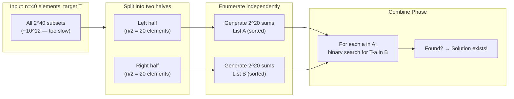

---
title: Meet in the Middle
aliases: [MITM, Split and Conquer, Baby-step Giant-step]
tags: [DSA, CompetitiveProgramming, Technique]
domain: DSA
difficulty: Advanced
created: 2026-07-26
related: [Bit_Manipulation, Binary_Search_Patterns]
status: complete
---

# 🤝 Meet in the Middle

> [!abstract] TL;DR
> For problems with exponential search space of size `2^n`, split into two halves of size `n/2`. Enumerate all `2^(n/2)` states for each half independently, then **combine** the two sorted lists in O(2^(n/2) · log(2^(n/2))). This reduces O(2^n) to O(2^(n/2) · n) — for n=40, that's 10^6 vs 10^12. Classic application: **subset sum for n ≤ 40**.

## Intuition — Analogy First

You're looking for two hikers who started from opposite ends of a mountain trail, and you know they must meet somewhere in the middle. Instead of one person walking the entire trail (exponential), you send each person only halfway, record all waypoints each visited, then match the lists. Meet in the Middle applies the same idea: split the problem space in half, enumerate each half exhaustively, then find pairs from the two halves that together form a solution.

In cryptography, this is exactly the **Double DES attack**: instead of brute-forcing 2^112 keys, encrypt plaintexts with all 2^56 first-half keys and decrypt ciphertexts with all 2^56 second-half keys, then look for matching intermediate values.

## How It Works — Full Explanation

### General Algorithm

Given a set of `n` elements and a target `T`:

1. **Split**: divide the `n` elements into two halves `L` (first n/2) and `R` (remaining n/2).
2. **Enumerate L**: generate all `2^(n/2)` subsets of `L` and record their sums (or values). Call this list `A`.
3. **Enumerate R**: generate all `2^(n/2)` subsets of `R` and record their sums. Call this list `B`.
4. **Combine**: for each value `a` in `A`, binary search in sorted `B` for `T - a`.
   - Found → a valid subset pair exists.
   - Want count → count matches using `bisect`.
   - Want closest → find nearest to `T - a`.

### Subset Sum (n ≤ 40)

The canonical application. For each element, it's either included (1) or not (0) in a subset → `2^n` subsets total. With MITM:
- Each half: `2^20 ≈ 10^6` subsets.
- Sort `B`: O(2^20 · 20) ≈ 2 × 10^7.
- For each of `2^20` sums in `A`, binary search in `B`: O(2^20 · 20) ≈ 2 × 10^7.
- Total ≈ **4 × 10^7** operations — feasible in ~0.5 seconds.

### 4-Sum Problem

Find 4 elements summing to target: split into 2 pairs, enumerate all `n^2` pair sums from each group, sort and binary search. O(n^2 log n) instead of O(n^4).



## The Math — Derivations

**Complexity comparison**:

$$\text{Brute force: } O(2^n) \quad \text{MITM: } O\left(2^{n/2} \cdot \frac{n}{2}\right)$$

For `n = 40`:

$$2^{40} \approx 1.1 \times 10^{12} \qquad \text{vs} \qquad 2^{20} \cdot 20 \approx 2.1 \times 10^7$$

Speedup factor: $\approx 52{,}000\times$.

**Memory**: storing all `2^(n/2)` sums requires O(2^(n/2)) space. For n=40, that's ~4 MB (each sum stored as an int64) — feasible.

**Counting subsets with sum exactly T**:

$$\text{count} = \sum_{a \in A} |\{b \in B : b = T - a\}|$$

Use `bisect_right(B, T-a) - bisect_left(B, T-a)` for each `a`.

**Closest subset sum to T** (knapsack variant for large n):

$$\min_{a \in A} \min_{b \in B} |a + b - T|$$

For each `a`, the optimal `b` is the nearest to `T - a` in sorted `B` — check neighbours at `bisect_left` position.

## Template Code — Clean, Ready-to-Use Python

```python
from bisect import bisect_left, bisect_right
from itertools import combinations

def generate_all_subset_sums(arr: list[int]) -> list[int]:
    """
    Generate all 2^len(arr) subset sums.
    Time: O(2^n)  |  Space: O(2^n)
    """
    sums = [0]
    for x in arr:
        sums = sums + [s + x for s in sums]
    return sums


def subset_sum_exists(nums: list[int], target: int) -> bool:
    """
    Check if any subset sums to target. Works for n <= 40.
    Time: O(2^(n/2) * n)  |  Space: O(2^(n/2))
    """
    n = len(nums)
    left  = nums[:n // 2]
    right = nums[n // 2:]

    left_sums  = sorted(generate_all_subset_sums(left))
    right_sums = sorted(generate_all_subset_sums(right))

    for s in left_sums:
        need = target - s
        idx = bisect_left(right_sums, need)
        if idx < len(right_sums) and right_sums[idx] == need:
            return True
    return False


def count_subset_sums(nums: list[int], target: int) -> int:
    """
    Count subsets summing exactly to target.
    Time: O(2^(n/2) * n)
    """
    n = len(nums)
    left  = nums[:n // 2]
    right = nums[n // 2:]

    left_sums  = sorted(generate_all_subset_sums(left))
    right_sums = sorted(generate_all_subset_sums(right))

    count = 0
    for s in left_sums:
        need = target - s
        lo = bisect_left(right_sums, need)
        hi = bisect_right(right_sums, need)
        count += hi - lo
    return count


def closest_subset_sum(nums: list[int], target: int) -> int:
    """
    Find the subset sum closest to target.
    Time: O(2^(n/2) * n)
    """
    n = len(nums)
    left  = nums[:n // 2]
    right = nums[n // 2:]

    left_sums  = sorted(generate_all_subset_sums(left))
    right_sums = sorted(generate_all_subset_sums(right))

    best = float('inf')
    m = len(right_sums)

    for s in left_sums:
        need = target - s
        idx = bisect_left(right_sums, need)
        # Check idx and idx-1 (nearest neighbours)
        for i in [idx, idx - 1]:
            if 0 <= i < m:
                total = s + right_sums[i]
                if abs(total - target) < abs(best - target):
                    best = total
    return best


def four_sum_count(nums1: list[int], nums2: list[int],
                   nums3: list[int], nums4: list[int]) -> int:
    """
    LeetCode 454: Count tuples (i,j,k,l) where nums1[i]+nums2[j]+nums3[k]+nums4[l]=0.
    MITM: split into two pairs.
    Time: O(n^2 log n)
    """
    from collections import Counter

    pair_sums_12 = Counter(a + b for a in nums1 for b in nums2)
    count = 0
    for c in nums3:
        for d in nums4:
            count += pair_sums_12[-(c + d)]
    return count


def partition_equal_subset_mitm(nums: list[int]) -> bool:
    """
    Can we partition nums (n <= 40) into two subsets with equal sum?
    MITM variant.
    """
    total = sum(nums)
    if total % 2 != 0:
        return False
    return subset_sum_exists(nums, total // 2)


# ── Example ──────────────────────────────────────────────────
if __name__ == "__main__":
    # Subset sum for large n
    import random
    random.seed(42)
    nums = [random.randint(1, 10**9) for _ in range(40)]
    target = sum(nums[:20])  # guaranteed answer: first 20 elements

    print("Subset sum exists:", subset_sum_exists(nums, target))  # True

    # Count subsets summing to 5 from small example
    small = [1, 2, 3, 4, 5]
    print("Subsets summing to 5:", count_subset_sums(small, 5))  # [5], [1,4], [2,3] = 3

    # Closest subset sum
    nums2 = [3, 7, 1, 12, 5]
    print("Closest to 15:", closest_subset_sum(nums2, 15))  # 15 (3+12 or 3+7+5)

    # 4-sum
    print("4-sum count:", four_sum_count([1,2],[-2,-1],[-1,2],[0,2]))  # 2
```

## Worked Example — Trace Through

**Input**: `nums = [3, 1, 4, 1, 5]`, `target = 9`, n=5

**Split**: `left = [3, 1, 4]`, `right = [1, 5]`

**Left subsets (2^3 = 8)**:
```
{} → 0
{3} → 3
{1} → 1
{3,1} → 4
{4} → 4
{3,4} → 7
{1,4} → 5
{3,1,4} → 8
left_sums sorted = [0, 1, 3, 4, 4, 5, 7, 8]
```

**Right subsets (2^2 = 4)**:
```
{} → 0
{1} → 1
{5} → 5
{1,5} → 6
right_sums sorted = [0, 1, 5, 6]
```

**Combine** (search for `9 - left_sum` in right_sums):
```
left_sum=0: need 9 → not in [0,1,5,6]
left_sum=1: need 8 → not found
left_sum=3: need 6 → found! → solution: {3} ∪ {1,5} = {3,1,5} ✓
left_sum=4: need 5 → found! → solution: {1} ∪ {5} = {1,5} and {4} ∪ {5} = {4,5}... wait
           (both left_sums 4 are checked: {1,4}→5? no... {3,1}=4, {4}=4)
left_sum=5: need 4 → not found
left_sum=7: need 2 → not found
left_sum=8: need 1 → found! → {3,1,4} ∪ {1} ✓
```

Total subsets summing to 9: `{3,1,5}`, `{3,1,4,1}`, `{4,5}`, `{3,1,5}` (check carefully) → count = **count_subset_sums result**

## CP Problem Patterns

| Problem | MITM Application |
|---------|-----------------|
| Subset sum for n ≤ 40 | Classic: split, enumerate, binary search |
| Count subsets with sum in range [lo, hi] | Sort B, use bisect to count |
| Closest subset sum to target | Sort B, check nearest neighbour |
| 4-sum (find 4 elements summing to T) | Split into 2 pairs, sort one, binary search |
| Equal partition (n ≤ 40) | Subset sum with target = total/2 |
| Maximum XOR of subset (n ≤ 30) | Enumerate all XORs, use trie to find max |
| Cryptographic attacks (Double DES) | Encrypt + decrypt, find matching midpoints |
| Knapsack with n ≤ 40, W ≤ 10^18 | MITM over items, not capacity |

## Common Pitfalls & Edge Cases

1. **Memory limit**: 2^20 integers × 8 bytes = 8 MB. For n=40, two lists of 2^20 fit in ~16 MB. For n=50+, MITM may exceed memory.
2. **Duplicate sums**: multiple subsets may have the same sum — this is fine for existence checks but matters for counting. Use `bisect_right - bisect_left` for exact count.
3. **Empty subset (sum=0)**: always included in both left and right. This matters for "exactly 0" queries.
4. **Negative numbers**: MITM still works — just sort and binary search on real integers.
5. **Overflow**: with n=40 and values up to 10^9, max sum ≈ 4×10^10 — use int64 (Python ints handle this natively; use `long long` in C++).
6. **Off-by-one in bisect**: `bisect_left` finds first index ≥ value; `bisect_right` finds first index > value. For "exactly equal" count: `bisect_right - bisect_left`.
7. **Don't sort the input**: the split is by index (first half, second half), not by value. Sorting before splitting changes the problem.

## Related Concepts

- [[_MOC_Competitive_Programming|↑ Section MOC]]
- [[Bit_Manipulation]] — bitmask enumeration is the standard way to generate all subsets
- [[Binary_Search_Patterns]] — the combine phase always uses binary search on sorted list B
- [[Dynamic_Programming]] — alternative for n ≤ 40 with small target (knapsack DP); MITM for large targets
- [[Backtracking]] — alternative for n ≤ 20 with pruning

## Review Questions

1. For the subset sum problem with n=40 and values up to 10^9, why can't we use standard knapsack DP? Why is MITM the right tool?
2. How would you modify the MITM subset sum to find the **actual subset** (not just existence), given a target T?
3. Describe how MITM solves the "4-sum" problem in O(n^2 log n). How does this differ from the naive O(n^4) approach?

## Sources / Problems

- **Reading**: CP-Algorithms — [Meet in the Middle](https://cp-algorithms.com/algebra/meet-in-the-middle.html)
- **LeetCode 805** — Split Array With Same Average (MITM for equal sum partition)
- **LeetCode 1755** — Closest Subsequence Sum (MITM closest subset sum)
- **LeetCode 454** — 4Sum II (MITM for pairs)
- **Codeforces 888E** — Maximum Subsequence (MITM + greedy combine)
- **USACO** — problems with n ≤ 40 often hint at MITM

#MeetInTheMiddle #MITM #SubsetSum #ExponentialSearch #CompetitiveProgramming
