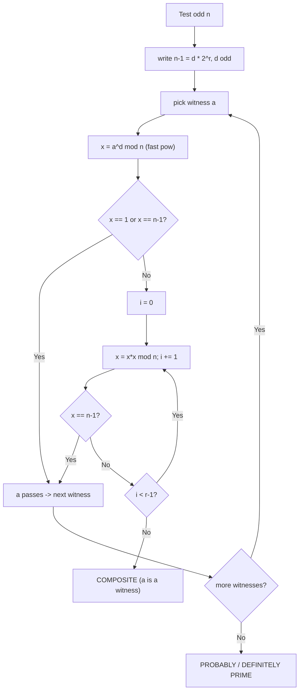

# 🎲 Miller–Rabin Primality Test

> [!abstract] TL;DR
> A fast primality test that answers "is `n` prime?" for numbers far too large for trial division. Write `n − 1 = d · 2ʳ` with `d` odd. For a **witness** `a`, `n` passes if `a^d ≡ 1 (mod n)` **or** `a^{d·2^i} ≡ −1 (mod n)` for some `0 ≤ i < r`. If `n` fails for any `a`, it's **definitely composite**. Random witnesses give error `≤ 4⁻ᵏ` (Monte Carlo). With the **fixed witness set** `{2,3,5,7,11,13,17,19,23,29,31,37}` it is **deterministic for all `n < 3.3 × 10²⁴`** — covering every 64-bit integer. Cost `O(k log³ n)`, powered by fast modular exponentiation.

## Intuition — analogy FIRST

Think of a witness `a` as a **detective** interrogating a suspect number `n`. If `n` really is prime, *every* honest detective's questions come back clean — a prime has no way to look composite. But if `n` is composite, most detectives will catch it red-handed; only a small minority of "gullible" witnesses get fooled.

The theorem behind Miller–Rabin guarantees that for a composite `n`, **at least ¾ of all possible witnesses expose it**. So each additional random detective you send in cuts the chance of being fooled by another factor of 4. Send in 20 detectives and the odds of a composite slipping through are astronomically small (`4⁻²⁰ ≈ 10⁻¹²`).

The deterministic twist: mathematicians have *proven* that for numbers below certain thresholds, a **specific small squad** of detectives (`2,3,5,…,37`) can never all be fooled at once. So for 64-bit numbers you don't gamble — you send that exact squad and get a guaranteed verdict.

Contrast the naive detective (**trial division**): it checks every possible factor up to `√n` — thorough but hopelessly slow for a 19-digit number (`√(10¹⁸) = 10⁹` checks). Miller–Rabin needs only a dozen exponentiations.

## How It Works + mermaid

The test refines **Fermat's test** (`a^{n−1} ≡ 1 (mod n)`) by exploiting a second fact about primes: modulo a prime, the only **square roots of 1** are `+1` and `−1`. So when we compute `a^{n−1}` by repeated squaring from `a^d`, a prime must reach `1` either by starting at `1` or by passing through `−1` right before. A composite often reveals a **"nontrivial square root of 1"** — a value that squares to `1` but is neither `+1` nor `−1` — which a prime can never produce.

Algorithm for testing `n` (odd, `> 2`):
1. Write `n − 1 = d · 2ʳ`, `d` odd.
2. For each witness `a` (take `a mod n`; skip if `a ≡ 0`):
   - Compute `x = a^d mod n`.
   - If `x == 1` or `x == n − 1`, `a` says "**probably prime**"; move on.
   - Otherwise square `x` up to `r − 1` times. If it ever equals `n − 1`, `a` is satisfied; move on.
   - If we exhaust the squarings without hitting `n − 1`, `a` is a **witness to compositeness** → return **composite**.
3. If all witnesses pass → **prime** (deterministically, for the right witness set / range).



## The Math

**The witness condition.** Let `n` be an odd prime and write `n − 1 = d · 2ʳ` with `d` odd. For any `a` with `gcd(a, n) = 1`, **at least one** of the following holds:

$$a^{d} \equiv 1 \pmod{n} \qquad \text{or} \qquad a^{d \cdot 2^{i}} \equiv -1 \pmod{n} \ \text{ for some } 0 \le i < r.$$

If **neither** holds, `n` is **guaranteed composite**, and such an `a` is called a *witness*.

*Why primes satisfy it.* By Fermat, `a^{n−1} = a^{d·2ʳ} ≡ 1`. Consider the sequence `a^d, a^{2d}, a^{4d}, …, a^{2ʳ d} = 1` (each is the square of the previous). Modulo a prime, `x² ≡ 1 ⟹ x ≡ ±1`. Walking the sequence backward from the final `1`: the value just before `1` must be a square root of `1`, hence `±1`. So either the whole chain is `1` from the start (first case), or somewhere a `−1` appears (second case). A prime cannot avoid both.

**Monte Carlo error bound.** For a **composite** `n`, the set of witnesses (values `a` that expose it) has size at least `¾·n` — equivalently, **strong liars** (fooled witnesses) number at most `¼(n−1)`. Choosing `k` independent uniform random `a ∈ [2, n−2]`:

$$\Pr[\text{composite } n \text{ declared prime}] \le \left(\tfrac{1}{4}\right)^{k} = 4^{-k}.$$

(This is a one-sided error: a **prime is never wrongly called composite**.)

**Deterministic ranges.** Some composites are strong liars for small witness sets, but the smallest such counterexamples are known. Using the first primes as witnesses:
- `{2, 3}` → correct for all `n < 1{,}373{,}653`.
- `{2, 3, 5, 7, 11, 13, 17}` → correct for all `n < 3.4 × 10¹⁴`.
- `{2, 3, 5, 7, 11, 13, 17, 19, 23, 29, 31, 37}` → correct for all `n < 3.3 × 10²⁴`, hence for **every** 64-bit unsigned integer (`< 1.8 × 10¹⁹`).

**Complexity.** Each witness does one modular exponentiation (`O(log n)` modular multiplications) plus up to `r = O(log n)` squarings; a schoolbook `mulmod` is `O(log² n)`. Total `O(k · log³ n)` — versus trial division's `O(√n)`, which is exponential in the number of digits.

## Python Implementation (clean, commented, runnable)

```python
def is_prime(n: int) -> bool:
    """
    Deterministic Miller-Rabin for all n that fit in 64 bits (and well beyond,
    up to ~3.3e24) using the fixed prime witness set.
    Returns True iff n is prime.
    """
    if n < 2:
        return False
    # quick check against small primes (also handles the witnesses themselves)
    small_primes = (2, 3, 5, 7, 11, 13, 17, 19, 23, 29, 31, 37)
    for p in small_primes:
        if n % p == 0:
            return n == p

    # factor out powers of 2:  n - 1 = d * 2^r,  d odd
    d = n - 1
    r = 0
    while d % 2 == 0:
        d //= 2
        r += 1

    def is_composite_witness(a: int) -> bool:
        """Return True if 'a' proves n composite (i.e. n fails for this a)."""
        x = pow(a, d, n)              # fast modular exponentiation
        if x == 1 or x == n - 1:
            return False              # a is satisfied -> not a witness
        for _ in range(r - 1):
            x = x * x % n
            if x == n - 1:
                return False          # hit -1 -> satisfied
        return True                   # never reached +-1 -> witness => composite

    for a in small_primes:           # deterministic for n < 3.3e24
        if is_composite_witness(a):
            return False
    return True


if __name__ == "__main__":
    assert is_prime(2) and is_prime(3) and is_prime(97)
    assert not is_prime(1) and not is_prime(0) and not is_prime(561)  # 561 Carmichael
    assert is_prime(1_000_000_007)          # classic CP prime
    assert is_prime((1 << 61) - 1)          # Mersenne prime 2^61 - 1
    assert not is_prime((1 << 61) - 1 + 2)
    print("all checks pass")
```

## Template Code (ready-to-paste CP snippet)

```python
def is_prime(n):
    if n < 2: return False
    for p in (2,3,5,7,11,13,17,19,23,29,31,37):
        if n % p == 0:
            return n == p
    d, r = n - 1, 0
    while d % 2 == 0:
        d //= 2; r += 1
    for a in (2,3,5,7,11,13,17,19,23,29,31,37):
        x = pow(a, d, n)
        if x == 1 or x == n - 1:
            continue
        for _ in range(r - 1):
            x = x * x % n
            if x == n - 1:
                break
        else:
            return False        # no break -> a is a witness -> composite
    return True
```

## Dry Run / Trace

**Test `n = 561`** (the smallest Carmichael number — passes the Fermat test but Miller–Rabin catches it).
```
n - 1 = 560 = 35 * 2^4   ->  d = 35, r = 4
witness a = 2:
  x = 2^35 mod 561 = 263
  263 != 1 and 263 != 560, so start squaring:
    i=0: 263^2 mod 561 = 166   (not 560)
    i=1: 166^2 mod 561 = 67    (not 560)
    i=2: 67^2  mod 561 = 1      <-- nontrivial sqrt of 1! never saw -1
  loop ends without hitting 560  ->  a=2 is a WITNESS
  => 561 is COMPOSITE   (indeed 561 = 3 * 11 * 17)
```
The Fermat test would have been *fooled*: `2^560 ≡ 1 (mod 561)`. Miller–Rabin wins because it noticed `67² ≡ 1` while `67 ≢ ±1` — a square root of 1 that a prime could never have.

**Test `n = 97`** (prime), `96 = 3 · 2⁵`, `d = 3, r = 5`, witness `a = 2`:
```
x = 2^3 mod 97 = 8
8 != 1, 8 != 96  ->  square:
  i=0: 64        (not 96)
  i=1: 64^2 mod 97 = 22   (not 96)
  i=2: 22^2 mod 97 = 96   <-- hit n-1  ->  a=2 satisfied
```
All other witnesses likewise pass → **97 is prime.** ✓

## CP Problem Patterns

| Problem shape | Why Miller–Rabin |
|---|---|
| Primality of a single 64-bit number | Deterministic witness set — instant, exact |
| Up to `10⁶` queries "is `x` prime?" for large `x` | `O(k log³ n)` each, no giant sieve needed |
| Factorize a big number (paired with **Pollard's rho**) | Rho splits; Miller–Rabin confirms factors are prime |
| "Next prime ≥ N" / "count primes in a huge range" | Test candidates one by one |
| Verify a randomly generated prime (crypto-style tasks) | Standard primality certificate |
| Numbers too large for a sieve (`n > 10⁹`) | Sieve is impossible; Miller–Rabin still works |
| RSA-modulus / strong-prime construction problems | Probabilistic test with tunable confidence |

## Common Pitfalls

- **Overflow on `x * x` in C++/Java.** For `n` near `2⁶³`, `x * x` overflows 64-bit. Use `__int128`, `unsigned __int128`, or a binary `mulmod`. Python big integers are immune.
- **Witnesses `≥ n`.** When `n` is itself a small witness (e.g. `n = 3`), `a = n` gives `a ≡ 0` and breaks the logic. Guard by returning early on small-prime divisibility (as in the template) or reduce `a %= n` and skip `a == 0`.
- **Even `n` or `n < 2`.** Handle these before factoring `n − 1`; the loop assumes `n` odd and `≥ 3`.
- **Fermat test is NOT enough.** Plain `a^{n−1} ≡ 1` is fooled by **Carmichael numbers** (561, 1105, 1729, …), which are Fermat-liars for *every* coprime base. Miller–Rabin's square-root check defeats them. Never ship a bare Fermat test.
- **Too few random witnesses.** For adversarial or contest inputs, don't rely on 1–2 random bases; use the **fixed deterministic set** for 64-bit, or `≥ 20–40` random bases for bigger numbers.
- **Trial division as a fallback.** `O(√n)` is fine up to `~10¹²` but hopeless at `10¹⁸`. Don't reach for it on 64-bit inputs.
- **Composite verdict is certain; prime verdict is conditional** — but with the correct witness set for the range, the "probably prime" becomes a *guarantee*.

## Related Concepts

- [[_MOC_Competitive_Programming|↑ Section MOC]]
- [[Modular_Arithmetic]]
- [[Number_Theory]]
- [[Sieve_of_Eratosthenes]]
- [[Randomized_Algorithms]]
- [[Euler_Totient]]
- [[Chinese_Remainder_Theorem]]

## Review Questions

1. Explain why the square-root-of-1 check makes Miller–Rabin strictly stronger than the Fermat test. Walk through why it catches a Carmichael number such as `561` while Fermat does not.
2. Derive the `4⁻ᵏ` error bound for `k` random witnesses. Why is the error *one-sided* — that is, why can a prime never be misreported as composite?
3. Why is the witness set `{2,3,5,7,11,13,17,19,23,29,31,37}` deterministic for all 64-bit integers? What would you change to test a 200-digit number where no proven deterministic set exists?

## Sources

- CP-algorithms.com: "Primality tests" (Miller–Rabin, Fermat, deterministic sets)
- CLRS, Section 31.8 — Primality testing (Miller–Rabin / Witness)
- "Competitive Programmer's Handbook" (Laaksonen) — number theory chapter
- Motwani & Raghavan, "Randomized Algorithms" — Monte Carlo primality
- deterministic witness thresholds: Jaeschke (1993), Sorenson & Webster (2015)
- Codeforces / SPOJ: "is prime" and Pollard-rho factorization problems

#NumberTheory #Primality #MillerRabin #ModularExponentiation #RandomizedAlgorithms #CarmichaelNumbers
