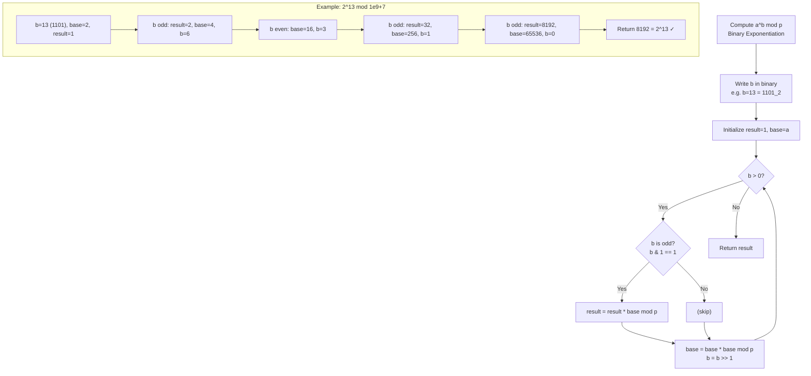

---
title: Modular Arithmetic
aliases: [Mod Arithmetic, Fast Exponentiation, Modular Inverse, CRT]
tags: [DSA, CompetitiveProgramming, ModularArithmetic, FastExponentiation]
domain: DSA
difficulty: Intermediate
created: 2026-07-26
related: [Number_Theory, Combinatorics, Bit_Manipulation]
status: complete
---

# 🔄 Modular Arithmetic

> [!abstract] TL;DR
> Modular arithmetic is the standard CP technique for keeping numbers in range when exact values would overflow. Know the four rules (add, subtract, multiply, power), understand that division requires a modular inverse, and implement fast exponentiation (binary exponentiation) to compute `a^b mod p` in O(log b). The prime modulus `10^9 + 7` appears in hundreds of problems.

## Intuition — analogy FIRST

A clock shows hours mod 12. If it's 10 o'clock now and you add 5 hours, you don't get 15 — you get 3 (15 mod 12 = 3). Modular arithmetic is clock arithmetic generalized to any modulus.

In CP, the "clock" is usually `10^9 + 7`. You're not interested in the exact combinatorial answer (which might have a thousand digits) — only in what time it shows on this particular clock. The beauty is that you can take the clock reading at every intermediate step: adding, subtracting, and multiplying on the clock gives the same final reading as computing the full result and then taking mod.

Division on a clock is trickier — you need the "inverse" of the divisor on that clock. Fermat's little theorem provides it efficiently.

## How It Works — full explanation + mermaid

### Why Use Modular Arithmetic?

1. **Overflow prevention**: `n! for n=100` has ~158 digits — cannot fit in any primitive type. But `100! mod (10^9+7)` is a single number ≤ 10^9+6.
2. **Problem requirement**: Many problems explicitly state "print answer modulo 10^9+7."
3. **Theoretical use**: GCD, primality, hashing — all use modular arithmetic internally.

### The Four Rules

| Operation | Rule |
|---|---|
| Addition | $(a + b) \bmod m = ((a \bmod m) + (b \bmod m)) \bmod m$ |
| Subtraction | $(a - b) \bmod m = ((a \bmod m) - (b \bmod m) + m) \bmod m$ |
| Multiplication | $(a \times b) \bmod m = ((a \bmod m) \times (b \bmod m)) \bmod m$ |
| Division | $(a / b) \bmod m = (a \times b^{-1}) \bmod m$ (requires gcd(b,m)=1) |

**The +m for subtraction** is critical: `(a - b) % m` can be negative in both Python and C++ when a < b. Adding m before taking mod ensures the result is in [0, m-1].

### Why 10^9 + 7?

- It is prime — guarantees modular inverses exist for all non-zero values
- It fits in a 32-bit integer (slightly above 10^9)
- The product of two values less than it fits in a 64-bit integer: $(10^9 + 6)^2 \approx 10^{18} < 2^{63}$
- So `(a * b) % MOD` never overflows `long long` in C++

### Fast Exponentiation (Binary Exponentiation)

Naively computing $a^b$ takes O(b) multiplications. Binary exponentiation uses the identity:

$$a^b = \begin{cases} 1 & \text{if } b = 0 \\ (a^{b/2})^2 & \text{if } b \text{ is even} \\ a \times a^{b-1} & \text{if } b \text{ is odd} \end{cases}$$

This halves the exponent each step → O(log b) multiplications. In iterative form, we process the bits of b from LSB to MSB.

### Modular Division (Modular Inverse)

To compute $(a / b) \bmod p$ where p is prime:

$$\frac{a}{b} \bmod p = a \cdot b^{-1} \bmod p = a \cdot b^{p-2} \bmod p$$

This uses Fermat's little theorem: $b^{p-1} \equiv 1 \pmod{p} \Rightarrow b^{p-2} \equiv b^{-1} \pmod{p}$.

### Chinese Remainder Theorem (CRT)

Given a system of congruences with pairwise coprime moduli:
$$x \equiv a_1 \pmod{m_1}, \quad x \equiv a_2 \pmod{m_2}, \quad \ldots$$

There exists a unique solution modulo $M = m_1 \cdot m_2 \cdots m_k$:
$$x = \sum_{i} a_i \cdot M_i \cdot (M_i^{-1} \bmod m_i) \pmod{M}$$

where $M_i = M / m_i$.



## The Math

**Modular addition/subtraction proof**: If $a \equiv a' \pmod{m}$ and $b \equiv b' \pmod{m}$, then $a + b \equiv a' + b' \pmod{m}$.

*Proof*: $a = a' + km$, $b = b' + lm$ for integers k, l. Then $a + b = a' + b' + (k+l)m \equiv a' + b' \pmod{m}$. ∎

**Fast exponentiation correctness**: Each bit $b_i$ of the exponent contributes $a^{2^i}$ when set. The algorithm computes $a, a^2, a^4, \ldots, a^{2^k}$ iteratively and multiplies in the contributions of set bits:

$$a^b = a^{\sum_i b_i \cdot 2^i} = \prod_{b_i = 1} a^{2^i}$$

**Fermat's little theorem**:

$$a^{p-1} \equiv 1 \pmod{p} \quad \text{for prime } p, \; p \nmid a$$

*Proof sketch*: The set $\{a, 2a, 3a, \ldots, (p-1)a\}$ mod p is a permutation of $\{1, 2, \ldots, p-1\}$ (since p is prime and a is non-zero mod p). So their products are equal: $a^{p-1}(p-1)! \equiv (p-1)! \pmod{p}$. Cancel $(p-1)!$ to get $a^{p-1} \equiv 1$. ∎

**Precomputing inverses of 1..n** in O(n): Use the recurrence:
$$\text{inv}[i] = -(p / i) \cdot \text{inv}[p \% i] \bmod p$$

This avoids n separate calls to fast exponentiation.

## Template Code

```python
MOD = 10**9 + 7

# ─── Fast modular exponentiation ──────────────────────────────────
def fast_pow(base: int, exp: int, mod: int) -> int:
    """Computes base^exp mod mod in O(log exp)."""
    result = 1
    base %= mod
    while exp > 0:
        if exp & 1:
            result = result * base % mod
        base = base * base % mod
        exp >>= 1
    return result

# Python built-in is equally efficient and preferred:
# pow(base, exp, mod)

# ─── Modular inverse ───────────────────────────────────────────────
def mod_inv(a: int, p: int = MOD) -> int:
    """a^(p-2) mod p. Requires p prime, gcd(a,p)=1."""
    return pow(a, p - 2, p)

# ─── Safe add/sub/mul with mod ─────────────────────────────────────
def add(a: int, b: int, mod: int = MOD) -> int:
    return (a + b) % mod

def sub(a: int, b: int, mod: int = MOD) -> int:
    return (a - b + mod) % mod

def mul(a: int, b: int, mod: int = MOD) -> int:
    return a * b % mod

def div_mod(a: int, b: int, p: int = MOD) -> int:
    """(a / b) mod p. Requires p prime."""
    return a * mod_inv(b, p) % p

# ─── Precompute inverses of 1..n ───────────────────────────────────
def precompute_inverses(n: int, p: int = MOD) -> list[int]:
    """O(n) precomputation of modular inverses for 1..n."""
    inv = [0] * (n + 1)
    inv[1] = 1
    for i in range(2, n + 1):
        # inv[i] = -(p // i) * inv[p % i] % p
        inv[i] = -(p // i) * inv[p % i] % p
    return inv

# ─── C++ equivalent (for reference) ────────────────────────────────
# ll fast_pow(ll base, ll exp, ll mod) {
#     ll result = 1;
#     base %= mod;
#     while (exp > 0) {
#         if (exp & 1) result = result * base % mod;
#         base = base * base % mod;
#         exp >>= 1;
#     }
#     return result;
# }
# ll mod_inv(ll a, ll p = MOD) { return fast_pow(a, p - 2, p); }

# ─── Chinese Remainder Theorem ─────────────────────────────────────
def crt(remainders: list[int], moduli: list[int]) -> int:
    """
    Solves x ≡ r_i (mod m_i) for pairwise coprime moduli.
    Returns unique x in [0, M) where M = product of all moduli.
    """
    from math import prod
    M = prod(moduli)
    x = 0
    for r, m in zip(remainders, moduli):
        Mi = M // m
        x += r * Mi * pow(Mi, -1, m)  # Python 3.8+ pow supports modular inverse
    return x % M
```

## Worked Example — trace through a real problem

**Problem**: Compute $2^{13} \bmod (10^9 + 7)$ using binary exponentiation.

Binary of 13: `1101`

| Step | exp | exp & 1 | result | base |
|---|---|---|---|---|
| Init | 13 (1101) | — | 1 | 2 |
| 1 | 13 (odd) | 1 | 1×2=2 | 2²=4 |
| 2 | 6 (1101→110) | 0 | 2 | 4²=16 |
| 3 | 3 (110→11) | 1 | 2×16=32 | 16²=256 |
| 4 | 1 (11→1) | 1 | 32×256=8192 | 256²=65536 |
| 5 | 0 | — | **8192** | — |

**Verify**: $2^{13} = 8192$. ✓

**Modular inverse trace**: compute $(5)^{-1} \bmod 7$.

By Fermat: $5^{7-2} = 5^5 \bmod 7$.

$5^1 = 5, \; 5^2 = 25 \equiv 4, \; 5^4 \equiv 16 \equiv 2 \pmod{7}$

$5^5 = 5^4 \times 5^1 \equiv 2 \times 5 = 10 \equiv 3 \pmod{7}$

Check: $5 \times 3 = 15 = 2 \times 7 + 1 \equiv 1 \pmod{7}$. ✓

## CP Problem Patterns

| Problem keyword | Modular technique |
|---|---|
| "Answer mod 10^9+7" | Apply mod at every add/mul step |
| Count paths / ways | Use mod; precompute factorials + inverse factorials |
| Matrix exponentiation | fast_pow on matrix, enables O(log n) Fibonacci |
| Fibonacci(10^18) mod p | Matrix exponentiation or Pisano period |
| Divide under modulus | mod_inv via Fermat or extended GCD |
| System of congruences | Chinese Remainder Theorem |
| Inverse of all integers 1..n | O(n) precomputation using recurrence |

## Common Pitfalls & Edge Cases

- **Subtraction going negative**: Always write `(a - b + MOD) % MOD`. Without `+MOD`, Python gives a negative result, C++ gives undefined behavior or wrong sign.
- **Multiplying before mod in C++**: `a * b % MOD` where a, b < MOD is fine (product < 10^18 < 2^63). But if a or b was already taken mod incorrectly and is large, intermediate can overflow.
- **Modular inverse of 0**: Does not exist. Calling `mod_inv(0, p)` returns `pow(0, p-2, p) = 0`, which is wrong. Guard against this.
- **Non-prime modulus**: Fermat's approach only works for prime p. For composite m, use extended GCD; inverse only exists if gcd(a, m) = 1.
- **CRT with non-coprime moduli**: Standard CRT fails. Use the generalized CRT (Garner's algorithm) instead.
- **Python `pow(x, -1, m)`**: Available since Python 3.8 and computes modular inverse directly. Don't use Fermat for non-prime m — use this built-in instead.
- **Matrix exponentiation overflow**: Matrix entries can reach O(MOD²) before taking mod. In C++, always apply mod inside the matrix multiply loop.

## Related Concepts

- [[_MOC_Competitive_Programming|↑ Section MOC]]
- [[Number_Theory]]
- [[Combinatorics]]
- [[Bit_Manipulation]]
- [[Sieve_of_Eratosthenes]]

## Review Questions

1. Explain why `(a - b) % MOD` can produce a wrong answer in both Python and C++, and write the correct form. Then demonstrate with a = 3, b = 5, MOD = 7.
2. Trace binary exponentiation computing `3^11 mod 13` step by step, showing the binary representation of 11 and how each bit is processed.
3. A problem requires computing $\binom{10^6}{500000} \bmod (10^9 + 7)$. Describe the full approach: what do you precompute, in what order, and what is the total time complexity?

## Sources / Problems

- LeetCode: 50 (Pow(x, n)), 372 (Super Pow), 509 (Fibonacci Number — use matrix expo for large n)
- Codeforces: Any problem with "mod 10^9+7" in the statement
- CP-algorithms.com: "Binary Exponentiation", "Modular Inverse", "Chinese Remainder Theorem"
- "Competitive Programmer's Handbook" — Chapter 21 (Number Theory)
- USACO: Gold problems involving combinatorics

#ModularArithmetic #FastExponentiation #BinaryExponentiation #ModularInverse #FermatsLittleTheorem #ChineseRemainderTheorem
