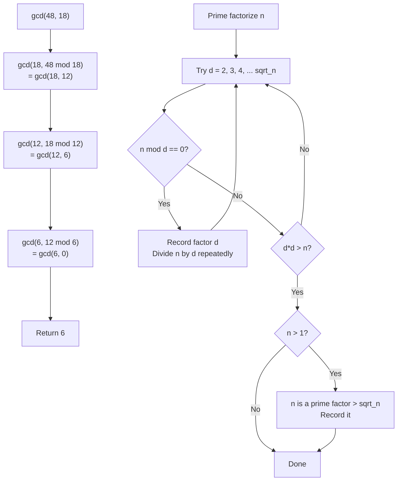

---
title: Number Theory
aliases: [GCD, LCM, Prime Factorization, Euler Totient, Modular Inverse]
tags: [DSA, CompetitiveProgramming, NumberTheory, GCD, Primes]
domain: DSA
difficulty: Intermediate
created: 2026-07-26
related: [Modular_Arithmetic, Sieve_of_Eratosthenes, Combinatorics]
status: complete
---

# 🔬 Number Theory

> [!abstract] TL;DR
> GCD, prime factorization, divisor counting, and modular inverses are the atoms of combinatorics and math-heavy CP problems. The Euclidean algorithm gives GCD in O(log min(a,b)). Fermat's little theorem gives modular inverses in O(log p) when p is prime. These two tools unlock a huge swath of competition problems.

## Intuition — analogy FIRST

The GCD of two numbers is like finding the largest tile that perfectly tiles both a 48-cm and 18-cm floor with no gaps. You can always reduce the larger floor: a tile that fits 48 cm and 18 cm must also fit 48 − 18 = 30 cm and 18 cm. Keep reducing until both are the same — that's the GCD. This is exactly the Euclidean algorithm.

Modular inverse is the number theory equivalent of division. If you can't directly divide by `a` under a modulus, you find its "inverse" `a^{-1}` — the number that, when multiplied by `a`, gives 1 (mod p). It exists whenever `a` and `p` are coprime.

## How It Works — full explanation + mermaid

### GCD — Euclidean Algorithm

`gcd(a, b) = gcd(b, a mod b)`, base case `gcd(a, 0) = a`.

Why: if `d | a` and `d | b`, then `d | (a mod b)` (since `a mod b = a - floor(a/b)*b`). So the set of common divisors of (a, b) equals the set of common divisors of (b, a mod b). The GCD is preserved.

The number of steps is O(log min(a, b)) because after two steps, a reduces by at least half.

### LCM

$$\text{lcm}(a, b) = \frac{a \times b}{\gcd(a, b)}$$

**Caution**: Compute as `a // gcd(a, b) * b` to avoid overflow before the division in C++.

### Prime Factorization

Trial division: divide by every integer from 2 to √n. At most one prime factor > √n. O(√n).

Key insight: if no prime ≤ √n divides n, then n is prime.

### Divisor Count and Sum

If $n = p_1^{e_1} \cdot p_2^{e_2} \cdots p_k^{e_k}$:

- Number of divisors: $\tau(n) = (e_1 + 1)(e_2 + 1) \cdots (e_k + 1)$
- Sum of divisors: $\sigma(n) = \prod_{i=1}^{k} \frac{p_i^{e_i+1} - 1}{p_i - 1}$

### Euler's Totient Function φ(n)

φ(n) = count of integers in [1, n] coprime to n.

$$\varphi(n) = n \prod_{p \mid n} \left(1 - \frac{1}{p}\right)$$

Properties:
- φ(1) = 1
- φ(p) = p − 1 for prime p
- φ(pᵏ) = pᵏ − pᵏ⁻¹
- Multiplicative: φ(mn) = φ(m)φ(n) when gcd(m,n) = 1

### Modular Inverse

When p is prime and 0 < a < p, the modular inverse of a mod p is:
$$a^{-1} \equiv a^{p-2} \pmod{p}$$

This follows from Fermat's little theorem. Compute via fast exponentiation in O(log p).



## The Math

**Euclidean algorithm termination**: After step `gcd(a, b)` with a > b, we get `gcd(b, a mod b)`. Since `a mod b < b`, the smaller argument strictly decreases each pair of steps. After k steps, the smaller argument is at most `a/2^(k/2)`, giving O(log a) steps.

**Bézout's identity**: There exist integers x, y such that $ax + by = \gcd(a, b)$. The extended Euclidean algorithm computes these. When gcd(a, b) = 1, this gives $ax \equiv 1 \pmod{b}$, so x is the modular inverse of a mod b.

**Fermat's little theorem**: For prime p and integer a with p ∤ a:
$$a^{p-1} \equiv 1 \pmod{p}$$

Multiplying both sides by $a^{-1}$:
$$a^{p-2} \equiv a^{-1} \pmod{p}$$

**Euler's theorem** (generalization): For gcd(a, n) = 1:
$$a^{\varphi(n)} \equiv 1 \pmod{n}$$

**Divisor bound**: The number of divisors $\tau(n) = O(n^\epsilon)$ for any $\epsilon > 0$. In practice, for $n \leq 10^6$, $\tau(n) \leq 240$.

## Template Code

```python
from math import gcd

# ─── GCD / LCM ────────────────────────────────────────────────────
def lcm(a: int, b: int) -> int:
    return a // gcd(a, b) * b   # divide first to prevent overflow in C++

# ─── Primality ─────────────────────────────────────────────────────
def is_prime(n: int) -> bool:
    """O(sqrt(n)) primality test."""
    if n < 2:
        return False
    if n == 2:
        return True
    if n % 2 == 0:
        return False
    d = 3
    while d * d <= n:
        if n % d == 0:
            return False
        d += 2
    return True

# ─── Prime factorization ───────────────────────────────────────────
def prime_factors(n: int) -> dict[int, int]:
    """Returns {prime: exponent}. O(sqrt(n))."""
    factors: dict[int, int] = {}
    d = 2
    while d * d <= n:
        while n % d == 0:
            factors[d] = factors.get(d, 0) + 1
            n //= d
        d += 1
    if n > 1:
        factors[n] = factors.get(n, 0) + 1
    return factors

# ─── Divisors ──────────────────────────────────────────────────────
def get_divisors(n: int) -> list[int]:
    """Returns sorted list of all divisors. O(sqrt(n))."""
    divs = []
    d = 1
    while d * d <= n:
        if n % d == 0:
            divs.append(d)
            if d != n // d:
                divs.append(n // d)
        d += 1
    return sorted(divs)

def count_divisors(n: int) -> int:
    """Uses prime factorization: product of (e+1)."""
    result = 1
    for exp in prime_factors(n).values():
        result *= (exp + 1)
    return result

# ─── Euler's Totient ───────────────────────────────────────────────
def euler_totient(n: int) -> int:
    """phi(n) = n * product(1 - 1/p) over prime p | n. O(sqrt(n))."""
    result = n
    temp = n
    d = 2
    while d * d <= temp:
        if temp % d == 0:
            while temp % d == 0:
                temp //= d
            result -= result // d
        d += 1
    if temp > 1:
        result -= result // temp
    return result

# ─── Modular inverse via Fermat's little theorem ───────────────────
def mod_inverse(a: int, p: int) -> int:
    """Requires p prime and gcd(a, p) = 1. Returns a^(p-2) mod p."""
    return pow(a, p - 2, p)   # Python built-in pow handles this in O(log p)

# ─── Extended GCD (Bézout coefficients) ───────────────────────────
def extended_gcd(a: int, b: int) -> tuple[int, int, int]:
    """Returns (g, x, y) such that a*x + b*y = g = gcd(a, b)."""
    if b == 0:
        return a, 1, 0
    g, x, y = extended_gcd(b, a % b)
    return g, y, x - (a // b) * y

def mod_inverse_extended(a: int, m: int) -> int:
    """Works for any m (not necessarily prime), requires gcd(a,m)=1."""
    g, x, _ = extended_gcd(a % m, m)
    if g != 1:
        raise ValueError("Inverse does not exist")
    return x % m
```

## Worked Example — trace through a real problem

**Problem**: Compute nCr mod (10^9 + 7) for n=10, r=3.

Step 1: Precompute factorials and their modular inverses.
```
MOD = 10^9 + 7
fact[0] = 1
fact[1] = 1
fact[2] = 2
...
fact[10] = 3628800

inv_fact[10] = pow(3628800, MOD-2, MOD)
```

Step 2: Apply formula:
$$\binom{10}{3} = \frac{10!}{3! \cdot 7!} = \frac{10 \times 9 \times 8}{3 \times 2 \times 1} = 120$$

Step 3: Mod (redundant here since 120 < MOD, but formula works for large n):
```python
nCr = fact[10] * inv_fact[3] % MOD * inv_fact[7] % MOD
    = 3628800 * mod_inverse(6) % MOD * mod_inverse(5040) % MOD
    = 120
```

**GCD trace** for gcd(252, 105):
```
gcd(252, 105) → gcd(105, 252 mod 105) = gcd(105, 42)
gcd(105, 42)  → gcd(42, 105 mod 42)  = gcd(42, 21)
gcd(42, 21)   → gcd(21, 42 mod 21)   = gcd(21, 0)
gcd(21, 0)    → return 21
```

## CP Problem Patterns

| Problem | Number theory tool |
|---|---|
| Reduce a fraction p/q to lowest terms | `g = gcd(p,q); p//=g; q//=g` |
| nCr mod p (p prime) | Precompute factorials + Fermat inverse |
| Count integers in [1,n] coprime to m | Euler's totient φ(m) |
| Find number with most divisors ≤ n | Count divisors via prime factorization |
| LCM of array (beware overflow) | Fold lcm pairwise |
| x ≡ a (mod m), find x | Modular inverse / Extended GCD |
| Is n a perfect square? | `isqrt(n)**2 == n` |
| Goldbach: express n as sum of 2 primes | Sieve + complement check |

## Common Pitfalls & Edge Cases

- **LCM overflow in C++**: `a * b / gcd(a,b)` overflows if a*b > 2^63. Write `a / gcd(a,b) * b` instead.
- **is_prime(1)**: 1 is not prime. Always guard `n < 2 → False`.
- **Modular inverse requires gcd(a,p) = 1**: if p | a, no inverse exists. Fermat's approach silently returns wrong answer; check the precondition.
- **Extended GCD returns negative x**: `x % m` in Python always gives non-negative result; in C++ use `((x % m) + m) % m`.
- **Euler's totient for n=1**: φ(1) = 1 by definition (the only integer in [1,1] coprime to 1 is 1 itself). The loop-based approach must handle n=1 correctly.
- **prime_factors(1)**: Returns empty dict. Be careful when assuming the result is non-empty.

## Related Concepts

- [[_MOC_Competitive_Programming|↑ Section MOC]]
- [[Modular_Arithmetic]]
- [[Sieve_of_Eratosthenes]]
- [[Combinatorics]]
- [[Bit_Manipulation]]

## Review Questions

1. Prove that `gcd(a, b) = gcd(b, a mod b)`. Use this to explain why the Euclidean algorithm terminates in O(log min(a,b)) steps.
2. Compute φ(36) by hand using the formula $\varphi(n) = n \prod_{p|n} (1 - 1/p)$, then verify by listing all integers in [1, 36] coprime to 36.
3. Why does `a^(p-2) mod p` give the modular inverse of `a` modulo prime `p`? What condition on `a` is required, and what happens if that condition is violated?

## Sources / Problems

- LeetCode: 1979 (Find Greatest Common Divisor), 2447 (Number of Subarrays With GCD Equal to K)
- Codeforces: problems tagged "number theory", "math"
- USACO: various Silver/Gold problems involving divisors and modular arithmetic
- CP-algorithms.com: "Euler's totient function", "Extended Euclidean Algorithm", "Modular Inverse"
- "Competitive Programmer's Handbook" — Chapters 11, 21
- Project Euler: problems 1–50 (number theory foundation)

#NumberTheory #GCD #LCM #PrimeFactorization #EulerTotient #ModularInverse #FermatsLittleTheorem
