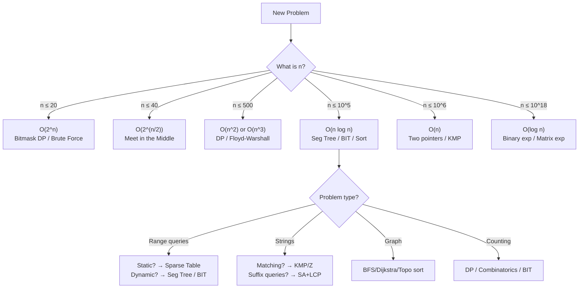

---
title: Problem Patterns Index — CP Reference
aliases: [CP Cheatsheet, Algorithm Selection Guide, Competitive Programming Index]
tags: [DSA, CompetitiveProgramming, Reference, Index]
domain: DSA
difficulty: Intermediate
created: 2026-07-26
related: [Big_O_Notation, Complexity_Cheat_Sheet, Bit_Manipulation, Segment_Tree, KMP_Algorithm]
status: complete
---

# 🗺️ Problem Patterns Index — CP Reference

> [!abstract] TL;DR
> A single-page lookup table for competitive programming: given `n` (input size) or a problem keyword, find the right algorithm. Use this before writing a single line of code. Organize thinking top-down: **constraint → complexity → algorithm family → specific technique**.

## Intuition — Analogy First

A doctor doesn't run every test on every patient. They triage: age + symptoms → likely diagnosis → specific tests. This index is your diagnostic guide. Start with the constraint (`n ≤ 10^5` → O(n log n)), narrow by the problem type ("range min query" → Sparse Table or Segment Tree), then pick the concrete tool. In contests, the right algorithm choice at minute 2 saves 40 minutes of debugging the wrong approach.

## How It Works — Using This Index

**Step 1**: Look up `n` in the constraint table → identifies affordable complexity.  
**Step 2**: Identify the problem pattern (keyword in problem statement).  
**Step 3**: Cross-reference with the pattern → algorithm table.  
**Step 4**: Verify time complexity fits within budget (usually 10^8 ops/sec for C++, 10^7 for Python).

---

## By Constraint Size — What Complexity to Target

| Input Size `n` | Max Affordable Complexity | Algorithm Families to Reach For |
|---|---|---|
| `n ≤ 10` | O(n!) | Backtracking, all permutations, brute force |
| `n ≤ 15` | O(2^n · n) | Bitmask DP (TSP), held-karp |
| `n ≤ 20` | O(2^n) | Bitmask DP, brute force subsets, SOS DP |
| `n ≤ 40` | O(2^(n/2)) | **Meet in the Middle** |
| `n ≤ 100` | O(n^3) | Floyd-Warshall, matrix chain, interval DP |
| `n ≤ 500` | O(n^2) | DP O(n^2), Bellman-Ford, naive string matching |
| `n ≤ 5000` | O(n^2) or O(n^2 log n) | DP with binary search optimization, LIS O(n log n) really O(n^2) naive |
| `n ≤ 10^5` | O(n log n) | Sorting, heaps, segment tree, BIT, merge sort, divide-and-conquer |
| `n ≤ 10^6` | O(n) or O(n log n) | Two pointers, sliding window, linear sieve, KMP/Z, union-find |
| `n ≤ 10^7` | O(n) | Linear algorithms only: counting sort, prefix sum, KMP |
| `n ≤ 10^18` | O(log n) or O(√n) | Binary search on answer, fast exponentiation, matrix exponentiation, Pollard rho |

> [!tip] Python penalty
> Python runs ~10-50x slower than C++. If your solution is O(n log n) with n=10^5, it may TLE in Python. Use PyPy on Codeforces, or switch to C++ for tight problems.

---

## By Problem Pattern → Algorithm Mapping

### Array / Sequence Problems

| Problem Pattern | Signal Words | Algorithm |
|---|---|---|
| Max/min subarray sum | "contiguous subarray" | Kadane's O(n) |
| Max subarray product | "product", "subarray" | Modified Kadane (track min too) |
| Sliding window max/min | "window of size k" | Monotonic deque O(n) |
| Two elements summing to target | "two sum", "pair" | Hash map O(n) or sort + two pointers |
| Count pairs with condition | "count pairs", i<j | Two pointers / hash map / BIT |
| Merge overlapping intervals | "intervals", "overlap" | Sort by start, linear merge |
| Longest increasing subsequence | "LIS", "increasing" | DP + binary search O(n log n) |
| Next greater/smaller element | "next greater", "stack" | Monotonic stack O(n) |
| Majority element (> n/2) | "majority" | Boyer-Moore voting O(n) |
| Median of stream | "median", "stream" | Two heaps (max + min) O(log n) per |

### Range Query Problems

| Problem Pattern | Signal Words | Algorithm |
|---|---|---|
| Range sum (static) | "prefix sum", "static array" | Prefix sum O(1) query |
| Range sum (mutable) | "update", "query" | Fenwick Tree O(log n) |
| Range min/max (static) | "static RMQ" | Sparse Table O(1) query |
| Range min/max (mutable) | "update + range min" | Segment Tree O(log n) |
| Range update + range sum | "add to range", "range query" | Lazy Segment Tree or 2-BIT |
| kth smallest in range | "kth", "range", "frequency" | Persistent Segment Tree O(log n) |
| Range GCD | "GCD of subarray" | Sparse Table O(1) (idempotent) |
| 2D range sum | "rectangle sum", "2D grid" | 2D prefix sum or 2D BIT |

### Graph Problems

| Problem Pattern | Signal Words | Algorithm |
|---|---|---|
| Connected components | "connected", "groups" | BFS/DFS or Union-Find O(α(n)) |
| Shortest path (unweighted) | "minimum hops", "levels" | BFS O(V+E) |
| Shortest path (non-neg weights) | "minimum cost", "Dijkstra" | Dijkstra O((V+E) log V) |
| Shortest path (negative weights) | "negative edges" | Bellman-Ford O(VE) |
| Shortest path (negative cycles) | "detect negative cycle" | Bellman-Ford (n-1 iterations + check) |
| All pairs shortest path | "between every pair" | Floyd-Warshall O(V^3) |
| Minimum spanning tree | "MST", "connect all" | Kruskal (sort edges) or Prim O(E log V) |
| Topological sort | "order", "dependencies", "DAG" | Kahn's BFS or DFS with finish times |
| Cycle detection (directed) | "detect cycle" | DFS with WHITE/GRAY/BLACK coloring |
| Bipartite check | "bipartite", "2-coloring" | BFS/DFS with 2-coloring |
| LCA (static tree) | "lowest common ancestor" | Binary lifting O(n log n) build, O(log n) query |
| Maximum flow | "max flow", "capacity" | Dinic's O(V^2 E) |
| Bridges and articulation | "critical edge/node" | Tarjan's DFS O(V+E) |
| SCC (strongly connected) | "cycles in directed graph" | Kosaraju's or Tarjan's O(V+E) |

### String Problems

| Problem Pattern | Signal Words | Algorithm |
|---|---|---|
| Pattern matching (single) | "find pattern in text" | KMP O(n+m) or Z-algorithm O(n+m) |
| Pattern matching (multiple) | "find all patterns" | Aho-Corasick O(n + Σ|patterns| + matches) |
| Substring equality O(1) | "compare substrings", "hash" | String hashing (Rabin-Karp) |
| All suffix queries | "suffix", "longest repeated" | Suffix Array + LCP array |
| Palindrome queries | "palindrome", "longest palindrome" | Eertree / Manacher's O(n) / Z on s+rev(s) |
| Distinct substrings | "distinct substrings" | Suffix Array: n(n+1)/2 - ΣLCP |
| Minimum period | "period", "repetition" | Z-algorithm or KMP failure function |
| Longest common substring (2 strings) | "common substring" | Suffix Array with sentinel |
| String compression | "smallest rotation" | Booth's algorithm O(n) or SA |

### Dynamic Programming Problems

| Problem Pattern | Signal Words | Algorithm |
|---|---|---|
| 1D DP | "linear", "sequential decisions" | O(n) or O(n^2) state DP |
| 2D DP | "grid", "2D path" | O(n^2) DP with state (i,j) |
| Interval DP | "split range", "matrix chain" | O(n^3) DP: `dp[i][j] = min over k of dp[i][k]+dp[k+1][j]+cost` |
| Bitmask DP | "subsets", "visiting all nodes" | O(2^n · n): dp[mask][last] |
| Tree DP | "root the tree", "subtree" | DFS-based DP on tree |
| DP on DAG | "dependencies", "longest path in DAG" | Topological order DP |
| Knapsack (0/1) | "capacity", "weight+value" | O(n · W) DP |
| Unbounded knapsack | "infinite items" | O(n · W) inner loop forward |
| Counting paths in grid | "number of ways" | DP with mod |
| DP optimization | "too slow", "convex hull trick" | Convex Hull Trick (linear optimization) or Divide & Conquer DP |

### Number Theory Problems

| Problem Pattern | Signal Words | Algorithm |
|---|---|---|
| All primes up to n | "prime", "sieve" | Sieve of Eratosthenes O(n log log n) |
| Large prime check | "is prime", "large number" | Miller-Rabin O(k log^2 n) |
| Prime factorization | "factorize" | Trial division O(√n) or Pollard rho O(n^1/4) |
| GCD / LCM | "GCD", "LCM" | Euclidean algorithm O(log min(a,b)) |
| Modular inverse | "mod", "division mod prime" | Fermat: `pow(a, MOD-2, MOD)` or Extended Euclidean |
| Count divisors | "number of divisors" | Factorize + multiply (e1+1)(e2+1)... |
| Chinese Remainder Theorem | "multiple moduli" | CRT O(n log n) |
| Power tower / fast exponentiation | "a^b mod m" | Binary exponentiation O(log b) |
| Matrix exponentiation | "linear recurrence", "Fibonacci" | Matrix power O(k^3 log n) |

### Combinatorics / Math

| Problem Pattern | Signal Words | Algorithm |
|---|---|---|
| Count subsets | "choose", "subset count" | 2^n or combinatorics with mod |
| Binomial coefficients | "C(n,k)", "ways to choose" | Pascal's triangle or `pow(fact[n] * inv[k] * inv[n-k], MOD)` |
| Permutations with constraints | "arrange", "forbidden positions" | Inclusion-exclusion / DP |
| Stars and bars | "distribute identical items" | C(n+k-1, k-1) |
| Expected value | "expected", "probability" | DP on probabilities |
| Game theory (nim) | "game", "two players optimal" | Grundy numbers / Sprague-Grundy |

### Advanced / Miscellaneous

| Problem Pattern | Signal Words | Algorithm |
|---|---|---|
| n ≤ 40 subset problems | large n, no obvious DP | **Meet in the Middle** |
| Large value ranges + seg tree | values up to 10^9 | **Coordinate Compression** + BIT/SegTree |
| Offline queries | "process queries in any order" | Sort queries + sweep + BIT (offline Fenwick) |
| Binary search on answer | "minimize maximum", "find smallest X" | Binary search on answer + feasibility check |
| Union by rank + path compress | "dynamic connectivity" | DSU / Union-Find O(α(n)) |
| √n decomposition | "balanced partition" | Mo's algorithm / sqrt decomposition |

---

## Complexity Budget Calculator

> Rule of thumb: `10^8` simple operations per second in C++, `10^7` in Python.

| Time limit | C++ budget | Python budget |
|---|---|---|
| 1 second | ~10^8 ops | ~10^7 ops |
| 2 seconds | ~2×10^8 ops | ~2×10^7 ops |
| 3 seconds | ~3×10^8 ops | ~3×10^7 ops |

**Quick checks**:
- n=10^5, O(n log n): 10^5 × 17 ≈ 1.7×10^6 ✓ (C++ and Python)
- n=10^5, O(n^2): 10^10 ops ✗
- n=500, O(n^3): 1.25×10^8 ≈ borderline in C++, TLE in Python
- n=20, O(2^n × n): 2^20 × 20 ≈ 2×10^7 ✓ (C++), borderline Python

---

## Interview vs Contest Checklists

### LeetCode / Interview Circuit

Master these 10 patterns (covers ~85% of medium/hard problems):

1. **Two Pointers** — sorted arrays, palindromes, container problems
2. **Sliding Window** — substring/subarray problems with fixed or variable window
3. **Binary Search** — sorted array, "minimize maximum", rotated array
4. **BFS/DFS** — trees, grids, connected components, level order
5. **1D/2D DP** — Fibonacci variants, grid paths, LIS, edit distance
6. **Heap (Priority Queue)** — top-k, merge k sorted lists, Dijkstra
7. **Backtracking** — permutations, combinations, N-queens, Sudoku
8. **Hash Map / Set** — O(1) lookup, frequency count, anagram detection
9. **Monotonic Stack** — next greater element, histogram, trapping rain water
10. **Prefix Sum** — range sum queries, subarray sum problems

### Codeforces / AtCoder / ICPC (add to the above)

| Category | Key Additions |
|---|---|
| Data Structures | Segment Tree (lazy), Fenwick Tree, Sparse Table, DSU, Persistent SegTree |
| String Algorithms | KMP, Z-algorithm, Suffix Array + LCP, String Hashing, Aho-Corasick |
| Graph Algorithms | Dijkstra, Bellman-Ford, Floyd-Warshall, Kruskal, Tarjan (SCC/bridges), Dinic's |
| Number Theory | Sieve, Miller-Rabin, Modular inverse, Matrix exponentiation, CRT |
| Advanced DP | Bitmask DP, Interval DP, Tree DP, Convex Hull Trick, Divide & Conquer DP |
| Special Techniques | Coordinate compression, Meet in the Middle, Binary search on answer, Mo's algorithm |

---

## Mermaid: Algorithm Selection Decision Tree

---

## Common Mistake Patterns to Avoid

| Mistake | Correct Approach |
|---|---|
| Using O(n^2) DP when n=10^5 | Find O(n log n) DP optimization (CHT, D&C DP) |
| Binary search without monotone property | Verify the predicate is indeed monotone before applying |
| Greedy without exchange argument | Either prove greedy or switch to DP |
| Integer overflow in product computations | Use `long long` in C++; multiply mod M at each step |
| Segment tree without lazy when doing range update | Always add lazy propagation for range updates |
| Not coordinate-compressing before BIT | BIT with indices up to 10^9 will MLE/TLE |
| Forgetting edge cases: n=1, all same elements, negative values | Test manually or with stress testing |
| Union-Find without path compression (TLE on large graphs) | Always use both union by rank AND path compression |

---

## Related Concepts

- [[_MOC_Competitive_Programming|↑ Section MOC]]
- [[Big_O_Notation]] — complexity foundations
- [[Bit_Manipulation]] — bitmask DP, bitset tricks
- [[Segment_Tree]] — core range query structure
- [[Fenwick_Tree]] — simpler range sum structure
- [[Sparse_Table]] — O(1) static RMQ
- [[Coordinate_Compression]] — prerequisite for BIT/SegTree on large values
- [[Meet_in_the_Middle]] — exponential → feasible for n≤40
- [[Z_Algorithm]] — O(n+m) string matching
- [[Suffix_Array]] — advanced string structure

## Review Questions

1. A problem gives you `n = 3000` with operations on pairs of elements. What complexity class can you afford? What DP variant is likely the intended solution?
2. You see the words "minimize the maximum segment sum" in a problem. What algorithmic pattern does this immediately suggest, and what is the key insight that makes it work?
3. A string problem asks for the number of distinct substrings of length exactly `k`. You have `n ≤ 10^5`. Which two data structures can solve this, and what are their respective tradeoffs?

## Sources / Problems

- **Reading**: Competitive Programmer's Handbook (Laaksonen) — free PDF
- **Reading**: CP-Algorithms — [cp-algorithms.com](https://cp-algorithms.com/)
- **Reading**: USACO Guide — [usaco.guide](https://usaco.guide/)
- **Practice**: Codeforces problem tags — filter by algorithm to practice specific patterns
- **Practice**: AtCoder Library Practice Contest — canonical problems for each data structure
- **Practice**: LeetCode patterns — "Blind 75" and "NeetCode 150" for interview patterns

#ProblemPatterns #CPReference #AlgorithmSelection #CompetitiveProgramming #CheatSheet #DSAIndex
