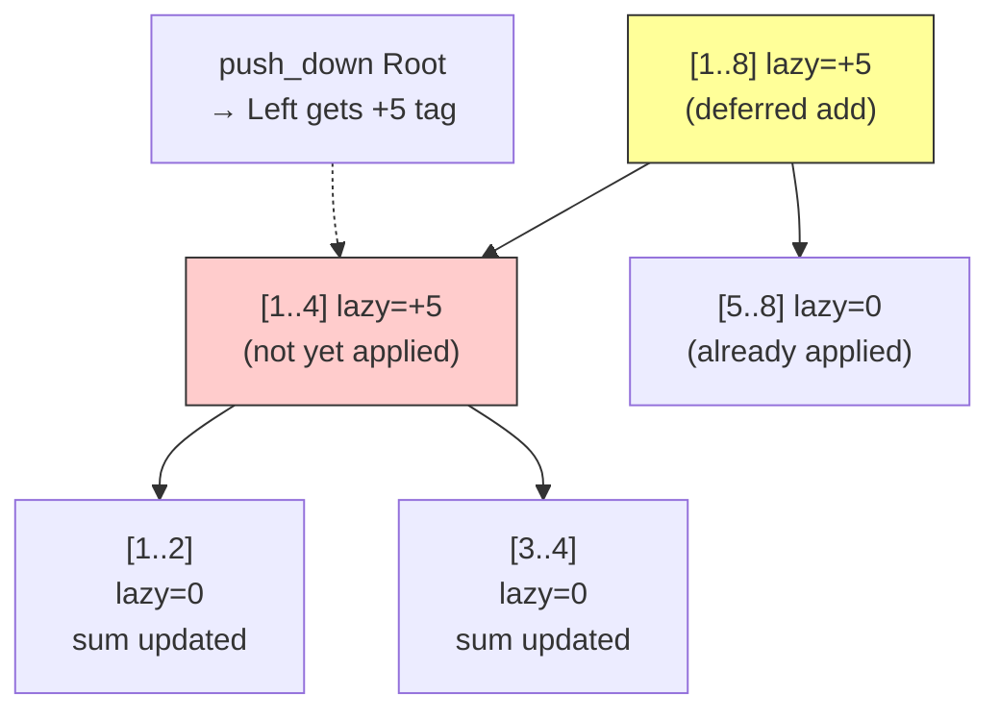

---
title: Segment Tree Advanced (Lazy Propagation & Persistent)
aliases: [Lazy Segment Tree, Persistent Segment Tree, Merge Sort Tree]
tags: [DSA, CompetitiveProgramming, DataStructures]
domain: DSA
difficulty: Advanced
created: 2026-07-26
related: [Segment_Tree, Fenwick_Tree, Coordinate_Compression]
status: complete
---

# 🌳 Segment Tree — Advanced (Lazy & Persistent)

> [!abstract] TL;DR
> **Lazy propagation** lets a segment tree handle range updates + range queries in O(log n) by deferring updates down the tree only when necessary. **Persistent segment tree** creates a new version per update in O(log n) time/space by sharing unchanged nodes. **Merge sort tree** (seg tree of sorted lists) answers kth-smallest in range in O(log² n). These three variants cover ~80% of hard DS problems in competitive programming.

## Intuition — Analogy First

**Lazy propagation**: imagine a manager who receives a memo saying "give everyone in department X a $1000 raise." Instead of updating every employee's file immediately, she writes a sticky note on the department door. Only when someone asks about a specific employee does she pass the sticky note down. This is a "lazy tag" — deferred work that propagates only when needed.

**Persistent segment tree**: like Git branches — each update creates a new version by copying only the O(log n) nodes along the path that changed. All other nodes are shared with the previous version. Query historical states by starting from the old root.

## How It Works — Full Explanation

### Lazy Propagation

Two invariants:
1. **push_down** before accessing children: propagate the lazy tag to children before recursing.
2. **push_up** after children are updated: recompute the current node from its children.

The lazy tag stores pending operations that haven't been applied to descendants yet. For **range add + range sum**:
- `lazy[node]` = pending addition to all elements in this node's range.
- When pushing down: `lazy[child] += lazy[node]`, `tree[child] += lazy[node] * child_size`.

For **range assign + range max**: similar, but `lazy[node]` stores the assigned value (use a sentinel like `None` for "no pending assign").

### Persistent Segment Tree

Each update creates a **new root** and at most `O(log n)` new nodes along the update path. All other nodes are shared (pointers reused). After `n` updates, total space is `O(n log n)`.

**Classic application**: "offline kth smallest in range [l, r]" — build SA[0..r] by inserting elements one by one. `root[r]` stores frequency info for `a[0..r]`. Range query = `root[r] - root[l-1]` (difference of two trees), walk down counting in left subtrees.

### Merge Sort Tree

**Segment tree where each node stores the sorted list of elements in its range.** Build in O(n log n) space. Query "how many elements in [l, r] are ≤ k" via binary search at each visited node: O(log² n). kth-smallest = binary search on answer + count query = O(log³ n), or O(log² n) with careful fractional cascading.



## The Math — Derivations

**Lazy propagation complexity**: each update/query traverses O(log n) nodes. At each node, push_down and push_up are O(1). Total: **O(log n)** per operation.

**Persistent segment tree space**:

$$\text{nodes per update} = O(\log n) \quad \Rightarrow \quad \text{total space} = O(n \log n)$$

**Merge sort tree space**: each element appears in O(log n) nodes → total **O(n log n)** space.

**Range kth-smallest query**: walk the persistent segment tree using a "virtual subtraction" of two roots:

$$\text{count\_left}(l, r) = \text{cnt\_left}(\text{root}[r]) - \text{cnt\_left}(\text{root}[l-1])$$

If `count_left >= k`, go left; otherwise subtract and go right. Total **O(log n)** per query.

**Beats segment tree** (Ji Driver Segmentation): supports `range min(a[i], x)` (chmin) + `range sum query` in amortized **O(n log² n)** by tracking `max` and `second_max` per node and only recursing when necessary.

## Template Code — Clean, Ready-to-Use Python

```python
# ─── 1. Lazy Propagation: Range Add + Range Sum ───────────────
class LazySegTree:
    """
    Range add, range sum query. 1-indexed, size n.
    Time: O(log n) per operation
    """
    def __init__(self, arr: list[int]):
        self.n = len(arr)
        self.tree = [0] * (4 * self.n)
        self.lazy = [0] * (4 * self.n)
        self._build(arr, 1, 1, self.n)

    def _build(self, arr, node, start, end):
        if start == end:
            self.tree[node] = arr[start - 1]
            return
        mid = (start + end) // 2
        self._build(arr, 2*node,   start, mid)
        self._build(arr, 2*node+1, mid+1, end)
        self.tree[node] = self.tree[2*node] + self.tree[2*node+1]

    def _push_down(self, node, start, end):
        if self.lazy[node] != 0:
            mid = (start + end) // 2
            left, right = 2*node, 2*node+1
            self.tree[left]  += self.lazy[node] * (mid - start + 1)
            self.tree[right] += self.lazy[node] * (end - mid)
            self.lazy[left]  += self.lazy[node]
            self.lazy[right] += self.lazy[node]
            self.lazy[node] = 0

    def update(self, l: int, r: int, val: int, node=1, start=1, end=None):
        """Add val to all elements in [l, r] (1-indexed)."""
        if end is None:
            end = self.n
        if r < start or end < l:
            return
        if l <= start and end <= r:
            self.tree[node] += val * (end - start + 1)
            self.lazy[node] += val
            return
        self._push_down(node, start, end)
        mid = (start + end) // 2
        self.update(l, r, val, 2*node,   start, mid)
        self.update(l, r, val, 2*node+1, mid+1, end)
        self.tree[node] = self.tree[2*node] + self.tree[2*node+1]

    def query(self, l: int, r: int, node=1, start=1, end=None) -> int:
        """Sum of [l, r] (1-indexed)."""
        if end is None:
            end = self.n
        if r < start or end < l:
            return 0
        if l <= start and end <= r:
            return self.tree[node]
        self._push_down(node, start, end)
        mid = (start + end) // 2
        return (self.query(l, r, 2*node,   start, mid) +
                self.query(l, r, 2*node+1, mid+1, end))


# ─── 2. Persistent Segment Tree ───────────────────────────────
class PersistentSegTree:
    """
    Persistent segment tree for range kth-smallest queries.
    Coordinate-compress values before use.
    Time: O(log n) per update/query  |  Space: O(n log n)
    """
    def __init__(self, max_val: int):
        self.max_val = max_val
        self.left  = [0]   # left child index (0 = null)
        self.right = [0]   # right child index
        self.cnt   = [0]   # count in subtree
        self.roots = [0]   # roots[i] = root after inserting first i elements

    def _new_node(self):
        self.left.append(0)
        self.right.append(0)
        self.cnt.append(0)
        return len(self.left) - 1

    def update(self, prev: int, val: int, lo: int = 1, hi: int = None) -> int:
        """
        Insert val into version prev, return new root node index.
        """
        if hi is None:
            hi = self.max_val
        cur = self._new_node()
        self.left[cur]  = self.left[prev]
        self.right[cur] = self.right[prev]
        self.cnt[cur]   = self.cnt[prev] + 1
        if lo == hi:
            return cur
        mid = (lo + hi) // 2
        if val <= mid:
            self.left[cur]  = self.update(self.left[prev],  val, lo,    mid)
        else:
            self.right[cur] = self.update(self.right[prev], val, mid+1, hi)
        return cur

    def kth(self, u: int, v: int, k: int, lo: int = 1, hi: int = None) -> int:
        """
        kth smallest in version-range [u+1..v].
        u = root of version l-1, v = root of version r.
        """
        if hi is None:
            hi = self.max_val
        if lo == hi:
            return lo
        mid = (lo + hi) // 2
        left_cnt = self.cnt[self.left[v]] - self.cnt[self.left[u]]
        if k <= left_cnt:
            return self.kth(self.left[u],  self.left[v],  k,     lo,    mid)
        else:
            return self.kth(self.right[u], self.right[v], k - left_cnt, mid+1, hi)

    def build(self, arr: list[int]) -> None:
        """Build from array (values must be in [1, max_val])."""
        self.roots = [0]
        root = 0
        for x in arr:
            root = self.update(root, x)
            self.roots.append(root)

    def query_kth(self, l: int, r: int, k: int) -> int:
        """kth smallest in arr[l-1..r-1] (1-indexed)."""
        return self.kth(self.roots[l-1], self.roots[r], k)


# ── Example ──────────────────────────────────────────────────
if __name__ == "__main__":
    # Lazy seg tree
    arr = [1, 3, 5, 7, 9, 11]
    seg = LazySegTree(arr)
    print("Sum [2,5]:", seg.query(2, 5))    # 3+5+7+9 = 24
    seg.update(2, 4, 10)                    # add 10 to indices 2,3,4
    print("Sum [2,5] after +10:", seg.query(2, 5))  # 13+15+17+9 = 54

    # Persistent seg tree: kth smallest in range
    arr2 = [3, 1, 4, 1, 5, 9, 2, 6]
    compressed = sorted(set(arr2))
    rank = {v: i+1 for i, v in enumerate(compressed)}
    pst = PersistentSegTree(len(compressed))
    pst.build([rank[x] for x in arr2])
    # 2nd smallest in arr2[1..5] = [3,1,4,1,5] → sorted [1,1,3,4,5] → 2nd = 1
    ans_rank = pst.query_kth(2, 6, 2)
    print("2nd smallest in [2,6]:", compressed[ans_rank - 1])  # 1
```

## Worked Example — Lazy Propagation Trace

**Array**: `[1, 2, 3, 4, 5]`, **operation**: `range_add([2, 4], +10)`

```
Segment tree before update (node [start,end] = sum):
Node 1 [1,5] = 15
  Node 2 [1,3] = 6      Node 3 [4,5] = 9
    Node 4 [1,2]=3         Node 6 [4,4]=4
    Node 5 [3,3]=3         Node 7 [5,5]=5

range_add(2, 4, 10):
→ At node 2 [1,3]: partial overlap → push_down (lazy=0, nothing to do) → recurse
  → At node 4 [1,2]: partial overlap → push_down → recurse
    → At node 8 [1,1]: out of range [2,4] → return
    → At node 9 [2,2]: fully inside → tree[9]+=10, lazy[9]+=10 → tree[9]=12
    → push_up: tree[4] = tree[8]+tree[9] = 1+12 = 13
  → At node 5 [3,3]: fully inside → tree[5]+=10, lazy[5]+=10 → tree[5]=13
  → push_up: tree[2] = 13+13 = 26
→ At node 3 [4,5]: partial overlap → push_down (lazy=0) → recurse
  → At node 6 [4,4]: fully inside → tree[6]+=10, lazy[6]+=10 → tree[6]=14
  → At node 7 [5,5]: out of range → return
  → push_up: tree[3] = 14+5 = 19
→ push_up: tree[1] = 26+19 = 45

Result: sum [2,4] = 12+13+14 = 39 ✓
```

## CP Problem Patterns

| Problem | Technique |
|---------|-----------|
| Range add + range sum/min/max | Lazy propagation |
| Range assign + range sum | Lazy (assign tag, careful push_down) |
| kth smallest in static range | Persistent segment tree |
| Count of range sum (offline) | Merge sort tree or persistent seg tree |
| Falling Squares (coordinate compress + range max) | Lazy seg tree with range assign |
| Kth Smallest in Range (LeetCode 2519) | Persistent seg tree |
| Segment Beats (range chmin + range sum) | Ji Driver Segmentation |
| Historical maximum (max over all versions) | Extension of persistent tree |

## Common Pitfalls & Edge Cases

1. **push_down before recursing, push_up after**: reversing this order corrupts the tree.
2. **Lazy tag identity**: for range add, identity = 0; for range assign, identity = `None`/sentinel. Distinguish "no pending operation" from "assign to zero."
3. **Combining lazy tags**: if a node already has an add-tag and receives another, they add. If it has an assign-tag and receives an add, the add modifies the assign value. Specify semantics carefully.
4. **Persistent tree memory**: pre-allocate `4 * n * log(n)` nodes to avoid dynamic allocation overhead in C++.
5. **Merge sort tree query correctness**: when querying "count ≤ k in [l,r]", you visit O(log n) nodes and do binary search at each — make sure to handle partial coverage correctly.
6. **Coordinate compression before persistent tree**: values must map to `[1, m]` for a manageable tree size.

## Related Concepts

- [[_MOC_Competitive_Programming|↑ Section MOC]]
- [[Segment_Tree]] — base segment tree without lazy/persistence
- [[Fenwick_Tree]] — simpler, faster for sum-only queries without lazy updates
- [[Coordinate_Compression]] — prerequisite for persistent seg tree on large value ranges
- [[Sparse_Table]] — O(1) static RMQ (no updates needed)

## Review Questions

1. In lazy propagation, why must you call `push_down` before recursing into children, and `push_up` after returning? What breaks if you do them in the wrong order?
2. How does a persistent segment tree achieve O(log n) time and O(log n) additional space per update despite the tree having O(n) nodes? Draw the node-sharing diagram for two consecutive point updates.
3. Describe how to answer "kth smallest element in subarray [l, r]" using a persistent segment tree built on coordinate-compressed values. What is the time complexity?

## Sources / Problems

- **Reading**: CP-Algorithms — [Segment Tree](https://cp-algorithms.com/data_structures/segment_tree.html)
- **LeetCode 307** — Range Sum Query - Mutable (base seg tree)
- **LeetCode 327** — Count of Range Sum (merge sort tree)
- **LeetCode 699** — Falling Squares (coordinate compress + lazy seg tree)
- **Codeforces 786C** — Till I Collapse (persistent seg tree)
- **AtCoder** — many problems in ABC/ARC that use lazy propagation

#SegmentTree #LazyPropagation #PersistentSegTree #MergeSortTree #DataStructures #CompetitiveProgramming
