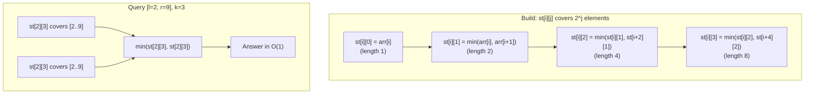

---
title: Sparse Table
aliases: [RMQ, Range Minimum Query, Sparse Table RMQ]
tags: [DSA, CompetitiveProgramming, DataStructures]
domain: DSA
difficulty: Intermediate
created: 2026-07-26
related: [Segment_Tree, Fenwick_Tree]
status: complete
---

# ⚡ Sparse Table

> [!abstract] TL;DR
> Sparse Table answers **range minimum (or maximum, GCD) queries in O(1)** after O(n log n) preprocessing. The key: precompute `st[i][j]` = min of `[i, i + 2^j - 1]`. For query `[l, r]`, find `k = floor(log2(r-l+1))` and return `min(st[l][k], st[r - 2^k + 1][k])` — the two ranges overlap, but **idempotency** (`min(a, a) = a`) makes this correct. No updates supported; use segment tree when values change.

## Intuition — Analogy First

You're a referee timing 100-metre sprint heats. Before the day starts, you precompute the fastest runner in every interval of length 1, 2, 4, 8, … heats. When a judge asks "who's fastest in heats 7–19?", you don't re-scan — you just look up the precomputed table for the two overlapping power-of-2 windows that together cover [7, 19]. The overlap doesn't matter because the fastest in the union is still the fastest of the two maximums. That's idempotency in action.

## How It Works — Full Explanation

### Structure

`st[i][j]` = minimum (or any idempotent function) of the subarray `arr[i .. i + 2^j - 1]`.

**Build** (bottom-up DP):
- Base: `st[i][0] = arr[i]` for all `i`.
- Recurrence: `st[i][j] = min(st[i][j-1], st[i + 2^(j-1)][j-1])` — split the range of length `2^j` into two halves of length `2^(j-1)`.

**Query [l, r]**:
1. Compute `k = floor(log2(r - l + 1))`.
2. Return `min(st[l][k], st[r - 2^k + 1][k])`.
   - `st[l][k]` covers `[l, l + 2^k - 1]`.
   - `st[r - 2^k + 1][k]` covers `[r - 2^k + 1, r]`.
   - These two intervals together span `[l, r]` (with overlap allowed since min is idempotent).

**Why idempotency matters**: For non-idempotent functions like **sum**, the overlap causes double-counting — `sum(a, a) ≠ a`. Sparse table works for: min, max, GCD, bitwise AND/OR, but NOT for sum/product.

### Precomputed Log Table

Computing `floor(log2(x))` with `math.log` introduces floating-point errors. Instead, precompute an integer log table:
```
log_table[1] = 0
log_table[i] = log_table[i // 2] + 1
```
This gives exact O(1) floor-log in queries.



## The Math — Derivations

**Build time**: for each of `n` starting positions and `log n` levels, we do O(1) work:

$$T_{\text{build}} = O(n \log n)$$

**Query time**: O(1) — two table lookups + one comparison.

**Space**: $O(n \log n)$ — the table has $n \times \lfloor \log_2 n \rfloor + 1$ entries.

**Correctness of overlapping ranges**: for any two positions $a, b$ in $[l, r]$:

$$\min(st[l][k],\ st[r - 2^k + 1][k]) = \min_{i \in [l,r]} arr[i]$$

Proof: every index in $[l, r]$ is covered by at least one of the two ranges (since their union covers $[l, r]$ when $2^k \leq r - l + 1 < 2^{k+1}$). Elements covered by both contribute the same minimum value to both lookups — the overall `min` is still correct.

**Idempotency requirement formally**: a function $f$ is idempotent if $f(x, x) = x$. For sparse table overlap, we need:

$$f(\text{ans1}, \text{ans2}) = f\left(\min_{[l, m]}, \min_{[m', r]}\right) = \min_{[l,r]}$$

This holds iff $f(\min(X), \min(X)) = \min(X)$ for the overlap region $X$ — exactly the idempotency condition.

## Template Code — Clean, Ready-to-Use Python

```python
import math

class SparseTable:
    """
    Static range minimum query (RMQ) in O(1) after O(n log n) build.
    Works for any idempotent function: min, max, gcd, bitwise AND/OR.
    """
    def __init__(self, arr: list[int], func=min):
        self.func = func
        self.n = len(arr)
        self.LOG = self.n.bit_length()  # floor(log2(n)) + 1

        # Precompute integer log table for O(1) floor_log2
        self.log_table = [0] * (self.n + 1)
        for i in range(2, self.n + 1):
            self.log_table[i] = self.log_table[i // 2] + 1

        # Build sparse table: st[j][i] = func of arr[i .. i + 2^j - 1]
        # Using j as outer index avoids cache thrashing in Python
        self.st = [arr[:]]  # st[0] = original array
        for j in range(1, self.LOG + 1):
            prev = self.st[j - 1]
            half = 1 << (j - 1)
            cur = [func(prev[i], prev[i + half])
                   if i + half < self.n else prev[i]
                   for i in range(self.n)]
            self.st.append(cur)

    def query(self, l: int, r: int) -> int:
        """
        Return func(arr[l..r]) in O(1).
        l, r are 0-indexed and both inclusive.
        """
        length = r - l + 1
        k = self.log_table[length]
        return self.func(self.st[k][l], self.st[k][r - (1 << k) + 1])


class SparseTableGCD:
    """GCD Sparse Table — idempotent since gcd(a,a)=a."""
    def __init__(self, arr: list[int]):
        from math import gcd
        self.table = SparseTable(arr, func=gcd)

    def query_gcd(self, l: int, r: int) -> int:
        return self.table.query(l, r)


def build_sparse_table_cpp_style(arr: list[int]) -> tuple[list[list[int]], list[int]]:
    """
    C++-style build: returns (st, log_table) for use in competitive programming.
    st[j][i] = min of arr[i .. i + 2^j - 1]
    """
    n = len(arr)
    LOG = max(1, n.bit_length())
    log_table = [0] * (n + 1)
    for i in range(2, n + 1):
        log_table[i] = log_table[i // 2] + 1

    st = [[0] * n for _ in range(LOG + 1)]
    st[0] = arr[:]
    for j in range(1, LOG + 1):
        for i in range(n - (1 << j) + 1):
            st[j][i] = min(st[j-1][i], st[j-1][i + (1 << (j-1))])
    return st, log_table


def rmq(st, log_table, l, r):
    """O(1) RMQ using precomputed sparse table."""
    k = log_table[r - l + 1]
    return min(st[k][l], st[k][r - (1 << k) + 1])


# ── Example ──────────────────────────────────────────────────
if __name__ == "__main__":
    arr = [2, 4, 3, 1, 6, 7, 8, 9, 1, 7]
    st = SparseTable(arr)

    print("Min [0,9]:", st.query(0, 9))   # 1
    print("Min [2,5]:", st.query(2, 5))   # 1
    print("Min [4,7]:", st.query(4, 7))   # 6
    print("Min [0,0]:", st.query(0, 0))   # 2

    # GCD sparse table
    from math import gcd
    arr2 = [12, 6, 18, 9, 3]
    st2 = SparseTable(arr2, func=gcd)
    print("GCD [0,4]:", st2.query(0, 4))  # gcd(12,6,18,9,3) = 3
    print("GCD [0,1]:", st2.query(0, 1))  # gcd(12,6) = 6
```

## Worked Example — Trace Through

**Array**: `arr = [3, 1, 4, 1, 5, 9, 2, 6]` (0-indexed)

**Build sparse table** (showing key entries):

```
j=0 (length 1): [3, 1, 4, 1, 5, 9, 2, 6]
j=1 (length 2): [1, 1, 1, 1, 5, 2, 2, _]
  st[1][0] = min(3,1)=1
  st[1][2] = min(4,1)=1
  st[1][4] = min(5,9)=5
  st[1][5] = min(9,2)=2
  st[1][6] = min(2,6)=2
j=2 (length 4): [1, 1, 1, 1, 2, _, _, _]
  st[2][0] = min(st[1][0], st[1][2]) = min(1,1) = 1
  st[2][4] = min(st[1][4], st[1][6]) = min(5,2) = 2
j=3 (length 8): [1, _, _, _, _, _, _, _]
  st[3][0] = min(st[2][0], st[2][4]) = min(1,2) = 1
```

**Query [2, 7]** (length 6):
- `k = floor(log2(6)) = 2`, so `2^k = 4`
- `st[2][2]` covers [2, 5] = 1
- `st[2][7 - 4 + 1] = st[2][4]` covers [4, 7] = 2
- Answer: `min(1, 2) = 1` ✓ (element at index 3)

**Query [4, 6]** (length 3):
- `k = floor(log2(3)) = 1`, so `2^k = 2`
- `st[1][4]` covers [4, 5] = 5
- `st[1][6-2+1] = st[1][5]` covers [5, 6] = 2
- Answer: `min(5, 2) = 2` ✓

## CP Problem Patterns

| Pattern | Sparse Table Role |
|---------|------------------|
| Static range minimum/maximum | Direct application: O(1) query |
| Range GCD query | GCD is idempotent; same structure |
| Range bitwise AND/OR | Both idempotent; direct application |
| LCA (binary lifting) | Same idea — precompute ancestors at power-of-2 depths |
| Cartesian tree / RMQ equivalence | RMQ ↔ LCA on Cartesian tree |
| Sliding window minimum (static) | Sparse table over fixed windows |
| Min in "skyline" problems | Preprocess heights for O(1) range min |
| Verify if range is non-decreasing | Range max == range min? No — use different approach |

## Common Pitfalls & Edge Cases

1. **Not idempotent = wrong answer**: sum, product, XOR (not idempotent) will give incorrect answers with the overlap trick. Verify your function is idempotent before using sparse table.
2. **0-indexing vs 1-indexing**: be consistent. The template above uses 0-indexing.
3. **Integer log precision**: never use `int(math.log2(x))` — it gives `int(math.log2(8)) = 2` sometimes due to floating point. Use the integer `log_table` or `x.bit_length() - 1`.
4. **Query l == r**: handled correctly since `k = 0`, both lookups return `arr[l]`.
5. **Build loop bounds**: `st[j][i]` is only valid for `i + 2^j - 1 < n`. Ensure inner loop stops at `n - 2^j`.
6. **No updates**: if the array changes even once, rebuild the entire table (O(n log n)). For dynamic data, use a segment tree.

## Related Concepts

- [[_MOC_Competitive_Programming|↑ Section MOC]]
- [[Segment_Tree]] — supports updates (O(log n) query), but no O(1) static query
- [[Fenwick_Tree]] — sum-only, supports updates; not applicable for min/max
- [[Segment_Tree_Advanced]] — for when you need lazy propagation with range updates

## Review Questions

1. Why can't a sparse table be used for range sum queries, but can be used for range minimum and range GCD? Give a concrete counterexample for sum.
2. Trace the query `[l=1, r=5]` on `arr = [5, 2, 8, 1, 9, 3]`. What is `k`? Which two table entries are looked up? Verify correctness.
3. How would you use a sparse table to answer "is the minimum in [l, r] achieved at a unique index?" in O(1) after O(n log n) preprocessing?

## Sources / Problems

- **Reading**: CP-Algorithms — [Sparse Table](https://cp-algorithms.com/data_structures/sparse-table.html)
- **LeetCode 2104** — Sum of Subarray Ranges (min/max; can use sparse table)
- **LeetCode 1231** — related RMQ pattern
- **Codeforces** — problems marked with "RMQ" or "LCA" often use sparse table internally
- **USACO** — Platinum problems with static arrays and many range queries
- **AtCoder** — Library Checker: "Static RMQ" is the canonical test problem

#SparseTable #RMQ #RangeMinimumQuery #DataStructures #CompetitiveProgramming #Idempotent
