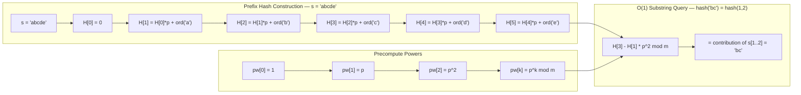

---
title: String Hashing
aliases: [Polynomial Rolling Hash, Rabin-Karp, Double Hashing, Prefix Hash]
tags: [DSA, CompetitiveProgramming, StringHashing, RollingHash, RabinKarp]
domain: DSA
difficulty: Advanced
created: 2026-07-26
related: [KMP_Algorithm, Z_Algorithm, Binary_Search_Patterns]
status: complete
---

# 🧮 String Hashing

> [!abstract] TL;DR
> Polynomial rolling hashing maps a string to a number so that two strings are equal if and only if their hashes match (with high probability). After O(n) preprocessing to build prefix hashes, any substring's hash is retrievable in O(1). This enables O(n log n) solutions to problems like "longest duplicate substring" that would otherwise need O(n²) naive comparison. Use double hashing (two independent hash functions) to make collision probability negligible.

## Intuition — analogy FIRST

Think of a book's ISBN number — a short code that uniquely identifies a book. If two books have the same ISBN, they're the same book (in theory). String hashing is the same idea: compress a string down to a single number so that equal strings always hash the same way.

The "prefix hash array" is like having an ISBN for every prefix of the text. Then the hash of any substring s[l..r] can be recovered by subtracting the ISBN of s[0..l-1] from the ISBN of s[0..r], analogous to how a prefix sum lets you compute a subarray sum by subtraction.

The danger: two different books could accidentally get the same ISBN (collision). Double hashing — computing two independent ISBNs using different primes — makes the coincidence astronomically unlikely.

## How It Works — full explanation + mermaid

### Polynomial Rolling Hash

For string s of length n over an alphabet, choose a base p (prime, larger than alphabet size) and a modulus m (large prime):

$$h(s) = s[0] \cdot p^0 + s[1] \cdot p^1 + s[2] \cdot p^2 + \cdots + s[n-1] \cdot p^{n-1} \pmod{m}$$

Or equivalently (left-to-right, more common):

$$h(s) = s[0] \cdot p^{n-1} + s[1] \cdot p^{n-2} + \cdots + s[n-1] \cdot p^0 \pmod{m}$$

Both work; pick one and be consistent.

### Prefix Hash Array

Define:
$$H[0] = 0, \quad H[i] = H[i-1] \cdot p + s[i-1] \pmod{m}$$

Then the hash of substring s[l..r] (0-indexed, inclusive) is:

$$\text{hash}(l, r) = (H[r+1] - H[l] \cdot p^{r-l+1}) \bmod m$$

This is the "polynomial evaluation" at position l to r: removing the contribution of the first l characters.

### Why Subtract?

$$H[r+1] = s[0] \cdot p^r + s[1] \cdot p^{r-1} + \cdots + s[l] \cdot p^{r-l} + \cdots + s[r] \cdot p^0$$
$$H[l] \cdot p^{r-l+1} = s[0] \cdot p^r + s[1] \cdot p^{r-1} + \cdots + s[l-1] \cdot p^{r-l+1}$$

Subtracting cancels the prefix, leaving exactly the contribution of s[l..r].

### Collision Probability

For a single hash function with modulus m, the probability of a false collision between two distinct strings of length n is at most $n/m$. With $m \approx 10^{18}$, this is negligible for typical inputs.

However, adversarial test cases can be constructed to cause collisions with a single hash. **Double hashing** uses two independent (p, m) pairs and requires both hashes to match — collision probability drops to $\approx (n/m_1)(n/m_2) \approx 10^{-30}$, effectively zero.

### Choice of Parameters

- **p**: 31 or 37 for lowercase letters; 131 for printable ASCII; any prime > alphabet size
- **m1**: `10^9 + 7` (common large prime)
- **m2**: `10^9 + 9` (another large prime, for double hashing)
- Or use **m = 2^61 - 1** (Mersenne prime, supports fast mod) with a single hash — extremely safe in practice



## The Math

**Substring hash formula**:

$$\text{hash}(s[l \ldots r]) = (H[r+1] - H[l] \cdot p^{r-l+1} \bmod m + \text{large\_multiple\_of\_m}) \bmod m$$

The `+ large_multiple_of_m` ensures non-negative result (critical in Python and C++).

**Collision probability** (birthday paradox bound): If we compare $Q$ pairs of substrings and each collision probability is $1/m$, the expected number of false matches is $Q/m$. For $Q = n^2 \approx 10^{12}$ comparisons and $m \approx 10^{18}$, expected false matches $\approx 10^{-6}$ — still fine.

**Rabin-Karp string matching**: Compute hash of pattern P (length m), then slide a window of length m over text T, updating the hash in O(1). Compare hashes → if match, verify character by character (to handle collisions). Expected O(n + m), worst case O(nm).

**Rolling hash update** (for sliding window of fixed length w):

$$H_{\text{new}} = (H_{\text{old}} - s[\text{left}] \cdot p^{w-1}) \cdot p + s[\text{right}] \pmod{m}$$

This removes the leftmost character and appends a new rightmost character.

## Template Code

```python
# ─── String Hasher with double hashing ────────────────────────────
class StringHasher:
    """
    Polynomial rolling hash with double hashing for near-zero collision probability.
    Builds prefix hash array in O(n); answers substring hash queries in O(1).
    """
    MOD1 = 10**9 + 7
    MOD2 = 10**9 + 9
    BASE1 = 131
    BASE2 = 137

    def __init__(self, s: str):
        n = len(s)
        self.n = n

        # Prefix hashes
        self.h1 = [0] * (n + 1)
        self.h2 = [0] * (n + 1)

        # Precomputed powers
        self.pw1 = [1] * (n + 1)
        self.pw2 = [1] * (n + 1)

        for i in range(n):
            self.h1[i+1] = (self.h1[i] * self.BASE1 + ord(s[i])) % self.MOD1
            self.h2[i+1] = (self.h2[i] * self.BASE2 + ord(s[i])) % self.MOD2
            self.pw1[i+1] = self.pw1[i] * self.BASE1 % self.MOD1
            self.pw2[i+1] = self.pw2[i] * self.BASE2 % self.MOD2

    def get_hash(self, l: int, r: int) -> tuple[int, int]:
        """
        Returns (hash1, hash2) of s[l..r] (0-indexed, inclusive).
        O(1) per query.
        """
        length = r - l + 1
        h1 = (self.h1[r+1] - self.h1[l] * self.pw1[length]) % self.MOD1
        h2 = (self.h2[r+1] - self.h2[l] * self.pw2[length]) % self.MOD2
        return (h1, h2)

    def are_equal(self, l1: int, r1: int, l2: int, r2: int) -> bool:
        """Check if s[l1..r1] == s[l2..r2] in O(1)."""
        if r1 - l1 != r2 - l2:
            return False
        return self.get_hash(l1, r1) == self.get_hash(l2, r2)

# ─── Longest Duplicate Substring (Binary search + hashing) ────────
def longest_duplicate_substring(s: str) -> str:
    """
    Binary search on length L; check if any substring of length L appears twice.
    O(n log n) overall.
    """
    hasher = StringHasher(s)
    n = len(s)

    def has_duplicate_of_length(length: int) -> int:
        """Returns start index of first duplicate, or -1."""
        seen: dict[tuple, int] = {}
        for i in range(n - length + 1):
            h = hasher.get_hash(i, i + length - 1)
            if h in seen:
                return seen[h]
            seen[h] = i
        return -1

    lo, hi = 1, n - 1
    best_start, best_len = -1, 0
    while lo <= hi:
        mid = (lo + hi) // 2
        idx = has_duplicate_of_length(mid)
        if idx != -1:
            best_start, best_len = idx, mid
            lo = mid + 1
        else:
            hi = mid - 1

    return s[best_start:best_start + best_len] if best_len > 0 else ""

# ─── Rabin-Karp: find all occurrences of pattern in text ──────────
def rabin_karp(text: str, pattern: str) -> list[int]:
    """
    Returns all start indices where pattern occurs in text.
    Average O(n + m); worst case O(nm) due to collision verification.
    """
    n, m = len(text), len(pattern)
    if m > n:
        return []

    MOD, BASE = 10**9 + 7, 131
    ph = phash = 0
    power = 1

    for i in range(m):
        phash = (phash * BASE + ord(pattern[i])) % MOD
        ph = (ph * BASE + ord(text[i])) % MOD
        if i > 0:
            power = power * BASE % MOD

    results = []
    if ph == phash and text[:m] == pattern:
        results.append(0)

    for i in range(1, n - m + 1):
        ph = (ph - ord(text[i-1]) * power % MOD + MOD) * BASE % MOD
        ph = (ph + ord(text[i + m - 1])) % MOD
        if ph == phash and text[i:i+m] == pattern:
            results.append(i)

    return results
```

## Worked Example — trace through a real problem

**Problem**: Are substrings "abc" and "abc" at positions [0,2] and [4,6] in "abcXabc" equal?

String: `a b c X a b c` (indices 0–6)

**Build prefix hashes** (using BASE=31, MOD=10^9+7, treating a=1, b=2, ..., z=26):

```
H[0] = 0
H[1] = 0*31 + 1 = 1           (a)
H[2] = 1*31 + 2 = 33          (ab)
H[3] = 33*31 + 3 = 1026       (abc)
H[4] = 1026*31 + 24 = 31830   (abcX, X=24)
H[5] = 31830*31 + 1 = 986731  (abcXa)
H[6] = 986731*31 + 2 = 30588663  (abcXab)
H[7] = 30588663*31 + 3 = 947848560  (abcXabc)

pw = [1, 31, 961, 29791, ...]
```

**Query hash(0, 2)** (first "abc", length 3):
```
hash(0,2) = H[3] - H[0] * pw[3]
           = 1026 - 0 * 29791 = 1026
```

**Query hash(4, 6)** (second "abc", length 3):
```
hash(4,6) = H[7] - H[4] * pw[3]
           = 947848560 - 31830 * 29791
           = 947848560 - 947874930 ← would be negative, add MOD
           = (947848560 - 947874930 + 10^9+7) % (10^9+7)
           = 1026  ✓ (matches first)
```

**Conclusion**: The hashes match → the substrings are equal. ✓

## CP Problem Patterns

| Problem | String hashing technique |
|---|---|
| Find all occurrences of pattern in text | Rabin-Karp rolling hash |
| Longest duplicate substring | Binary search on length + hash set |
| Longest palindromic substring | Hash forward + reverse, binary search |
| String compression (smallest period) | Check if hash of s[0..L-1] repeats |
| Count distinct substrings | Sort all n*(n+1)/2 substring hashes |
| Compare substrings in O(1) | Prefix hash array |
| Anagram detection | Sort character hash or use multiset hash |
| Z-array via hashing | Less common; KMP/Z more direct |

## Common Pitfalls & Edge Cases

- **Negative hash after subtraction**: Always add MOD (or a large multiple of MOD) before taking mod. In C++, `(a - b) % MOD` is negative when a < b.
- **Hash collision in solutions**: Single hash with small modulus (10^9+7) can be hacked in contests. Use double hashing or the Mersenne prime 2^61-1.
- **Power array off-by-one**: `pw[k]` should equal `BASE^k`. Make sure `pw[0] = 1` and the length passed to the formula matches the substring length.
- **0 as a valid hash**: If hash == 0, it's a valid hash, not "no result." Don't use 0 as a sentinel.
- **Rabin-Karp still needs character verification**: When hashes match, always verify with actual string comparison to handle collisions correctly.
- **Empty substring**: hash(l, r) when l > r should return a defined sentinel (e.g., 0). Guard this case.
- **Single character strings**: pw[1] = BASE, not 1. Trace through a length-1 query to verify your formula.
- **Large n in Python**: `h1[i] * pw1[length]` can be a very large number before `% MOD`. Python handles this, but in C++ use `(__int128)` or take mod more carefully.

## Related Concepts

- [[_MOC_Competitive_Programming|↑ Section MOC]]
- [[KMP_Algorithm]]
- [[Z_Algorithm]]
- [[Binary_Search_Patterns]]
- [[Combinatorics]]

## Review Questions

1. Given prefix hashes `H = [0, 97, 9799, 981098, ...]` with BASE=100 and MOD=10^9+7, explain how to compute the hash of the substring at positions [1, 2] (0-indexed). Write the formula and identify what each term represents.
2. Why does double hashing reduce collision probability from ~1/m to ~1/(m1×m2)? Under what circumstances could an adversary still cause collisions even with double hashing?
3. Describe how to use string hashing plus binary search to solve "Longest Duplicate Substring" in O(n log n). Why is binary search valid here (what monotone property does it exploit)?

## Sources / Problems

- LeetCode: 1044 (Longest Duplicate Substring), 718 (Maximum Length of Repeated Subarray)
- LeetCode: 28 (Find the Index of the First Occurrence — Rabin-Karp approach)
- Codeforces: problems tagged "hashing", "strings"
- CP-algorithms.com: "String Hashing", "Rabin-Karp Algorithm"
- "Competitive Programmer's Handbook" — Chapter 26 (String Algorithms)
- "Algorithm Design" — Kleinberg & Tardos (Rabin-Karp)

#StringHashing #RollingHash #RabinKarp #DoubleHashing #PrefixHash #SubstringComparison #LongestDuplicateSubstring
