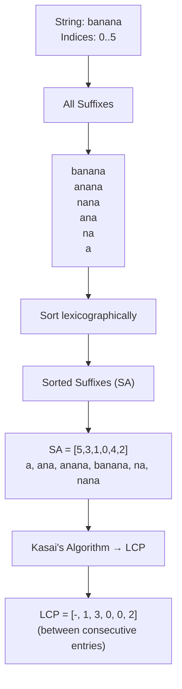

---
title: Suffix Array
aliases: [SA, Suffix Array + LCP]
tags: [DSA, CompetitiveProgramming, StringAlgorithms]
domain: DSA
difficulty: Advanced
created: 2026-07-26
related: [KMP_Algorithm, Z_Algorithm, String_Hashing]
status: complete
---

# 📐 Suffix Array

> [!abstract] TL;DR
> A suffix array `SA` is the sorted array of all suffixes of a string, stored as start indices. Combined with the LCP (Longest Common Prefix) array built via Kasai's algorithm, it answers virtually every string query in O(log n) or O(1). Construction is O(n log² n) with prefix doubling (or O(n) with SA-IS). Key formula: **distinct substrings = n(n+1)/2 − Σ LCP**.

## Intuition — Analogy First

A phone book sorts all names alphabetically. A suffix array is like making a phone book of every possible "tail" of a long string — from the last character all the way back to the full string. Once sorted, any question about substrings becomes a binary search question: "find me the range of entries that start with pattern P." The LCP array tells you how much consecutive entries share, which avoids re-scanning shared prefixes and enables O(1) range-LCP queries via Sparse Table.

## How It Works — Full Explanation

### Suffix Array (SA)

`SA[i]` = starting index of the i-th lexicographically smallest suffix.

**Prefix doubling (O(n log² n)):**
1. Sort suffixes by their first character → initial ranking.
2. Double the key length each round: sort by rank of `(s[i..i+2^k-1])` = pair `(rank[i], rank[i + 2^(k-1)])`.
3. After `log n` rounds, keys cover the full suffix length → SA is complete.
4. Each sort step is O(n log n) using Python's timsort on pairs → total O(n log² n).

**O(n) algorithms**: DC3 (Skew) and SA-IS exist for contests requiring truly linear construction, but prefix doubling is usually sufficient for n ≤ 10^5.

### LCP Array (Kasai's Algorithm, O(n))

`LCP[i]` = length of longest common prefix between `SA[i]` and `SA[i-1]` (consecutive sorted suffixes).

**Kasai's key insight**: if suffix starting at `s[i]` has LCP `k` with its predecessor, then suffix `s[i+1]` has LCP at least `k-1` with its predecessor. This means the LCP pointer never decreases by more than 1 per step → total work O(n).

### Applications

- **Longest common substring of two strings**: concatenate with sentinel, build SA+LCP, find max LCP between suffixes from different strings.
- **Number of distinct substrings**: total substrings = n(n+1)/2. Subtract duplicates via LCP: `n(n+1)/2 − Σ LCP[i]`.
- **Number of occurrences of pattern P**: binary search on SA to find range `[lo, hi]` of suffixes starting with P → count = `hi - lo + 1`.
- **Longest repeated substring**: max value in LCP array.



## The Math — Derivations

**Construction complexity with prefix doubling:**

$$T(n) = \sum_{k=0}^{\log n} O(n \log n) = O(n \log^2 n)$$

**Distinct substrings**: each suffix `SA[i]` of length `n - SA[i]` introduces `(n - SA[i]) - LCP[i]` new substrings (substrings not shared with the previous suffix).

$$\text{distinct\_substrings} = \sum_{i=0}^{n-1} \big((n - SA[i]) - LCP[i]\big) = \frac{n(n+1)}{2} - \sum_{i=1}^{n-1} LCP[i]$$

**Pattern matching via binary search**: for pattern `P` of length `m`:

$$\text{occurrences} = \text{upper\_bound}(P) - \text{lower\_bound}(P) \quad \text{in } O(m \log n)$$

With LCP-accelerated binary search (using sparse table for range-min on LCP), this reduces to **O(m + log n)**.

**Range LCP query**: `lcp(i, j) = RMQ(LCP[i+1..j])` where RMQ is answered in O(1) using a sparse table over the LCP array.

## Template Code — Clean, Ready-to-Use Python

```python
def build_suffix_array(s: str) -> list[int]:
    """
    Build suffix array via prefix doubling.
    Time: O(n log^2 n)  |  Space: O(n)
    """
    n = len(s)
    # initial ranking by character
    sa = sorted(range(n), key=lambda i: s[i])
    rank = [0] * n
    rank[sa[0]] = 0
    for i in range(1, n):
        rank[sa[i]] = rank[sa[i-1]] + (1 if s[sa[i]] != s[sa[i-1]] else 0)

    gap = 1
    while gap < n:
        # sort by (rank[i], rank[i+gap]) pairs
        def sort_key(i):
            return (rank[i], rank[i + gap] if i + gap < n else -1)
        sa = sorted(range(n), key=sort_key)
        # recompute ranks
        new_rank = [0] * n
        new_rank[sa[0]] = 0
        for i in range(1, n):
            prev, cur = sa[i-1], sa[i]
            same = (rank[prev] == rank[cur] and
                    (rank[prev+gap] if prev+gap < n else -1) ==
                    (rank[cur+gap]  if cur+gap  < n else -1))
            new_rank[cur] = new_rank[prev] + (0 if same else 1)
        rank = new_rank
        if rank[sa[-1]] == n - 1:
            break  # all ranks unique, done early
        gap *= 2
    return sa


def build_lcp(s: str, sa: list[int]) -> list[int]:
    """
    Build LCP array using Kasai's algorithm.
    LCP[i] = lcp(sa[i-1], sa[i])  (LCP[0] = 0 by convention)
    Time: O(n)  |  Space: O(n)
    """
    n = len(s)
    rank = [0] * n
    for i, suffix in enumerate(sa):
        rank[suffix] = i
    lcp = [0] * n
    h = 0  # current lcp length
    for i in range(n):
        if rank[i] > 0:
            j = sa[rank[i] - 1]  # predecessor in sorted order
            while i + h < n and j + h < n and s[i + h] == s[j + h]:
                h += 1
            lcp[rank[i]] = h
            if h > 0:
                h -= 1  # Kasai's key: lcp decreases by at most 1
    return lcp


def count_distinct_substrings(s: str) -> int:
    """Count distinct non-empty substrings of s."""
    n = len(s)
    sa = build_suffix_array(s)
    lcp = build_lcp(s, sa)
    total = n * (n + 1) // 2
    return total - sum(lcp)


def find_pattern(text: str, pattern: str, sa: list[int]) -> tuple[int, int]:
    """
    Binary search for pattern in text using its suffix array.
    Returns (lo, hi) inclusive range in SA, or (-1, -1) if not found.
    Count of occurrences = hi - lo + 1.
    Time: O(m log n) where m = |pattern|, n = |text|
    """
    m = len(pattern)
    n = len(text)

    def suffix_ge(mid: int, p: str) -> bool:
        return text[sa[mid]:sa[mid]+m] >= p

    # lower bound: first suffix >= pattern
    lo, hi = 0, n
    while lo < hi:
        mid = (lo + hi) // 2
        if suffix_ge(mid, pattern):
            hi = mid
        else:
            lo = mid + 1
    left = lo

    # upper bound: first suffix > pattern
    lo, hi = 0, n
    while lo < hi:
        mid = (lo + hi) // 2
        if text[sa[mid]:sa[mid]+m] > pattern:
            hi = mid
        else:
            lo = mid + 1
    right = lo - 1

    if left > right:
        return (-1, -1)
    return (left, right)


def longest_common_substring(s: str, t: str) -> str:
    """
    Find longest common substring of s and t using SA + LCP.
    Time: O((|s|+|t|) log^2(|s|+|t|))
    """
    sep = "$"  # sentinel not in s or t
    combined = s + sep + t
    ns = len(s)
    sa = build_suffix_array(combined)
    lcp = build_lcp(combined, sa)

    best_len = 0
    best_start = 0
    for i in range(1, len(combined)):
        # lcp between sa[i-1] and sa[i]
        l = lcp[i]
        # must come from different strings
        from_s = sa[i-1] < ns
        from_t = sa[i]   >= ns + 1
        if (from_s != from_t) and l > best_len:  # one from each
            best_len = l
            best_start = sa[i]
    return combined[best_start:best_start + best_len]


# ── Example ──────────────────────────────────────────────────
if __name__ == "__main__":
    s = "banana"
    sa = build_suffix_array(s)
    lcp = build_lcp(s, sa)
    print("SA: ", sa)    # [5, 3, 1, 0, 4, 2]
    print("LCP:", lcp)   # [0, 1, 3, 0, 0, 2]
    print("Distinct substrings:", count_distinct_substrings(s))  # 15

    lo, hi = find_pattern(s, "an", sa)
    print(f"'an' found at SA[{lo}:{hi}] → {hi-lo+1} occurrences")
```

## Worked Example — Trace Through

**Input**: `s = "banana"` (indices 0–5)

**All suffixes**:
```
0: banana
1: anana
2: nana
3: ana
4: na
5: a
```

**Sorted (SA)**:
```
SA[0] = 5  →  "a"
SA[1] = 3  →  "ana"
SA[2] = 1  →  "anana"
SA[3] = 0  →  "banana"
SA[4] = 4  →  "na"
SA[5] = 2  →  "nana"
```

**LCP array** (Kasai's):
```
LCP[0] = 0  (no predecessor)
LCP[1] = 1  ("a" vs "ana" → "a")
LCP[2] = 3  ("ana" vs "anana" → "ana")
LCP[3] = 0  ("anana" vs "banana" → nothing)
LCP[4] = 0  ("banana" vs "na" → nothing)
LCP[5] = 2  ("na" vs "nana" → "na")
```

**Distinct substrings**:
$$\frac{6 \times 7}{2} - (0+1+3+0+0+2) = 21 - 6 = 15$$

**Pattern search for "ana"**: binary search finds SA range `[1, 2]` → 2 occurrences at positions 3 and 1.

## CP Problem Patterns

| Pattern | Technique |
|---------|-----------|
| Count distinct substrings | n(n+1)/2 − Σ LCP |
| Longest repeated substring | max(LCP) |
| Longest common substring of 2 strings | Concatenate with sentinel, find max LCP between cross-string SA entries |
| Number of occurrences of pattern | Binary search on SA → O(m log n) |
| Lexicographically smallest rotation | SA on doubled string |
| Lyndon factorization | SA-based approach |
| Substring equality in O(1) | Build sparse table over LCP for range-min → O(1) lcp queries |
| kth lexicographically smallest substring | Walk SA using LCP gaps |

## Common Pitfalls & Edge Cases

1. **Sentinel character**: when concatenating two strings for LCS, the sentinel must not appear in either string. `"$"` (ASCII 36) is safe for lowercase-only problems; use `chr(1)` for general.
2. **LCP[0] is undefined**: treat as 0 (no predecessor). Kasai naturally sets it to 0.
3. **Off-by-one in distinct substring formula**: `lcp[0] = 0` so the sum starts from index 1 effectively, but summing all of `lcp` (including lcp[0]=0) gives the same result.
4. **Prefix doubling early termination**: if all ranks become unique before `gap >= n`, stop — otherwise you waste a log factor.
5. **Python sort stability**: Python's `sorted` is stable (timsort), which is required for correct rank propagation in prefix doubling.
6. **SA-IS vs prefix doubling**: SA-IS is O(n) but notoriously hard to implement. In contests, O(n log² n) is almost always fast enough for n ≤ 10^5.

## Related Concepts

- [[_MOC_Competitive_Programming|↑ Section MOC]]
- [[KMP_Algorithm]] — O(n+m) single-pattern matching (simpler for one-shot queries)
- [[Z_Algorithm]] — O(n+m) pattern matching (easier implementation than KMP)
- [[String_Hashing]] — O(1) substring comparison but probabilistic
- [[Sparse_Table]] — use over LCP array for O(1) range-min → O(1) lcp(i,j) queries

## Review Questions

1. Why does Kasai's algorithm run in O(n) despite the nested while loop? What invariant ensures the `h` pointer never decreases by more than 1?
2. Given the LCP array, how would you find the longest repeated substring (a substring that appears at least twice)?
3. How does the distinct-substring formula `n(n+1)/2 − Σ LCP` arise? Explain why each LCP value exactly accounts for the duplicates introduced by its SA entry.

## Sources / Problems

- **Reading**: CP-Algorithms — [Suffix Array](https://cp-algorithms.com/string/suffix-array.html)
- **LeetCode 1044** — Longest Duplicate Substring (SA + LCP)
- **LeetCode 718** — Maximum Length of Repeated Subarray
- **Codeforces 271D** — Good Substrings (distinct substrings)
- **SPOJ SUBST1** — New Distinct Substrings (classic SA problem)
- **AtCoder** — many string problems in Beginner/Regular contests

#SuffixArray #LCP #KasaisAlgorithm #StringAlgorithms #CompetitiveProgramming
