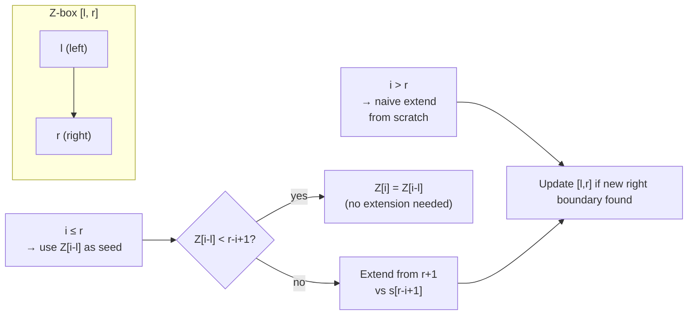

---
title: Z Algorithm
aliases: [Z-function, Z-array]
tags: [DSA, CompetitiveProgramming, StringAlgorithms]
domain: DSA
difficulty: Advanced
created: 2026-07-26
related: [KMP_Algorithm, String_Hashing]
status: complete
---

# 🔍 Z Algorithm

> [!abstract] TL;DR
> The Z-algorithm computes for every index `i` the length of the longest substring starting at `s[i]` that is also a prefix of `s` — call this `Z[i]`. It runs in **O(n)** using a sliding "Z-box" that avoids redundant comparisons. String matching becomes trivial: concatenate `pattern + "$" + text`, then every index where `Z[i] == len(pattern)` is a match start.

## Intuition — Analogy First

Imagine you're reading a long book and the author keeps reusing the same opening sentence. Instead of re-reading it every time you spot potential repetition, you keep a bookmark at the farthest-right segment that you've already verified matches the opening. When you reach a new position inside that bookmarked region, you can reuse what you already know — you only need to extend the match beyond the right edge of the bookmark. This "bookmark" is the Z-box `[l, r]`.

## How It Works — Full Explanation

The Z-array is defined as:
- `Z[0]` is undefined (or set to `n` by convention — the whole string trivially matches itself)
- `Z[i]` = length of the longest substring starting at `s[i]` that equals a prefix of `s`

**Z-box maintenance** — at any point we track `[l, r]` = the rightmost Z-box seen so far (i.e., the match `s[l..r]` equals `s[0..r-l]`).

For each new position `i`:
1. If `i > r`: we are outside the current Z-box — extend naively from `s[i]` vs `s[0]`.
2. If `i <= r`: position `i` corresponds to position `i - l` inside the already-matched prefix.
   - If `Z[i - l] < r - i + 1`: we know `Z[i] = Z[i - l]` (entirely inside the box, can't extend).
   - Otherwise: start from `r - i + 1` characters already matched, extend naively beyond `r`.
3. Update `[l, r]` if we extended beyond the current right boundary.

**String matching** using Z: build the string `s = pattern + "$" + text`. Any `Z[i] == len(pattern)` means a match starts at position `i - len(pattern) - 1` in the original text. The sentinel `"$"` ensures `Z[i]` never exceeds `len(pattern)`.



## The Math — Derivations

Let `n = |s|`. The key invariant is:

$$s[l \ldots r] = s[0 \ldots r-l]$$

When `i \leq r`, by the invariant:

$$s[i \ldots r] = s[i-l \ldots r-l]$$

So the longest match starting at `i` is at least:

$$Z[i] \geq \min(Z[i-l],\ r - i + 1)$$

The naive pointer never moves left — each character is visited at most twice (once when naively extending a Z-box, once when reusing it). Therefore total work is **O(n)**.

For string matching with `|p| = m`, `|t| = n`:
- Concatenated string length = `m + 1 + n`
- Total time = **O(m + n)**
- Space = **O(m + n)**

**Minimum period**: the minimum period of string `s` is the smallest `p` such that `s[i] = s[i \bmod p]` for all `i`. This equals the smallest `p` such that `Z[p] = n - p` (or `p` divides `n` and some Z-value condition holds).

$$\text{min\_period}(s) = \min\{p > 0 : p + Z[p] = n\}$$

## Template Code — Clean, Ready-to-Use Python

```python
def compute_z(s: str) -> list[int]:
    """
    Compute Z-array for string s in O(n).
    Z[i] = length of longest prefix of s that matches s[i:].
    Z[0] is conventionally set to len(s) (or 0, check problem context).
    """
    n = len(s)
    z = [0] * n
    z[0] = n  # entire string matches prefix of itself
    l, r = 0, 0
    for i in range(1, n):
        if i < r:
            z[i] = min(r - i, z[i - l])
        # try to extend
        while i + z[i] < n and s[z[i]] == s[i + z[i]]:
            z[i] += 1
        # update Z-box if we extended past r
        if i + z[i] > r:
            l, r = i, i + z[i]
    return z


def find_pattern(text: str, pattern: str) -> list[int]:
    """
    Find all starting positions of pattern in text using Z-algorithm.
    Returns 0-indexed positions in text.
    Time: O(|text| + |pattern|)
    """
    if not pattern or not text:
        return []
    s = pattern + "$" + text
    z = compute_z(s)
    m = len(pattern)
    result = []
    for i in range(m + 1, len(s)):
        if z[i] == m:
            result.append(i - m - 1)  # position in original text
    return result


def min_period(s: str) -> int:
    """
    Find the minimum period of string s.
    A period p means s[i] = s[i % p] for all i.
    """
    n = len(s)
    z = compute_z(s)
    for p in range(1, n):
        if p + z[p] == n:
            return p
    return n  # the string itself is its own minimum period


# ── Example ──────────────────────────────────────────────────
if __name__ == "__main__":
    text = "aabxaabxaabxaab"
    pattern = "aabx"
    positions = find_pattern(text, pattern)
    print(f"Pattern '{pattern}' found at: {positions}")
    # Output: [0, 4, 8]

    s = "abababab"
    print(f"Min period of '{s}': {min_period(s)}")
    # Output: 2
```

## Worked Example — Trace Through

**Input**: `s = "aabzaa"`

Build Z-array step by step:

| i | s[i] | Z[i] | Explanation |
|---|------|------|-------------|
| 0 | a    | 6    | Convention: entire string |
| 1 | a    | 1    | `s[1]='a'=s[0]`, `s[2]='b'≠s[1]='a'` → Z[1]=1. Update box [1,2) |
| 2 | b    | 0    | `s[2]='b'≠s[0]='a'` → Z[2]=0 |
| 3 | z    | 0    | `s[3]='z'≠s[0]='a'` → Z[3]=0 |
| 4 | a    | 2    | i=4 > r=2, naive: `s[4]='a'=s[0]`, `s[5]='a'=s[1]`, `s[6]` OOB → Z[4]=2. Update box [4,6) |
| 5 | a    | 1    | i=5 < r=6, i-l=5-4=1, Z[1]=1, r-i=6-5=1, min(1,1)=1 → Z[5]=1. Extend check: `s[6]` OOB → Z[5]=1 |

Z-array: `[6, 1, 0, 0, 2, 1]`

**String matching trace**: `pattern = "aa"`, `text = "aabzaa"`

```
s = "aa$aabzaa"
     0123456789
Z =  [9,1,0,2,1,0,0,2,1]
                         
Indices where Z[i] == 2 (len(pattern)):
  i=3: position in text = 3 - 2 - 1 = 0 ✓
  i=7: position in text = 7 - 2 - 1 = 4 ✓
```

Pattern found at text positions: **0, 4** ✓

## CP Problem Patterns

| Pattern | How Z Helps |
|---------|-------------|
| Find all occurrences of pattern in text | Concatenate with sentinel, scan Z-array |
| Count occurrences without overlap | Filter results ensuring `prev_end <= cur_start` |
| Minimum period of a string | Find smallest `p` with `p + Z[p] == n` |
| Longest prefix that is also a suffix (border) | Check Z values near end; `Z[i] = n-i` → border of length `n-i` |
| Palindrome detection (with reverse) | Concatenate `s + "$" + reverse(s)`, inspect Z |
| Lexicographically smallest rotation | Z on doubled string |
| Check if string is a rotation of another | `Z[n+1:]` in `s + "$" + s + s` |

## Common Pitfalls & Edge Cases

1. **Z[0] convention**: Some implementations set `Z[0] = 0`, others `Z[0] = n`. For string matching, it doesn't matter since we skip index 0. Be consistent.
2. **Sentinel character**: The `"$"` must not appear in either pattern or text. Use a character outside your alphabet (e.g., `"#"` for lowercase-letter problems, `chr(0)` for binary).
3. **Off-by-one in result position**: result index = `i - len(pattern) - 1`. The `- 1` accounts for the sentinel.
4. **Empty pattern or text**: Guard with early return.
5. **Z-box update condition**: Update `[l, r]` only when `i + z[i] > r`, not `>=`.
6. **KMP vs Z**: Both are O(n+m). Z is generally easier to implement from scratch in a contest. KMP's failure function is more commonly pre-memorized.

## Related Concepts

- [[_MOC_Competitive_Programming|↑ Section MOC]]
- [[KMP_Algorithm]] — alternative O(n+m) string matcher using failure function
- [[String_Hashing]] — O(1) substring comparison after O(n) preprocessing, but probabilistic
- [[Suffix_Array]] — more powerful structure for complex suffix queries
- [[Aho_Corasick]] — multi-pattern matching

## Review Questions

1. Why does the Z-algorithm run in O(n) even though there is a nested while loop? What invariant prevents the pointer from backtracking?
2. Given a string `s`, how would you use the Z-array to find all positions where a suffix of `s` is also a prefix of `s` (the "border" property)?
3. How do you modify `find_pattern` to count only non-overlapping occurrences?

## Sources / Problems

- **Reading**: CP-Algorithms — [Z-function](https://cp-algorithms.com/string/z-function.html)
- **LeetCode 28** — Find the Index of the First Occurrence in a String
- **LeetCode 459** — Repeated Substring Pattern (uses min period)
- **Codeforces 126E** — Password (borders via Z)
- **USACO** — multiple string problems where Z is optimal

#Z_Algorithm #StringAlgorithms #CompetitiveProgramming #PatternMatching #LinearTime
