# 🏁 Competitive Programming — Map of Content

> [!abstract] What This Section Covers
> Competitive programming extends core DSA with a toolkit of mathematical techniques, advanced string algorithms, and specialised data structures that reduce hard problems to known patterns within time limits. This section covers 20 notes organised into six clusters: environment setup, mathematics (number theory, modular arithmetic, sieve, combinatorics, Euler's totient, Chinese Remainder Theorem, Miller–Rabin primality), bit manipulation, string algorithms (KMP, Z-algorithm, hashing, suffix array, Aho-Corasick), advanced data structures (Fenwick/BIT tree, Segment Tree, Sparse Table), and advanced techniques (coordinate compression, meet-in-the-middle). The section closes with a pattern index linking problem constraints to the right algorithm family.

## Concept Map

```mermaid
graph TD
    CP["🏁 Competitive Programming"]

    CP --> SETUP["Setup"]
    CP --> MATH["Mathematics"]
    CP --> BITS["Bit Tricks"]
    CP --> STR["Strings"]
    CP --> DS["Data Structures"]
    CP --> TECH["Techniques"]
    CP --> REF["Reference"]

    SETUP --> CS["[[CP_Setup_and_Tools]]"]

    MATH --> NT["[[Number_Theory]]"]
    MATH --> MA["[[Modular_Arithmetic]]"]
    MATH --> SV["[[Sieve_of_Eratosthenes]]"]
    MATH --> CB["[[Combinatorics]]"]
    MATH --> ET["[[Euler_Totient]]"]
    MATH --> CRT["[[Chinese_Remainder_Theorem]]"]
    MATH --> MR["[[Miller_Rabin_Primality]]"]

    BITS --> BM["[[Bit_Manipulation]]"]

    STR --> SH["[[String_Hashing]]"]
    STR --> KMP["[[KMP_Algorithm]]"]
    STR --> ZA["[[Z_Algorithm]]"]
    STR --> SA["[[Suffix_Array]]"]
    STR --> AC["[[Aho_Corasick]]"]

    DS --> FT["[[Fenwick_Tree]]"]
    DS --> ST["[[Segment_Tree_Advanced]]"]
    DS --> SP["[[Sparse_Table]]"]

    TECH --> CC["[[Coordinate_Compression]]"]
    TECH --> MM["[[Meet_in_the_Middle]]"]

    REF --> PPI["[[Problem_Patterns_Index]]"]
```

## Learning Path

1. [[CP_Setup_and_Tools]] — Judge environments, fast I/O, competitive templates, debugging strategies
2. [[Bit_Manipulation]] — Bit tricks, masks, XOR properties; bitmask DP prerequisites
3. [[Number_Theory]] — GCD/LCM, Euler's totient, modular inverse, Fermat's little theorem
4. [[Modular_Arithmetic]] — Modular exponentiation, inverse, properties under mod; overflow avoidance
5. [[Euler_Totient]] — Euler's φ function; Euler's theorem; totient-based modular inverse and its sieve
6. [[Chinese_Remainder_Theorem]] — Solve simultaneous congruences; CRT reconstruction and its uniqueness
7. [[Miller_Rabin_Primality]] — Fast probabilistic primality via witnesses; deterministic bases for 64-bit ints
8. [[Sieve_of_Eratosthenes]] — Linear and segmented sieve; smallest prime factor table
9. [[Combinatorics]] — nCr mod p, Pascal's triangle, inclusion-exclusion, Catalan numbers
10. [[KMP_Algorithm]] — Failure function; pattern matching in O(n+m); prefix function intuition
11. [[Z_Algorithm]] — Z-array; O(n+m) matching; comparison with KMP
12. [[String_Hashing]] — Polynomial rolling hash; collision avoidance; double hashing
13. [[Suffix_Array]] — SA-IS or prefix-doubling construction; LCP array; applications
14. [[Aho_Corasick]] — Multi-pattern string matching via a trie automaton with failure links; O(Σ|Pᵢ|) build + O(n + occ) query; replaces running KMP for each pattern
15. [[Fenwick_Tree]] — Binary indexed tree; point update + prefix sum in O(log n)
16. [[Sparse_Table]] — Idempotent range queries in O(1); static array preprocessing
17. [[Segment_Tree_Advanced]] — Lazy propagation; range update + range query; persistent segment trees
18. [[Coordinate_Compression]] — Mapping large value ranges to small indices before applying BIT/SegTree
19. [[Meet_in_the_Middle]] — Split search space; 2^(n/2) collision approach; application to subset sum
20. [[Problem_Patterns_Index]] — Constraint → algorithm mapping reference; pattern recognition guide

## All Notes at a Glance

| Note | Summary | Difficulty |
|------|---------|------------|
| [[CP_Setup_and_Tools]] | Judge setup, fast I/O, template code | Beginner |
| [[Bit_Manipulation]] | Bit ops, masks, tricks, XOR; bitmask enumeration | Intermediate |
| [[Number_Theory]] | GCD, Euler totient, modular inverse, primality | Intermediate |
| [[Modular_Arithmetic]] | Mod operations; fast exponentiation; modular inverse | Intermediate |
| [[Sieve_of_Eratosthenes]] | O(n log log n) prime sieve; SPF table | Intermediate |
| [[Combinatorics]] | nCr, inclusion-exclusion, Catalan, Stirling numbers | Intermediate |
| [[Euler_Totient]] | Euler's φ function; Euler's theorem; totient-based modular inverse | Advanced |
| [[Chinese_Remainder_Theorem]] | Solve simultaneous congruences; CRT reconstruction | Advanced |
| [[Miller_Rabin_Primality]] | Probabilistic primality test; deterministic 64-bit witnesses | Advanced |
| [[String_Hashing]] | Polynomial rolling hash; O(1) substring comparison | Advanced |
| [[KMP_Algorithm]] | Failure function; O(n+m) string matching | Advanced |
| [[Z_Algorithm]] — | Z-array; alternative to KMP for pattern matching | Advanced |
| [[Suffix_Array]] | Sorted suffixes; LCP; substring search; string DP | Advanced |
| [[Aho_Corasick]] | Multi-pattern trie automaton; failure links; O(Σ\|Pᵢ\|) build + O(n+occ) search | Advanced |
| [[Fenwick_Tree]] | BIT for point update / prefix query in O(log n) | Advanced |
| [[Segment_Tree_Advanced]] | Lazy prop; range update; persistent; merge sort tree | Advanced |
| [[Sparse_Table]] | Static RMQ in O(1) after O(n log n) preprocessing | Intermediate |
| [[Coordinate_Compression]] | Value → rank mapping; enables BIT/SegTree on large ranges | Intermediate |
| [[Meet_in_the_Middle]] | Split + join; 2^(n/2) complexity; knapsack / subset sum | Advanced |
| [[Problem_Patterns_Index]] | Constraint-size → algorithm cheatsheet | Intermediate (reference) |

## Key Questions This Section Answers

- What is the fastest way to compute nCr mod p for large n and p prime?
- How do KMP and Z-algorithm differ, and when would you choose one over the other?
- Why does suffix array construction matter, and what problems require it over KMP/Z?
- When do you use a Fenwick Tree vs a Segment Tree vs a Sparse Table?
- What is coordinate compression and why is it needed before applying a BIT on an unsorted value range?
- How does meet-in-the-middle improve 2^n to 2^(n/2), and what makes a problem amenable to it?
- How do you avoid hash collision in competitive programming with string hashing?

## Related Sections

- [[_MOC_DSA_Master|↑ DSA Master MOC]]
- [[_MOC_Trees]] — Segment trees and Fenwick trees are tree-based; tree DP appears in CP heavily
- [[_MOC_Graphs]] — Graph algorithms are foundational to most CP problems

#MOC #DSA #competitive-programming
