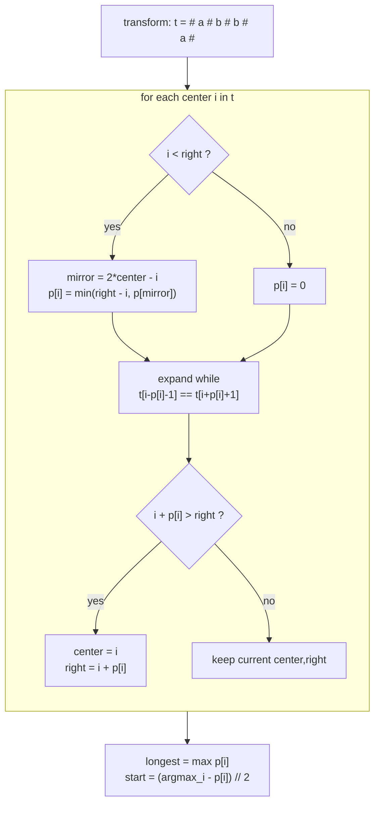

# 🪞 Manacher's Algorithm

> [!abstract] TL;DR
> Manacher's algorithm finds the **longest palindromic substring** — and the palindrome radius at *every* center — in **O(n)**, beating expand-around-center's O(n²). The two tricks: (1) **transform** the string by inserting a separator `#` between every character (and at both ends) so odd- and even-length palindromes are handled uniformly as odd-length ones; (2) maintain the current rightmost palindrome as a `(center, right)` boundary and **reuse the mirror**: the radius at position `i` is at least the radius at its mirror `2·center − i`, capped by the right boundary — so most positions need little or no fresh expansion.

---

## Intuition — Analogy First

Palindromes have perfect mirror symmetry. Manacher exploits this at *two* levels.

**Level 1 — a mirror hallway.** Suppose you've already discovered a big palindrome and you know its **center** and how far right it reaches (its **right boundary**). Everything inside that palindrome is mirror-symmetric about the center. So if you're now standing at some position `i` on the *right* half, there is a twin position `i'` on the *left* half (the "mirror"). Whatever palindrome radius you already measured at the twin `i'`, position `i` is *guaranteed at least that same radius* — as long as it doesn't poke past the right boundary. You get that information **for free**, no re-scanning. You only ever expand character-by-character when you reach *new ground* past the right boundary. Because the right boundary only ever moves forward, total expansion work across the whole string is O(n).

**Level 2 — the `#` trick.** Ordinary palindromes are annoying because "aba" (odd) and "abba" (even) behave differently — one has a character center, the other a gap center. Insert `#` everywhere: `aba → #a#b#a#`, `abba → #a#b#b#a#`. Now **every** palindrome, odd or even, is centered on a single symbol of the transformed string and has odd length. One uniform case. Bonus: the radius you measure in the transformed string equals the *length* of the palindrome in the original string.

---

## How It Works

### Step 1 — Transform

Insert `#` between every pair of characters and at both ends:

```
s = "abba"   ->   t = "#a#b#b#a#"
s = "aba"    ->   t = "#a#b#a#"
```

Now `len(t) = 2·n + 1` is always odd, and every center is a single index of `t`.

### Step 2 — The radius array `p`

`p[i]` = the palindrome **radius** around index `i` in `t` (how many characters extend on each side while staying a palindrome). Crucially, for the `#`-transform, `p[i]` **equals the length of the corresponding palindrome in the original string**, and its start in the original is `(i − p[i]) // 2`.

### Step 3 — Mirror reuse with `(center, right)`

Keep `center` and `right` = center of, and right edge of, the palindrome that currently reaches farthest right. For each `i`:

1. **If `i < right`**, let `mirror = 2·center − i`. Initialize `p[i] = min(right − i, p[mirror])`. (Reuse the twin's answer, but never assume more than the distance to the right boundary — beyond it we have no verified information.)
2. **Attempt to expand** `p[i]` further by comparing `t[i − p[i] − 1]` with `t[i + p[i] + 1]` while they match and stay in bounds.
3. **If `i + p[i] > right`**, this palindrome reaches farther right than any before → update `center = i`, `right = i + p[i]`.



The `min(right − i, p[mirror])` cap is the whole subtlety: within the known palindrome the mirror is exact, but a palindrome at the mirror might extend *past* the left boundary — and we have no proof the right side matches beyond `right`, so we clamp and let the expand step verify any surplus.

---

## Complexity Analysis

| Approach | Time | Space | Notes |
|---|---|---|---|
| Brute force (check every substring) | O(n³) | O(1) | check + verify each |
| Expand around center | O(n²) | O(1) | see [[String_Fundamentals]] |
| DP table `is_pal[i][j]` | O(n²) | O(n²) | also O(n²) memory |
| **Manacher** | **O(n)** | O(n) | `p` array of size `2n+1` |

**Why O(n)?** Each character comparison in the expand step either extends `right` (which only moves forward, at most `2n+1` times total) or fails once per center. Reused-mirror positions do zero expansion. [[Amortized_Analysis|Amortized]], total expansion work is linear.

---

## Python Implementation

```python
from typing import List


def manacher(s: str) -> str:
    """
    Longest palindromic substring in O(n) via Manacher's algorithm.
    Returns the substring (first one, if several share the max length).
    """
    if not s:
        return ""

    # ── Step 1: transform so every palindrome is odd-length ──
    # "abba" -> "#a#b#b#a#"   (len = 2n+1, always odd)
    t = "#" + "#".join(s) + "#"
    n = len(t)
    p = [0] * n           # p[i] = palindrome radius around i in t
    center = right = 0    # farthest-reaching palindrome so far

    for i in range(n):
        # ── Step 3a: reuse the mirror if i is inside (center, right) ──
        if i < right:
            mirror = 2 * center - i                 # twin position on the left
            p[i] = min(right - i, p[mirror])        # clamp to the right boundary

        # ── Step 3b: try to grow the palindrome centered at i ──
        while (i - p[i] - 1 >= 0 and i + p[i] + 1 < n
               and t[i - p[i] - 1] == t[i + p[i] + 1]):
            p[i] += 1

        # ── Step 3c: extend the (center, right) window if we reached farther ──
        if i + p[i] > right:
            center, right = i, i + p[i]

    # ── Step 4: locate the max radius, map back to original indices ──
    max_len = 0
    center_index = 0
    for i in range(n):
        if p[i] > max_len:        # strict > -> keeps the FIRST longest
            max_len = p[i]
            center_index = i
    start = (center_index - max_len) // 2   # transformed index -> original index
    return s[start:start + max_len]


def manacher_radii(s: str) -> List[int]:
    """
    Return the full radius array p over the transformed string.
    p[i] = length of the palindrome in the ORIGINAL string centered at
    transformed index i. Useful for counting all palindromic substrings.
    """
    if not s:
        return []
    t = "#" + "#".join(s) + "#"
    n = len(t)
    p = [0] * n
    center = right = 0
    for i in range(n):
        if i < right:
            p[i] = min(right - i, p[2 * center - i])
        while (i - p[i] - 1 >= 0 and i + p[i] + 1 < n
               and t[i - p[i] - 1] == t[i + p[i] + 1]):
            p[i] += 1
        if i + p[i] > right:
            center, right = i, i + p[i]
    return p


def count_palindromic_substrings(s: str) -> int:
    """
    LC 647: total number of palindromic substrings, in O(n).
    Each center contributes ceil(p[i] / 2) = (p[i] + 1) // 2 palindromes.
    """
    return sum((r + 1) // 2 for r in manacher_radii(s))


# ── Demo ────────────────────────────────────────────────────────────────
if __name__ == "__main__":
    print(manacher("babad"))                   # "bab"
    print(manacher("cbbd"))                     # "bb"
    print(manacher("abba"))                     # "abba"
    print(manacher("forgeeksskeegfor"))         # "geeksskeeg"
    print(count_palindromic_substrings("aaa"))  # 6
    print(count_palindromic_substrings("abc"))  # 3
```

---

## Dry Run / Trace

**`manacher("abba")`** — transformed `t = # a # b # b # a #` (indices 0..8):

```
idx:  0  1  2  3  4  5  6  7  8
 t :  #  a  #  b  #  b  #  a  #
```

| i | t[i] | i<right? | mirror | p[i] init | after expand | (center,right) |
|---|---|---|---|---|---|---|
| 0 | # | no  | —  | 0 | 0 (t[-1] OOB) | (0,0) |
| 1 | a | no  | —  | 0 | 1 (#a# ) | (1,2) |
| 2 | # | 2<2? no | — | 0 | 0 (a≠b) | keep (1,2) |
| 3 | b | no  | —  | 0 | 1 (#b#) | (3,4) |
| 4 | # | 4<4? no | — | 0 | **4** (grows to whole "#a#b#b#a#") | (4,8) |
| 5 | b | yes | 3  | min(3, p[3]=1)=**1** (reused!) | 1 (t[3]=b ≠ t[7]=a) | keep (4,8) |
| 6 | # | yes | 2  | min(2, p[2]=0)=**0** (reused!) | 0 | keep (4,8) |
| 7 | a | yes | 1  | min(1, p[1]=1)=**1** (reused!) | 1 (t[9] OOB) | keep (4,8) |
| 8 | # | yes | 0  | min(0, p[0]=0)=0 | 0 | keep (4,8) |

```
p = [0, 1, 0, 1, 4, 1, 0, 1, 0]
```

Max radius `4` at `i = 4`. `start = (4 − 4)//2 = 0`, length 4 → **`s[0:4] = "abba"`**. ✅

Notice positions **5, 6, 7** did *zero or almost-zero* expansion — their initial `p[i]` came straight from the mirror (`p[3], p[2], p[1]`). That reuse is exactly why Manacher is linear: work is done only when pushing `right` forward (which happened at i = 1, 3, 4).

---

## Patterns & LeetCode Applications

| Problem | Manacher usage |
|---|---|
| LC 5 Longest Palindromic Substring | Direct — the canonical use |
| LC 647 Palindromic Substrings (count) | Sum `(p[i]+1)//2` over all centers |
| LC 214 Shortest Palindrome | Longest palindromic *prefix* via `p`; (also KMP-solvable) |
| LC 1745 Palindromic Partitioning IV | Precompute all palindromes in O(n²) or use radii |
| Longest palindrome starting/ending at each index | Derived from the radius array |
| Number of distinct palindromic substrings | Eertree (palindromic tree) — related idea |

---

## Common Pitfalls

1. **Skipping the transform** — without the `#` separators you must special-case even vs odd palindromes; the whole elegance evaporates. Add `#` at both ends too, or boundary checks break.
2. **Forgetting the `min(right − i, p[mirror])` clamp** — copying `p[mirror]` outright is wrong when the mirror palindrome extends past the *left* boundary; you must cap at the known-good distance `right − i` and re-verify by expanding.
3. **Wrong index mapping back** — the original start is `(center_index − p[i]) // 2`, *not* `center_index − p[i]`. Mixing transformed and original indices is the #1 bug.
4. **Off-by-one in expansion bounds** — compare `t[i − p[i] − 1]` with `t[i + p[i] + 1]` (the *next* pair outward), with both bounds checked, or you index out of range.
5. **Separator inside the alphabet** — `#` must not be a real character of `s`. If `s` can contain `#`, pick a sentinel outside the alphabet (or use distinct end sentinels).
6. **Tie-breaking** — use strict `>` when scanning for the max radius to return the *first* longest substring deterministically.
7. **Reaching for Manacher too soon** — for `n ≤ a few thousand`, expand-around-center's O(n²) is simpler and fast enough; Manacher earns its keep on large `n` or when you need per-center radii.

---

## Related Concepts

- [[_MOC_Strings|↑ Section MOC]]
- [[String_Fundamentals]] — the O(n²) expand-around-center baseline Manacher replaces
- [[String_Matching_Overview]] — where palindrome finding sits among string algorithms
- [[String_Hashing]] — an alternative: binary-search a radius and compare hashes in O(1)
- [[KMP_Algorithm]] — solves Shortest Palindrome (LC 214) via the failure function

---

## Review Questions

1. Explain, with a concrete example, *why* `p[i]` is initialized to `min(right − i, p[mirror])` rather than just `p[mirror]`. What goes wrong if you drop the `min`?
2. Prove that Manacher runs in O(n). Your argument must reference the fact that `right` never decreases and bound the total number of successful character comparisons.
3. Given the radius array `p` from the transformed string, derive the formula for the total number of palindromic substrings of the original string, and verify it on `s = "aaa"` (expected 6).

---

## Sources

- LeetCode: 5, 214, 647, 1745
- CP-algorithms.com — "Manacher's Algorithm — Finding all sub-palindromes in O(N)"
- Manacher, "A new linear-time on-line algorithm for finding the smallest initial palindrome of a string" (1975)
- *Competitive Programmer's Handbook* — string algorithms

#DSA #Strings #Manacher #Palindrome #LinearTime #StringAlgorithms #Advanced
