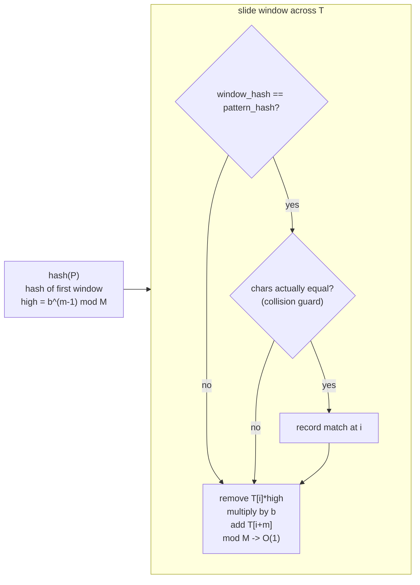

# 🎯 Rabin-Karp Algorithm

> [!abstract] TL;DR
> Rabin-Karp finds a pattern P (length m) in text T (length n) by comparing **hashes** instead of characters. Compute the polynomial hash of P once, then slide a length-m window across T, updating the window's hash in **O(1)** per step via a **rolling hash** (drop the leaving character, add the entering one). When a window hash equals the pattern hash, verify character-by-character to rule out a collision. Average time **O(n + m)**; adversarial worst case O(nm). Its superpower is **multiple patterns of the same length** and **2D pattern matching**, where one pass of hashing checks many patterns at once.

---

## Intuition — Analogy First

Imagine scanning a shelf of books for one specific book, but you're not allowed to read titles directly — reading a title is slow. Instead, each book has a cheap **barcode** (a number). You memorize the barcode of the book you want, then walk the shelf comparing barcodes. Only when a barcode *matches* do you pull the book and read its title to confirm (two different books could, rarely, share a barcode).

The magic trick is the **rolling barcode**. As your window of `m` characters slides right by one, you don't recompute the whole barcode from scratch. You **subtract the contribution of the character that just left** the window and **add the character that just entered** — a constant number of arithmetic operations. That is the "rolling hash," and it is what turns an O(nm) scan into an O(n) one on average.

A concrete numeric feel: treat the window as a base-`b` number. `"abc"` in base 256 is `a·256² + b·256¹ + c·256⁰`. Sliding to `"bcd"` = remove the top digit `a·256²`, multiply the rest by 256, add `d`. Just like shifting digits in ordinary decimal.

---

## How It Works

### Polynomial rolling hash

Treat a string `s[0..m-1]` as a base-`b` number modulo a large prime `M`:

$$H(s) = \big(s_0 \cdot b^{m-1} + s_1 \cdot b^{m-2} + \dots + s_{m-1} \cdot b^0\big) \bmod M$$

- `b` (base) is a value larger than the alphabet, often 31, 131, or 256.
- `M` (modulus) is a large prime (e.g. 1e9 + 7 or 2⁶¹ − 1) to keep numbers bounded and collisions rare.

### The rolling update — O(1) per shift

Given the hash of window `T[i .. i+m-1]`, get the hash of the next window `T[i+1 .. i+m]`:

$$H_{new} = \big((H_{old} - T_i \cdot b^{m-1}) \cdot b + T_{i+m}\big) \bmod M$$

Precompute `b^{m-1} mod M` once. Each step is a subtract, a multiply, and an add — constant time. Under modular arithmetic, subtraction can go negative, so add `M` and take `mod` again to stay non-negative.

### The full algorithm

1. Compute `hash(P)` and `hash(T[0..m-1])`, plus `high = b^{m-1} mod M`.
2. For each window position `i`:
   - If `window_hash == pattern_hash`, **verify** `T[i..i+m-1] == P` char-by-char (guards against collisions).
   - Roll the hash to the next window in O(1).



### Why verify? Collisions.

Two different strings can hash to the same value (a **collision**). A raw hash match is only *probable*. Verifying on a hit keeps correctness. With a good modulus, collisions are rare, so verification runs seldom → average cost stays O(n + m). A malicious input engineered against a *known* `(b, M)` can force many collisions → O(nm); randomize `b`/`M` or use **double hashing** (see [[String_Hashing]]) to defend.

### Multiple patterns & 2D

- **Multiple equal-length patterns:** hash all `k` patterns into a set once; each window checks set membership in O(1) → find all of them in a single O(n) pass.
- **2D matching:** hash each row-strip, then hash column-wise over those row hashes — a rolling hash of rolling hashes — to locate a small `a×b` grid inside a big one.

---

## Complexity Analysis

| Aspect | Cost |
|---|---|
| Preprocess (hash P + first window + power) | O(m) |
| Each window roll | O(1) |
| Search, average (rare collisions) | **O(n + m)** |
| Search, worst case (adversarial collisions) | O(n·m) |
| Space | O(1) extra (single hash + power) |
| Multiple k patterns (same length) | O(n + Σ pattern lengths) average |
| 2D matching (R×C text, r×c pattern) | O(R·C) average |

`n = |T|`, `m = |P|`.

---

## Python Implementation

```python
from typing import List


# ── Single-pattern Rabin-Karp with collision verification ───────────────
def rabin_karp(text: str, pattern: str,
               base: int = 256, mod: int = 1_000_000_007) -> List[int]:
    """
    Return all start indices where pattern occurs in text.
    Average O(n + m); worst case O(n*m) under adversarial collisions.
    """
    n, m = len(text), len(pattern)
    if m == 0:
        return list(range(n + 1))
    if m > n:
        return []

    # high = base^(m-1) mod mod  -> weight of the leftmost (leaving) char
    high = pow(base, m - 1, mod)

    # Hash the pattern and the first window of the text.
    p_hash = 0
    t_hash = 0
    for i in range(m):
        p_hash = (p_hash * base + ord(pattern[i])) % mod
        t_hash = (t_hash * base + ord(text[i])) % mod

    hits: List[int] = []
    for i in range(n - m + 1):
        if t_hash == p_hash:
            # Hashes agree -> verify to rule out a collision.
            if text[i:i + m] == pattern:
                hits.append(i)
        # Roll the hash to window starting at i+1 (skip on the last window).
        if i < n - m:
            leaving = ord(text[i])          # char sliding out on the left
            entering = ord(text[i + m])     # char sliding in on the right
            t_hash = (t_hash - leaving * high) % mod   # drop leaving char
            t_hash = (t_hash * base + entering) % mod  # shift + add entering
            # % on a possibly-negative value already normalizes in Python,
            # but being explicit avoids surprises in other languages.
    return hits


# ── Multiple equal-length patterns in ONE pass ──────────────────────────
def rabin_karp_multi(text: str, patterns: List[str],
                     base: int = 256, mod: int = 1_000_000_007) -> dict:
    """
    Find all patterns (all the SAME length m) in text in one scan.
    Returns {pattern: [start indices]}. Average O(n + k*m).
    """
    if not patterns:
        return {}
    m = len(patterns[0])
    assert all(len(p) == m for p in patterns), "patterns must share length"
    n = len(text)
    result = {p: [] for p in patterns}
    if m > n:
        return result

    high = pow(base, m - 1, mod)

    # Map each pattern hash -> list of patterns with that hash (guards collisions).
    from collections import defaultdict
    hash_to_patterns = defaultdict(list)
    for p in patterns:
        h = 0
        for ch in p:
            h = (h * base + ord(ch)) % mod
        hash_to_patterns[h].append(p)

    t_hash = 0
    for i in range(m):
        t_hash = (t_hash * base + ord(text[i])) % mod

    for i in range(n - m + 1):
        if t_hash in hash_to_patterns:
            window = text[i:i + m]
            for p in hash_to_patterns[t_hash]:
                if window == p:                 # verify each candidate
                    result[p].append(i)
        if i < n - m:
            t_hash = (t_hash - ord(text[i]) * high) % mod
            t_hash = (t_hash * base + ord(text[i + m])) % mod
    return result


# ── Repeated DNA Sequences (LC 187) via rolling hash ────────────────────
def find_repeated_dna(s: str) -> List[str]:
    """All 10-letter substrings that appear more than once. O(n) average."""
    L, n = 10, len(s)
    if n < L:
        return []
    base, mod = 4, (1 << 61) - 1
    # Map A,C,G,T -> 0,1,2,3 for a tight base-4 hash.
    code = {'A': 0, 'C': 1, 'G': 2, 'T': 3}
    high = pow(base, L - 1, mod)

    seen_hash: dict = {}
    output = set()
    h = 0
    for i in range(L):
        h = (h * base + code[s[i]]) % mod
    for i in range(n - L + 1):
        if h in seen_hash and s[i:i + L] == seen_hash[h]:
            output.add(seen_hash[h])
        else:
            seen_hash.setdefault(h, s[i:i + L])
        if i < n - L:
            h = (h - code[s[i]] * high) % mod
            h = (h * base + code[s[i + L]]) % mod
    return list(output)


# ── Demo ────────────────────────────────────────────────────────────────
if __name__ == "__main__":
    print(rabin_karp("abracadabra", "abra"))        # [0, 7]
    print(rabin_karp("aaaaa", "aa"))                # [0, 1, 2, 3]
    print(rabin_karp_multi("abcabcabc", ["abc", "bca"]))
    print(find_repeated_dna("AAAAACCCCCAAAAACCCCCCAAAAAGGGTTT"))
```

---

## Dry Run / Trace

**`rabin_karp("abcxabc", "abc")` with base = 256, small window.** Using ord values a=97, b=98, c=99, x=120.

```
m = 3, high = 256^2 = 65536

pattern hash: ((97*256 + 98)*256 + 99)          = P
window0 "abc": same computation                 = P   -> hash match
        verify text[0:3]=="abc"  YES -> record 0
roll: drop 'a'(97)*65536, *256, add 'x'(120)    -> hash of "bcx"
window1 "bcx": hash != P                          (no verify)
roll -> "cxa": hash != P
roll -> "xab": hash != P
roll -> "abc": hash == P -> verify text[4:7]=="abc" YES -> record 4

matches = [0, 4]
```

Only **2 windows** triggered a character comparison (the two real matches); the other windows were rejected by a single integer compare. That is the O(1)-per-step payoff.

**Collision illustration (why we verify):** with a tiny modulus like `mod = 101`, two unequal 3-grams could both hash to, say, 12. Without the `text[i:i+m] == pattern` check we'd report a false match. The verify step catches it; a large prime modulus makes such events astronomically rare.

---

## Patterns & LeetCode Applications

| Problem | How Rabin-Karp / rolling hash applies |
|---|---|
| LC 187 Repeated DNA Sequences | Rolling hash of every length-10 window; dedupe |
| LC 1044 Longest Duplicate Substring | [[Binary_Search]] on length + Rabin-Karp per length |
| LC 28 strStr / Find First Occurrence | Direct single-pattern search |
| LC 686 Repeated String Match | Hash pattern against repeated text |
| LC 1147 / 1316 (duplicate substrings) | Rolling hash to compare substrings in O(1) |
| 2D "find grid inside grid" | Row hashing + column rolling hash |
| Plagiarism / near-duplicate detection | Fingerprint (Rabin fingerprints, shingling) |

---

## Common Pitfalls

1. **Skipping the verification step** — hash equality is only *probable* equality. Always confirm `text[i:i+m] == pattern` on a hit, or accept false positives.
2. **Negative values after subtraction** — `(t_hash - leaving * high)` can go negative under `mod`. In C/C++/Java add `mod` before taking `%`; Python's `%` already returns non-negative but be explicit for portability.
3. **Weak modulus / adversarial input** — a fixed, known `(base, mod)` can be attacked to force O(nm). Randomize the base or use **double hashing** ([[String_Hashing]]).
4. **Overflow** — in fixed-width languages, `t_hash * base` overflows 64-bit; use 128-bit intermediate or `mod = 2⁶¹−1`. Python big ints are safe but slower.
5. **Recomputing `high` inside the loop** — precompute `base^(m-1) mod` once; recomputing per step reintroduces an O(m) factor.
6. **Base ≤ alphabet size** — the base must exceed the largest character code (or map chars to `1..σ`) so distinct strings rarely collide.
7. **Off-by-one on the last window** — don't roll past `i = n − m`; there is no `text[i+m]` to add.

---

## Related Concepts

- [[_MOC_Strings|↑ Section MOC]]
- [[String_Hashing]] — the polynomial-hash foundation, double hashing, prefix-hash substring comparison in O(1)
- [[KMP_Algorithm]] — deterministic O(n+m) alternative with no collision risk
- [[String_Matching_Overview]] — where Rabin-Karp fits among all matching algorithms
- [[Sliding_Window]] — the window-slide mechanic Rabin-Karp rides on
- [[Modular_Arithmetic]] — the modular math that keeps hashes bounded

---

## Review Questions

1. Derive the rolling-update formula `H_new = ((H_old − T_i·b^{m-1})·b + T_{i+m}) mod M` from the definition of the polynomial hash. Why is `b^{m-1} mod M` precomputed?
2. Rabin-Karp is "O(n + m) average" but "O(n·m) worst case." Construct an input (text, pattern, and a *known* base/mod) that realizes the worst case, and explain how double hashing defends against it.
3. Explain concretely how Rabin-Karp finds `k` patterns of the same length `m` in a single O(n) pass, and why the same trick does not directly extend to patterns of *different* lengths.

---

## Sources

- LeetCode: 28, 187, 686, 1044, 1147
- CP-algorithms.com — "String Hashing", "Rabin-Karp"
- CLRS — Chapter 32.2 (The Rabin-Karp algorithm)
- Original: Karp & Rabin, "Efficient randomized pattern-matching algorithms" (1987)

#DSA #Strings #StringMatching #RabinKarp #RollingHash #Hashing #Intermediate
