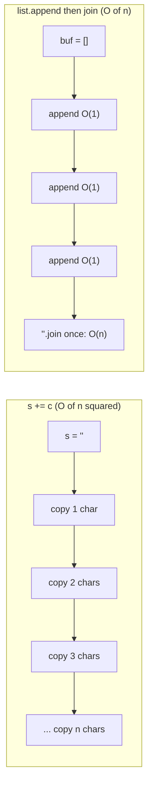
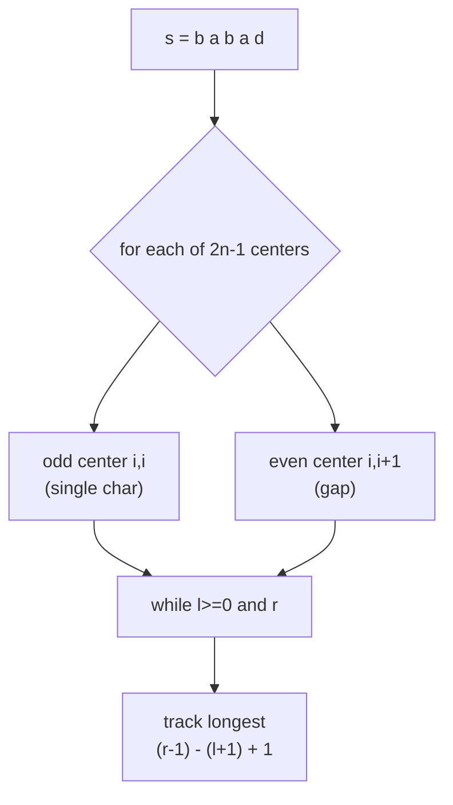

# 🔤 String Fundamentals

> [!abstract] TL;DR
> In Python, strings are **immutable** — every "modification" builds a brand-new string. This makes the innocent-looking `s += c` inside a loop secretly **O(n²)**; the fix is to collect pieces in a list and call `''.join(...)` for O(n). This note covers the immutability trap, frequency counting (`collections.Counter` and 26-element arrays), the two-pointer palindrome check, finding the longest palindromic substring via **expand-around-center** in O(n²), the true cost of slicing, and the character/number bridge (`ord`, `chr`, ASCII vs Unicode). Master these and the harder string algorithms become straightforward.

---

## Intuition — Analogy First

Think of a Python string as words **carved into stone**. You cannot rub out one letter and re-carve it — the tablet is fixed forever. To "change" the inscription you must chisel a **whole new tablet**. If you build a sentence by carving a fresh tablet for every single letter you add (tablet of length 1, then copy it onto a tablet of length 2, then length 3, …), the total chiseling work grows as `1 + 2 + 3 + ... + n ≈ n²/2`. That is the concatenation trap.

The smart stonemason instead jots each letter on a **cheap notepad** (a Python list, which *is* mutable), and only at the very end carves the finished sentence onto stone **once**. That final single carving is O(n). The notepad is `list.append`; the final carving is `''.join(list)`.

Everything else in this note is a small variation on two ideas: **counting characters** (a 26-slot ledger or a `Counter`) and **walking two pointers** inward or outward across the text.

---

## How It Works

### 1. Immutability and the concatenation trap

```python
s = "cat"
# s[0] = "b"        # ❌ TypeError: 'str' object does not support item assignment
s = "b" + s[1:]     # ✅ builds a NEW string "bat"; the old "cat" is untouched
```

Because each `+=` copies the entire accumulated string, a loop that appends `n` characters does `1 + 2 + ... + n = O(n²)` character-copies. Collect into a list and `join` once for O(n) total.



### 2. Frequency counting — two idioms

- **`collections.Counter`**: a dict subclass, general (any hashable key, any alphabet, Unicode).
- **26-element array**: `count[ord(ch) - ord('a')]`, when the alphabet is fixed lowercase a–z. Faster, cache-friendly, and gives a cheap comparable *signature* for anagram grouping.

Two strings are **anagrams** iff their frequency vectors are equal. Group anagrams by using the sorted string (or the 26-count tuple) as a dictionary key.

### 3. Palindrome check — two pointers

Place one pointer at each end and walk inward while characters match. O(n) time, O(1) space. For "valid palindrome" problems, skip non-alphanumerics and compare case-insensitively.

### 4. Longest palindromic substring — expand around center

A palindrome is defined by a **center**. There are `2n - 1` possible centers: `n` single characters (odd-length palindromes) and `n - 1` gaps between adjacent characters (even-length palindromes). From each center, expand outward while both sides match. The longest expansion wins.



### 5. The character/number bridge

- `ord(ch)` → integer code point (`ord('A') = 65`, `ord('a') = 97`, `ord('0') = 48`).
- `chr(n)` → character for a code point (`chr(97) = 'a'`).
- **ASCII** is the first 128 code points (English letters, digits, punctuation). **Unicode** extends this to every script/emoji; Python 3 `str` is Unicode by default, so `len("café") == 4` counts *characters*, while its UTF-8 `bytes` may be longer.

---

## Complexity Analysis

Common Python string operations (`n` = string length):

| Operation | Example | Time | Notes |
|---|---|---|---|
| Index / access | `s[i]` | O(1) | |
| Length | `len(s)` | O(1) | cached |
| Slice | `s[i:j]` | O(j − i) | **copies** the slice |
| Concatenate | `a + b` | O(len a + len b) | new string |
| Repeated `+=` in loop | `for c: s += c` | **O(n²)** | the trap |
| `''.join(list)` | join n pieces | O(total length) | the fix |
| `in` / `find` / `count` | `sub in s` | O(n·m) worst | naive scan |
| `ch in s` (single char) | membership | O(n) | |
| `str.replace`, `.split`, `.lower` | — | O(n) | build new string |
| `sorted(s)` | anagram key | O(n log n) | |
| `Counter(s)` | frequency map | O(n) | |
| Palindrome (two pointer) | — | O(n) time, O(1) space | |
| Longest palindromic substring | expand-around-center | **O(n²)** time, O(1) space | see [[Manacher_Algorithm]] for O(n) |

---

## Python Implementation

```python
from collections import Counter, defaultdict
from typing import List


# ── 1. The concatenation trap vs the fix ────────────────────────────────
def build_bad(chars: List[str]) -> str:
    """O(n^2): each += copies the whole accumulated string."""
    s = ""
    for c in chars:
        s += c              # copies s every time -> quadratic
    return s

def build_good(chars: List[str]) -> str:
    """O(n): append to a list (mutable), join once at the end."""
    buf = []
    for c in chars:
        buf.append(c)       # amortized O(1) each
    return "".join(buf)     # single O(n) build


# ── 2. Frequency counting ───────────────────────────────────────────────
def freq_counter(s: str) -> Counter:
    """General frequency map for any alphabet / Unicode. O(n)."""
    return Counter(s)

def freq_array_lower(s: str) -> List[int]:
    """26-slot ledger for lowercase a-z only. O(n), fixed O(26) space."""
    count = [0] * 26
    for ch in s:
        count[ord(ch) - ord('a')] += 1
    return count

def is_anagram(a: str, b: str) -> bool:
    """Two strings are anagrams iff their frequency vectors match. O(n)."""
    return Counter(a) == Counter(b)


# ── 3. Group anagrams (LC 49) ───────────────────────────────────────────
def group_anagrams(words: List[str]) -> List[List[str]]:
    """
    Key each word by its 26-count signature so anagrams collide.
    O(N * K) where N = number of words, K = max word length.
    """
    groups: dict[tuple, List[str]] = defaultdict(list)
    for w in words:
        sig = [0] * 26
        for ch in w:
            sig[ord(ch) - ord('a')] += 1
        groups[tuple(sig)].append(w)   # tuple is hashable -> usable as key
    return list(groups.values())


# ── 4. Valid palindrome (LC 125): two pointers, skip non-alphanumerics ──
def is_palindrome(s: str) -> bool:
    """O(n) time, O(1) extra space."""
    l, r = 0, len(s) - 1
    while l < r:
        while l < r and not s[l].isalnum():
            l += 1
        while l < r and not s[r].isalnum():
            r -= 1
        if s[l].lower() != s[r].lower():
            return False
        l += 1
        r -= 1
    return True


# ── 5. Longest palindromic substring (LC 5): expand around center ───────
def longest_palindrome(s: str) -> str:
    """
    Try all 2n-1 centers; expand outward while sides match.
    O(n^2) time, O(1) extra space. See Manacher for O(n).
    """
    if not s:
        return ""
    start, end = 0, 0   # best window [start, end], inclusive

    def expand(l: int, r: int) -> tuple[int, int]:
        """Expand while in-bounds and symmetric; return the widest [l, r]."""
        while l >= 0 and r < len(s) and s[l] == s[r]:
            l -= 1
            r += 1
        return l + 1, r - 1   # step back to the last valid match

    for i in range(len(s)):
        l1, r1 = expand(i, i)       # odd-length center (single char)
        l2, r2 = expand(i, i + 1)   # even-length center (between i and i+1)
        if r1 - l1 > end - start:
            start, end = l1, r1
        if r2 - l2 > end - start:
            start, end = l2, r2
    return s[start:end + 1]


# ── 6. ord / chr bridge ─────────────────────────────────────────────────
def shift_cipher(s: str, k: int) -> str:
    """Caesar shift lowercase letters by k, wrapping within a-z. O(n)."""
    out = []
    for ch in s:
        if ch.islower():
            out.append(chr((ord(ch) - ord('a') + k) % 26 + ord('a')))
        else:
            out.append(ch)
    return "".join(out)


# ── Demo ────────────────────────────────────────────────────────────────
if __name__ == "__main__":
    print(build_good(list("hello")))                 # hello
    print(is_anagram("listen", "silent"))            # True
    print(group_anagrams(["eat", "tea", "tan", "ate", "nat", "bat"]))
    print(is_palindrome("A man, a plan, a canal: Panama"))  # True
    print(longest_palindrome("babad"))               # "bab" (or "aba")
    print(longest_palindrome("cbbd"))                # "bb"
    print(shift_cipher("abcxyz", 3))                 # defabc
    print(ord('a'), chr(97), ord('A'), ord('0'))     # 97 a 65 48
```

---

## Dry Run / Trace

**`longest_palindrome("babad")`** — expand around each center:

```
s = b a b a d
    0 1 2 3 4

i=0 odd  center 0,0 -> "b"          best = "b"      (len 1)
i=0 even center 0,1 -> s[0]!=s[1]   -> "" (len 0)
i=1 odd  center 1,1 -> expand: s[0]=b == s[2]=b -> "bab", s[-1] OOB stop
                       best = "bab" (len 3)
i=1 even center 1,2 -> s[1]=a != s[2]=b -> "" 
i=2 odd  center 2,2 -> expand: s[1]=a == s[3]=a -> "aba", s[0]=b != s[4]=d stop
                       len 3, NOT > current 3 -> keep "bab"
i=2 even center 2,3 -> s[2]=b != s[3]=a -> ""
i=3 odd  center 3,3 -> "a"           len 1
i=3 even center 3,4 -> s[3]=a != s[4]=d
i=4 odd  center 4,4 -> "d"           len 1

Result: "bab"  (a first-found tie with "aba")
```

**The concatenation trap, counted:** building `"abcd"` with `+=`
```
s=""   -> s="a"    (copy 0, write 1)
s="a"  -> s="ab"   (copy 1)
s="ab" -> s="abc"  (copy 2)
s="abc"-> s="abcd" (copy 3)
total copies = 0+1+2+3 = 6  ~ n^2/2  -> quadratic
```

---

## Patterns & LeetCode Applications

| Problem | Technique |
|---|---|
| LC 125 Valid Palindrome | Two pointers, skip non-alphanumerics |
| LC 5 Longest Palindromic Substring | Expand around center (O(n²)) or [[Manacher_Algorithm]] (O(n)) |
| LC 49 Group Anagrams | 26-count signature / sorted key |
| LC 242 Valid Anagram | Counter equality / count array |
| LC 383 Ransom Note | Counter subtraction |
| LC 387 First Unique Character | Counter, first with count 1 |
| LC 344 Reverse String | Two pointers in place (list of chars) |
| LC 271 Encode/Decode Strings | `''.join` with length prefixes |
| LC 647 Palindromic Substrings | Expand around center, count each expansion |

---

## Common Pitfalls

1. **`s += c` in a loop** — silent O(n²). Use a list + `''.join`. This is the single most common Python string performance bug.
2. **Assuming slicing is free** — `s[i:j]` copies `j − i` characters. Repeated slicing inside a loop can turn an O(n) algorithm into O(n²). Prefer index arithmetic.
3. **Mutating a string in place** — `s[0] = 'x'` raises `TypeError`. Convert to a list, mutate, then `''.join`.
4. **Anagram key mistakes** — a `list` is unhashable and cannot be a dict key; use a `tuple(counts)` or the `sorted` string.
5. **Case / whitespace in palindromes** — normalize with `.lower()` and skip non-alphanumerics; forgetting this fails "A man, a plan…".
6. **Even vs odd centers** — expand-around-center must try both `(i, i)` and `(i, i+1)` or it misses all even-length palindromes like `"bb"`.
7. **`len` counts characters, not bytes** — for Unicode, `len(s)` ≠ byte length. Encode to `bytes` if you need byte counts.
8. **Off-by-one after expansion** — the loop overshoots by one on each side; the valid window is `[l+1, r-1]`.

---

## Related Concepts

- [[_MOC_Strings|↑ Section MOC]]
- [[String_Matching_Overview]] — where to go once you need to *find* patterns, not just analyze them
- [[Manacher_Algorithm]] — turns the O(n²) longest-palindrome scan into O(n)
- [[Two_Pointers]] — the engine behind palindrome checks and reversal
- [[Hash_Table_Fundamentals]] — `Counter` is a hash map; frequency counting is a hashing pattern
- [[Sliding_Window]] — many substring problems combine frequency counts with a moving window

---

## Review Questions

1. Explain precisely *why* `s += c` inside a loop is O(n²) even though a single `+=` "looks" O(1). What property of Python strings causes it, and what is the total number of character copies for `n` appends?
2. You must group anagrams. Compare using `sorted(word)` as the key (O(K log K) per word) versus a 26-element count tuple (O(K) per word). When would the sorted key still be preferable?
3. Expand-around-center is O(n²). Sketch why the number of centers is `2n − 1` and give a worst-case input (all identical characters) where every center expands maximally. What total work does that produce?

---

## Sources

- LeetCode: 5, 49, 125, 242, 344, 383, 387, 647
- Python docs — `collections.Counter`, `str` methods, Data Model (immutability)
- [Python Time Complexity (wiki.python.org)](https://wiki.python.org/moin/TimeComplexity)
- Skiena — *The Algorithm Design Manual*, Chapter on strings

#DSA #Strings #Fundamentals #Palindrome #Anagram #Immutability #Beginner
