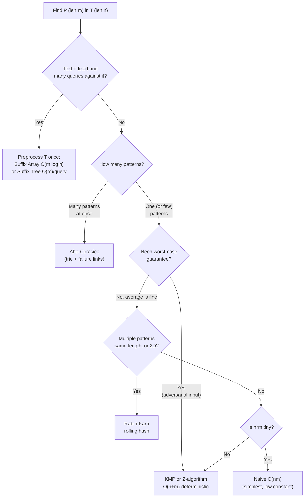

# 🧭 String Matching Overview

> [!abstract] TL;DR
> "Find pattern P (length m) inside text T (length n)" has many solutions, and picking the right one matters. **Naive** search is O(nm). **KMP** and **Z-algorithm** achieve O(n + m) with a precomputed prefix/Z structure. **Rabin-Karp** hits O(n + m) *average* via a rolling hash and shines for multiple patterns and 2D matching. When you must answer *many* queries against a *fixed* text, preprocess it once into a **suffix array** or **suffix tree** and answer each query in O(m log n) or O(m). This note is the decision hub that ties those algorithms together — the deep dives live in their own notes.

---

## Intuition — Analogy First

Imagine looking for a phrase in a physical book.

- **Naive** = start reading at page 1, and every time a word mismatches, jump back and restart one character later. Simple, but you re-read a lot.
- **KMP / Z** = before you start, you *study the phrase itself* so that when a mismatch happens you know exactly how far you can safely skip without re-checking — you never re-read text you've already cleared.
- **Rabin-Karp** = you memorize a quick *fingerprint* (a number) of the phrase, then slide a window over the book computing each window's fingerprint in one cheap step; you only actually read a window letter-by-letter when its fingerprint matches.
- **Suffix array / tree** = you first build a full *index* of the book (like the index at the back). Building it costs effort once, but afterward *any* phrase lookup is nearly instant — worth it when you'll search the same book thousands of times.

The right choice depends on: **how many patterns**, **how many texts/queries**, and whether you can afford **preprocessing** the text.

---

## How It Works — The Contenders

### Naive (brute force)
For each of the `n − m + 1` alignments, compare up to `m` characters. Worst case O(nm) (e.g. `T = "aaaa...a"`, `P = "aaa...b"`). No preprocessing, tiny constant — fine when `n·m` is small.

### KMP — [[KMP_Algorithm]]
Precompute the **failure function** (pi array) of the pattern so that on a mismatch, the pattern shifts by the largest safe amount without re-examining text characters. Deterministic **O(n + m)**, O(m) space. Great single-pattern workhorse.

### Z-algorithm — [[Z_Algorithm]]
Compute the **Z-array** (longest substring starting at each index that matches a prefix) of `P + separator + T`. Any Z-value equal to `m` marks a match. Deterministic **O(n + m)**, conceptually simpler than KMP for many.

### Rabin-Karp — [[Rabin_Karp]]
Compare **polynomial rolling hashes** of the pattern and each length-`m` window; verify character-by-character only when hashes collide. **O(n + m) average**, O(nm) adversarial worst case. Uniquely good for **multiple patterns of equal length** and **2D pattern matching**.

### Suffix structures — [[Suffix_Array]], [[Suffix_Tree]]
Preprocess the **text** (not the pattern) once. A suffix array + binary search answers a pattern query in O(m log n); a suffix tree answers it in O(m). Ideal when the text is fixed and you run **many** queries, or need longest-repeated / longest-common-substring answers.

### Aho-Corasick (honorable mention)
For searching **many patterns simultaneously**, build a trie of all patterns with failure links (KMP generalized to a set). O(n + total pattern length + matches). The classic multi-pattern tool.



---

## Complexity Analysis

| Algorithm | Preprocess | Search | Space | Worst case | Best for |
|---|---|---|---|---|---|
| Naive | — | O(nm) | O(1) | O(nm) | tiny inputs, quick code |
| [[KMP_Algorithm]] | O(m) | O(n) | O(m) | **O(n+m)** | single pattern, guaranteed linear |
| [[Z_Algorithm]] | O(m) | O(n) | O(n+m) | **O(n+m)** | single pattern, simple mental model |
| [[Rabin_Karp]] | O(m) | O(n) avg | O(1) | O(nm) | multiple equal-length patterns, 2D |
| [[Aho_Corasick\|Aho-Corasick]] | O(Σ\|Pᵢ\|) | O(n + occ) | O(Σ\|Pᵢ\|·σ) | O(n + occ) | many patterns at once |
| [[Suffix_Array]] | O(n log n) | O(m log n) | O(n) | build-dependent | fixed text, many queries |
| [[Suffix_Tree]] | O(n) | O(m) | O(n·σ) | O(n) | fixed text, powerful substring queries |

`n = |T|`, `m = |P|`, `σ = alphabet size`, `occ = number of matches`, `Pᵢ = i-th pattern`.

---

## Decision Guide (Python skeletons)

```python
from typing import List


# ── Naive search: baseline everyone should be able to write ─────────────
def naive_search(text: str, pattern: str) -> List[int]:
    """Return all start indices where pattern occurs. O(n*m) worst case."""
    n, m = len(text), len(pattern)
    hits = []
    for i in range(n - m + 1):
        # Compare the window text[i:i+m] against the pattern char by char.
        j = 0
        while j < m and text[i + j] == pattern[j]:
            j += 1
        if j == m:
            hits.append(i)
    return hits


def choose_matcher(num_patterns: int,
                   text_is_fixed_with_many_queries: bool,
                   need_worst_case_guarantee: bool,
                   two_dimensional: bool) -> str:
    """
    A decision helper mirroring the flowchart. Returns the recommended
    algorithm name. (Illustrative, not exhaustive.)
    """
    if text_is_fixed_with_many_queries:
        return "Suffix Array / Suffix Tree (preprocess the text once)"
    if num_patterns > 1:
        if two_dimensional:
            return "Rabin-Karp (2D rolling hash)"
        return "Aho-Corasick (many patterns simultaneously)"
    # single pattern
    if need_worst_case_guarantee:
        return "KMP or Z-algorithm (O(n+m) deterministic)"
    if two_dimensional:
        return "Rabin-Karp (2D rolling hash)"
    return "KMP for a guarantee, or naive if n*m is tiny"


if __name__ == "__main__":
    print(naive_search("ababcababc", "abc"))   # [2, 7]
    print(choose_matcher(1, False, True, False))   # KMP / Z
    print(choose_matcher(50, False, False, False)) # Aho-Corasick
    print(choose_matcher(1, True, False, False))   # Suffix structures
```

---

## Dry Run / Trace

**Why naive degrades — `T = "aaaaa"`, `P = "aab"`:**

```
i=0: a a a  compare a==a, a==a, a!=b (b vs a) -> 3 compares, fail
i=1: a a a  a==a, a==a, a!=b            -> 3 compares, fail
i=2: a a a  a==a, a==a, a!=b            -> 3 compares, fail
each of ~n alignments does ~m compares -> O(n*m)
```
KMP avoids this: after matching `"aa"` and failing on `b`, the failure function shifts the pattern by 1 but keeps the already-matched prefix, so text characters are never re-scanned — total O(n + m).

**Choosing for a real task:** "Search 10,000 different queries against one 1 MB document." Text is fixed, queries are many → build a **suffix array once** (O(n log n)), then answer each query in O(m log n). Re-running KMP per query would cost O(10000 · n).

---

## Patterns & LeetCode Applications

| Problem | Best fit |
|---|---|
| LC 28 Find First Occurrence (strStr) | KMP / Z (or naive for small inputs) |
| LC 459 Repeated Substring Pattern | KMP failure function / period |
| LC 214 Shortest Palindrome | KMP on `s + '#' + reverse(s)` |
| LC 187 Repeated DNA Sequences | Rabin-Karp / hashing |
| LC 1044 Longest Duplicate Substring | [[Binary_Search]] + Rabin-Karp, or suffix array |
| LC 686 Repeated String Match | KMP / naive |
| Multi-keyword filtering / dictionary match | Aho-Corasick |
| Many substring queries on fixed text | Suffix array / tree |

---

## Common Pitfalls

1. **Reaching for suffix structures too early** — if you only search a text once, an O(n) build plus query is not worth it; KMP/Z is simpler and fast enough.
2. **Trusting Rabin-Karp's worst case** — average O(n+m) is not worst case; an adversary who knows your modulus can force collisions. Use randomized/double hashing (see [[String_Hashing]]) for safety.
3. **Forgetting overlapping matches** — after a match, reset the matcher state (`j = pi[m-1]` in KMP) so overlapping occurrences are found.
4. **Separator collisions in Z/KMP concatenation** — the separator in `P + sep + T` must not appear in either string (use `chr(0)`), or you'll get spurious matches.
5. **Ignoring alphabet size** — suffix-tree space is O(n·σ); for huge alphabets, prefer suffix arrays.
6. **Confusing "preprocess the pattern" vs "preprocess the text"** — KMP/Z/Rabin-Karp preprocess the *pattern*; suffix structures preprocess the *text*. This flips which one being "fixed" helps you.

---

## Related Concepts

- [[_MOC_Strings|↑ Section MOC]]
- [[KMP_Algorithm]] — deterministic linear single-pattern search via failure function
- [[Z_Algorithm]] — the Z-array approach to linear matching
- [[Rabin_Karp]] — rolling-hash matching, multi-pattern and 2D
- [[String_Hashing]] — the polynomial-hash toolkit underneath Rabin-Karp
- [[Suffix_Array]] — space-efficient full-text index
- [[Suffix_Tree]] — the conceptually powerful full-text index
- [[Trie]] — the base structure behind Aho-Corasick multi-pattern matching

---

## Review Questions

1. You must run 100,000 substring queries against a single fixed 10 MB text. Rank naive, KMP, and suffix array by total cost and justify which you would pick.
2. Rabin-Karp and KMP are both "O(n + m)". Explain the crucial difference in that claim (average vs worst case) and give an input that makes Rabin-Karp degrade to O(nm).
3. When would you choose Aho-Corasick over running KMP once per pattern? Express both costs in terms of `n`, the number of patterns `k`, and total pattern length `M`.

---

## Sources

- LeetCode: 28, 187, 214, 459, 686, 1044
- CP-algorithms.com — "Prefix function", "Z-function", "String Hashing", "Suffix Automaton/Array"
- CLRS — Chapter 32 (String Matching)
- *Competitive Programmer's Handbook* — String algorithms chapter

#DSA #Strings #StringMatching #PatternSearch #Overview #DecisionGuide #Intermediate
