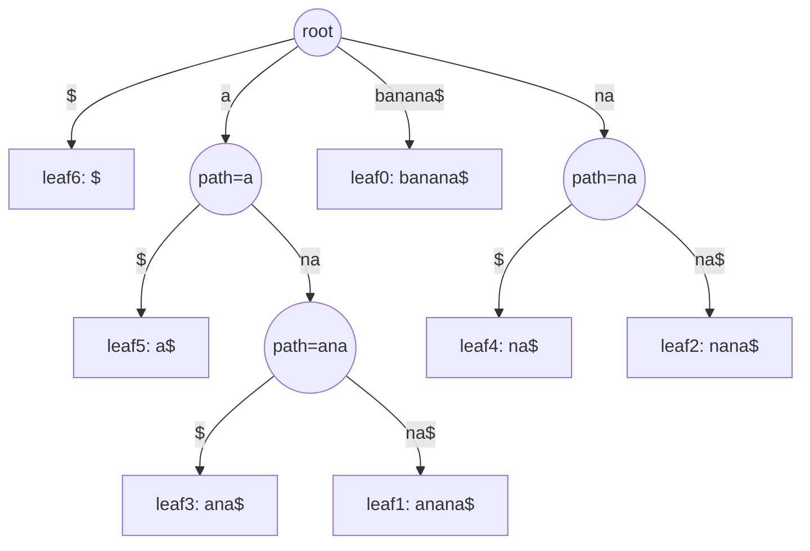

# 🌳 Suffix Tree

> [!abstract] TL;DR
> A suffix tree is a **compressed trie of all suffixes** of a string `s` (with a unique terminator `$`). Because chains of single-child nodes are collapsed into one edge labeled by a substring, the whole tree has only **O(n) nodes** despite representing all `n` suffixes. Once built, it answers **substring search in O(m)**, **longest repeated substring**, and (as a generalized suffix tree) **longest common substring** of multiple strings — each essentially by walking down edges. Construction is O(n) with **Ukkonen's algorithm** (intricate; we describe it rather than implement it) or O(n²) naively. In practice a [[Suffix_Array]] is smaller and simpler; the suffix *tree* wins on conceptual power and worst-case query time.

---

## Intuition — Analogy First

Start with a plain **[[Trie]]** built from every suffix of `"banana$"`:

```
banana$
 anana$
  nana$
   ana$
    na$
     a$
      $
```

A trie of these would have long, boring, single-file chains — e.g. `b → a → n → a → n → a → $` with no branching until the end. Storing one node per character wastes space (O(n²) nodes total).

The suffix tree's insight: **collapse every non-branching chain into a single edge** labeled with the whole substring. A node only exists where suffixes actually *diverge* (branch) or *end* (a leaf). It's like a subway map that only draws stations where lines split or terminate, not one dot per meter of track. This compression drops the node count from O(n²) to **O(n)** while preserving every suffix as a root-to-leaf path.

The final trick: every **internal branching node** corresponds to a substring that appears at least twice (that's *why* it branches). So "which substring repeats, and how long?" becomes "find the deepest internal node." The tree turns hard string questions into simple tree walks.

---

## How It Works

### Structure

- Append a unique sentinel `$` (not in the alphabet) so no suffix is a prefix of another → every suffix ends at its own **leaf**.
- Each **edge** is labeled by a substring of `s` (stored as `(start, end)` indices in practice, so labels cost O(1) space).
- Each **internal node** has ≥ 2 children; its **path label** (concatenation of edge labels from the root) is a substring occurring ≥ 2 times.
- Each **leaf** corresponds to exactly one suffix; the leaf's depth-label *is* that suffix.

### Suffix tree of `"banana$"`

Suffix start indices: `banana$`=0, `anana$`=1, `nana$`=2, `ana$`=3, `na$`=4, `a$`=5, `$`=6.



Internal nodes `a`, `na`, `ana` mark repeated substrings. The deepest, **`ana`** (length 3), is the **longest repeated substring** of `banana`.

### Queries the tree answers

| Query | Method | Time |
|---|---|---|
| Is `P` a substring of `s`? | Walk down edges matching `P`; success iff fully consumed | O(m) |
| How many times does `P` occur? | Walk to `P`'s node; count leaves in its subtree | O(m + occ) |
| Longest repeated substring | Deepest internal node (by path-label length) | O(n) |
| Longest common substring of `s₁, s₂` | Generalized tree; deepest node with leaves from *both* | O(n₁ + n₂) |
| Longest palindromic substring | Generalized tree of `s` and `reverse(s)` + [[Lowest_Common_Ancestor\|LCA]] tricks | O(n) |

### Construction — Ukkonen's algorithm (described, not implemented)

**Ukkonen's algorithm** builds the suffix tree **online** in **O(n)** by processing the string left to right, maintaining:
- **Suffix links** — a pointer from the node with path `xα` to the node with path `α`, letting the builder jump between suffixes without re-walking from the root.
- **The "active point"** (`active_node, active_edge, active_length`) tracking where the next insertion happens.
- **Implicit extensions** — "leaf edges" grow automatically via a global end pointer ("once a leaf, always a leaf"), and the "Rule 3 / show-stopper" shortcut ends a phase early.

Ukkonen is famously fiddly to implement correctly. For learning and most contest use, prefer the **naive O(n²)** build below (insert each suffix into a compressed trie, splitting edges as needed) — it's short, correct, and clear.

---

## Complexity Analysis

| Aspect | Suffix Tree | [[Suffix_Array]] |
|---|---|---|
| Construction | O(n) (Ukkonen) / O(n²) naive | O(n log n) doubling / O(n) SA-IS |
| Space (practical) | ~20–40 bytes/char, O(n·σ) or O(n) with maps | ~4–8 bytes/char |
| Substring search | **O(m)** | O(m log n) |
| Longest repeated substring | O(n) deepest internal node | O(n) via max LCP |
| Longest common substring (k strings) | O(total) generalized tree | O(total) with LCP + sliding window |
| Implementation difficulty | High (Ukkonen) | Moderate |
| Practical preference | conceptual power, guaranteed O(m) | **smaller, simpler, contest-friendly** |

`n = |s|`, `m = |pattern|`, `σ = alphabet size`, `occ = occurrences`.

---

## Python Implementation

```python
from typing import Dict, Optional


# Naive O(n^2) suffix tree: insert every suffix into a COMPRESSED trie,
# splitting edges where suffixes diverge. Clear and correct; Ukkonen is O(n).

class _Node:
    __slots__ = ("children",)
    def __init__(self) -> None:
        # first-char -> _Edge  (each edge holds a substring label + child node)
        self.children: Dict[str, "_Edge"] = {}

class _Edge:
    __slots__ = ("label", "node")
    def __init__(self, label: str, node: "_Node") -> None:
        self.label = label     # in production, store (start, end) indices, not the text
        self.node = node


class SuffixTree:
    def __init__(self, text: str) -> None:
        self.text = text + "$"          # unique terminator: no suffix is a prefix of another
        self.root = _Node()
        for i in range(len(self.text)):
            self._insert_suffix(self.text[i:])

    def _insert_suffix(self, suffix: str) -> None:
        """Walk down matching edges; when we diverge, split the edge."""
        node = self.root
        j = 0
        while j < len(suffix):
            c = suffix[j]
            if c not in node.children:
                # No matching edge -> attach the rest of the suffix as a new leaf.
                node.children[c] = _Edge(suffix[j:], _Node())
                return
            edge = node.children[c]
            label = edge.label
            k = 0
            # Match as far as we can along this edge's label.
            while k < len(label) and j < len(suffix) and label[k] == suffix[j]:
                k += 1
                j += 1
            if k == len(label):
                node = edge.node            # consumed whole edge -> descend
                continue
            # Diverged mid-edge -> split it at position k.
            mid = _Node()
            mid.children[label[k]] = _Edge(label[k:], edge.node)  # old tail
            edge.label = label[:k]                                # shorten to shared part
            edge.node = mid
            if j < len(suffix):                                   # attach remaining suffix
                mid.children[suffix[j]] = _Edge(suffix[j:], _Node())
            return

    # ── Query 1: substring membership in O(m) ──
    def contains(self, pattern: str) -> bool:
        node = self.root
        i = 0
        while i < len(pattern):
            c = pattern[i]
            if c not in node.children:
                return False
            label = node.children[c].label
            k = 0
            while k < len(label) and i < len(pattern):
                if label[k] != pattern[i]:
                    return False
                k += 1
                i += 1
            node = node.children[c].node
        return True

    # ── Query 2: longest repeated substring = deepest internal (branching) node ──
    def longest_repeated_substring(self) -> str:
        best = ""
        def dfs(node: _Node, path: str) -> None:
            nonlocal best
            # An internal node with >= 2 children means `path` occurs >= 2 times.
            if len(node.children) >= 2 and len(path) > len(best):
                best = path
            for edge in node.children.values():
                dfs(edge.node, path + edge.label)
        dfs(self.root, "")
        return best


# ── Generalized idea (sketch): longest common substring of two strings ──
def longest_common_substring(a: str, b: str) -> str:
    """
    Build a generalized suffix tree over a#b$ (distinct sentinels) and find the
    deepest internal node whose subtree contains a leaf from BOTH strings.
    Shown here with a simple O(n*m) DP for a runnable reference result;
    a generalized suffix tree does it in O(n+m).
    """
    n, m = len(a), len(b)
    dp = [[0] * (m + 1) for _ in range(n + 1)]
    best_len, best_end = 0, 0
    for i in range(1, n + 1):
        for j in range(1, m + 1):
            if a[i - 1] == b[j - 1]:
                dp[i][j] = dp[i - 1][j - 1] + 1
                if dp[i][j] > best_len:
                    best_len, best_end = dp[i][j], i
    return a[best_end - best_len:best_end]


# ── Demo ────────────────────────────────────────────────────────────────
if __name__ == "__main__":
    st = SuffixTree("banana")
    print(st.contains("ana"))                 # True
    print(st.contains("nan"))                 # True
    print(st.contains("xyz"))                 # False
    print(st.longest_repeated_substring())    # "ana"
    print(longest_common_substring("banana", "cabanana"))  # "banana"
```

---

## Dry Run / Trace

**Substring search `contains("ana")` on the `banana$` tree:**

```
start at root, pattern = "a n a"
i=0 'a': root has edge 'a' (label "a"); match 'a' -> descend to node[path=a], i=1
i=1 'n': node[a] has edge 'n' (label "na"); match 'n','a' -> label[0]='n'==p[1],
         label[1]='a'==p[2]; consumed pattern (i reaches 3) -> descend to node[path=ana]
pattern fully consumed -> return True
```
Only **3 character comparisons** — O(m), independent of the text length. In a 10 GB genome, checking a 30-character probe still costs ~30 steps.

**Longest repeated substring** — [[DFS]] collects internal-node path labels:
```
internal nodes and their path labels:
  "a"   (2 children)  -> candidate len 1
  "na"  (2 children)  -> candidate len 2
  "ana" (2 children)  -> candidate len 3   <-- deepest -> WINNER
result = "ana"   (occurs at positions 1 and 3 of "banana")
```

---

## Patterns & LeetCode Applications

| Problem / task | Suffix-structure approach |
|---|---|
| LC 1044 Longest Duplicate Substring | Suffix tree/array (or binary search + rolling hash) |
| Longest repeated substring | Deepest internal node |
| Longest common substring of two texts | Generalized suffix tree over both |
| Count distinct substrings | n(n+1)/2 − Σ(edge splits) / via suffix automaton or array LCP |
| Pattern occurrence count | Leaves under the pattern's node |
| Bioinformatics (genome alignment, motif finding) | Classic suffix-tree territory |
| Data compression (LZ-family, BWT) | Suffix structures underpin them |

> In competitive programming, the **suffix automaton** or **[[Suffix_Array]] + LCP** usually replaces a hand-rolled suffix tree because they are far easier to code correctly.

---

## Common Pitfalls

1. **Forgetting the sentinel `$`** — without a unique terminator, one suffix can be a prefix of another (e.g. `"na"` prefix of `"nana"`), so it wouldn't get its own leaf and the tree becomes an *implicit* suffix tree. Always append `$`.
2. **Storing edge labels as strings** — the naive code copies substrings (O(n²) memory). Real implementations store `(start, end)` index pairs so each label is O(1) space.
3. **Attempting Ukkonen from memory** — suffix links, the active point, and "Rule 3" are easy to get subtly wrong. If you need O(n), use a well-tested library or a suffix array/automaton instead.
4. **Confusing suffix tree with suffix trie** — the *trie* is uncompressed (O(n²) nodes); the *tree* compresses non-branching chains to O(n) nodes. They are not the same structure.
5. **Alphabet-size blow-up** — array-indexed children cost O(n·σ) space; for large alphabets use hash-map children (as here) or a suffix array.
6. **Assuming it beats a suffix array in practice** — asymptotically the tree gives O(m) search vs O(m log n), but its constant factors and memory are much larger; the array usually wins on real inputs.

---

## Related Concepts

- [[_MOC_Strings|↑ Section MOC]]
- [[Suffix_Array]] — the space-efficient, contest-preferred cousin (SA + LCP does most of the same jobs)
- [[Trie]] — the uncompressed base structure; a suffix tree is a compressed trie of suffixes
- [[String_Hashing]] — an easier alternative for many "longest duplicate / common substring" tasks (binary search + hash)
- [[String_Matching_Overview]] — where suffix structures sit among matching algorithms
- [[Segment_Tree]] — often paired with suffix arrays for range-LCP queries

---

## Review Questions

1. Explain why a suffix tree has only O(n) nodes even though it represents `n` suffixes whose total length is O(n²). What structural rule keeps the node count linear?
2. Given the suffix tree of `"banana$"`, describe exactly how you would (a) test whether `"nan"` is a substring, and (b) find the longest repeated substring. What is the time complexity of each?
3. Compare suffix tree vs suffix array on four axes: construction difficulty, memory, substring-search time, and typical contest choice. When would you still reach for the tree?

---

## Sources

- LeetCode: 1044 (Longest Duplicate Substring), and suffix-structure problems generally
- CP-algorithms.com — "Suffix Automaton", "Suffix Array" (suffix-tree alternatives)
- Ukkonen, "On-line construction of suffix trees" (1995)
- Gusfield — *Algorithms on Strings, Trees, and Sequences* (the definitive suffix-tree reference)
- Skiena — *The Algorithm Design Manual*, Section 12.3

#DSA #Strings #SuffixTree #Ukkonen #CompressedTrie #StringAlgorithms #Advanced
