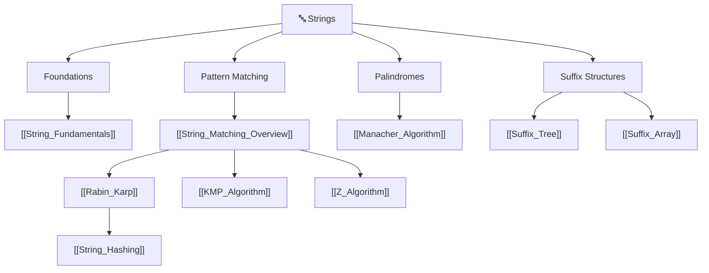

# 🔤 Strings — Map of Content

> [!abstract] What This Section Covers
> Strings are their own algorithmic universe. This section starts with the Python-specific fundamentals — immutability, the O(n²) concatenation trap, frequency counting, and two-pointer palindrome checks — then builds toward the classic pattern-matching problem "find P inside T". A decision-hub overview ranks the contenders, Rabin-Karp shows the rolling-hash approach, Manacher's algorithm collapses longest-palindrome search from O(n²) to O(n), and the suffix tree preprocesses a fixed text into a full-text index. The heavy competitive-programming string machinery (KMP, Z-algorithm, suffix array, string hashing) lives in the CP section but is cross-referenced here so the topic reads as one coherent whole.

## Concept Map

*Dashed cross-links `[[KMP_Algorithm]]`, `[[Z_Algorithm]]`, `[[Suffix_Array]]`, and `[[String_Hashing]]` are the deep-dive CP string notes that complete the matching / suffix / hashing story — they live in [[_MOC_Competitive_Programming]].*

## Learning Path

1. [[String_Fundamentals]] — Immutability, the `s += c` O(n²) trap, `Counter`/26-array frequency counting, two-pointer palindromes, expand-around-center
2. [[String_Matching_Overview]] — The decision hub: naive vs KMP/Z vs Rabin-Karp vs suffix structures vs [[Aho_Corasick|Aho-Corasick]]; preprocess-the-pattern vs preprocess-the-text
3. [[Rabin_Karp]] — Polynomial rolling hash; O(1) window roll; multi-pattern and 2D matching; collision verification
4. [[Manacher_Algorithm]] — Longest palindromic substring in O(n) via the `#` transform and mirror reuse
5. [[Suffix_Tree]] — Compressed trie of all suffixes; O(m) substring search, longest repeated / common substring; Ukkonen described

## All Notes at a Glance

| Note | Summary | Difficulty |
|------|---------|------------|
| [[String_Fundamentals]] | Immutability trap, frequency counting, two-pointer palindrome, expand-around-center | Beginner |
| [[String_Matching_Overview]] | Decision guide across all substring-search algorithms | Intermediate |
| [[Rabin_Karp]] | Rolling-hash matching; multi-pattern and 2D; O(n+m) average | Intermediate |
| [[Manacher_Algorithm]] | Longest palindromic substring in O(n) via `#` transform + mirror reuse | Advanced |
| [[Suffix_Tree]] | Compressed suffix trie; O(m) queries; longest repeated/common substring | Advanced |

## Related CP String Algorithms

These four notes finish the string toolkit but are catalogued under [[_MOC_Competitive_Programming]] because they are used most heavily in contests. They are linked from the section notes above and belong to this section's mental model:

| Note | Role | Difficulty |
|------|------|------------|
| [[KMP_Algorithm]] | Deterministic O(n+m) single-pattern search via the failure function | Advanced |
| [[Z_Algorithm]] | Z-array approach to linear matching; conceptually simpler than KMP | Advanced |
| [[Suffix_Array]] | Space-efficient, contest-preferred full-text index (SA + LCP) | Advanced |
| [[String_Hashing]] | Polynomial-hash toolkit; double hashing; O(1) substring comparison — the foundation under Rabin-Karp | Advanced |

## Key Questions This Section Answers

- Why is `s += c` inside a loop secretly O(n²), and what is the O(n) fix?
- When do you preprocess the *pattern* (KMP / Z / Rabin-Karp) versus the *text* (suffix array / suffix tree)?
- How does a rolling hash turn substring matching into O(n) average, and why must you still verify on a hash hit?
- Why does Manacher beat expand-around-center, and what do the `#` separators accomplish?
- Why does a suffix tree have only O(n) nodes, and when is a suffix array the better real-world choice?
- How do palindrome, anagram, and matching problems reduce to frequency-counting or two-pointer patterns?

## Related Sections

- [[_MOC_DSA_Master|↑ DSA Master MOC]]
- [[_MOC_Competitive_Programming]] — home of KMP, Z-algorithm, suffix array, and string hashing
- [[_MOC_Trees]] — a suffix tree is a compressed trie; tries underpin Aho-Corasick multi-pattern matching
- [[_MOC_Hash_Tables]] — rolling hashes and frequency counting are hashing patterns

#MOC #DSA #strings
