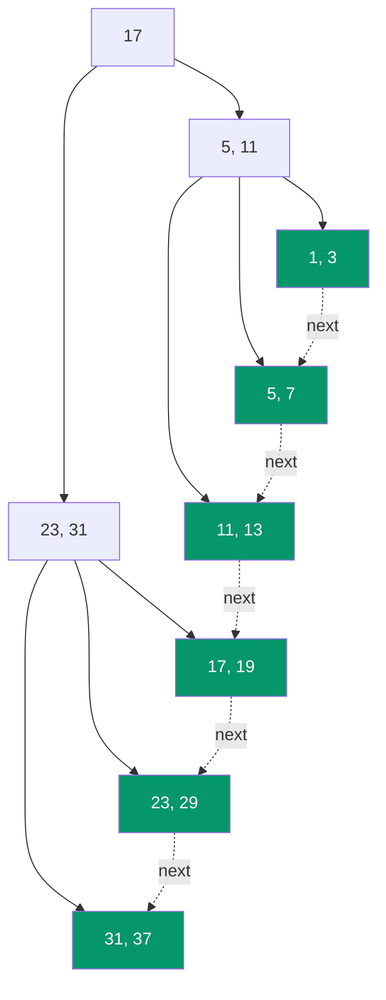

# 🗄️ B+ Tree

> [!abstract] TL;DR
> A **B+ tree** is the workhorse of relational-database indexing. It is a [[B_Tree]] variant with two crucial changes: **(1) all actual data (or row pointers) live only in the leaf nodes** — internal nodes hold *copies of keys purely for routing* — and **(2) the leaves are chained together in a [[Doubly_Linked_List|doubly linked list]]**. Storing no data in internal nodes gives them a higher fan-out (shorter tree), and the linked leaf level turns a range query like `WHERE age BETWEEN 20 AND 40` into a single descent followed by a fast sequential leaf scan. This is the default index structure in **MySQL InnoDB, PostgreSQL, Oracle, SQL Server**, and filesystems like **NTFS** and **ext4**.

---

## Intuition — Analogy First

Think of a **phone book with thumb-index tabs**.

- The **coloured alphabet tabs** on the edge (A, B, C, …) do not contain phone numbers — they only tell you *which pages to flip to*. Those are the **internal (routing) nodes**: pure signposts, no data.
- The **actual pages** with names and numbers, printed in order, are the **leaf nodes**. Every real entry lives here — nowhere else.
- Because the pages are physically bound in order, once you find "Smith" you can just **keep flipping forward** to read everyone from Smith to Turner without ever consulting the tabs again. That physical adjacency is the **linked list between leaves** — the feature that makes range scans fast.

A plain [[B_Tree]] is like a phone book where *some* numbers are printed on the tab dividers themselves — convenient for a single lookup, but you lose the clean "just keep flipping" property for ranges.

---

## How It Works

| Aspect | B-tree | **B+ tree** |
|---|---|---|
| Where data lives | Internal **and** leaf nodes | **Leaf nodes only** |
| Internal node content | keys **+** data/values | **keys only** (separators) |
| Median on split | **moved** up (removed from child) | **copied** up (kept in leaf) |
| Leaf linkage | none | **linked list** across all leaves |
| A single lookup | may stop early at an internal node | **always** walks to a leaf |

Because internal nodes store only keys (no bulky rows), each internal node fits **more separators per disk page → higher fan-out → an even shorter tree** than a B-tree over the same data.



*Solid arrows are the routing tree; dashed arrows are the **leaf linked list**. Note the routing key `17` also appears in leaf `L4` — internal keys are copies. Every actual value is at the green leaf level, and the leaves form one sorted sequence.*

### Point query (`WHERE id = 29`)

Descend from the root using the routing keys until you reach a leaf, then scan that leaf. **Every** search touches exactly *height* nodes — search cost is uniform and predictable (unlike a B-tree, which may terminate early at an internal node).

### Range query (`WHERE id BETWEEN 11 AND 29`) — the killer feature

1. Descend once to the leaf containing the lower bound (`11`).
2. **Walk the leaf linked list forward** (`11,13 → 17,19 → 23,29`) emitting values until you pass the upper bound.

No repeated root-to-leaf descents, no re-traversal of internal nodes — pure sequential I/O, which disks and SSDs love. This is why **ordered scans, `ORDER BY`, `GROUP BY`, and `BETWEEN`** are so cheap on a B+ tree index.

### Insert / delete

Structurally identical to a [[B_Tree]] (split on overflow, borrow/merge on underflow) with one twist: on a **leaf split**, the median key is **copied** up into the parent (not moved), because the leaf must still contain every key. New leaves are also **spliced into the linked list** by fixing two `next`/`prev` pointers.

---

## Complexity Analysis

Let *n* = number of keys, *m* = fan-out, h = O(log_m n).

| Operation | Time | Disk accesses |
|---|---|---|
| Point search | O(log n) | O(log_m n) (always reaches a leaf) |
| Insert | O(log n) | O(log_m n) + pointer splice |
| Delete | O(log n) | O(log_m n) |
| **Range scan of k results** | **O(log n + k)** | O(log_m n + k/m) — one descent then sequential leaves |
| Full ordered scan | O(n) | O(n/m) — just follow leaf links |
| Space | O(n) | — |

> [!tip] Higher fan-out, shorter tree
> Suppose a 16 KB page holds 200 (key, row) pairs in a B-tree but 400 keys-only separators in a B+ tree internal node. Over the same billions of rows the B+ tree is often one full level shorter — one fewer disk read on *every* query.

---

## Python Implementation

A B+ tree with **search, range query, and insert with leaf-splitting + leaf linking**. This highlights the two defining features (leaves hold all data; leaves are linked).

```python
import bisect


class BPlusLeaf:
    def __init__(self):
        self.keys: list[int] = []
        self.values: list = []          # data lives ONLY here
        self.next: "BPlusLeaf | None" = None   # linked list across leaves
        self.leaf = True


class BPlusInternal:
    def __init__(self):
        self.keys: list[int] = []       # routing separators only (no data)
        self.children: list = []
        self.leaf = False


class BPlusTree:
    """B+ tree of order m: <= m-1 keys per node, data only in linked leaves."""

    def __init__(self, order: int = 4):
        self.order = order
        self.root = BPlusLeaf()

    # ── Point search ───────────────────────────────────────────────────────
    def _find_leaf(self, key: int) -> BPlusLeaf:
        node = self.root
        while not node.leaf:
            i = bisect.bisect_right(node.keys, key)   # routing: key < keys[i]
            node = node.children[i]
        return node

    def search(self, key: int):
        leaf = self._find_leaf(key)
        i = bisect.bisect_left(leaf.keys, key)
        if i < len(leaf.keys) and leaf.keys[i] == key:
            return leaf.values[i]
        return None

    # ── Range query — the reason B+ trees win for databases ────────────────
    def range_query(self, lo: int, hi: int) -> list:
        leaf = self._find_leaf(lo)
        out = []
        while leaf:                      # walk the linked leaf list
            for k, v in zip(leaf.keys, leaf.values):
                if k > hi:
                    return out
                if k >= lo:
                    out.append((k, v))
            leaf = leaf.next             # sequential hop, no re-descent
        return out

    # ── Insert ─────────────────────────────────────────────────────────────
    def insert(self, key: int, value=None) -> None:
        value = key if value is None else value
        root = self.root
        split = self._insert(root, key, value)
        if split is not None:            # root split -> grow a new root
            sep, right = split
            new_root = BPlusInternal()
            new_root.keys = [sep]
            new_root.children = [root, right]
            self.root = new_root

    def _insert(self, node, key, value):
        if node.leaf:
            i = bisect.bisect_left(node.keys, key)
            if i < len(node.keys) and node.keys[i] == key:
                node.values[i] = value   # update existing
                return None
            node.keys.insert(i, key)
            node.values.insert(i, value)
            if len(node.keys) < self.order:
                return None
            return self._split_leaf(node)
        else:
            i = bisect.bisect_right(node.keys, key)
            split = self._insert(node.children[i], key, value)
            if split is None:
                return None
            sep, right = split
            node.keys.insert(i, sep)
            node.children.insert(i + 1, right)
            if len(node.keys) < self.order:
                return None
            return self._split_internal(node)

    def _split_leaf(self, leaf: BPlusLeaf):
        mid = len(leaf.keys) // 2
        right = BPlusLeaf()
        right.keys = leaf.keys[mid:]
        right.values = leaf.values[mid:]
        leaf.keys = leaf.keys[:mid]
        leaf.values = leaf.values[:mid]
        right.next = leaf.next           # splice into the linked list
        leaf.next = right
        return (right.keys[0], right)    # separator is COPIED up (still in leaf)

    def _split_internal(self, node: BPlusInternal):
        mid = len(node.keys) // 2
        sep = node.keys[mid]             # separator MOVES up (removed here)
        right = BPlusInternal()
        right.keys = node.keys[mid + 1:]
        right.children = node.children[mid + 1:]
        node.keys = node.keys[:mid]
        node.children = node.children[:mid + 1]
        return (sep, right)


# ── Demo ────────────────────────────────────────────────────────────────────
if __name__ == "__main__":
    bpt = BPlusTree(order=4)
    for k in [10, 20, 5, 6, 12, 30, 7, 17, 3, 25]:
        bpt.insert(k, f"row-{k}")

    print("search(17):    ", bpt.search(17))              # row-17
    print("search(99):    ", bpt.search(99))              # None
    print("range [6, 20]:  ", [k for k, _ in bpt.range_query(6, 20)])
    # -> [6, 7, 10, 12, 17, 20]  via one descent + sequential leaf scan
```

---

## Real-World Use

- **MySQL InnoDB** — every table is stored *as* a B+ tree keyed on the **clustered primary key**; secondary indexes are separate B+ trees whose leaves store the primary key.
- **PostgreSQL** — the default `btree` access method is a Lehman-Yao concurrent **B+ tree** (leaves linked left-and-right for concurrent scans).
- **Oracle, SQL Server, DB2, SQLite** — B+ trees for primary and secondary indexes.
- **Filesystems** — **NTFS** (directory indexes), **ext4** (HTree directories), **XFS**, and **APFS** use B+ trees for on-disk metadata.
- **Range-heavy workloads generally** — anything doing `BETWEEN`, `ORDER BY`, prefix scans, or time-series windows benefits from the linked leaf level.

---

## Comparison with Alternatives

| Feature | [[B_Tree]] | **B+ tree** | [[Hash_Table_Fundamentals\|Hash index]] |
|---|---|---|---|
| Data location | internal + leaves | **leaves only** | buckets |
| Internal fan-out | lower (data bloats nodes) | **higher (keys only)** | n/a |
| Point lookup | O(log n), may stop early | O(log n), always leaf | **O(1) average** |
| Range / ordered scan | slower (no leaf links) | **O(log n + k), sequential** | **not supported** |
| `ORDER BY` for free | partial | **yes** | no |
| Typical use | some filesystems, memory | **DB indexes, filesystems** | equality-only lookups |

> **Why databases pick B+ over plain B-trees:** (1) linked leaves make range/ordered scans sequential, and (2) keys-only internal nodes pack a higher fan-out, shrinking tree height and giving *uniform* lookup cost. The one thing B+ trees give up — early termination at an internal node on a lucky point query — barely matters at scale.

---

## Common Pitfalls

1. **Thinking internal nodes store rows.** They store only *separator keys*. A `SELECT` must always walk to a leaf; there is no early exit.
2. **Moving the median up on a leaf split.** On a **leaf** split the separator is **copied** (the key must remain in the leaf). Only on an **internal** split is the separator moved. Getting this backwards silently loses keys.
3. **Forgetting to relink leaves after a split.** If you split a leaf but don't fix the `next` pointer, range scans skip records — a bug that passes point-query tests and fails only on ranges.
4. **Assuming a hash index can replace a B+ tree.** Hash indexes give O(1) equality but **cannot** do ranges, `ORDER BY`, or `LIKE 'prefix%'`. That is exactly why B+ trees remain the default.
5. **Ignoring clustering.** In InnoDB the table *is* the primary-key B+ tree; a poorly chosen (random/UUID) primary key scatters leaf writes and fragments the tree. Prefer monotonically increasing keys for insert locality.
6. **Undersized nodes.** Node size should match the storage page (e.g. 8–16 KB). Tiny nodes throw away the fan-out advantage.

---

## Related Concepts

- [[_MOC_Advanced_Data_Structures|↑ Section MOC]]
- [[B_Tree]] — the parent structure; B+ tree pushes all data to linked leaves
- [[Indexing]] — where B+ trees sit among linear, hash, and clustered indexing strategies
- [[Hash_Table_Fundamentals]] — the O(1) equality alternative that cannot do ranges
- [[Database_Indexes]] — the System Design vault's DB-side treatment of index types
- [[Two_Three_Tree]] — a minimal B-tree-family tree for intuition

---

## Review Questions

1. A B+ tree and a B-tree both store the same keys with the same fan-out. Explain the two structural differences and how *each one* independently improves database query performance.
2. On a leaf split the separator key is *copied* upward, but on an internal split it is *moved* upward. Why the asymmetry? What breaks if you move it on a leaf split?
3. Trace the execution of `WHERE id BETWEEN 11 AND 29` on the tree in the diagram. Which nodes are visited, and why is this cheaper than issuing many individual point lookups?

---

## Sources

- Comer, D. (1979) — "The Ubiquitous B-Tree", *ACM Computing Surveys* (defines B+/B* variants)
- Lehman & Yao (1981) — "Efficient Locking for Concurrent Operations on B-Trees" (PostgreSQL's design)
- Ramakrishnan & Gehrke — *Database Management Systems*, Chapter 10
- MySQL Reference Manual — *InnoDB Index Types*; PostgreSQL docs — *B-Tree Indexes*
- [Use The Index, Luke!](https://use-the-index-luke.com/) — practical B+ tree indexing

#DSA #DataStructures #BPlusTree #Indexing #Databases #Advanced
