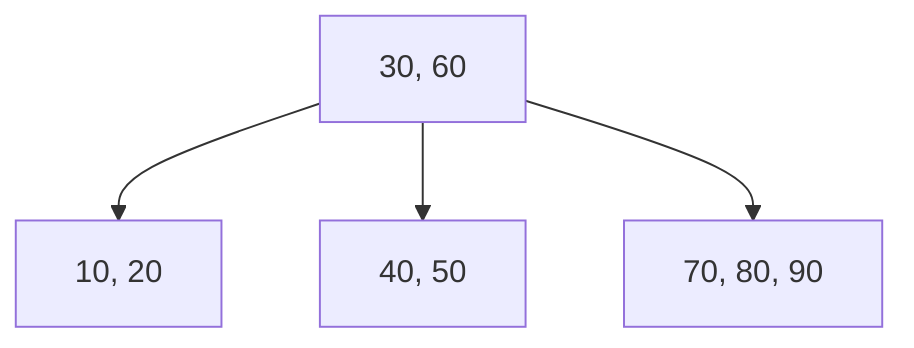
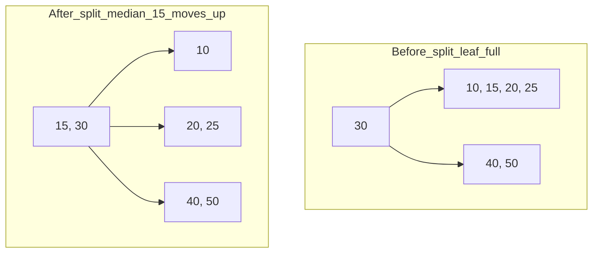

# 🌲 B-Tree

> [!abstract] TL;DR
> A **B-tree** is a self-balancing **m-way search tree** where every node stores *many* keys and has *many* children. It is engineered for **block-based storage** (disks, SSDs): a high branching factor makes the tree extremely shallow, so a lookup touches only a handful of nodes — and therefore only a handful of expensive disk reads. All leaves sit at the same depth, and every non-root node stays between ⌈m/2⌉−1 and m−1 keys. Search, insert, and delete are all O(log n), but with far fewer *node accesses* than a [[Binary_Tree_Fundamentals|binary tree]]. B-trees (and their sibling the [[B_Plus_Tree]]) power the indexes inside MySQL InnoDB, PostgreSQL, and filesystems.

---

## Intuition — Analogy First

Imagine a **multi-level filing cabinet** in a huge records office.

- A binary search tree is like a cabinet where every drawer contains **one** folder and points you to exactly **two** other drawers. To find a record you may have to open dozens of drawers — and each "open a drawer" costs a slow walk across the room (a disk read).
- A B-tree drawer instead holds a **whole row of folders** (say 100 labels) already sorted, plus **101 pointers** to the next cabinets. In one glance at one drawer you narrow the search from millions of records to a few thousand. Two or three drawer-openings later, you have the record.

The insight: **disk reads are ~100,000× slower than comparisons in RAM.** So the winning strategy is *not* "fewest comparisons" but "**fewest node visits**." Pack each node full, make it as wide as a disk block, and the tree becomes only 3–4 levels tall even for billions of keys.

---

## How It Works

A B-tree of **order m** (also called *degree* / *fan-out*) obeys these invariants:

1. Every node has **at most m children** and **at most m−1 keys** (keys are kept sorted).
2. Every node except the root has **at least ⌈m/2⌉ children** (so at least ⌈m/2⌉−1 keys) — this half-full rule guarantees the height stays logarithmic.
3. The root has at least 1 key (unless the tree is empty).
4. A non-leaf node with *k* keys has exactly *k+1* children. The keys act as **separators**: everything in child *i* is between key *i−1* and key *i*.
5. **All leaves are at the same depth** — the tree is perfectly height-balanced at all times.

Instead of "minimum degree", CLRS parameterizes with **t** (minimum degree), where each node holds between **t−1 and 2t−1 keys** — i.e. order m = 2t.



*A B-tree of order 4 (max 3 keys, max 4 children per node). The root's two keys `30` and `60` split the key space into three ranges: `<30`, `30–60`, `>60`, each pointing to a child. Every leaf is at depth 1.*

### Search

[[Binary_Search|Binary-search]] the sorted keys **inside** the current node. If the key is present, done. Otherwise follow the single child pointer for the range the key falls into, and repeat. At most *height* nodes are visited.

### Insert — split on overflow (grows upward)

1. Descend to the correct **leaf** and insert the key in sorted position.
2. If that node now has **m keys** (overflow), **split** it: the **median key moves up** into the parent, and the node divides into two half-full nodes.
3. A split can cascade: if the parent overflows too, it splits, pushing *its* median up. If the split reaches the root, a **new root is created** — this is the *only* way a B-tree grows taller, which is why all leaves stay at equal depth.



*Inserting into a full leaf `[10,15,20,25]` overflows it; the median `15` is promoted to the parent and the leaf splits into `[10]` and `[20,25]`.*

### Delete — borrow or merge on underflow (shrinks downward)

1. If deleting from an internal node, first replace the key with its in-order **predecessor/successor** (which lives in a leaf), reducing to a leaf deletion.
2. Remove the key from the leaf. If the node now has **fewer than ⌈m/2⌉−1 keys** (underflow):
   - **Borrow** a key from an adjacent sibling that has a spare (rotate through the parent), OR
   - **Merge** with a sibling and pull the separating key down from the parent.
3. A merge can cause the parent to underflow, cascading upward. If the root loses its last key, its single child becomes the new root and the tree shrinks by one level.

---

## Complexity Analysis

Let *n* = number of keys, *m* = order (branching factor), *t* = minimum degree (m = 2t). Height h = O(log_m n) = O(log n / log m).

| Operation | Time (comparisons) | Disk accesses (node reads) |
|---|---|---|
| Search | O(log n) | **O(log_m n)** = tree height |
| Insert | O(log n) | O(log_m n) reads + O(log_m n) writes on cascading split |
| Delete | O(log n) | O(log_m n) reads + O(log_m n) writes on cascading merge |
| Min / Max | O(log n) | O(log_m n) |
| In-order traversal | O(n) | O(n / m) |
| Space | O(n) | — |

> [!tip] Why the height is tiny
> With order m = 256, a tree holding **1 billion** keys has height ⌈log₂₅₆(10⁹)⌉ ≈ **4**. A balanced *binary* tree holding the same data has height ~30. That is the difference between 4 disk reads and 30 disk reads per lookup.

---

## Python Implementation

A correct B-tree **search + insert** (with cascading node split), following the CLRS minimum-degree formulation. Delete is summarized as pseudocode afterward because a fully correct delete adds ~120 lines of case handling.

```python
class BTreeNode:
    def __init__(self, leaf: bool = False):
        self.keys: list[int] = []        # sorted keys
        self.children: list["BTreeNode"] = []
        self.leaf = leaf                 # True if this node has no children


class BTree:
    """
    B-tree with minimum degree t.
    Each non-root node holds between t-1 and 2t-1 keys (order m = 2t).
    """

    def __init__(self, t: int = 2):
        assert t >= 2, "minimum degree must be >= 2"
        self.t = t
        self.root = BTreeNode(leaf=True)

    # ── Search ─────────────────────────────────────────────────────────────
    def search(self, key: int, node: BTreeNode | None = None):
        node = node or self.root
        i = 0
        while i < len(node.keys) and key > node.keys[i]:   # binary-search-able
            i += 1
        if i < len(node.keys) and key == node.keys[i]:
            return (node, i)             # found
        if node.leaf:
            return None                  # not present
        return self.search(key, node.children[i])          # descend

    # ── Insert ─────────────────────────────────────────────────────────────
    def insert(self, key: int) -> None:
        root = self.root
        if len(root.keys) == 2 * self.t - 1:      # root is full → tree grows up
            new_root = BTreeNode(leaf=False)
            new_root.children.append(root)
            self._split_child(new_root, 0)
            self.root = new_root
            self._insert_nonfull(new_root, key)
        else:
            self._insert_nonfull(root, key)

    def _split_child(self, parent: BTreeNode, i: int) -> None:
        """Split parent.children[i] (which is full) around its median."""
        t = self.t
        full = parent.children[i]
        sibling = BTreeNode(leaf=full.leaf)
        median = full.keys[t - 1]                 # median is promoted

        sibling.keys = full.keys[t:]              # right half → new sibling
        full.keys = full.keys[: t - 1]            # left half stays
        if not full.leaf:
            sibling.children = full.children[t:]
            full.children = full.children[: t]

        parent.children.insert(i + 1, sibling)
        parent.keys.insert(i, median)

    def _insert_nonfull(self, node: BTreeNode, key: int) -> None:
        i = len(node.keys) - 1
        if node.leaf:
            node.keys.append(None)                # make room
            while i >= 0 and key < node.keys[i]:
                node.keys[i + 1] = node.keys[i]
                i -= 1
            node.keys[i + 1] = key
        else:
            while i >= 0 and key < node.keys[i]:
                i -= 1
            i += 1
            if len(node.children[i].keys) == 2 * self.t - 1:
                self._split_child(node, i)        # split before descending
                if key > node.keys[i]:
                    i += 1
            self._insert_nonfull(node.children[i], key)

    # ── In-order traversal (yields sorted keys) ────────────────────────────
    def inorder(self) -> list[int]:
        out: list[int] = []
        def walk(node: BTreeNode) -> None:
            for i, key in enumerate(node.keys):
                if not node.leaf:
                    walk(node.children[i])
                out.append(key)
            if not node.leaf:
                walk(node.children[-1])
        walk(self.root)
        return out


# ── Delete (conceptual pseudocode) ─────────────────────────────────────────
"""
delete(key):
    if key in an internal node:
        replace key with in-order predecessor/successor (a leaf key), recurse
    remove key from its leaf
    if node underflows (< t-1 keys) and node is not the root:
        if a sibling has >= t keys:  BORROW  (rotate a key through the parent)
        else:                        MERGE   (join sibling + pull down separator)
        underflow may cascade to the parent -> repeat upward
    if root becomes empty: its only child becomes the new root (tree shrinks)
"""


# ── Demo ────────────────────────────────────────────────────────────────────
if __name__ == "__main__":
    bt = BTree(t=2)                       # order 4: 1..3 keys per node
    for k in [10, 20, 5, 6, 12, 30, 7, 17]:
        bt.insert(k)

    print("Sorted keys:", bt.inorder())   # [5, 6, 7, 10, 12, 17, 20, 30]
    print("Root keys:  ", bt.root.keys)   # small root — tree is very shallow
    print("Search 12:  ", bt.search(12) is not None)   # True
    print("Search 99:  ", bt.search(99) is not None)   # False
```

---

## Real-World Use

- **Relational databases** — MySQL/MariaDB **InnoDB** and **PostgreSQL** build their indexes as B-tree family structures (InnoDB and PostgreSQL specifically use [[B_Plus_Tree]] variants). Node size is tuned to the disk/page size (often 8 KB or 16 KB).
- **Filesystems** — NTFS directories, HFS+, ReiserFS, and Btrfs ("**B-tree** filesystem") organize metadata in B-trees for O(log n) file/directory lookup.
- **Key-value & embedded engines** — Berkeley DB, SQLite (B-tree for tables/indexes), and LMDB use B-tree pages.
- **Anywhere data lives on a block device** — the design goal is minimizing block reads, so B-trees dominate on-disk indexing while balanced *binary* trees dominate in-RAM ordered maps.

---

## Comparison with Alternatives

| Structure | Keys / node | Height (n keys) | Best domain | Notes |
|---|---|---|---|---|
| [[Binary_Search_Tree]] | 1 | up to O(n) (degenerates) | In-memory, small | No balance guarantee |
| [[AVL_Tree]] | 1 | ~1.44 log₂ n | In-memory, read-heavy | Strict balance, many rotations |
| [[Red_Black_Tree]] | 1 | ≤ 2 log₂ n | In-memory ordered maps | Fewer rotations on write |
| **B-tree** | up to m−1 | **O(log_m n)** | On-disk indexes, filesystems | Wide, shallow, block-aligned |
| [[B_Plus_Tree]] | up to m−1 | O(log_m n) | DB indexes, range scans | Data only in linked leaves |
| [[Two_Three_Tree]] | 1–2 | O(log n) | Teaching / RB foundation | B-tree of order 3 |

> A **2-3 tree is exactly a B-tree of order 3**, and a **2-3-4 tree (order 4) is isomorphic to a [[Red_Black_Tree]]** — B-trees are the general theory behind those balanced binary trees.

---

## Common Pitfalls

1. **Confusing order m with minimum degree t.** Order m = 2t. A node holds t−1 to 2t−1 keys. Mixing the two conventions produces off-by-one split logic.
2. **Splitting *after* insertion instead of proactively.** The CLRS "split-on-the-way-down" approach splits any full child *before* descending, guaranteeing single-pass insertion. Splitting reactively forces a second upward pass.
3. **Forgetting that the median is promoted, not copied (in a plain B-tree).** In a B-tree the median key *moves up* and leaves both halves. (In a [[B_Plus_Tree]] it is *copied* up because leaves must keep every key — a frequent source of confusion between the two.)
4. **Letting a non-root node fall below ⌈m/2⌉−1 keys.** Skipping the borrow/merge step on delete breaks the balance invariant and inflates height.
5. **Choosing an order unrelated to the storage block size.** The whole point is one node ≈ one disk/page read; a tiny order throws away the disk-locality advantage.
6. **Assuming the root obeys the half-full rule.** The root is exempt — it may legally hold as little as one key.

---

## Related Concepts

- [[_MOC_Advanced_Data_Structures|↑ Section MOC]]
- [[B_Plus_Tree]] — the database-favored variant: all data in linked leaves for range scans
- [[Binary_Search_Tree]] — the 1-key-per-node ancestor a B-tree generalizes
- [[AVL_Tree]] — strictly balanced binary alternative for in-memory ordered data
- [[Red_Black_Tree]] — a 2-3-4 tree in disguise; the in-memory balanced-tree counterpart
- [[Two_Three_Tree]] — the smallest B-tree (order 3), useful for building intuition
- [[Indexing]] — how B-trees fit into the broader database indexing picture

---

## Review Questions

1. A binary search tree and a B-tree both offer O(log n) search, yet databases overwhelmingly choose B-trees for on-disk indexes. Explain *precisely* what B-trees optimize that binary trees do not, and why it matters more than raw comparison count.
2. Walk through inserting into a full node: which key is promoted, how does the node divide, and why does this discipline keep *all leaves at the same depth*? What is the only situation that increases the tree's height?
3. Given order m = 256, estimate the height of a B-tree holding one billion keys, and contrast it with a balanced binary tree of the same size. Roughly how many disk reads does each lookup cost in the two cases?

---

## Sources

- CLRS — *Introduction to Algorithms*, Chapter 18 "B-Trees"
- Bayer & McCreight (1972) — "Organization and Maintenance of Large Ordered Indexes" (the original B-tree paper)
- Ramakrishnan & Gehrke — *Database Management Systems*, Chapter 10
- [Visualgo — B-Tree / B+ Tree](https://visualgo.net/en/bst)

#DSA #DataStructures #BTree #Indexing #Databases #Advanced
