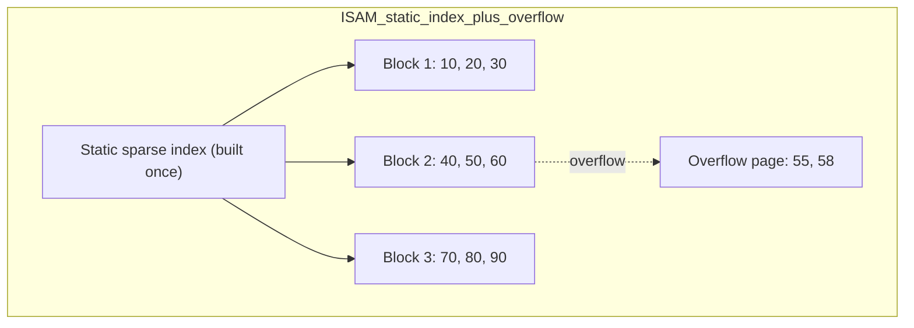
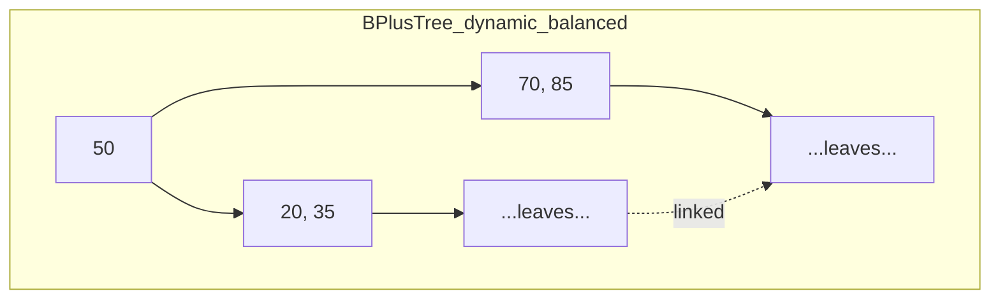

# 📇 Indexing

> [!abstract] TL;DR
> **Indexing** is the family of data structures and strategies that let a database find rows *without scanning the whole table*. The main flavors are **linear/sorted indexing** (an ordered index file over the data — e.g. **ISAM**, a static index plus overflow pages), **tree-based indexing** (the dominant [[B_Plus_Tree]] — logarithmic lookup *and* fast ranges), and **hash indexing** ([[Hash_Table_Fundamentals|hash tables]] — O(1) equality but no ranges). Cross-cutting choices — **clustered vs non-clustered**, **primary vs secondary**, **dense vs sparse**, and **covering** indexes — determine how the index relates to the physical data. Indexes turbo-charge reads but tax writes and storage, so they must be chosen deliberately.

---

## Intuition — Analogy First

Consider finding a topic in a **1,000-page textbook.**

- **No index (full table scan):** read every page front to back until you hit the topic. Guaranteed to work; painfully slow — O(n).
- **The index at the back of the book (a secondary index):** an alphabetical list of terms, each pointing to page numbers. You binary-search the short index, then jump straight to the page. That's a **non-clustered index** — a separate sorted structure pointing *at* the content.
- **The book's own chapter order (a clustered index):** the pages are *physically* arranged by chapter number, so once you find chapter 12 you can read 12, 13, 14 sequentially. That's a **clustered index** — the data itself is stored in index order, which is why range scans are so cheap.

A database index is exactly this "book index" idea, mechanized with [[B_Plus_Tree]]s or hash tables and tuned so each lookup costs a couple of disk reads instead of thousands.

---

## How It Works

### 1. Linear / sorted indexing — ISAM

The oldest approach: keep the data sorted and build a **sorted index file** of (key → block address) entries. **ISAM (Indexed Sequential Access Method)** builds a *static*, multi-level index once, at load time:

- The index is **sparse** — one entry per data *block*, not per record — so it's small enough to keep in memory.
- Lookup = binary search / multi-level descent through the static index → jump to the data block → scan the block.
- **Inserts** are the weakness: the index is static, so new records that don't fit go into **overflow pages** chained off the home block. Over time overflow chains grow, degrading performance until the file is rebuilt/reorganized.



*ISAM: a fixed sparse index over sorted blocks. Inserts (55, 58) that don't fit spill into a chained overflow page — the source of ISAM's gradual degradation.*

### 2. Tree-based indexing — B+ tree (the dominant approach)

A **[[B_Plus_Tree]]** solves ISAM's insert problem by being **dynamic**: it splits and merges nodes to stay balanced, so it never needs a global rebuild, and its **linked leaves** make range scans sequential. This is the default index in virtually every relational database.



*A B+ tree stays balanced under inserts/deletes and links its leaves for range scans — no overflow chains, no periodic rebuild.*

### 3. Hash indexing

A [[Hash_Table_Fundamentals|hash index]] maps `hash(key) → bucket → row pointer`, giving **O(1) average equality lookup**. But hashing destroys ordering, so it supports **no range queries, no `ORDER BY`, no prefix search**. Used for exact-match columns (e.g. PostgreSQL `HASH` indexes, in-memory join hash tables).

### Cross-cutting classifications

| Dimension | Options | Meaning |
|---|---|---|
| **Clustered vs non-clustered** | clustered / non-clustered | *Clustered*: table rows are physically stored in index-key order (one per table; leaves *are* the data). *Non-clustered*: a separate structure whose leaves point at the rows. |
| **Primary vs secondary** | primary / secondary | *Primary*: index on the primary/unique key (often the clustered one). *Secondary*: any additional index on non-key columns. |
| **Dense vs sparse** | dense / sparse | *Dense*: one index entry per **record**. *Sparse*: one entry per **block/page** (smaller; requires sorted data, so only for clustered/primary). |
| **Covering** | yes / no | A *covering* index includes every column a query needs, so the query is answered from the index alone — an **index-only scan**, never touching the table (heap). |

---

## Complexity Analysis

| Index type | Equality lookup | Range query | Insert / delete | Ordered scan |
|---|---|---|---|---|
| Full scan (no index) | O(n) | O(n) | O(1) append | O(n log n) (must sort) |
| **Linear / ISAM** | O(log n) + overflow | O(log n + k) | **O(overflow)** — degrades | O(n) sorted |
| **B+ tree** | O(log n) | **O(log n + k)** | O(log n) | O(n) via leaf links |
| **Hash** | **O(1)** average | **not supported** | O(1) average | not supported |

Where *n* = rows, *k* = rows returned by the range.

> [!tip] The write/read trade-off
> Every index must be updated on every `INSERT`/`UPDATE`/`DELETE` to the indexed column. An index that speeds reads by 100× can slow writes measurably and consume significant storage. This is the central tension of indexing: **more indexes = faster reads, slower writes, more space.**

---

## When Indexes Help vs Hurt

**Indexes HELP when:**
- Columns appear in `WHERE`, `JOIN`, `ORDER BY`, or `GROUP BY`.
- The column is **high-selectivity** (many distinct values — e.g. `email`, `user_id`), so the index eliminates most rows.
- The query is a **range** or needs sorted output (B+ tree) or exact equality on a huge table (hash/B+ tree).
- A **covering** index can answer the query without touching the table.

**Indexes HURT when:**
- The column is **low-selectivity** (e.g. a boolean `is_active`) — the planner often prefers a full scan anyway.
- The table is **write-heavy** — index maintenance cost dominates.
- The table is tiny — a scan is cheaper than an index descent.
- There are **too many** indexes — each `INSERT` updates all of them, and unused indexes waste space and slow writes.

---

## Illustrative Code — sparse (ISAM-style) index lookup

A compact model of a **sparse** index over sorted blocks: binary-search the in-memory index to find the right block, then scan that block. Contrast with a dense index (one entry per record).

```python
import bisect


class SparseBlockIndex:
    """
    ISAM-style sparse index: one index entry per block (first key of block).
    Data is stored as sorted, fixed-size blocks. Overflow simulates inserts.
    """

    def __init__(self, sorted_keys: list[int], block_size: int = 3):
        self.block_size = block_size
        self.blocks = [sorted_keys[i:i + block_size]
                       for i in range(0, len(sorted_keys), block_size)]
        # Sparse index: only the FIRST key of each block (small, fits in RAM)
        self.index = [block[0] for block in self.blocks]
        self.overflow: dict[int, list[int]] = {}   # block_idx -> overflow keys

    def search(self, key: int) -> bool:
        # 1) binary search the sparse index to pick the block
        b = bisect.bisect_right(self.index, key) - 1
        if b < 0:
            return False
        # 2) scan the chosen block (and its overflow chain)
        if key in self.blocks[b]:
            return True
        return key in self.overflow.get(b, [])      # overflow = ISAM's weakness

    def insert(self, key: int) -> None:
        b = max(bisect.bisect_right(self.index, key) - 1, 0)
        if len(self.blocks[b]) < self.block_size:
            self.blocks[b].append(key)
            self.blocks[b].sort()
        else:
            self.overflow.setdefault(b, []).append(key)   # spill (degrades!)


# ── Demo ────────────────────────────────────────────────────────────────────
if __name__ == "__main__":
    idx = SparseBlockIndex([10, 20, 30, 40, 50, 60, 70, 80, 90], block_size=3)
    print("index (block starts):", idx.index)     # [10, 40, 70]
    print("search 50:", idx.search(50))           # True  (binary search -> block)
    print("search 55:", idx.search(55))           # False
    idx.insert(55)                                 # goes to overflow of block 1
    print("search 55 after insert:", idx.search(55))   # True (via overflow chain)
```

---

## Real-World Use

- **Relational databases** — MySQL InnoDB stores every table as a **clustered** [[B_Plus_Tree]] on the primary key; secondary indexes are separate B+ trees whose leaves hold the primary key. PostgreSQL heap tables use **non-clustered** B-tree indexes (plus optional hash, GiST, GIN, BRIN).
- **ISAM heritage** — IBM's original ISAM and VSAM, and the storage engine MySQL was built on before InnoDB (MyISAM), descend from indexed-sequential ideas.
- **Search engines** — inverted indexes (term → posting list) are a specialized indexing form; posting lists often use [[Skip_List|skip lists]] internally.
- **Key-value / NoSQL** — hash indexing underlies many KV stores; LSM-tree engines (RocksDB, Cassandra) combine sorted SSTables with in-memory index/skip-list structures.

---

## Comparison with Alternatives

| Strategy | Structure | Equality | Range / order | Insert cost | When to use |
|---|---|---|---|---|---|
| **Linear / ISAM** | sorted file + static sparse index | good | good (until overflow) | poor (overflow chains) | static, read-mostly, sorted data |
| **Tree-based** | [[B_Plus_Tree]] | O(log n) | **excellent** (linked leaves) | O(log n) | **general default** |
| **Hash** | [[Hash_Table_Fundamentals]] | **O(1)** | none | O(1) | exact-match only |
| **Bitmap** | bit vectors per value | good | via bit ops | poor | low-cardinality analytics |

> **Rule of thumb:** use a **B+ tree** unless you have a specific reason not to (hash for pure equality on a huge table, bitmap for low-cardinality warehouse columns).

---

## Common Pitfalls

1. **Indexing everything.** Each index slows writes and consumes storage. Index the columns queries actually filter/sort on — not every column.
2. **Expecting a hash index to serve ranges.** Hashing has no order; `WHERE age BETWEEN ...`, `ORDER BY`, and `LIKE 'abc%'` need a [[B_Plus_Tree]], not a hash index.
3. **Ignoring selectivity.** An index on a boolean or a heavily skewed column rarely helps — the optimizer may scan anyway.
4. **Misordering a composite index.** `INDEX(a, b)` supports `WHERE a=? AND b=?` and `WHERE a=?`, but *not* a lone `WHERE b=?`. Leftmost-prefix rules matter.
5. **Confusing clustered with non-clustered.** A table can have only **one clustered** index (it defines physical row order); everything else is non-clustered and adds an extra pointer hop to reach the row.
6. **Forgetting ISAM's overflow decay.** Static indexes degrade as overflow chains grow — they need periodic reorganization, which is precisely why dynamic B+ trees replaced them.
7. **Overlooking covering indexes.** If an index already contains every column a hot query needs, an index-only scan avoids touching the table entirely — a big, often-missed win.

---

## Related Concepts

- [[_MOC_Advanced_Data_Structures|↑ Section MOC]]
- [[B_Plus_Tree]] — the dominant tree-based index structure
- [[B_Tree]] — the parent structure of the B+ tree
- [[Hash_Table_Fundamentals]] — the hash-indexing alternative (O(1) equality, no ranges)
- [[Skip_List]] — used inside inverted-index posting lists and LSM memtables
- [[Binary_Search]] — the core operation over a sorted/linear index
- [[Database_Indexes]] — the System Design vault's DBA-oriented treatment of index types and tuning

---

## Review Questions

1. Compare linear (ISAM) indexing with tree-based (B+ tree) indexing: what specific weakness of ISAM does the B+ tree eliminate, and how does the linked-leaf level change the range-query story?
2. A query filters on an exact `user_id`. Would you choose a hash index or a B+ tree index, and what changes your answer if the query also needs results `ORDER BY created_at`?
3. Explain clustered vs non-clustered and dense vs sparse indexes. Why can a *sparse* index only be built over a clustered/primary (sorted) structure, and why can a table have only one clustered index?

---

## Sources

- Ramakrishnan & Gehrke — *Database Management Systems*, Chapters 8–10 (file organizations & indexing)
- Silberschatz, Korth & Sudarshan — *Database System Concepts*, Chapter 14 (Indexing)
- roadmap.sh — *DSA: Indexing* (Linear / Tree-based indexing)
- MySQL & PostgreSQL reference manuals — index types and the query optimizer

#DSA #DataStructures #Indexing #Databases #BPlusTree #Intermediate
