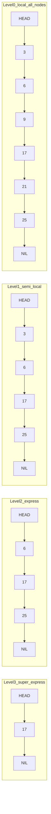

# 🎢 Skip List

> [!abstract] TL;DR
> A **skip list** is a **probabilistic** ordered data structure — a stack of sorted linked lists where each higher level is an "express lane" that skips over many nodes below it. Each element is promoted to the next level up with probability ~½ (a coin flip), so on average half the nodes appear at level 1, a quarter at level 2, and so on. This randomized layering gives **expected O(log n)** search, insert, and delete — the same as a balanced [[Binary_Search_Tree|BST]] — but with **far simpler code** (no rotations, no rebalancing cases). Skip lists back **Redis sorted sets (ZSET)**, **LevelDB/RocksDB memtables**, and many **lock-free concurrent** maps.

---

## Intuition — Analogy First

Picture an **express subway system** over a local line.

- The **local line (level 0)** stops at *every* station — it always gets you there, but slowly.
- An **express line (level 1)** stops at only every *other* station.
- A **super-express (level 2)** stops at only a few major hubs.

To travel far, you ride the highest express as far as it goes without overshooting your stop, then drop down to a slower line for the finer approach, and keep dropping until you're on the local line at your exact station. You **skip** huge stretches of local stops — that's the "skip" in skip list.

The clever part: instead of *engineering* which stations get express service (which would require rebalancing as stations are added/removed), a skip list decides it by **flipping a coin** for each new element. On average this produces the same nice logarithmic spacing — no maintenance required.

---

## How It Works

- Each node carries a **tower of forward pointers**, one per level it participates in.
- **Level 0** is a complete sorted linked list of every element.
- A new node's height is chosen randomly: keep flipping a fair coin; each head promotes it one level higher. So P(height ≥ k) = (½)ᵏ. Expected height is 2, expected total pointers is 2n, and the top level is ~log₂ n.
- **Search** starts at the top-left sentinel head and moves **right while the next key is smaller than the target**; when it would overshoot, it **drops down one level** and continues. This zig-zags down to level 0 in expected O(log n) steps.



*Every element appears at level 0; each is promoted upward by coin flips. Searching for `21`: at level 3 the next key `17` < `21`, but past `17` is `NIL`, so drop; at level 2 pass `17`, next is `25` > `21`, drop; at level 1 pass `17`, next `25` > `21`, drop; at level 0 step from `17` to `21`. Found in a handful of hops instead of scanning all 6 nodes.*

### Insert

1. Search for the position, **recording the last node visited on each level** in an `update[]` array (these are the nodes whose forward pointers must change).
2. Flip coins to pick the new node's random height.
3. Splice the new node into the `update[]` predecessors at every level up to its height.

### Delete

Same search-with-`update[]`, then unlink the node from each level it appears on, and lower the list's top level if it emptied out. No rotations, no rebalancing — just pointer surgery.

---

## Complexity Analysis

| Operation | Expected | Worst case | Space |
|---|---|---|---|
| Search | **O(log n)** | O(n) (unlucky coin flips) | — |
| Insert | **O(log n)** | O(n) | O(1) new pointers |
| Delete | **O(log n)** | O(n) | — |
| Successor / range start | **O(log n)** then O(k) scan | O(n) | — |
| Total space | — | — | **O(n)** expected (2n pointers avg) |

> [!note] "Expected", not "guaranteed"
> Skip list bounds are **probabilistic** — a pathological run of coin flips *could* make it degrade to a linked list. But the probability of exceeding c·log n levels shrinks exponentially, so in practice it behaves like a balanced tree. Contrast with [[AVL_Tree]]/[[Red_Black_Tree]], which *guarantee* O(log n) deterministically.

---

## Python Implementation

A full skip list with **randomized level**, search, insert, and delete.

```python
import random


class SkipNode:
    __slots__ = ("val", "forward")

    def __init__(self, val, level: int):
        self.val = val
        self.forward: list[SkipNode | None] = [None] * (level + 1)


class SkipList:
    MAX_LEVEL = 16          # supports ~2^16 elements comfortably
    P = 0.5                 # promotion probability (fair coin)

    def __init__(self):
        self.level = 0                                   # current highest level
        self.head = SkipNode(None, self.MAX_LEVEL)       # left sentinel (-inf)

    def _random_level(self) -> int:
        """Coin-flip tower height: P(level >= k) = P^k."""
        lvl = 0
        while random.random() < self.P and lvl < self.MAX_LEVEL:
            lvl += 1
        return lvl

    # ── Search ─────────────────────────────────────────────────────────────
    def search(self, target) -> bool:
        curr = self.head
        for i in range(self.level, -1, -1):          # top level down to 0
            while curr.forward[i] and curr.forward[i].val < target:
                curr = curr.forward[i]               # move right (express)
        curr = curr.forward[0]                       # step onto candidate
        return curr is not None and curr.val == target

    # ── Insert ─────────────────────────────────────────────────────────────
    def insert(self, val) -> None:
        update = [None] * (self.MAX_LEVEL + 1)       # predecessors per level
        curr = self.head
        for i in range(self.level, -1, -1):
            while curr.forward[i] and curr.forward[i].val < val:
                curr = curr.forward[i]
            update[i] = curr
        curr = curr.forward[0]
        if curr and curr.val == val:
            return                                   # no duplicates

        new_level = self._random_level()
        if new_level > self.level:                   # grow: sentinel is predecessor
            for i in range(self.level + 1, new_level + 1):
                update[i] = self.head
            self.level = new_level

        node = SkipNode(val, new_level)
        for i in range(new_level + 1):               # splice into each level
            node.forward[i] = update[i].forward[i]
            update[i].forward[i] = node

    # ── Delete ─────────────────────────────────────────────────────────────
    def delete(self, val) -> None:
        update = [None] * (self.MAX_LEVEL + 1)
        curr = self.head
        for i in range(self.level, -1, -1):
            while curr.forward[i] and curr.forward[i].val < val:
                curr = curr.forward[i]
            update[i] = curr
        curr = curr.forward[0]
        if not curr or curr.val != val:
            return                                   # not present

        for i in range(self.level + 1):
            if update[i].forward[i] is not curr:
                break                                # node absent above here
            update[i].forward[i] = curr.forward[i]
        while self.level > 0 and self.head.forward[self.level] is None:
            self.level -= 1                          # shrink emptied top levels

    def to_list(self) -> list:
        out, curr = [], self.head.forward[0]
        while curr:
            out.append(curr.val)
            curr = curr.forward[0]
        return out


# ── Demo ────────────────────────────────────────────────────────────────────
if __name__ == "__main__":
    random.seed(42)
    sl = SkipList()
    for v in [3, 6, 9, 17, 21, 25, 26, 12]:
        sl.insert(v)

    print("Sorted:      ", sl.to_list())    # [3, 6, 9, 12, 17, 21, 25, 26]
    print("search(17):  ", sl.search(17))   # True
    print("search(18):  ", sl.search(18))   # False
    sl.delete(17)
    print("after del 17:", sl.to_list())    # [3, 6, 9, 12, 21, 25, 26]
    print("top level:   ", sl.level)        # ~log2(n) after coin flips
```

---

## Real-World Use

- **Redis** — the `ZSET` (sorted set) is implemented as a **skip list + [[Hash_Table_Fundamentals|hash map]]**: the skip list keeps members ordered by score for `ZRANGE`/`ZRANGEBYSCORE`, while the hash gives O(1) score lookup. Redis chose skip lists over balanced trees largely because they are simpler and range-scan friendly.
- **LevelDB / RocksDB** — the in-memory **memtable** (the write buffer before data flushes to SSTables) is a skip list, chosen for fast concurrent inserts.
- **Apache Lucene / HBase** — skip lists accelerate posting-list and cell traversal.
- **Concurrent / lock-free maps** — Java's `ConcurrentSkipListMap` / `ConcurrentSkipListSet` are production concurrent ordered maps; skip lists are far easier to make lock-free than balanced trees because a change touches only local pointers, never a whole rotated subtree.

---

## Comparison with Alternatives

| Feature | Skip List | [[AVL_Tree]] | [[Red_Black_Tree]] | Sorted Array |
|---|---|---|---|---|
| Search / insert / delete | **O(log n) expected** | O(log n) guaranteed | O(log n) guaranteed | O(n) insert |
| Balance mechanism | randomized (coin flips) | rotations (strict) | rotations (relaxed) | shift on insert |
| Implementation effort | **low** (no rotations) | high | very high | trivial |
| Concurrency | **excellent** (local pointer edits) | hard | hard | poor |
| Range scan | **easy** (walk level 0) | in-order traversal | in-order traversal | easy |
| Worst case | O(n) (rare) | O(log n) | O(log n) | O(n) |
| Extra space | ~2n pointers | O(n) | O(n) + 1 color bit | O(1) |

> Skip lists trade a *deterministic* guarantee for **simplicity and concurrency**. When you need a hard worst-case bound, reach for [[AVL_Tree]] or [[Red_Black_Tree]]; when you need an ordered structure that's easy to write and easy to make concurrent, reach for a skip list.

---

## Common Pitfalls

1. **Forgetting the `update[]` array.** You must remember the last node visited on *every* level during the search; those are the exact predecessors whose forward pointers change on insert/delete. Recomputing them is a common source of bugs.
2. **Not raising `self.level` when a tall node is inserted.** If the new random level exceeds the list's current level, the extra `update[]` slots must point at the head sentinel before splicing.
3. **Not lowering the level after deletes.** Empty top levels waste search time; shrink `self.level` while the top level is empty.
4. **Using a biased or reseeded RNG.** The O(log n) expectation relies on ~½ promotion probability with independent flips. A skewed coin or repeatedly reseeding per insert can distort the level distribution.
5. **Expecting a worst-case guarantee.** Bounds are *expected*, not guaranteed — adversarial or extremely unlucky inputs can degrade performance. Do not use a skip list where a hard real-time bound is required.
6. **Off-by-one in the tower size.** A node built for level `L` needs `L+1` forward pointers (levels `0..L`). Sizing it `L` truncates the top pointer.

---

## Related Concepts

- [[_MOC_Advanced_Data_Structures|↑ Section MOC]]
- [[AVL_Tree]] — deterministic balanced-BST alternative with guaranteed O(log n)
- [[Red_Black_Tree]] — relaxed balanced BST; harder to make concurrent than a skip list
- [[Singly_Linked_List]] — a skip list is a stack of linked lists with express lanes
- [[Binary_Search]] — the "skip ahead, then refine" idea generalized to a linked structure
- [[Amortized_Analysis]] — the framework behind "expected" probabilistic bounds

---

## Review Questions

1. A skip list achieves O(log n) search without any rotations or explicit balancing. Explain *where the balance comes from*, and why the expected number of levels is about log₂ n.
2. Redis implements sorted sets as a skip list paired with a hash table rather than as a balanced tree. Give two concrete engineering reasons this is a good choice.
3. What exactly does the `update[]` array store during an insert, and why is it required? What goes wrong if you skip recording it at the higher levels?

---

## Sources

- Pugh, W. (1990) — "Skip Lists: A Probabilistic Alternative to Balanced Trees", *CACM*
- CLRS-adjacent lecture notes (MIT 6.046) — Randomized data structures
- Redis source — `t_zset.c` / `server.h` (`zskiplist`)
- Java API docs — `java.util.concurrent.ConcurrentSkipListMap`

#DSA #DataStructures #SkipList #Probabilistic #Redis #Intermediate
