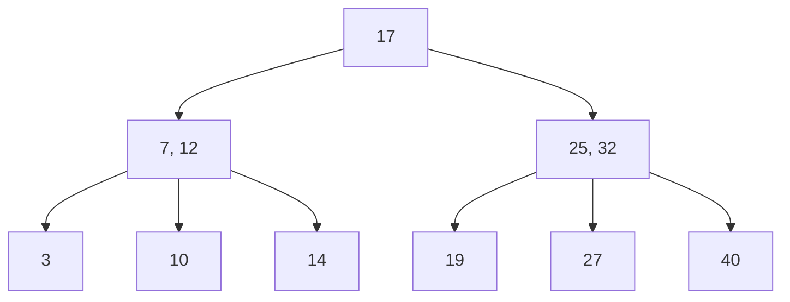
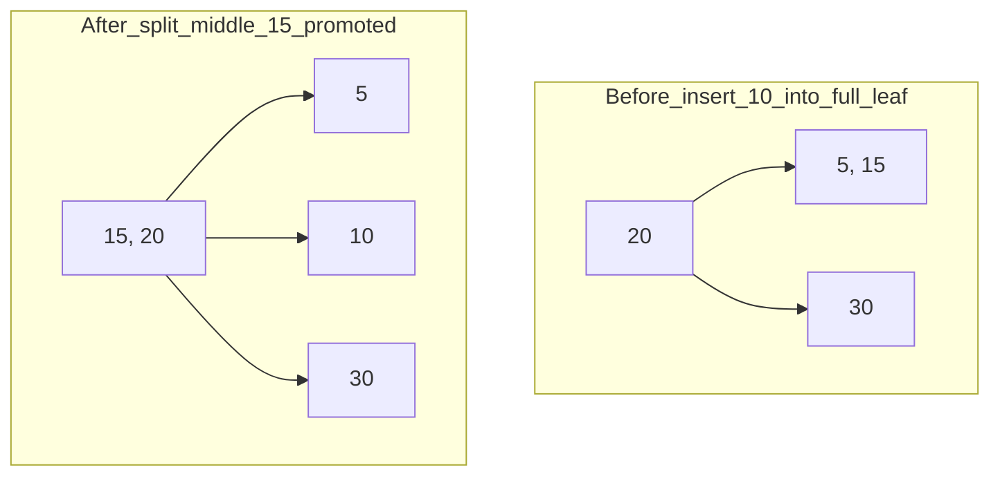

# 🌿 2-3 Tree

> [!abstract] TL;DR
> A **2-3 tree** is a self-balancing search tree in which every internal node is either a **2-node** (1 key, 2 children) or a **3-node** (2 keys, 3 children). Crucially, **all leaves are always at the same level** — perfect height balance is maintained at *every* moment, without rotations. Balance is preserved by **splitting overflowing nodes and pushing the middle key upward**. All operations are O(log n). The 2-3 tree is both a **[[B_Tree]] of order 3** and the conceptual blueprint for the [[Red_Black_Tree]]: a 2-3-4 tree is *isomorphic* to a red-black tree, which is why understanding 2-3 trees makes red-black trees click.

---

## Intuition — Analogy First

Think of **parking cars in numbered bays, where each signpost can label at most two bays.**

- A **2-node** is a signpost with **one number** and **two arrows**: "smaller cars that way, bigger cars this way."
- A **3-node** is a signpost with **two numbers** and **three arrows**: "small / middle / large."

Now the rule that keeps everything tidy: **a signpost may never hold three numbers.** The instant a third number would land on a signpost, the signpost **splits in half** and shoves its **middle number up to the signpost above it** — which may itself split, and so on. If the split bubbles all the way to the top, a brand-new top signpost is born, and *every branch of the whole lot grows one level taller at once.*

Because growth only ever happens at the root and happens to all paths simultaneously, **the tree can never become lopsided.** No car ever has a longer walk than any other — that's perfect balance for free.

---

## How It Works

**Node types:**

| Node | Keys | Children | Ordering rule |
|---|---|---|---|
| **2-node** | 1 (say `a`) | 2 (L, R) | L < a < R |
| **3-node** | 2 (say `a`, `b`, a<b) | 3 (L, M, R) | L < a < M < b < R |

**Invariants:** every node is a 2-node or a 3-node, and **all leaves are at the same depth**. There is no such thing as a "4-node" that persists — the instant one forms during an insert, it is split.



*The root `17` is a **2-node** (1 key → 2 children). Nodes `[7,12]` and `[25,32]` are **3-nodes** (2 keys → 3 children). Every leaf sits at the same depth.*

### Search

Just like a BST, but each node may hold two keys: compare against the node's key(s) and follow the correct one of its 2 or 3 child pointers. O(log n).

### Insert — split upward (the whole mechanism)

1. Search down to the correct **leaf**.
2. **Add the key to that leaf.**
   - If the leaf was a **2-node**, it simply becomes a **3-node** — done, no structural change.
   - If the leaf was a **3-node**, adding a third key temporarily makes a **4-node** (3 keys). **Split it:** the **middle key is promoted** to the parent, and the node divides into two 2-nodes.
3. Promoting into the parent may make *it* a temporary 4-node — split again, recursively. If the root splits, a new root is created and **the tree's height grows by one** (for all paths simultaneously — this is why balance is preserved).



*Inserting `10` into the full 3-node leaf `[5,15]` overflows it to `{5,10,15}`. The middle key `15` is promoted into the parent `20` (making it the 3-node `[15,20]`), and the leaf splits into `[5]` and `[10]` — both 2-nodes. All leaves remain level.*

### Delete

Symmetric: remove from a leaf (swapping with an in-order predecessor/successor first if deleting from an internal node). If a node underflows to zero keys, **borrow** a key from a sibling (rotating through the parent) or **merge** with a sibling and pull a key down — mirroring the split process in reverse.

---

## The 2-3-4 ↔ Red-Black Isomorphism

A **2-3-4 tree** (the order-4 cousin that also allows 4-nodes) maps *exactly* onto a [[Red_Black_Tree]]:

| 2-3-4 node | Red-black encoding |
|---|---|
| **2-node** (1 key) | one **black** node |
| **3-node** (2 keys) | a black node with **one red child** |
| **4-node** (3 keys) | a black node with **two red children** |

The "all leaves at equal depth" property of the B-tree family becomes the red-black **"equal black-height on every path"** property, and a 2-3-4 **split** corresponds to a red-black **recolor/rotation**. So a red-black tree is really a 2-3-4 tree squeezed into a binary shape — studying the 2-3 tree first is the standard way to demystify red-black trees.

---

## Complexity Analysis

| Operation | Time | Notes |
|---|---|---|
| Search | O(log n) | height is between log₃ n and log₂ n |
| Insert | O(log n) | split cascades at most up to the root |
| Delete | O(log n) | borrow/merge cascades at most up to the root |
| Min / Max | O(log n) | follow leftmost / rightmost pointers |
| In-order traversal | O(n) | yields sorted order |
| Height | ⌈log₃(n+1)⌉ ≤ h ≤ ⌈log₂(n+1)⌉ | always perfectly balanced |
| Space | O(n) | — |

> [!tip] Why no rotations?
> Unlike [[AVL_Tree]]/[[Red_Black_Tree]], a 2-3 tree keeps balance by **changing node arity** (2-node ↔ 3-node) and splitting, not by rotating subtrees. Balance is structural and automatic because height only ever changes at the root.

---

## Pseudocode

A fully coded 2-3 tree with all delete cases is lengthy; the *insert-with-split* logic is the conceptual core and is shown clearly below.

```text
SEARCH(node, key):
    if node is null: return NOT_FOUND
    if key in node.keys: return FOUND
    child = child interval of node that contains key   # 2 or 3 way branch
    return SEARCH(child, key)

INSERT(root, key):
    if root is null:
        return new 2-node(key)
    (promoted_key, left, right) = INSERT_REC(root, key)
    if promoted_key is not null:            # root split -> grow height
        return new 2-node(promoted_key) with children (left, right)
    return root

INSERT_REC(node, key):
    if node is a leaf:
        add key to node (sorted)
    else:
        child = correct child of node for key
        (promoted, l, r) = INSERT_REC(child, key)
        if promoted is null: return (null, _, _)
        insert promoted into node.keys (sorted); replace child with (l, r)

    if node now has 3 keys {a, b, c}:       # temporary 4-node -> SPLIT
        left  = 2-node(a)                   # takes node's two left children
        right = 2-node(c)                   # takes node's two right children
        return (b, left, right)             # promote MIDDLE key b upward
    return (null, _, _)                     # no split needed
```

Key invariant every call preserves: **a node never permanently holds 3 keys**, and **all leaves stay at the same depth** because the only height change happens when the recursion returns a promoted key all the way to the root.

---

## Real-World Use

- **Teaching & theory** — the 2-3 tree is the standard classroom bridge to balanced trees; Sedgewick & Wayne's *Algorithms* introduces red-black trees *via* 2-3 trees.
- **Foundation of red-black trees** — every [[Red_Black_Tree]] in Java's `TreeMap`, C++ `std::map`, and the Linux kernel is a 2-3-4 tree in binary clothing.
- **B-tree family** — a 2-3 tree is literally a [[B_Tree]] of order 3; the split-and-promote mechanism scales directly to the wide B-trees used in databases and filesystems.
- **Functional / persistent structures** — because updates are localized to a root-to-leaf path with no rotations, 2-3 trees (and 2-3 finger trees) are popular in purely functional persistent maps (e.g. Haskell's `Data.Sequence` finger trees).

---

## Comparison with Alternatives

| Structure | Keys / node | Balance method | Relationship |
|---|---|---|---|
| **2-3 tree** | 1–2 | split / merge (no rotations) | = [[B_Tree]] of order 3 |
| 2-3-4 tree | 1–3 | split / merge | isomorphic to [[Red_Black_Tree]] |
| [[Red_Black_Tree]] | 1 | recolor + rotate | binary encoding of a 2-3-4 tree |
| [[AVL_Tree]] | 1 | rotations (strict) | stricter balance, more rotations |
| [[B_Tree]] | up to m−1 | split / merge | 2-3 tree generalized to order m |
| [[Binary_Search_Tree]] | 1 | none | unbalanced ancestor |

> Choose a 2-3 tree conceptually to *understand* balance; in production you'll use its descendants — [[Red_Black_Tree]] (in memory) or [[B_Tree]]/[[B_Plus_Tree]] (on disk).

---

## Common Pitfalls

1. **Trying to insert by rotation.** 2-3 trees have *no rotations* — balance comes purely from splitting and promoting the middle key. Reaching for AVL-style rotations is a category error.
2. **Letting a 4-node persist.** A 4-node (3 keys) is only ever *transient*; it must be split immediately. Storing it permanently breaks the structure.
3. **Promoting the wrong key on split.** Always promote the **middle** of the three keys; the outer two become the roots of the two new 2-nodes.
4. **Forgetting that height changes only at the root.** New levels are never added at a leaf — that is exactly what keeps all leaves at equal depth. Adding a level anywhere else corrupts the balance invariant.
5. **Mishandling delete underflow.** After removing a key, a node with zero keys must borrow from a sibling or merge — mirroring split. Skipping this creates an invalid empty node.
6. **Assuming a 2-3 tree and red-black tree differ in behavior.** They are two encodings of the same idea; the operations correspond one-to-one (split ↔ recolor/rotate).

---

## Related Concepts

- [[_MOC_Advanced_Data_Structures|↑ Section MOC]]
- [[Red_Black_Tree]] — a 2-3-4 tree encoded as a binary tree (isomorphic)
- [[B_Tree]] — the general order-m structure; a 2-3 tree is order 3
- [[AVL_Tree]] — rotation-based balanced BST, a different balancing philosophy
- [[Binary_Search_Tree]] — the unbalanced base whose worst case 2-3 trees fix
- [[B_Plus_Tree]] — the database-oriented member of the same B-tree family

---

## Review Questions

1. Describe exactly what happens when you insert a key into a **3-node leaf**. Which key is promoted, what two nodes result, and why does this operation keep all leaves at the same level?
2. State the mapping between 2-3-4 tree nodes and red-black tree nodes, and use it to explain why a red-black tree's "equal black-height" rule corresponds to the 2-3 tree's "all leaves at equal depth" rule.
3. A 2-3 tree needs no rotations, yet an [[AVL_Tree]] does. What structural freedom does the 2-3 tree have that a binary AVL tree lacks, and how does that freedom substitute for rotations?

---

## Sources

- Aho, Hopcroft & Ullman (1974) — *The Design and Analysis of Computer Algorithms* (introduces 2-3 trees)
- Sedgewick & Wayne — *Algorithms* (4th ed.), Section 3.3 (2-3 trees → red-black trees)
- CLRS — *Introduction to Algorithms*, Chapter 18 (B-trees, which generalize 2-3 trees)
- [Visualgo — B-Tree (order 3 = 2-3 tree)](https://visualgo.net/en/bst)

#DSA #DataStructures #TwoThreeTree #SelfBalancing #Trees #Intermediate
