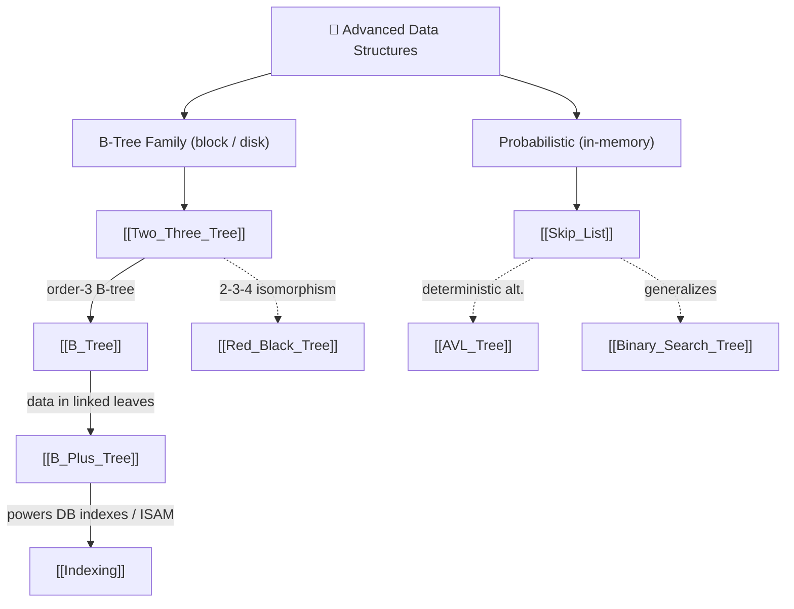

# 🌲 Advanced Data Structures — Map of Content

> [!abstract] What This Section Covers
> This section covers the balanced, block-oriented, and probabilistic structures that power real databases and filesystems — the layer beyond the in-memory balanced BSTs of the Trees section. It builds the **B-tree family** from its smallest member (the 2-3 tree, which is also the conceptual blueprint for red-black trees) up through the disk-optimized B-tree and its database-favored B+ tree variant, then shows how B+ trees underpin database **indexing** (versus the older ISAM and hash indexing). Alongside these deterministic structures sits the **skip list** — a randomized, rotation-free alternative that trades a hard worst-case guarantee for simpler code and easy concurrency (it backs Redis sorted sets and RocksDB memtables).

## Concept Map

*Dashed edges are cross-links into [[_MOC_Trees]]: the 2-3-4 tree is isomorphic to a [[Red_Black_Tree]], and a skip list is the probabilistic counterpart to the deterministically balanced [[AVL_Tree]] / [[Binary_Search_Tree]].*

## Learning Path

1. [[Two_Three_Tree]] — 2-node/3-node balancing by split-and-promote (no rotations); the bridge to red-black trees and the smallest B-tree
2. [[B_Tree]] — m-way search tree engineered for block storage; wide, shallow, all leaves at equal depth; split-on-overflow
3. [[B_Plus_Tree]] — data pushed to linked leaves for fast range scans; higher fan-out; the default relational-DB index
4. [[Indexing]] — how B+ trees fit among linear/ISAM, hash, and bitmap indexes; clustered vs non-clustered, dense vs sparse, covering indexes
5. [[Skip_List]] — probabilistic layered linked lists; O(log n) expected without rotations; Redis ZSET, RocksDB memtables, concurrent maps

## All Notes at a Glance

| Note | Summary | Difficulty |
|------|---------|------------|
| [[Two_Three_Tree]] | 2-node/3-node self-balancing tree; split-and-promote; RB-tree blueprint | Intermediate |
| [[B_Tree]] | m-way, block-aligned search tree for on-disk indexes and filesystems | Advanced |
| [[B_Plus_Tree]] | B-tree variant: data only in linked leaves; the DB-index workhorse | Advanced |
| [[Indexing]] | Database indexing families: ISAM, B+ tree, hash; clustered/sparse/covering | Intermediate |
| [[Skip_List]] | Probabilistic ordered structure; O(log n) expected; rotation-free, concurrency-friendly | Intermediate |

## Key Questions This Section Answers

- Why do databases and filesystems choose B-trees over balanced binary trees for on-disk indexes?
- What two structural changes turn a B-tree into a B+ tree, and how does each speed up range queries?
- How is a 2-3-4 tree isomorphic to a red-black tree, and why does studying 2-3 trees demystify RB trees?
- How does a skip list achieve O(log n) search using coin flips instead of rotations?
- What is the difference between clustered/non-clustered and dense/sparse indexes, and why does ISAM degrade over time?
- When would you pick a probabilistic skip list over a structure with a hard worst-case guarantee?

## Related Sections

- [[_MOC_DSA_Master|↑ DSA Master MOC]]
- [[_MOC_Trees]] — the in-memory balanced BSTs (AVL, red-black, BST) these structures extend and generalize
- [[_MOC_Hash_Tables]] — hash indexing, the O(1)-equality alternative that cannot serve ranges

#MOC #DSA #data-structures #advanced
