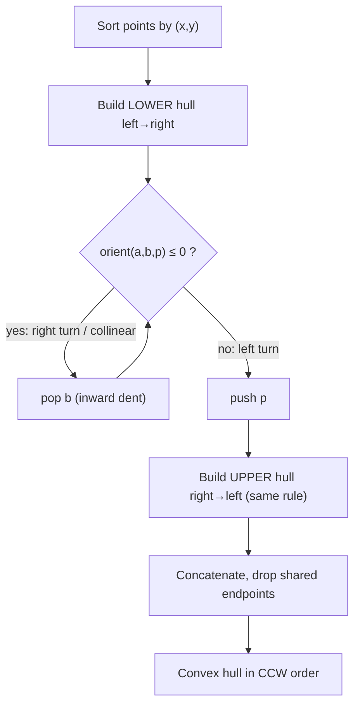
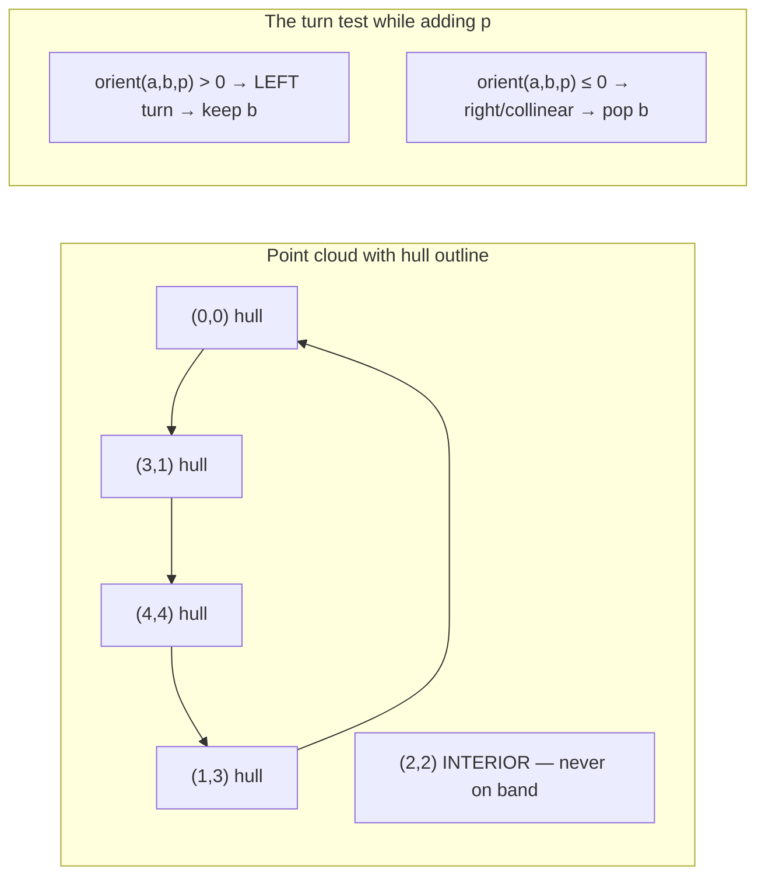

# 🧊 Convex Hull — Andrew's Monotone Chain & Graham Scan

> [!abstract] TL;DR
> The **convex hull** is the smallest convex polygon enclosing a set of points — imagine a rubber band snapped around a bed of nails. **Andrew's monotone chain** computes it in **O(n log n)**: sort points by `(x, y)`, then sweep left→right building the **lower hull** and right→left building the **upper hull**, using the [[Geometry_Fundamentals|orientation test]] to pop any point that would create a non-left (clockwise) turn. **Graham scan** achieves the same bound by sorting points by polar angle around the bottom-most point. Hulls unlock farthest-pair (rotating calipers), collision detection, and shape analysis.

## Intuition — Analogy First

Hammer a nail into a board at each point. Now stretch a rubber band wide enough to surround every nail and let go. The band snaps tight and clings to the *outermost* nails, ignoring everything interior. The polygon traced by that taut band is the convex hull. Every interior point is "shadowed" — no rubber band tension ever reaches it.

The monotone-chain algorithm builds that band in two passes. Think of walking along the bottom edge of the point cloud from the leftmost to the rightmost nail, always keeping the band taut so it only ever curves **one way** (never doubling back inward). Then walk back along the top edge the same way. Glue the two chains together and you have the full loop.

## How It Works + Diagram

**Andrew's Monotone Chain (O(n log n)):**

1. **Sort** all points lexicographically by `(x, y)`. Sorting dominates the cost — the hull construction itself is linear.
2. **Build the lower hull**: iterate left→right. Maintain a stack. Before pushing point `p`, while the last two stack points `a, b` and `p` make a **clockwise or collinear** turn (`orient(a, b, p) <= 0`), pop `b`. This keeps only left turns, tracing the taut bottom boundary.
3. **Build the upper hull**: iterate right→left with the same popping rule. This traces the taut top boundary.
4. **Concatenate**: drop the last point of each chain (it is the first of the other) to avoid duplicating the two extreme endpoints. The result is the hull in counter-clockwise order.

The popping rule is the whole trick: `orient(a, b, p) <= 0` means point `b` is a "reflex" / inward dent, so it cannot belong to a convex boundary and gets discarded.





**Graham Scan (also O(n log n)):** pick the bottom-most (then left-most) point `P0` as a pivot. Sort the rest by **polar angle** around `P0`. Sweep once, popping any point that makes a non-left turn — same orientation test, different sort key. Monotone chain is usually preferred in practice because sorting by coordinate is simpler and numerically safer than sorting by angle.

**Gift wrapping (Jarvis march):** repeatedly pick the most clockwise next point; `O(nh)` where `h` = hull size. Great when `h` is tiny, but worst case `O(n²)`.

## The Math

A set `S` is **convex** if for any two points `p, q ∈ S`, the whole segment `pq ⊆ S`. The convex hull is the intersection of all convex sets containing the points — equivalently the set of all **convex combinations**:
$$\text{conv}(P) = \left\{ \sum_{i} \lambda_i p_i \;\middle|\; \lambda_i \ge 0,\; \sum_i \lambda_i = 1 \right\}$$

The boundary is characterised by orientation: the hull vertices in CCW order satisfy, for every consecutive triple,
$$\text{orient}(v_{i-1}, v_i, v_{i+1}) > 0 \quad\text{(strict left turns only)}$$

**Complexity lower bound.** Convex hull is at least as hard as sorting: given numbers `x_1, ..., x_n`, map each to the point `(x_i, x_i^2)` on a parabola. All points are hull vertices, and reading the hull off in order yields the sorted `x_i`. Since comparison sorting is `Ω(n log n)`, so is convex hull — making monotone chain's `O(n log n)` **optimal**.

**Hull size** `h` ranges from 3 (a triangle) up to `n` (all points on a circle). Output-sensitive algorithms (Chan's algorithm) reach `O(n log h)`.

## Python Implementation

```python
# Reuses the exact-integer primitives from [[Geometry_Fundamentals]].
Point = tuple[int, int]

def cross(o: Point, a: Point, b: Point) -> int:
    """Cross product of (a - o) and (b - o).
       > 0 : counter-clockwise (left turn)
       = 0 : collinear
       < 0 : clockwise (right turn)
    Same orientation primitive as Geometry_Fundamentals.orient."""
    return (a[0] - o[0]) * (b[1] - o[1]) - (a[1] - o[1]) * (b[0] - o[0])

def convex_hull(points: list[Point]) -> list[Point]:
    """
    Andrew's monotone chain. Returns hull vertices in CCW order,
    each vertex listed once. Time: O(n log n). Space: O(n).
    Collinear points on an edge are EXCLUDED (strict '<= 0' pop).
    Use '< 0' if you want to keep collinear boundary points.
    """
    pts = sorted(set(points))          # dedupe + sort by (x, y)
    if len(pts) <= 2:
        return pts                     # 0, 1, or 2 points: hull is themselves

    # --- lower hull: left to right ---
    lower: list[Point] = []
    for p in pts:
        while len(lower) >= 2 and cross(lower[-2], lower[-1], p) <= 0:
            lower.pop()                # pop right turns / collinear
        lower.append(p)

    # --- upper hull: right to left ---
    upper: list[Point] = []
    for p in reversed(pts):
        while len(upper) >= 2 and cross(upper[-2], upper[-1], p) <= 0:
            upper.pop()
        upper.append(p)

    # drop each chain's last point (it is the other chain's first point)
    return lower[:-1] + upper[:-1]

def hull_area2(hull: list[Point]) -> int:
    """Twice the polygon area of the hull (shoelace) — stays integer."""
    n, s = len(hull), 0
    for i in range(n):
        x1, y1 = hull[i]
        x2, y2 = hull[(i + 1) % n]
        s += x1 * y2 - x2 * y1
    return abs(s)


if __name__ == "__main__":
    pts = [(0, 0), (1, 1), (2, 2), (2, 0), (2, 4), (3, 3), (0, 3), (1, 2)]
    h = convex_hull(pts)
    print("Hull (CCW):", h)
    print("2 x area:", hull_area2(h))
```

## Dry Run / Trace

Points: `(0,0), (1,1), (2,2), (2,0), (2,4), (3,3), (0,3), (1,2)`.

**Sorted:** `(0,0), (0,3), (1,1), (1,2), (2,0), (2,2), (2,4), (3,3)`.

**Lower hull** (left→right, pop when `cross <= 0`):
- Push `(0,0)`, `(0,3)`. Add `(1,1)`: `cross((0,0),(0,3),(1,1)) = (0)(1) − (3)(1) = −3 ≤ 0` → pop `(0,3)`. Stack `[(0,0),(1,1)]`.
- Add `(1,2)`: `cross((0,0),(1,1),(1,2)) = (1)(2)−(1)(1)=1 > 0` → keep. Add `(2,0)`: `cross((1,1),(1,2),(2,0))` and `cross((0,0),(1,1),(2,0))=(1)(0)−(1)(2)=−2≤0` → pops until `[(0,0),(2,0)]`.
- Continue with `(2,2),(2,4),(3,3)` applying the same rule → lower chain ends `[(0,0),(2,0),(3,3),(2,4)]` (approx; exact stack after full sweep).

**Upper hull** (right→left) mirrors the process along the top: `[(2,4),(0,3),(0,0)]`-style chain.

**Concatenate** (drop shared endpoints) → hull `[(0,0), (2,0), (3,3), (2,4), (0,3)]` in CCW order. Interior points `(1,1),(1,2),(2,2)` never survive a pop test — the rubber band skips them. ✓

## Patterns & LeetCode Applications

| Application | How the hull helps |
|-------------|--------------------|
| **Erect the Fence** (LC 587) | The fence = convex hull; keep collinear boundary points (`< 0` pop rule) |
| **Farthest pair of points** | The diameter is between two hull vertices → **rotating calipers** on the hull in O(n) after hulling |
| **Collision detection** | Two convex shapes overlap iff no separating axis; hull + [[Line_and_Polygon_Algorithms|SAT]] |
| **Smallest enclosing rectangle** | Minimum-area bounding box has an edge flush with a hull edge (rotating calipers) |
| **Shape / outlier analysis** | Hull area & perimeter summarise a scatter; peeling hulls layers points |
| **Largest triangle from points** | Optimal triangle uses only hull vertices |

**LeetCode 587 — Erect the Fence:** return every tree lying on the perimeter of the convex hull, *including* points collinear on an edge. Change the pop condition from `<= 0` to `< 0` so collinear boundary points are retained, and dedupe the final list.

**Rotating calipers** (farthest pair): after building the hull, walk two antipodal pointers around it; the farthest pair distance is found in `O(h)`, giving overall `O(n log n)`.

## Common Pitfalls

1. **Floating point!** Keep coordinates and the `cross` result as integers. A hull built with float comparisons can flicker on nearly-collinear points and produce a non-convex loop.
2. **Collinear policy must be deliberate.** `<= 0` drops points on a hull edge (minimal vertex set); `< 0` keeps them (needed for LC 587). Mixing the two silently changes the answer.
3. **Duplicate points.** Dedupe first (`set(points)`); duplicates can cause a zero-length edge and a degenerate `cross`.
4. **Fewer than 3 points.** A hull of 0/1/2 points is just those points — handle before the main loops or you index an empty stack.
5. **Dropping the shared endpoints.** Forgetting `lower[:-1] + upper[:-1]` duplicates the two extreme points, corrupting downstream area/perimeter computations.
6. **All points collinear.** With the `<= 0` rule the hull collapses to the two endpoints — make sure callers tolerate a "degenerate" 2-vertex hull.
7. **Winding direction.** Monotone chain here returns **CCW**; algorithms like shoelace assume a consistent winding — verify the sign if you mix libraries.

## Related Concepts

- [[_MOC_Computational_Geometry|↑ Section MOC]]
- [[Geometry_Fundamentals]] — the `orient`/`cross` turn test is the engine of the pop rule
- [[Line_and_Polygon_Algorithms]] — shoelace area & point-in-polygon operate on the hull output
- [[Sorting_Overview]] — the `O(n log n)` bound comes entirely from the initial sort
- [[Merge_Sort]] — a stable `O(n log n)` sort suits the lexicographic pre-sort
- [[Two_Pointers]] — rotating calipers is a two-pointer sweep around the hull

## Review Questions

1. Why is the convex-hull problem provably `Ω(n log n)`? Sketch the reduction from sorting using the parabola `(x, x²)`.
2. You need every point that lies *on* the hull boundary (LC 587), including collinear ones. Which single character in the pop condition do you change, and why does it work?
3. After building the hull, how does **rotating calipers** find the farthest pair of points in `O(h)`? What property of the hull makes the two pointers only ever advance forward?

## Sources

- **Reading**: CP-Algorithms — [Convex Hull (Andrew's monotone chain)](https://cp-algorithms.com/geometry/convex-hull.html)
- **Reading**: Wikipedia — [Convex hull algorithms](https://en.wikipedia.org/wiki/Convex_hull_algorithms)
- **LeetCode 587** — Erect the Fence
- **LeetCode 812** — Largest Triangle Area (hull vertices suffice)
- **Classic**: Preparata & Shamos, *Computational Geometry: An Introduction* (rotating calipers)

#ComputationalGeometry #ConvexHull #MonotoneChain #GrahamScan #DSA
