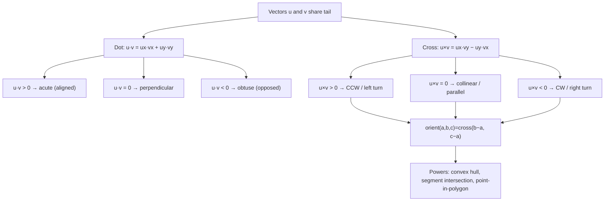
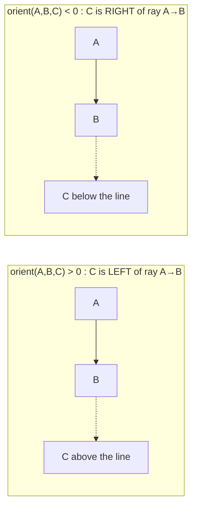

# 📐 Geometry Fundamentals — Points, Vectors, Dot & Cross Products

> [!abstract] TL;DR
> Almost every computational geometry algorithm reduces to two operations on 2D vectors. The **dot product** `a·b = ax·bx + ay·by` measures alignment — its sign tells you acute (`+`), obtuse (`−`), or perpendicular (`0`). The **2D cross product** `a×b = ax·by − ay·bx` is a *scalar* whose sign gives orientation (left turn / right turn / collinear) and whose magnitude is twice the triangle area. The single most-used helper is the **orientation test** `cross(b−a, c−a)`. Keep everything in **integer arithmetic** and compare **squared distances** — never trust floating-point equality in geometry.

## Intuition — Analogy First

Imagine you are walking along a path from point `A` to point `B`, and a friend is standing at point `C`. You want to know: to reach your friend, do you turn **left**, turn **right**, or is your friend **straight ahead** on the line you are already walking?

That single yes/left/right question is the heartbeat of computational geometry. The **cross product** answers it instantly with a sign. If it is positive, your friend is to your left (a counter-clockwise turn); negative means right (clockwise); zero means dead ahead (collinear). Convex hulls, segment intersection, point-in-polygon — they are all just this "which way do I turn?" question asked thousands of times.

The **dot product** answers a different question: "is my friend roughly *ahead* of me or *behind* me?" It measures how much two directions agree.

## How It Works + Diagram

A **point** and a **vector** share the same representation `(x, y)`; the difference is interpretation. A point is a location; a vector `b − a` is the displacement/arrow from `a` to `b`. This duality is why we can subtract points to get direction vectors.

**Dot product** `a·b = |a||b|cos θ`:
- `> 0` → angle < 90° (vectors point the same general way, acute)
- `= 0` → angle = 90° (perpendicular)
- `< 0` → angle > 90° (opposite general way, obtuse)

**Cross product (2D)** `a×b = ax·by − ay·bx`:
- This is the `z`-component of the 3D cross product of `(ax, ay, 0)` and `(bx, by, 0)` — so in 2D it collapses to a single scalar.
- `> 0` → `b` is counter-clockwise (left) from `a`
- `= 0` → `a` and `b` are parallel/collinear
- `< 0` → `b` is clockwise (right) from `a`
- `|a×b|` = area of the parallelogram spanned by `a` and `b` = **2 × triangle area**.

The **orientation test** `orient(a, b, c) = cross(b − a, c − a)` tells you the turn direction of the ordered triple `a → b → c`. This is *the* workhorse function.





## The Math

For vectors $\mathbf{a} = (a_x, a_y)$ and $\mathbf{b} = (b_x, b_y)$:

**Dot product:**
$$\mathbf{a} \cdot \mathbf{b} = a_x b_x + a_y b_y = |\mathbf{a}|\,|\mathbf{b}|\cos\theta$$

The sign of the dot product is exactly the sign of $\cos\theta$, giving the acute/right/obtuse classification.

**2D cross product** (the scalar $z$-component):
$$\mathbf{a} \times \mathbf{b} = a_x b_y - a_y b_x = |\mathbf{a}|\,|\mathbf{b}|\sin\theta$$

**Signed area of triangle** $ABC$:
$$\text{Area}_{\pm} = \frac{1}{2}\bigl[(\mathbf{b} - \mathbf{a}) \times (\mathbf{c} - \mathbf{a})\bigr] = \frac{1}{2}\Bigl(x_a(y_b - y_c) + x_b(y_c - y_a) + x_c(y_a - y_b)\Bigr)$$

Positive signed area ⇔ counter-clockwise ordering. Twice the signed area is exactly `orient(a, b, c)` and stays an **integer** when the coordinates are integers.

**Euclidean distance** — always prefer the *squared* form to remain exact:
$$d^2(\mathbf{a}, \mathbf{b}) = (a_x - b_x)^2 + (a_y - b_y)^2$$

Since $\sqrt{\cdot}$ is monotonic, comparisons like "is A closer than B?" never need the square root — compare $d^2$ values and stay in integers.

**Point-to-line distance** from point `p` to the line through `a`, `b`:
$$\text{dist} = \frac{\bigl|(\mathbf{b} - \mathbf{a}) \times (\mathbf{p} - \mathbf{a})\bigr|}{|\mathbf{b} - \mathbf{a}|}$$

The numerator is the (integer) doubled triangle area; only divide when you truly need the real distance.

## Python Implementation

```python
from math import isqrt

# A point (or vector) is just a tuple (x, y). Integer coordinates keep
# every operation below EXACT — no floating-point error creeps in.
Point = tuple[int, int]

def sub(a: Point, b: Point) -> Point:
    """Vector from b to a  (a - b)."""
    return (a[0] - b[0], a[1] - b[1])

def dot(a: Point, b: Point) -> int:
    """Dot product. Sign: >0 acute, 0 perpendicular, <0 obtuse."""
    return a[0] * b[0] + a[1] * b[1]

def cross(a: Point, b: Point) -> int:
    """2D cross product (a scalar). |cross| = 2 * triangle area."""
    return a[0] * b[1] - a[1] * b[0]

def orient(a: Point, b: Point, c: Point) -> int:
    """
    Orientation of the ordered triple a -> b -> c.
    Returns cross(b - a, c - a):
        > 0  : counter-clockwise (c is LEFT of ray a->b)
        = 0  : collinear
        < 0  : clockwise (c is RIGHT of ray a->b)
    THE workhorse of computational geometry.
    """
    return cross(sub(b, a), sub(c, a))

def sign(x: int) -> int:
    """Normalise to -1, 0, +1 so magnitudes never mislead a comparison."""
    return (x > 0) - (x < 0)

def dist2(a: Point, b: Point) -> int:
    """SQUARED Euclidean distance — exact, integer, great for comparisons."""
    dx, dy = a[0] - b[0], a[1] - b[1]
    return dx * dx + dy * dy

def twice_triangle_area(a: Point, b: Point, c: Point) -> int:
    """Absolute doubled area of triangle abc (always an integer)."""
    return abs(orient(a, b, c))

def collinear(a: Point, b: Point, c: Point) -> bool:
    return orient(a, b, c) == 0

def angle_type(a: Point, b: Point, c: Point) -> str:
    """Classify angle ABC (vertex at b) using the dot product sign."""
    d = dot(sub(a, b), sub(c, b))
    return {1: "acute", 0: "right", -1: "obtuse"}[sign(d)]


if __name__ == "__main__":
    A, B, C = (0, 0), (4, 0), (2, 3)
    print("orient(A,B,C):", orient(A, B, C))            # 12  -> CCW (left turn)
    print("orient(A,B,down):", orient(A, B, (2, -3)))   # -12 -> CW  (right turn)
    print("collinear:", collinear((0, 0), (2, 2), (5, 5)))  # True
    print("2x area:", twice_triangle_area(A, B, C))     # 12  (area = 6)
    print("dist^2 A-C:", dist2(A, C))                   # 13
    print("angle at B:", angle_type(A, B, C))           # acute
```

## Dry Run / Trace

Take `A = (0,0)`, `B = (4,0)`, `C = (2,3)`.

1. `sub(B, A) = (4, 0)` — direction along the ray `A→B`.
2. `sub(C, A) = (2, 3)` — direction from `A` toward `C`.
3. `orient(A, B, C) = cross((4,0), (2,3)) = 4·3 − 0·2 = 12`.
   - Sign `+` → `C` is to the **left** of the ray `A→B` (a CCW turn). ✓
4. Triangle area `= |12| / 2 = 6`. Verify with base×height: base `AB = 4`, height = `y_C = 3`, area `= ½·4·3 = 6`. ✓
5. Now test `C' = (2, −3)`: `orient(A, B, C') = 4·(−3) − 0·2 = −12` → sign `−` → **right** turn. ✓
6. Collinearity: `orient((0,0), (2,2), (5,5)) = cross((2,2),(5,5)) = 2·5 − 2·5 = 0` → collinear. ✓

Every number stayed an integer — no rounding, no epsilon needed.

## Patterns & LeetCode Applications

| Pattern | Primitive used | Example |
|---------|----------------|---------|
| Collinearity / "valid triangle" | `orient == 0` | LC 1037 Valid Boomerang |
| Left/right turn while building a hull | `orient > 0` | Convex hull (monotone chain) |
| Angle classification | `dot` sign | Right-angle detection |
| Nearest point / closest pair | `dist2` comparison | LC 973 K Closest Points |
| Point on a segment | `orient == 0` + bounding box | Segment intersection |
| Polygon area | sum of `cross` terms (shoelace) | LC 812 Largest Triangle Area |
| Movement along a grid path | `cross` of consecutive steps | LC 883 (grid geometry) |

**LeetCode 1037 — Valid Boomerang**: three points form a boomerang iff they are *not* collinear → return `orient(a, b, c) != 0`. One line, no floats.

**LeetCode 883 — Projection Area** and grid problems: reduce to per-cell area contributions; the same integer-area reasoning applies.

## Common Pitfalls

1. **Floating point!** Never compare coordinates or areas with `==` on floats. With integer inputs, keep every intermediate integer (`orient`, `cross`, `dist2`). If inputs are floats, compare against an epsilon: `abs(val) < 1e-9`.
2. **Compare `dist2`, not `dist`.** Taking `sqrt` throws away exactness and is slower; monotonicity means the squared value orders points identically.
3. **Cross product overflow.** For coordinates up to `1e9`, `ax·by` can reach `1e18` — fine for Python's big ints, but in C++/Java use 64-bit (`long long`) or the product overflows silently.
4. **Sign vs magnitude confusion.** For orientation you only care about the *sign*; normalise with `sign()` so a large magnitude never masquerades as "more of a turn."
5. **Argument order matters.** `orient(a, b, c)` is antisymmetric: swapping any two points flips the sign. Fix a consistent convention (CCW-positive) and never deviate.
6. **Degenerate inputs.** Duplicate points and collinear triples make many algorithms misbehave; handle `orient == 0` explicitly rather than assuming strict turns.

## Related Concepts

- [[_MOC_Computational_Geometry|↑ Section MOC]]
- [[Convex_Hull]] — builds directly on the `orient` test to decide left/right turns
- [[Line_and_Polygon_Algorithms]] — segment intersection and shoelace area reuse `orient` and `cross`
- [[Bit_Manipulation]] — the `sign` trick `(x>0)-(x<0)` is a branchless bit idiom
- [[Prefix_Sum]] — shoelace area is a running signed-area accumulation

## Review Questions

1. You compute `orient(a, b, c) = 0`. What does this tell you geometrically, and what *extra* check is needed before concluding `c` lies on segment `ab` (not just the infinite line)?
2. Why is `dist2` preferred over `dist` for "find the closest point"? Give one correctness reason and one performance reason.
3. Given three integer points, write a one-expression test for whether angle `ABC` (vertex `B`) is obtuse. Which primitive do you use and what is the sign condition?

## Sources

- **Reading**: CP-Algorithms — [Basic Geometry](https://cp-algorithms.com/geometry/basic-geometry.html)
- **Reading**: CP-Algorithms — [Oriented area of a triangle](https://cp-algorithms.com/geometry/oriented-triangle-area.html)
- **LeetCode 1037** — Valid Boomerang
- **LeetCode 883** — Projection Area of 3D Shapes
- **LeetCode 812** — Largest Triangle Area
- **LeetCode 973** — K Closest Points to Origin

#ComputationalGeometry #Vectors #CrossProduct #DotProduct #Orientation #DSA
