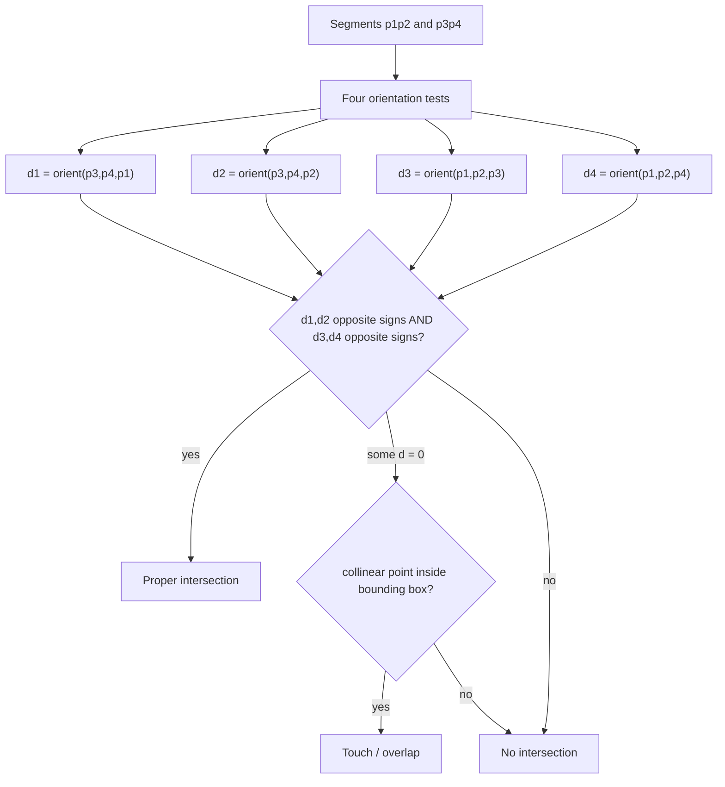
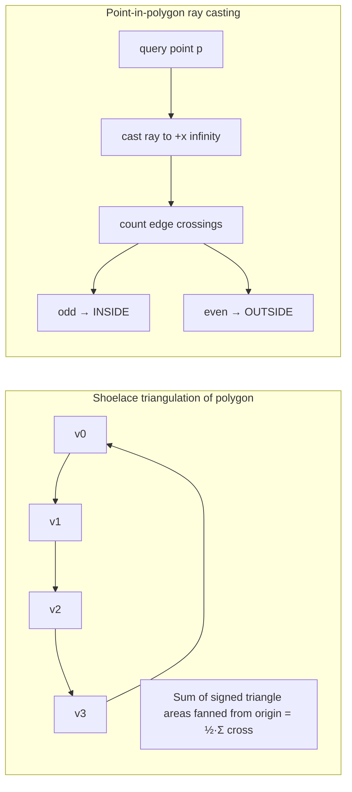

# 📏 Line & Polygon Algorithms — Intersection, Shoelace, Point-in-Polygon, Sweep Line

> [!abstract] TL;DR
> Four polygon workhorses. **Segment intersection**: two segments cross iff each straddles the other's supporting line — checked with **four [[Geometry_Fundamentals|orientation tests]]**, plus an on-segment check for the collinear case. **Shoelace formula**: polygon area is `½·|Σ (x_i·y_{i+1} − x_{i+1}·y_i)|`, a signed sum of cross products. **Point-in-polygon**: cast a ray and count edge crossings (odd = inside) or sum the **winding number**. **Sweep line** (Bentley–Ottmann): slide a vertical line across the plane, keeping only "active" segments in a balanced BST, to detect *any* intersection in **O((n + k) log n)** instead of the brute-force O(n²).

## Intuition — Analogy First

**Segment intersection** is a "do these two roads cross?" question. Two straight roads cross iff the endpoints of road 2 lie on **opposite sides** of road 1, *and* vice versa. "Opposite sides" is exactly a sign flip in the orientation test — the same left/right turn primitive from the fundamentals note.

**Shoelace** is like lacing a shoe: pair up consecutive vertices, cross-multiply their coordinates going one way, subtract the other way, and the leftover is twice the enclosed area. Wind counter-clockwise and the sum is positive; clockwise flips the sign — the *magnitude* is the area either way.

**Point-in-polygon by ray casting** is the "escape the maze" trick: fire a ray from your point straight out to infinity. Each time it pierces a wall you flip a light switch. If the switch ends **on** (odd number of crossings), you started **inside**; if **off** (even), you were outside all along.

**Sweep line** is a scanner bar sweeping left to right across a document. Instead of comparing every pair of segments (O(n²)), you only ever compare segments that are *currently under the bar* and *vertically adjacent* — dramatically fewer checks.

## How It Works + Diagram

**Segment intersection** of `p1p2` and `p3p4`:
- Compute four orientations: `d1 = orient(p3, p4, p1)`, `d2 = orient(p3, p4, p2)`, `d3 = orient(p1, p2, p3)`, `d4 = orient(p1, p2, p4)`.
- **General (proper) crossing**: `d1` and `d2` have opposite signs **and** `d3` and `d4` have opposite signs → the segments straddle each other → they intersect.
- **Collinear/touch cases**: if any `d_i == 0`, the point is on the *line*; verify it also lies within the segment's bounding box (the "on-segment" check) to confirm a real touch.





**Shoelace area** sums signed areas of triangles fanned from the origin — interior overlaps cancel, leaving exactly the polygon area.

**Point-in-polygon**:
- *Ray casting (even–odd rule)*: shoot a ray to `+x` infinity; count how many polygon edges it crosses. Odd → inside. Handle the "ray grazes a vertex" case by a consistent half-open edge convention (count an edge only if one endpoint is strictly above the ray height and the other is at-or-below).
- *Winding number*: sum the signed angle subtended by each edge around the point; a nonzero total winding means inside. More robust for self-intersecting polygons than even–odd.

**Sweep line (Bentley–Ottmann intuition)**: sort all segment endpoints by `x`. Sweep a vertical line rightward through these **event points**. Maintain a balanced BST ("status structure") of segments currently crossing the line, ordered by their `y` at the sweep position. At a left endpoint, insert the segment and test it against its new neighbours; at a right endpoint, remove it and test the two segments that become adjacent. Only vertically adjacent segments can be the *first* to intersect, so you test far fewer than all pairs → `O((n + k) log n)` for `k` intersections.

## The Math

**Shoelace formula** for a simple polygon with vertices $(x_0, y_0), \dots, (x_{n-1}, y_{n-1})$ in order:
$$A = \frac{1}{2}\left| \sum_{i=0}^{n-1} \bigl(x_i \, y_{i+1} - x_{i+1} \, y_i\bigr) \right| \qquad (\text{indices mod } n)$$

The **signed** version (drop the absolute value) is positive for CCW winding, negative for CW — useful for detecting orientation. The inner term $x_i y_{i+1} - x_{i+1} y_i$ is exactly the [[Geometry_Fundamentals|cross product]] of consecutive vertices, so with integer coordinates $2A$ is an **integer**.

**Straddle condition** for proper intersection:
$$\bigl(\text{orient}(p_3,p_4,p_1)\bigr)\bigl(\text{orient}(p_3,p_4,p_2)\bigr) < 0 \;\land\; \bigl(\text{orient}(p_1,p_2,p_3)\bigr)\bigl(\text{orient}(p_1,p_2,p_4)\bigr) < 0$$

**Winding number** of closed curve `C` about point `p`:
$$\text{wn}(p, C) = \frac{1}{2\pi}\oint_C d\theta \in \mathbb{Z}, \qquad \text{wn} \neq 0 \iff p \text{ inside}$$

**Pick's theorem** (bonus, integer polygons): $A = I + \dfrac{B}{2} - 1$, where $I$ = interior lattice points, $B$ = boundary lattice points — links area (shoelace) to lattice counts.

## Python Implementation

```python
# Builds on the integer primitives from [[Geometry_Fundamentals]].
Point = tuple[int, int]

def orient(a: Point, b: Point, c: Point) -> int:
    """Cross of (b-a) and (c-a): >0 CCW, 0 collinear, <0 CW."""
    return (b[0] - a[0]) * (c[1] - a[1]) - (b[1] - a[1]) * (c[0] - a[0])

def on_segment(a: Point, b: Point, p: Point) -> bool:
    """Assuming p is COLLINEAR with a,b: is p within segment ab's box?"""
    return (min(a[0], b[0]) <= p[0] <= max(a[0], b[0]) and
            min(a[1], b[1]) <= p[1] <= max(a[1], b[1]))

def segments_intersect(p1: Point, p2: Point, p3: Point, p4: Point) -> bool:
    """
    True iff segment p1p2 intersects segment p3p4 (touching counts).
    Four orientation tests + on-segment for the collinear case.
    Pure integer arithmetic — exact.
    """
    d1 = orient(p3, p4, p1)
    d2 = orient(p3, p4, p2)
    d3 = orient(p1, p2, p3)
    d4 = orient(p1, p2, p4)

    # proper crossing: each segment straddles the other's line
    if ((d1 > 0) != (d2 > 0)) and ((d3 > 0) != (d4 > 0)) and \
       d1 != 0 and d2 != 0 and d3 != 0 and d4 != 0:
        return True

    # collinear / endpoint-touch cases
    if d1 == 0 and on_segment(p3, p4, p1): return True
    if d2 == 0 and on_segment(p3, p4, p2): return True
    if d3 == 0 and on_segment(p1, p2, p3): return True
    if d4 == 0 and on_segment(p1, p2, p4): return True
    return False

def polygon_area2(poly: list[Point]) -> int:
    """Twice the (unsigned) polygon area via shoelace. Integer-exact."""
    n, s = len(poly), 0
    for i in range(n):
        x1, y1 = poly[i]
        x2, y2 = poly[(i + 1) % n]
        s += x1 * y2 - x2 * y1
    return abs(s)               # divide by 2 for the true area

def point_in_polygon(p: Point, poly: list[Point]) -> bool:
    """
    Ray casting (even-odd rule). Cast a ray toward +x infinity and
    count edge crossings. Uses a half-open edge convention so a ray
    grazing a vertex is counted exactly once.
    Returns True for strictly-inside points.
    """
    x, y = p
    inside = False
    n = len(poly)
    for i in range(n):
        x1, y1 = poly[i]
        x2, y2 = poly[(i + 1) % n]
        # edge crosses the horizontal line y? (half-open: one strictly above)
        if (y1 > y) != (y2 > y):
            # x-coordinate where the edge meets height y (float only here)
            x_cross = x1 + (y - y1) * (x2 - x1) / (y2 - y1)
            if x < x_cross:
                inside = not inside
    return inside

def any_segments_intersect(segments: list[tuple[Point, Point]]) -> bool:
    """
    Sweep-line flavour: O(n^2) fallback shown for clarity, but the
    Bentley-Ottmann idea is to keep only ACTIVE segments ordered by y
    in a balanced BST and test just vertical neighbours -> O((n+k) log n).
    """
    for i in range(len(segments)):
        for j in range(i + 1, len(segments)):
            (a, b), (c, d) = segments[i], segments[j]
            if segments_intersect(a, b, c, d):
                return True
    return False


if __name__ == "__main__":
    print(segments_intersect((0,0),(4,4),(0,4),(4,0)))   # True  (cross)
    print(segments_intersect((0,0),(1,1),(2,2),(3,3)))   # False (parallel, disjoint)
    square = [(0,0),(4,0),(4,4),(0,4)]
    print("2 x area:", polygon_area2(square))            # 32 -> area 16
    print("inside:", point_in_polygon((2,2), square))    # True
    print("outside:", point_in_polygon((5,5), square))   # False
```

## Dry Run / Trace

**Segment intersection** — `p1p2 = (0,0)-(4,4)` and `p3p4 = (0,4)-(4,0)` (the two diagonals of a square):
- `d1 = orient((0,4),(4,0),(0,0)) = (4)( -4) − (−4)(0) = −16` (< 0)
- `d2 = orient((0,4),(4,0),(4,4)) = (4)(0) − (−4)(4) = 16` (> 0) → `d1,d2` opposite ✓
- `d3 = orient((0,0),(4,4),(0,4)) = (4)(4) − (4)(0) = 16` (> 0)
- `d4 = orient((0,0),(4,4),(4,0)) = (4)(0) − (4)(4) = −16` (< 0) → `d3,d4` opposite ✓
- Both straddles hold, no zeros → **proper crossing** at `(2,2)`. ✓

**Shoelace** on square `(0,0),(4,0),(4,4),(0,4)`:
- Terms `x_i y_{i+1} − x_{i+1} y_i`: `(0·0−4·0)=0`, `(4·4−4·0)=16`, `(4·4−0·4)=16`, `(0·0−0·4)=0`. Sum `= 32` → area `= 32/2 = 16`. ✓

**Ray casting** for `p=(2,2)` in the square:
- Bottom edge `(0,0)-(4,0)`: both endpoints at/below `y=2` → no crossing.
- Right edge `(4,0)-(4,4)`: straddles `y=2`; `x_cross=4`, `2 < 4` → toggle → `inside=True`.
- Top edge `(4,4)-(0,4)`: both above → no crossing. Left edge `(0,4)-(0,0)`: straddles `y=2`; `x_cross=0`, `2 < 0` false → no toggle.
- One toggle (odd) → **inside**. ✓

## Patterns & LeetCode Applications

| Problem | Technique |
|---------|-----------|
| **Rectangle Overlap** (LC 836) | Axis-aligned interval overlap test on x and y (a degenerate polygon case) |
| **Rectangle Area** (LC 223) | Union area = `areaA + areaB − overlap`; overlap via interval intersection |
| **The Skyline Problem** (LC 218) | Sweep line over building edges with a max-heap of active heights |
| **My Calendar / Range overlap** | Sweep line / interval scheduling on start–end events |
| **Minimum area rectangle** (LC 963/939) | Segment/point geometry over candidate corners |
| **Robot bounded in circle** (LC 1041) | Vector composition, orientation of net displacement |
| **Erect the Fence** (LC 587) | [[Convex_Hull]], then these polygon tools operate on the result |

**LeetCode 836 — Rectangle Overlap:** two axis-aligned rectangles overlap iff their x-intervals overlap **and** their y-intervals overlap: `x1_a < x2_b and x1_b < x2_a and y1_a < y2_b and y1_b < y2_a`. A specialised, float-free instance of segment/polygon intersection.

**LeetCode 223 — Rectangle Area:** total covered area = `area(A) + area(B) − area(overlap)`, where the overlap width/height come from `min(rights) − max(lefts)` clamped at 0. This is the two-rectangle base case of **rectangle union**, which generalises via a sweep line + coordinate compression for many rectangles.

## Common Pitfalls

1. **Floating point!** Keep `orient`, `polygon_area2`, and the straddle products in integers. In `point_in_polygon` the single division `x_cross` is the *only* float — with integer polygons you can even avoid it by comparing `(x - x1)*(y2 - y1)` against `(y - y1)*(x2 - x1)` with a sign fix.
2. **Ray grazing a vertex.** Without a **half-open** edge convention (`(y1 > y) != (y2 > y)`), a ray through a vertex is double-counted and flips inside/outside. The convention counts each spanning edge exactly once.
3. **Collinear overlap.** Two collinear, overlapping segments *do* intersect, but the four-orientation test alone returns all zeros — the `on_segment` bounding-box check is mandatory to catch this.
4. **Boundary points.** Ray casting classifies on-boundary points ambiguously; decide up front whether the boundary counts as "inside" and add an explicit `on_segment` test if it must.
5. **Polygon winding assumption.** Signed shoelace flips with orientation; always take `abs` for area, and never assume input is CCW unless guaranteed.
6. **Self-intersecting polygons.** Even–odd and winding-number rules disagree here; pick the rule the problem intends (winding for "nonzero fill", even–odd for "alternating fill").
7. **Sweep-line event ordering.** Ties at equal `x` (vertical segments, shared endpoints) must break consistently or the status BST desynchronises and misses intersections.

## Related Concepts

- [[_MOC_Computational_Geometry|↑ Section MOC]]
- [[Geometry_Fundamentals]] — `orient`/`cross` power intersection, shoelace, and ray casting
- [[Convex_Hull]] — produces the polygons these algorithms then measure and query
- [[Coordinate_Compression]] — shrinks coordinates for sweep-line rectangle-union problems
- [[Segment_Tree]] — the sweep-line "status structure" for area-of-union / skyline queries
- [[Two_Pointers]] — interval-overlap tests are the 1D shadow of segment intersection
- [[Binary_Search]] — locating a segment's position in the sweep status structure

## Review Questions

1. Two segments return all four orientation values equal to `0`. What does this mean, and what additional test decides whether they actually intersect?
2. Derive why the shoelace inner term `x_i·y_{i+1} − x_{i+1}·y_i` equals twice the signed area of the triangle `(origin, v_i, v_{i+1})`, and explain why the overlaps cancel to give the polygon area.
3. In ray casting, why does a naive "count crossings" fail when the ray passes exactly through a polygon vertex, and how does the half-open edge convention `(y1 > y) != (y2 > y)` fix it?

## Sources

- **Reading**: CP-Algorithms — [Segments intersection](https://cp-algorithms.com/geometry/segments-intersection.html)
- **Reading**: CP-Algorithms — [Point in polygon](https://cp-algorithms.com/geometry/point-in-convex-polygon.html)
- **Reading**: Wikipedia — [Shoelace formula](https://en.wikipedia.org/wiki/Shoelace_formula) · [Bentley–Ottmann algorithm](https://en.wikipedia.org/wiki/Bentley%E2%80%93Ottmann_algorithm)
- **LeetCode 836** — Rectangle Overlap
- **LeetCode 223** — Rectangle Area
- **LeetCode 218** — The Skyline Problem (sweep line)

#ComputationalGeometry #SegmentIntersection #Shoelace #PointInPolygon #SweepLine #DSA
