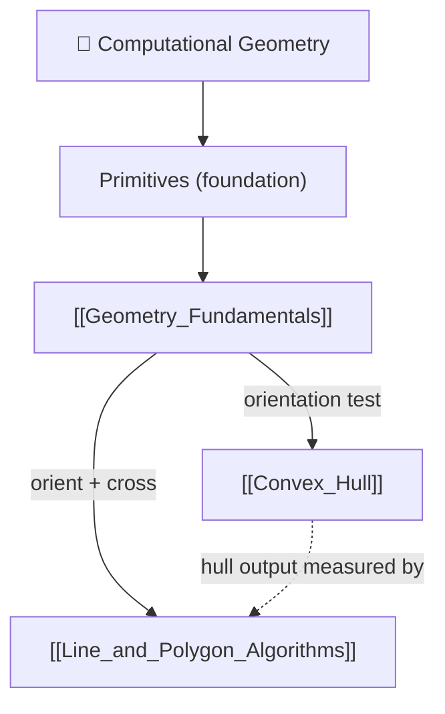

# 📐 Computational Geometry — Map of Content

> [!abstract] What This Section Covers
> Computational geometry looks intimidating but reduces to a tiny set of primitives applied thousands of times. This section starts with those primitives — points, vectors, the **dot product** (alignment), the **2D cross product**, and the **orientation test** (`cross(b−a, c−a)`) that answers "left turn, right turn, or straight ahead?". Everything else builds on that foundation: the **convex hull** (Andrew's monotone chain / Graham scan) uses the orientation test to keep only convex turns, and the **line & polygon algorithms** (segment intersection, shoelace area, point-in-polygon, sweep line) reuse the same `orient`/`cross` engine. The recurring discipline: stay in **integer arithmetic**, compare **squared distances**, and never trust floating-point equality.

## Concept Map

*`[[Geometry_Fundamentals]]` (dot/cross/orientation) is the single foundation; both `[[Convex_Hull]]` and `[[Line_and_Polygon_Algorithms]]` are built directly on the orientation test, and the hull's polygon output feeds the area / point-in-polygon tools.*

## Learning Path

1. [[Geometry_Fundamentals]] — Points vs vectors, dot product (acute/right/obtuse), 2D cross product, the orientation test, signed area, squared distance; integer-exact arithmetic
2. [[Convex_Hull]] — Andrew's monotone chain and Graham scan in O(n log n); the pop-on-non-left-turn rule; rotating calipers; why the problem is Ω(n log n)
3. [[Line_and_Polygon_Algorithms]] — Segment intersection (four orientation tests), shoelace area, point-in-polygon (ray casting / winding number), and the Bentley-Ottmann sweep line

## All Notes at a Glance

| Note | Summary | Difficulty |
|------|---------|------------|
| [[Geometry_Fundamentals]] | Dot/cross products, orientation test, signed area, squared distance; the primitives everything reduces to | Intermediate |
| [[Convex_Hull]] | Smallest enclosing polygon via monotone chain / Graham scan; O(n log n) | Advanced |
| [[Line_and_Polygon_Algorithms]] | Segment intersection, shoelace, point-in-polygon, sweep line | Advanced |

## Key Questions This Section Answers

- Why keep every intermediate value in integers and compare squared distances instead of taking square roots?
- What does the sign of the cross product / orientation test tell you geometrically?
- How does Andrew's monotone chain build a convex hull in O(n log n), and why is that bound optimal?
- How do four orientation tests decide whether two segments properly cross, and why is an on-segment check still needed?
- How do ray casting and the winding number classify a point as inside or outside a polygon?
- How does a sweep line cut segment-intersection detection from O(n²) to O((n + k) log n)?

## Related Sections

- [[_MOC_DSA_Master|↑ DSA Master MOC]]
- [[_MOC_Sorting_Searching]] — the convex hull's cost is dominated entirely by the initial sort
- [[_MOC_Competitive_Programming]] — geometry is a CP staple; sweep-line status structures reuse balanced BSTs / segment trees

#MOC #DSA #computational-geometry #geometry
