# 🏆 DSA + Competitive Programming — Master Map of Content

> [!abstract] About This Vault
> Comprehensive DSA and competitive programming knowledge vault covering ~140 notes across 16 sections — from Big O fundamentals to advanced CP algorithms, string processing, disk-based data structures, and computational geometry. Designed for interview prep, competitive programming, and deep algorithmic understanding.

## Vault Architecture

```mermaid
graph TD
    M["🏆 DSA Master"]:::master

    M --> C00["00 Complexity Analysis"]:::blue
    M --> C01["01 Arrays"]:::blue
    M --> C02["02 Linked Lists"]:::blue
    M --> C03["03 Stacks & Queues"]:::blue
    M --> C04["04 Hash Tables"]:::blue

    M --> C05["05 Trees"]:::green
    M --> C06["06 Heaps"]:::green
    M --> C07["07 Graphs"]:::green
    M --> C08["08 Sorting & Searching"]:::green

    M --> C09["09 Recursion & Backtracking"]:::orange
    M --> C10["10 Dynamic Programming"]:::orange
    M --> C11["11 Greedy"]:::orange

    M --> C12["12 Competitive Programming"]:::red

    M --> C13["13 Strings"]:::blue
    M --> C14["14 Advanced Data Structures"]:::green
    M --> C15["15 Computational Geometry"]:::teal

    classDef master fill:#7c3aed,color:#fff,stroke:#5b21b6
    classDef blue fill:#2563eb,color:#fff,stroke:#1d4ed8
    classDef green fill:#059669,color:#fff,stroke:#047857
    classDef orange fill:#d97706,color:#fff,stroke:#b45309
    classDef red fill:#dc2626,color:#fff,stroke:#b91c1c
    classDef teal fill:#0d9488,color:#fff,stroke:#0f766e
```

## Sections at a Glance

| # | Section | Notes | Entry Point | Difficulty |
|---|---------|-------|-------------|------------|
| 00 | Complexity Analysis | 6 | [[_MOC_Complexity_Analysis]] | Beginner |
| 01 | Arrays | 7 | [[_MOC_Arrays]] | Beginner–Intermediate |
| 02 | Linked Lists | 4 | [[_MOC_Linked_Lists]] | Beginner–Intermediate |
| 03 | Stacks & Queues | 5 | [[_MOC_Stacks_Queues]] | Beginner–Intermediate |
| 04 | Hash Tables | 4 | [[_MOC_Hash_Tables]] | Beginner–Intermediate |
| 05 | Trees | 7 | [[_MOC_Trees]] | Beginner–Advanced |
| 06 | Heaps | 5 | [[_MOC_Heaps]] | Intermediate |
| 07 | Graphs | 17 | [[_MOC_Graphs]] | Beginner–Intermediate |
| 08 | Sorting & Searching | 12 | [[_MOC_Sorting_Searching]] | Beginner–Intermediate |
| 09 | Recursion & Backtracking | 6 | [[_MOC_Recursion_Backtracking]] | Beginner–Intermediate |
| 10 | Dynamic Programming | 13 | [[_MOC_Dynamic_Programming]] | Intermediate–Advanced |
| 11 | Greedy | 4 | [[_MOC_Greedy]] | Intermediate |
| 12 | Competitive Programming | 19 | [[_MOC_Competitive_Programming]] | Intermediate–Advanced |
| 13 | Strings | 5 | [[_MOC_Strings]] | Beginner–Advanced |
| 14 | Advanced Data Structures | 5 | [[_MOC_Advanced_Data_Structures]] | Intermediate–Advanced |
| 15 | Computational Geometry | 3 | [[_MOC_Computational_Geometry]] | Intermediate–Advanced |

## Learning Paths

### Path 1: LeetCode Interview Prep (8–12 weeks)

Focus: cover the patterns interviewers actually test.

- **Week 1–2:** [[_MOC_Complexity_Analysis]] → [[_MOC_Arrays]] → [[_MOC_Linked_Lists]]
- **Week 3–4:** [[_MOC_Stacks_Queues]] → [[_MOC_Hash_Tables]] → [[_MOC_Trees]] (BST + traversals)
- **Week 5–6:** [[_MOC_Heaps]] → [[_MOC_Graphs]] (BFS, DFS, Union-Find)
- **Week 7–8:** [[_MOC_Sorting_Searching]] → [[_MOC_Recursion_Backtracking]]
- **Week 9–12:** [[_MOC_Dynamic_Programming]] → [[_MOC_Greedy]]

### Path 2: Competitive Programming (ongoing)

Core: all of Path 1 + [[_MOC_Competitive_Programming]]

Focus order: Number Theory → Modular Arithmetic → Bit Manipulation → String Algorithms → Advanced Data Structures → Meet in the Middle

### Path 3: Quick Interview Refresher (2–3 days)

[[Complexity_Cheat_Sheet]] → [[Problem_Patterns_Index]] → [[Hash_Table_Patterns]] → [[Backtracking_Patterns]] → [[DP_Patterns]] → [[Greedy_Patterns]] → [[Binary_Search_Patterns]]

## Must-Know Concepts

**Core Data Structures**
Array, Hash Map, Stack/Queue, BST, Heap, Graph (adjacency list)

**Core Algorithms**
Binary Search, BFS/DFS, Merge Sort, Quicksort, Dijkstra, Topological Sort

**Core Techniques**
Two Pointers, Sliding Window, Prefix Sum, Monotonic Stack, Union-Find

**Core DP Patterns**
1D linear, Knapsack 0/1, Knapsack unbounded, LCS/LIS, Interval DP

**CP Essentials**
Modular arithmetic, Sieve, BIT/Fenwick Tree, KMP/Z-algorithm

## Reference Sheets (Start Here for Review)

| Reference | What It Covers |
|-----------|----------------|
| [[Complexity_Cheat_Sheet]] | All complexity classes + data structures + sorting/graph algorithms |
| [[Problem_Patterns_Index]] | Constraint size → algorithm mapping |
| [[Sorting_Overview]] | All sorting algorithms comparison table |
| [[DP_Patterns]] | DP family classification with templates |
| [[Greedy_Patterns]] | Greedy pattern classification and examples |
| [[Binary_Search_Patterns]] | Binary search variants and the "search on answer" template |
| [[Backtracking_Patterns]] | Subsets, permutations, constraint satisfaction templates |

## Section MOC Index

- [[_MOC_Complexity_Analysis]] — Big O, time/space analysis, amortised complexity
- [[_MOC_Arrays]] — Two pointers, sliding window, prefix sum, intervals
- [[_MOC_Linked_Lists]] — Traversal, reversal, fast/slow pointers, merging
- [[_MOC_Stacks_Queues]] — Monotonic stack, deque, BFS queue, implementation
- [[_MOC_Hash_Tables]] — Hash maps, sets, collision handling, patterns
- [[_MOC_Trees]] — BST, traversals, LCA, balanced trees, trie
- [[_MOC_Heaps]] — Min/max heap, heap sort, priority queue patterns
- [[_MOC_Graphs]] — Representation, BFS/DFS, Union-Find, shortest paths, MST
- [[_MOC_Sorting_Searching]] — Merge sort, quicksort, binary search, search on answer
- [[_MOC_Recursion_Backtracking]] — Recursion fundamentals, D&C, backtracking with pruning
- [[_MOC_Dynamic_Programming]] — Memoisation, tabulation, knapsack, sequence, tree DP
- [[_MOC_Greedy]] — Greedy proofs, activity selection, Huffman coding
- [[_MOC_Competitive_Programming]] — Math, strings, advanced DS, CP techniques
- [[_MOC_Strings]] — String fundamentals, pattern matching, Manacher, suffix structures
- [[_MOC_Advanced_Data_Structures]] — B-tree family, B+ tree, 2-3 tree, skip list, indexing
- [[_MOC_Computational_Geometry]] — Geometry primitives, convex hull, line & polygon algorithms

#MOC #DSA #CompetitiveProgramming #MasterMOC
