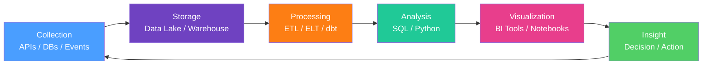

# Data Analytics Overview

> [!abstract] TL;DR
> Data analytics is the discipline of transforming raw data into actionable insight. It spans four levels — descriptive, diagnostic, predictive, and prescriptive — and is practiced across distinct roles (analyst, scientist, engineer, BI developer) that form a data team. Understanding the full data lifecycle and where your work sits on the analytics maturity model is what separates analysts who produce reports from analysts who drive decisions.

---

## The Four Types of Analytics

| Type | Question Answered | Example | Technique |
|---|---|---|---|
| **Descriptive** | What happened? | "Revenue was $2.1M last quarter" | Aggregations, dashboards, KPI reports |
| **Diagnostic** | Why did it happen? | "Revenue dropped because churn spiked in the SMB segment" | Drill-down, cohort analysis, root-cause |
| **Predictive** | What will happen? | "30% probability of churn in the next 30 days" | Regression, classification, time-series forecasting |
| **Prescriptive** | What should we do? | "Offer a 15% discount to users with churn score > 0.7" | Optimization, simulation, reinforcement learning |

Most enterprise analytics teams are 80% descriptive/diagnostic. Predictive and prescriptive require more mature data infrastructure and cross-functional buy-in.

---

## Role Landscape

```
Data Engineer ──────────────────────────────────────────►
Builds pipelines, warehouses, data models (dbt, Spark, Airflow)

Analytics Engineer ──────────────────────────────────────►
Sits between DE and DA: owns dbt models, defines canonical metrics

Data Analyst ────────────────────────────────────────────►
SQL + Python + BI tools; answers business questions, builds dashboards

BI Developer ────────────────────────────────────────────►
Specialist in Power BI / Tableau; owns the reporting layer

Data Scientist ──────────────────────────────────────────►
Predictive/prescriptive; experiments, ML models, statistical tests
```

| Role | Primary Tools | Output |
|---|---|---|
| Data Engineer | Spark, Airflow, dbt, Kafka | Clean data in warehouse |
| Analytics Engineer | dbt, SQL, Python | Semantic data models |
| Data Analyst | SQL, Python, Excel, Power BI/Tableau | Dashboards, ad-hoc analysis |
| BI Developer | Power BI, Tableau, Looker | Self-service reporting layer |
| Data Scientist | Python (scikit-learn, PyTorch), R | ML models, experiments |

---

## The Data Lifecycle



**Common failure modes at each stage:**
- **Collection:** Missing events, schema drift, PII not flagged
- **Storage:** No partitioning → slow queries; no governance → data swamp
- **Processing:** Silent failures, no idempotency, transformations not tested
- **Analysis:** Wrong grain, aggregating pre-aggregated data, date filter bugs
- **Visualization:** Misleading chart types, truncated axes, no context
- **Insight:** Correlation confused for causation, no A/B test to validate

---

## Analytics Maturity Model

```
Level 1 — Ad-hoc        Every question answered manually with Excel/SQL
Level 2 — Reports       Scheduled reports sent by email (static, backward-looking)
Level 3 — Dashboards    Self-refreshing dashboards; stakeholders pull their own data
Level 4 — Self-Service  Business users query data themselves via BI tools
Level 5 — Predictive    Automated forecasting, anomaly detection, decision support
```

Most organizations plateau at Level 3. The jump to Level 4 requires a clean semantic layer (dbt + Looker / Power BI with good data model) and data literacy across business teams. Level 5 requires Level 4 as a prerequisite — predictive models built on dirty, inconsistent data have zero credibility.

---

## Key Tools by Role

| Category | Tool | Notes |
|---|---|---|
| Query | SQL (PostgreSQL / BigQuery / Snowflake) | Non-negotiable for every role |
| Python analytics | pandas, polars | Data manipulation and EDA |
| Visualization | Matplotlib, Seaborn, Plotly | Code-based charts |
| Dashboards | Power BI, Tableau, Looker, Metabase | Self-service reporting |
| Spreadsheets | Excel, Google Sheets | Stakeholder-friendly |
| Transformation | dbt | SQL-based data modeling |
| Orchestration | Airflow, Prefect, Dagster | Pipeline scheduling |
| Notebooks | Jupyter, Databricks | Exploratory analysis |

---

## Metrics That Matter vs Vanity Metrics

**Vanity metric:** looks impressive, hard to act on.
**North Star metric:** directly tied to business value; drives decisions.

| Domain | Vanity Metric | Meaningful Metric |
|---|---|---|
| SaaS | Page views | Weekly Active Users (WAU) |
| E-commerce | Total registrations | Activated users (made first purchase) |
| Mobile | Total downloads | D30 Retention rate |
| Content | Total followers | 30-day average read rate |

> [!tip] Business → Analytical Translation
> "Why are sales down?" → Break by segment / product / region → isolate the *where*, then "why in that segment?" → cohort, timing, external factors. Every business question is a sequence of drill-down SQL queries.

---

## Translating Business Questions

| Business Question | Analytical Question | SQL Approach |
|---|---|---|
| "Is our product sticky?" | What % of Month-1 users return in Month-2? | Cohort retention query |
| "What drives churn?" | Which features correlate with 30-day churn? | Correlation / logistic regression |
| "Which channel has best ROI?" | CAC and LTV by acquisition channel? | Attribution + LTV model |
| "Are we growing?" | Week-over-week revenue growth rate? | LAG window function |

---

## Common Pitfalls

- **Reporting metrics without targets** — a number without context (budget, prior period, industry benchmark) is meaningless. Always add the target, prior period, and trend arrow.
- **Confusing average with median** — when distributions are skewed (revenue per customer, page load time), the mean is misleading. Report P50/P90/P99.
- **Wrong time granularity** — daily data aggregated to monthly can hide weekly seasonality. Choose granularity based on the decision cadence, not convenience.
- **Stale dashboards** — a dashboard nobody trusts is worse than none. Instrument data freshness timestamps and alert when pipelines fail.
- **Analyst bottleneck** — if every question must go through an analyst, you're at Level 2. Self-service is the goal; educate stakeholders on basic BI tool usage.

---

## Review Questions

1. **Conceptual:** A product manager asks "our new feature launched 3 weeks ago — is it working?" Map this through all four analytics types: what would a descriptive, diagnostic, predictive, and prescriptive analysis look like for this question?

2. **Scenario:** Your company's main dashboard shows DAU up 15% month-over-month, but revenue is flat. Walk through the diagnostic analytics process to identify the most likely explanations and the SQL queries you'd write to investigate each.

3. **Trade-off:** Your team is considering adopting Looker to achieve analytics maturity Level 4 (self-service). What data model quality requirements must be met *before* this investment pays off? What happens if you skip the semantic layer and go straight to connecting Power BI to raw tables?

---

#DataAnalytics #Overview #BusinessIntelligence #DataStrategy #beginner
