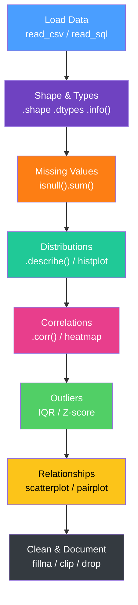

# Data Cleaning and EDA

> [!abstract] TL;DR
> Exploratory Data Analysis (EDA) is the systematic process of understanding a new dataset before modeling or reporting. It always follows the same arc: understand shape and types → profile distributions → find and handle missing values → detect outliers → understand relationships. Data cleaning is what you do when EDA reveals problems — bad types, missing values, duplicates, invalid values. Skipping EDA is the single fastest way to build a wrong model or a misleading dashboard.

---

## EDA Workflow



```python
import pandas as pd
import numpy as np
import matplotlib.pyplot as plt
import seaborn as sns

df = pd.read_csv("data.csv")

# ── Step 1: Shape and types ───────────────────────────────
print(df.shape)         # (n_rows, n_cols)
print(df.dtypes)        # is that date column actually datetime?
df.info()               # non-null counts + memory
df.head(5)              # sanity check first rows
df.tail(5)              # check for trailing garbage

# ── Step 2: Missing values ───────────────────────────────
missing = df.isnull().sum().sort_values(ascending=False)
missing_pct = (df.isnull().mean() * 100).round(2)
print(pd.concat([missing, missing_pct], axis=1, keys=["count", "pct"]))

# ── Step 3: Distributions ────────────────────────────────
df.describe(percentiles=[.05, .25, .50, .75, .95])  # numerical summary
df.describe(include="object")                         # categorical summary

for col in df.select_dtypes(include="number").columns:
    df[col].hist(bins=30)
    plt.title(col); plt.show()
```

---

## Missing Data: MCAR, MAR, MNAR

Understanding *why* data is missing determines the right strategy:

| Type | Meaning | Example | Strategy |
|---|---|---|---|
| **MCAR** | Missing Completely At Random | Random sensor dropout | Any method safe |
| **MAR** | Missing At Random | Income missing more for young users | Impute using other variables |
| **MNAR** | Missing Not At Random | High earners skip income field | Requires domain knowledge; flag as feature |

```python
# Diagnose missingness pattern
import missingno as msno
msno.matrix(df)  # visual pattern — are same rows missing multiple cols?
msno.heatmap(df)  # correlations between missingness

# MNAR flag: create binary indicator before imputing
df["income_missing"] = df["income"].isnull().astype(int)
```

### Imputation Strategies

```python
# Drop — only when missing < 5% of rows AND MCAR
df.dropna(subset=["target"], inplace=True)

# Constant fill
df["category"].fillna("Unknown", inplace=True)

# Statistical imputation (fit on train set only!)
df["age"].fillna(df["age"].median(), inplace=True)

# Forward-fill for time series (propagate last known value)
df = df.sort_values("date")
df["price"].fillna(method="ffill", inplace=True)

# KNN imputation (multivariate)
from sklearn.impute import KNNImputer
imputer = KNNImputer(n_neighbors=5)
df[numeric_cols] = imputer.fit_transform(df[numeric_cols])
```

---

## Outlier Detection

### IQR Method (Robust, Distribution-Free)

```python
def iqr_bounds(series, k=1.5):
    Q1 = series.quantile(0.25)
    Q3 = series.quantile(0.75)
    IQR = Q3 - Q1
    lower = Q1 - k * IQR
    upper = Q3 + k * IQR
    return lower, upper

lower, upper = iqr_bounds(df["revenue"])
outliers = df[(df["revenue"] < lower) | (df["revenue"] > upper)]
print(f"Outliers: {len(outliers)} ({len(outliers)/len(df)*100:.1f}%)")

# Capping (Winsorization) instead of dropping
df["revenue_capped"] = df["revenue"].clip(lower=lower, upper=upper)
```

### Z-Score Method (Assumes Normality)

```python
from scipy import stats

z_scores = np.abs(stats.zscore(df["revenue"].dropna()))
outlier_mask = z_scores > 3  # beyond 3 standard deviations
print(f"Outliers: {outlier_mask.sum()}")
```

### Isolation Forest (Multivariate, ML-based)

```python
from sklearn.ensemble import IsolationForest

model = IsolationForest(contamination=0.05, random_state=42)
df["is_outlier"] = model.fit_predict(df[["amount", "duration", "frequency"]])
# -1 = outlier, 1 = normal
outlier_rows = df[df["is_outlier"] == -1]
```

---

## Data Type Coercion

```python
# Detect disguised numerics
df.dtypes  # "object" for a column that should be int or float

# Coerce with error handling
df["price"] = pd.to_numeric(df["price"].str.replace("$", "").str.replace(",", ""),
                             errors="coerce")

# Date parsing
df["date"] = pd.to_datetime(df["date"], format="%Y-%m-%d", errors="coerce")

# Category for low-cardinality strings (saves memory, enables fast groupby)
df["status"] = df["status"].astype("category")
print(df["status"].cat.categories)  # inspect levels
```

---

## String Cleaning

```python
# Normalize case and whitespace
df["city"] = df["city"].str.strip().str.title()

# Remove special characters
df["name"] = df["name"].str.replace(r"[^a-zA-Z\s]", "", regex=True)

# Extract patterns with regex
df[["area_code", "number"]] = df["phone"].str.extract(r"(\d{3})-(\d{7})")

# Standardize categories
df["country"] = df["country"].str.upper().replace({
    "US": "USA", "U.S.": "USA", "UNITED STATES": "USA"
})

# Fuzzy matching for messy strings (requires fuzzywuzzy or rapidfuzz)
from rapidfuzz import fuzz
scores = df["company_name"].apply(lambda x: fuzz.ratio(x, "Acme Corp"))
```

---

## Duplicate Detection and Deduplication

```python
# Full duplicate rows
df.duplicated().sum()

# Key-based duplicates (logical duplicates — same transaction, different row)
df.duplicated(subset=["user_id", "event_timestamp", "event_type"]).sum()

# Preview duplicates before dropping
dupes = df[df.duplicated(subset=["user_id", "order_id"], keep=False)]
print(dupes.sort_values("user_id").head(20))

# Drop keeping first occurrence
df = df.drop_duplicates(subset=["user_id", "order_id"], keep="first")
```

---

## Data Quality Dimensions

| Dimension | Question | Check Method |
|---|---|---|
| **Completeness** | Is required data present? | `isnull().sum()` |
| **Consistency** | Same entity described same way? | Cross-table joins, value normalization |
| **Accuracy** | Does value match real world? | Range checks, domain logic |
| **Timeliness** | Is data fresh enough? | `MAX(updated_at)` vs current timestamp |
| **Uniqueness** | No duplicates on business key? | `duplicated(subset=[key_cols])` |
| **Validity** | Values within allowed range/set? | `value_counts()`, min/max, enum checks |

---

## Automated Profiling with ydata-profiling

```python
# pip install ydata-profiling
from ydata_profiling import ProfileReport

profile = ProfileReport(df, title="EDA Report", explorative=True)
profile.to_file("eda_report.html")

# Or display inline in Jupyter
profile.to_notebook_iframe()
```

The report auto-generates: distributions, correlations, missing value matrix, duplicate detection, and alert flags (highly correlated columns, columns with high cardinality, columns with many zeros).

---

## Common Pitfalls

- **EDA on leaky data** — running EDA before train/test split leaks test set statistics (e.g., imputing with dataset-wide mean includes test data). Always split first for ML projects; for BI/reporting this applies less strictly.
- **Dropping all missing rows** — if 40% of rows have at least one missing value, dropping all of them loses most of your data. Investigate *which* columns drive missingness; drop only rows missing the target or key join columns.
- **Mistaking data entry errors for outliers** — an age of 999 is not a genuine outlier; it's a sentinel value. Distinguish between domain outliers (valid but unusual) and data quality errors (invalid values).
- **Assuming stationarity in time series** — `df.describe()` gives one distribution but time series data can have seasonality and drift. Always plot the time dimension.
- **Not versioning clean data** — if you overwrite raw data during cleaning, you lose the ability to re-run EDA. Keep raw → clean as a separate pipeline step.

---

## Review Questions

1. **Coding:** A dataset has `user_id`, `age`, `income`, and `churn` (target). The `income` column is 35% missing. You suspect higher-income users are less likely to report it (MNAR). Describe the complete cleaning strategy, including what feature(s) to create from the missingness itself.

2. **Conceptual:** You find that removing outliers (IQR method, k=1.5) improves your model's validation RMSE dramatically. Is this always a good outcome? What are the risks of outlier removal, particularly in a revenue forecasting context?

3. **Scenario:** After joining two tables, you notice the row count is 30% higher than expected. Walk through the diagnostic SQL and pandas steps to identify the source of row duplication.

---

#DataAnalytics #EDA #DataCleaning #DataQuality #Python #intermediate
