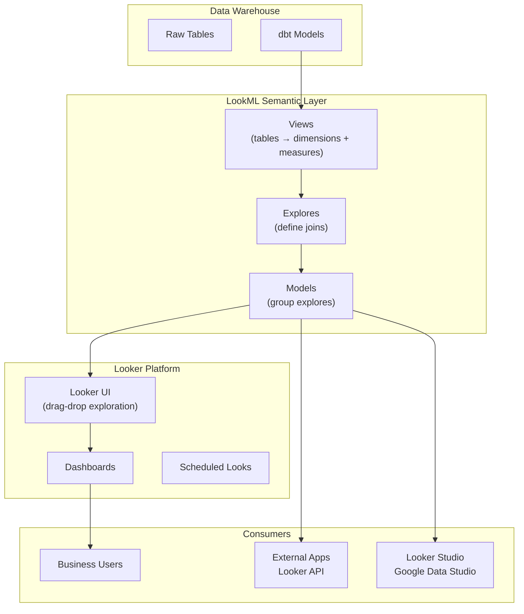

# Looker and LookML

> [!abstract] TL;DR
> Looker's core innovation is the semantic layer: business logic (metric definitions, joins, access control) is defined once in LookML and applies consistently to every query, from every user, in every tool. Business users explore data through a curated, governed lens — they can't accidentally query the wrong table or define revenue differently from the Finance team. The trade-off is a steeper setup investment and a learning curve for LookML development.

---

## Looker Architecture



**Why semantic layer?**
- Define `total_revenue` once in LookML → every dashboard, report, and API query uses the same definition
- Business users explore data via a curated interface without writing SQL
- Access control at the row and column level in LookML, not in each BI tool separately

---

## LookML Core Concepts

### Views — Tables with Defined Dimensions and Measures

```lookml
# views/orders.view.lkml

view: orders {
  sql_table_name: `myproject.prod.orders` ;;

  # Primary key
  dimension: order_id {
    primary_key: yes
    type: number
    sql: ${TABLE}.order_id ;;
  }

  # Dimensions (columns / derived columns)
  dimension: customer_id {
    type: number
    sql: ${TABLE}.customer_id ;;
  }

  dimension: status {
    type: string
    sql: ${TABLE}.status ;;
  }

  dimension_group: order_date {
    type: time
    timeframes: [date, week, month, quarter, year]
    sql: ${TABLE}.order_date ;;
    # Auto-creates: order_date, order_week, order_month, order_quarter, order_year
  }

  dimension: revenue {
    type: number
    sql: ${TABLE}.revenue ;;
    value_format_name: usd
  }

  # Derived dimension
  dimension: is_high_value {
    type: yesno
    sql: ${revenue} >= 1000 ;;
  }

  # Measures (aggregations)
  measure: total_revenue {
    type: sum
    sql: ${revenue} ;;
    value_format_name: usd
    description: "Sum of order revenue"
  }

  measure: order_count {
    type: count
    drill_fields: [order_id, customer_id, order_date, revenue]
  }

  measure: unique_customers {
    type: count_distinct
    sql: ${customer_id} ;;
  }

  measure: avg_order_value {
    type: average
    sql: ${revenue} ;;
    value_format_name: usd
  }

  measure: running_revenue {
    type: running_total
    sql: ${revenue} ;;
    value_format_name: usd
  }
}
```

### Explores — Defining Joins

```lookml
# models/ecommerce.model.lkml

explore: orders {
  label: "Orders and Customers"
  description: "Order-level analysis with customer attributes"

  join: customers {
    type: left_outer
    sql_on: ${orders.customer_id} = ${customers.customer_id} ;;
    relationship: many_to_one  # many orders → one customer
  }

  join: order_items {
    type: left_outer
    sql_on: ${orders.order_id} = ${order_items.order_id} ;;
    relationship: one_to_many
  }
}
```

### Models — Groups of Explores

```lookml
# models/ecommerce.model.lkml

connection: "snowflake_prod"

include: "/views/*.view.lkml"   # include all view files

explore: orders { ... }
explore: customers { ... }
explore: inventory { ... }
```

---

## Derived Tables

Derived tables are virtual tables defined as SQL or native LookML. They let you create intermediate aggregations or complex joins without modifying the warehouse.

### SQL Derived Table

```lookml
view: customer_lifetime_value {
  derived_table: {
    sql:
      SELECT
        customer_id,
        SUM(revenue)                               AS lifetime_value,
        COUNT(DISTINCT order_id)                   AS total_orders,
        MIN(order_date)                            AS first_order_date,
        MAX(order_date)                            AS last_order_date,
        DATEDIFF('day', MIN(order_date), MAX(order_date)) AS tenure_days
      FROM orders
      WHERE status = 'completed'
      GROUP BY 1
    ;;
  }

  dimension: customer_id {
    primary_key: yes
    type: number
    sql: ${TABLE}.customer_id ;;
  }

  dimension: lifetime_value { type: number; sql: ${TABLE}.lifetime_value ;; }
  dimension: total_orders    { type: number; sql: ${TABLE}.total_orders ;; }
  measure: avg_ltv           { type: average; sql: ${lifetime_value} ;; }
}
```

### Persistent Derived Tables (PDTs)

PDTs are materialized in the warehouse on a schedule, improving query performance:

```lookml
derived_table: {
  sql: SELECT ... FROM large_table ;;
  persist_for: "24 hours"           # rebuild every 24h
  # or:
  sql_trigger_value: SELECT MAX(updated_at) FROM orders ;;  # rebuild when data changes
}
```

---

## Filters and Parameters in LookML

```lookml
# Templated filter — adds a WHERE clause to the underlying SQL
filter: date_filter {
  type: date
  sql_where: ${order_date_date} >=  AND
             ${order_date_date} <  ;;
}

# Parameter — user-selectable value used in SQL or labels
parameter: metric_selector {
  type: unquoted
  allowed_value: { label: "Revenue" value: "revenue" }
  allowed_value: { label: "Profit" value: "profit" }
  allowed_value: { label: "Units" value: "units" }
}

measure: selected_metric {
  type: sum
  sql:  ${revenue}
        ${profit}
        ${units}
        ;;
}
```

---

## Looker Studio (Google Data Studio)

Looker Studio is Google's free BI tool — not the same as Looker (different product, both now under Google).

| Feature | Looker | Looker Studio |
|---|---|---|
| Semantic layer | Yes (LookML) | No |
| Cost | Expensive enterprise license | Free |
| Data sources | Warehouse-only (generates SQL) | 600+ connectors |
| Governance | Strong (define once, use everywhere) | Minimal |
| Best for | Large enterprises with complex metrics | Smaller teams, quick dashboards |

```
Looker Studio data sources:
→ BigQuery (native, fast)
→ Google Sheets
→ Google Analytics
→ PostgreSQL, MySQL
→ Looker (via Looker Studio connector)
→ 600+ community connectors
```

---

## dbt + Looker Pattern

The most common modern analytics engineering pattern:

```
Raw Data
    ↓
dbt (transformation, testing, documentation)
    ↓
dbt-generated tables in warehouse (clean, tested, documented)
    ↓
LookML views reference dbt model tables (sql_table_name: ref('dbt_model'))
    ↓
Looker explores join the views
    ↓
Business users explore in Looker
```

```lookml
# View referencing a dbt model
view: orders {
  sql_table_name: `{{ _user_attributes["project"] }}.analytics.fct_orders` ;;
  # or simply:
  sql_table_name: analytics.fct_orders ;;
}
```

---

## Common Pitfalls

- **Fanout in joins** — joining a many-to-many relationship causes row duplication, inflating SUM measures. Always define `relationship: many_to_one` accurately; use `type: sum_distinct` or symmetric aggregates for fanout scenarios.
- **Too many explores** — creating an explore for every possible join combination overwhelms business users. Limit to 5-10 curated explores covering real business questions.
- **Not using persistent derived tables** — complex LookML derived tables without persistence re-run on every query. PDTs can reduce query time from minutes to seconds.
- **Dimensions vs measures mix-up** — putting a metric (revenue) as a dimension means it won't aggregate. LookML will let you do this; the result is usually confusing raw values per row rather than totals.

---

## Review Questions

1. **LookML Design:** You need to show "average revenue per active customer" where "active" means at least one order in the last 90 days. Design the LookML view with the derived table, dimensions, and measure. What type of measure aggregation do you use?

2. **Architecture:** A company has 15 analysts using Tableau, 10 using Looker, and some using the raw API. Finance defines "revenue" differently from Sales (discounts included vs excluded). How does Looker's semantic layer solve this problem, and what would you do in Tableau to achieve the same governance?

3. **Performance:** A LookML explore runs a 90-second query in Snowflake every time a user opens it. Walk through three techniques to improve performance without changing the data model.

---

#DataAnalytics #Looker #LookML #BI #SemanticLayer #BusinessIntelligence #advanced
