# Power BI Fundamentals

> [!abstract] TL;DR
> Power BI is Microsoft's end-to-end BI platform — Desktop for authoring, Service for cloud publishing and collaboration, Mobile for consumption. Its power comes from a columnar in-memory engine (VertiPaq), a star schema data model, and DAX (Data Analysis Expressions) for defining measures. Getting the data model right (star schema, proper relationships, measure-not-column discipline) determines whether your reports are fast and flexible or slow and brittle.

---

## Architecture Overview

```mermaid
flowchart LR
    A["Data Sources\nSQL / Excel / API / Warehouse"] --> B["Power Query\nETL / M Language"]
    B --> C["Data Model\nStar Schema + Relationships"]
    C --> D["DAX Layer\nMeasures + Calculated Columns"]
    D --> E["Report Canvas\nVisuals + Slicers"]
    E --> F["Power BI Service\nPublish + Share + Schedule"]
    F --> G["End Users\nBrowser / Mobile / Embedded"]

    style A fill:#4a9eff,color:#fff
    style B fill:#fd7e14,color:#fff
    style C fill:#6f42c1,color:#fff
    style D fill:#20c997,color:#fff
    style E fill:#e83e8c,color:#fff
    style F fill:#fcc419,color:#000
    style G fill:#51cf66,color:#fff
```



---

## Data Model: Star Schema in Power BI

The star schema is the recommended Power BI model: one or more fact tables at the center connected to dimension tables. Every table should have a clear role.

```
Fact_Sales ────────────── Dim_Customer
    │ customer_key ──────── customer_key (PK)
    │ product_key  ──────── Dim_Product
    │ date_key     ──────── Dim_Date
    │ revenue             
    │ units               
    └─ store_key  ──────── Dim_Store
```

**Rules:**
- Relationships are always one-to-many (dimension PK → fact FK)
- Avoid many-to-many relationships when possible (use a bridge table)
- Cross-filter direction: Single (dimension → fact) unless you have a specific reason for Bidirectional (can cause ambiguous paths)
- Always create a dedicated Date/Calendar dimension table

```
// Creating a Date Dimension table (Power Query M)
let
    StartDate = #date(2020, 1, 1),
    EndDate = Date.From(DateTime.LocalNow()),
    DateList = List.Dates(StartDate, Duration.Days(EndDate - StartDate) + 1, #duration(1,0,0,0)),
    TableFromList = Table.FromList(DateList, Splitter.SplitByNothing(), {"Date"}),
    ChangedType = Table.TransformColumnTypes(TableFromList, {{"Date", type date}}),
    AddYear = Table.AddColumn(ChangedType, "Year", each Date.Year([Date]), Int64.Type),
    AddMonth = Table.AddColumn(AddYear, "Month", each Date.Month([Date]), Int64.Type),
    AddMonthName = Table.AddColumn(AddMonth, "MonthName", each Date.MonthName([Date]), type text),
    AddQuarter = Table.AddColumn(AddMonthName, "Quarter", each "Q" & Text.From(Date.QuarterOfYear([Date])), type text)
in
    AddQuarter
```

---

## Power Query (M Language)

Power Query is the ETL layer. Each transformation step is recorded as M code and can be edited in the Advanced Editor.

```m
// Merge two tables and filter rows
let
    Orders = Sql.Database("server", "db", [Query="SELECT * FROM orders"]),
    Customers = Sql.Database("server", "db", [Query="SELECT * FROM customers"]),
    JoinedData = Table.NestedJoin(Orders, {"customer_id"}, Customers, {"id"}, "CustomerData", JoinKind.Left),
    ExpandCustomer = Table.ExpandTableColumn(JoinedData, "CustomerData", {"name", "tier", "region"}),
    FilterActive = Table.SelectRows(ExpandCustomer, each [status] = "active"),
    FinalTable = Table.RemoveColumns(FilterActive, {"status", "internal_id"})
in
    FinalTable
```

---

## DAX — Data Analysis Expressions

DAX is the formula language for creating measures and calculated columns in Power BI (and Power Pivot / SSAS).

### Calculated Column vs Measure

| | Calculated Column | Measure |
|---|---|---|
| Computed | Row by row at load time | On demand at query time |
| Storage | Stored in model (increases file size) | Not stored |
| Filter context | Uses current row context | Uses current filter context |
| Use for | Static attributes, keys | Metrics displayed in visuals |

**Rule: Almost always create a Measure, not a Calculated Column.**

### Core DAX Functions

```dax
// Basic measures
Total Revenue = SUM(Fact_Sales[Revenue])
Total Orders = COUNTROWS(Fact_Sales)
Avg Order Value = DIVIDE([Total Revenue], [Total Orders], 0)

// CALCULATE — the most important DAX function
// Changes the filter context before evaluating an expression
Revenue East = CALCULATE([Total Revenue], Dim_Store[Region] = "East")

// ALL — removes filters from a column or table
Revenue All Regions = CALCULATE([Total Revenue], ALL(Dim_Store))
Revenue Share = DIVIDE([Total Revenue], [Revenue All Regions])

// ALLEXCEPT — removes all filters EXCEPT specified columns
Revenue Share in Category = DIVIDE(
    [Total Revenue],
    CALCULATE([Total Revenue], ALLEXCEPT(Dim_Product, Dim_Product[Category]))
)

// FILTER — row-by-row filter (returns a table)
Premium Revenue = CALCULATE(
    [Total Revenue],
    FILTER(Dim_Customer, Dim_Customer[Tier] = "Premium")
)
```

### SUMX / AVERAGEX — Iterator Functions

```dax
// SUMX: iterate row by row, compute expression, sum results
// Use for row-level arithmetic BEFORE aggregation
Gross Margin = SUMX(
    Fact_Sales,
    Fact_Sales[Revenue] - Fact_Sales[Cost]
)
// Different from SUM(Revenue) - SUM(Cost) only when Revenue/Cost are in different tables

// AVERAGEX: average of a row-level expression
Avg Margin Per Order = AVERAGEX(Fact_Sales, (Fact_Sales[Revenue] - Fact_Sales[Cost]) / Fact_Sales[Revenue])
```

### Time Intelligence

Time intelligence requires a marked Date table connected to fact tables.

```dax
// Year-to-date
Revenue YTD = TOTALYTD([Total Revenue], Dim_Date[Date])

// Same period last year
Revenue LY = CALCULATE([Total Revenue], SAMEPERIODLASTYEAR(Dim_Date[Date]))

// Year-over-year growth
Revenue YoY % = DIVIDE([Total Revenue] - [Revenue LY], [Revenue LY])

// Trailing 12 months
Revenue TTM = CALCULATE(
    [Total Revenue],
    DATESINPERIOD(Dim_Date[Date], LASTDATE(Dim_Date[Date]), -12, MONTH)
)

// Month-to-date
Revenue MTD = TOTALMTD([Total Revenue], Dim_Date[Date])

// Previous month
Revenue PM = CALCULATE([Total Revenue], DATEADD(Dim_Date[Date], -1, MONTH))
```

---

## Report Design Best Practices

### Cross-Filtering and Drill-Through

- **Cross-filtering:** clicking a visual filters other visuals on the same page (enabled by default; can be disabled per visual pair in "Edit Interactions")
- **Drill-through:** right-click a data point → navigate to a detail page filtered to that context; add a detail page with "Drill through" fields configured
- **Bookmarks:** save a snapshot of filter state; use for toggle buttons (show/hide visuals, reset filters)

### Slicer Design

```
Responsive slicers: use "Single select" for mutually exclusive filters
Date slicers: prefer date range pickers over standard slicers for date columns
Sync slicers: sync the same slicer across multiple report pages (View → Sync Slicers)
Search slicers: enable search for slicers with > 10 items
```

### Performance Optimization

- Use star schema — snowflake schemas with many joins are slower
- Avoid `CALCULATE` with `FILTER` when `ALL` + direct filter is sufficient
- Disable Auto Date/Time (File → Options → Current File) — it creates hidden DateTime tables for every date column
- Use variables in DAX to avoid recomputing the same expression
- Import mode is faster than DirectQuery for most use cases

```dax
// Use VAR to avoid recalculating expressions
Revenue YoY % (optimized) = 
VAR current = [Total Revenue]
VAR prior = [Revenue LY]
RETURN DIVIDE(current - prior, prior)
```

---

## Common Pitfalls

- **Bidirectional relationships** — enabling both directions on a relationship allows filters to propagate both ways, which can cause unexpected results and ambiguous paths. Use only when you understand the impact; many-to-many scenarios are the main legitimate use.
- **Calculated columns that should be measures** — creating a `Profit` calculated column in the fact table adds a column for every row. A `Profit` measure computes on demand, context-aware. File size balloons with unnecessary calculated columns.
- **Context transition confusion** — inside an iterator (`SUMX`, `AVERAGEX`), each row creates a row context. `CALCULATE` inside an iterator triggers a context transition (row context becomes equivalent filter context). This is a common source of unexpected results.
- **Implicit measures** — dropping a numeric column directly into a visual creates an implicit aggregation. Always create explicit measures for any metric you intend to reuse; implicit aggregations can't be referenced in DAX.

---

## Review Questions

1. **DAX Logic:** A report visual shows Revenue by Region. You add a `Revenue Share` measure using `DIVIDE([Total Revenue], CALCULATE([Total Revenue], ALL(Dim_Store)))`. When you filter the report to "East" region using a page-level slicer, why does `Revenue Share` show 100% for East? How do you fix it to show East's share of all-region revenue regardless of the slicer?

2. **Model Design:** You receive data from an ERP system where orders and order line items are in separate tables. Design the Power BI data model (tables, relationships, granularity) that supports measures at both the order level and line-item level.

3. **Performance:** A Power BI report takes 30 seconds to render. Users complain it is too slow. Walk through the five-step investigation process you would follow, from data model checks to DAX profiling to the Performance Analyzer tool.

---

#DataAnalytics #PowerBI #DAX #BusinessIntelligence #Visualization #intermediate
