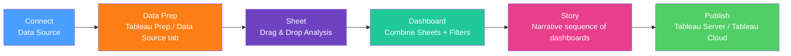

# Tableau Fundamentals

> [!abstract] TL;DR
> Tableau's core value proposition is speed of insight: drag-and-drop visual analytics that let analysts explore data faster than SQL or Python. Its key differentiators are LOD (Level of Detail) expressions for fixed-granularity calculations independent of the view, and table calculations for post-aggregation computations. Mastering these two concepts — and when to use each — separates a beginner Tableau user from a power user.

---

## Tableau Workflow



---

## Dimensions vs Measures

This is Tableau's most fundamental distinction:

| | Dimensions | Measures |
|---|---|---|
| **Color in pill** | Blue | Green |
| **Type** | Discrete (categorical) | Continuous (quantitative) |
| **Default role** | Label / slice the data | Aggregate (SUM, AVG, etc.) |
| **Examples** | Region, Product, Date, Customer ID | Revenue, Units, Profit |
| **In view** | Creates headers/axis labels | Creates axes with numeric values |

You can convert: right-click a field pill → "Convert to Discrete/Continuous" or "Convert to Dimension/Measure." A common pattern: drag a Date to Rows as Discrete (blue) for a categorical breakdown by year/month, or as Continuous (green) for a time-series axis.

---

## Marks Card — Encoding Channels

The Marks card controls how data is visually encoded. Every field you drop here adds a dimension to the encoding.

```
Marks card options:
├── Color   → encode a field as color hue/saturation
├── Size    → encode a quantitative field as mark size
├── Label   → show values as text labels
├── Detail  → add granularity without visual encoding (more data points)
├── Tooltip → show field value on hover
└── Shape   → use custom shapes per category (maps, scatter)
```

**Example: 4-dimensional scatter plot**
- X axis: Tenure
- Y axis: Revenue
- Color: Customer Tier (qualitative)
- Size: Number of Orders (quantitative)

---

## LOD Expressions — Tableau's Key Differentiator

LOD (Level of Detail) expressions compute aggregations at a *specified* granularity, independent of what is currently displayed in the view.

### FIXED

Computes at the specified dimension, ignoring the view's dimensions.

```tableau
// Total revenue per customer, regardless of what the view shows
{ FIXED [Customer ID] : SUM([Revenue]) }

// Use case: tag each order row with the customer's total spend
// even when the view is at order granularity
[Customer Total Revenue] = { FIXED [Customer ID] : SUM([Revenue]) }
```

### INCLUDE

Adds additional granularity beyond the current view.

```tableau
// Average revenue per order, within each region+product cell in the view
// (even if the view doesn't show Order ID)
{ INCLUDE [Order ID] : AVG([Revenue]) }
```

### EXCLUDE

Removes a dimension from the current view's granularity.

```tableau
// Useful for "percent of total" calculations
// View is: Region → Revenue, and you want % of grand total
{ EXCLUDE [Region] : SUM([Revenue]) }
// This gives grand total revenue regardless of the Region filter in view

// Percent of total:
SUM([Revenue]) / { EXCLUDE [Region] : SUM([Revenue]) }
```

### LOD vs Table Calculations vs Regular Aggregations

| Calculation | Computed At | Affected By Filters | Use Case |
|---|---|---|---|
| Regular `SUM([Revenue])` | View grain | Yes | Standard aggregation |
| Table Calculation (RUNNING_SUM) | Post-aggregation | Yes (data in view only) | Running totals, ranking |
| LOD FIXED | Specified grain | No (context filters only) | Customer-level stats in order-level view |
| LOD INCLUDE | Finer than view | Yes | Avg per sub-level |
| LOD EXCLUDE | Coarser than view | Context filters only | % of total |

---

## Table Calculations

Table calculations operate on the aggregated result set *after* Tableau queries the database. They are computed in Tableau, not in the database.

```tableau
// Running sum (cumulative revenue over time)
RUNNING_SUM(SUM([Revenue]))

// Percent of total (each bar as % of grand total)
SUM([Revenue]) / TOTAL(SUM([Revenue]))

// Moving average (3-period centered)
WINDOW_AVG(SUM([Revenue]), -1, 1)

// Year-over-year growth (percent change from same period last year)
(SUM([Revenue]) - LOOKUP(SUM([Revenue]), -1)) / ABS(LOOKUP(SUM([Revenue]), -1))

// Rank within partition
RANK(SUM([Revenue]))
```

**Addressing and Partitioning:**
- Table calculations compute *across* some dimension (addressing) and *within* each group of another (partitioning)
- Example: Running sum across Month, partitioned by Region → one running sum per region

---

## Sets and Groups

**Groups:** Manual or rule-based groupings of dimension members.
```
Right-click field → Create → Group
Select "East" and "West" → "Coastal" group
```

**Sets:** Dynamic binary IN/OUT classification based on a condition.
```
Right-click field → Create → Set
Condition: SUM([Revenue]) > 100,000
→ "Top customers" = IN, others = OUT
Use in filter or color encoding
```

**Combined Sets:** Intersection, union, or difference of two sets (e.g., customers who bought Product A AND Product B).

---

## Parameters

Parameters are workbook-level variables that users can change, enabling dynamic calculations.

```tableau
// Create parameter: "Metric Selector"
// Type: String, Allowable values: List: Revenue | Profit | Units

// Then use in a calculated field:
CASE [Metric Selector]
    WHEN "Revenue" THEN SUM([Revenue])
    WHEN "Profit"  THEN SUM([Profit])
    WHEN "Units"   THEN SUM([Units])
END

// Dynamic top-N filter using parameter [Top N]:
RANK(SUM([Revenue])) <= [Top N]

// Dynamic date granularity:
CASE [Date Level]
    WHEN "Day"   THEN DATETRUNC('day',   [Order Date])
    WHEN "Week"  THEN DATETRUNC('week',  [Order Date])
    WHEN "Month" THEN DATETRUNC('month', [Order Date])
END
```

---

## Tableau Prep — Data Preparation

Tableau Prep (separate application) is a visual ETL tool that produces clean, prepped data for Tableau Desktop.

```
Input (connect to sources) → Clean → Aggregate → Join/Union → Output (extract or published DS)
```

Key operations:
- **Clean step:** fix data types, rename fields, group similar values (fuzzy matching), remove nulls
- **Aggregate step:** group by dimensions, add measures — equivalent to SQL `GROUP BY`
- **Join step:** visual join with automatic field matching recommendation
- **Pivot step:** unpivot wide data to long format

---

## Tableau Server vs Tableau Cloud vs Tableau Public

| Option | Hosting | Cost | Best For |
|---|---|---|---|
| **Tableau Server** | On-premise / your cloud | License + infrastructure | Enterprises with data governance requirements |
| **Tableau Cloud** | Tableau-managed SaaS | Per user license | Most organizations — no infra overhead |
| **Tableau Public** | Tableau-managed, public | Free | Personal portfolios, public data journalism |
| **Tableau Desktop** | Local only | Creator license | Authoring; not for sharing |

---

## Common Pitfalls

- **Aggregating pre-aggregated data** — connecting to a table that already has `SUM` applied and then doing `SUM([Revenue])` double-counts. Check the grain of your data source.
- **Table calculation scope mistakes** — running sum that resets at the wrong level. Always set addressing/partitioning explicitly; never rely on "Table (Across then Down)" defaults.
- **LOD context filters** — FIXED LODs ignore dimension filters but respect context filters. If a slicer isn't affecting your LOD, convert the filter to a context filter (right-click filter → Add to Context).
- **Slow dashboards from many data blends** — Tableau data blending (joining data sources at query time) is row-limit sensitive and slow. Prefer pre-joined data in the warehouse or cross-database joins (Tableau 10.0+).
- **Publishing extracts vs live connections** — live connections provide real-time data but query the DB on every interaction. Extracts are fast but stale. Choose based on data freshness requirements.

---

## Review Questions

1. **LOD Design:** Your view shows Revenue by Category. You want to add a column showing each category's revenue as a percentage of the overall grand total, ignoring the Category filter in the view. Write the LOD expression for the denominator. Why does `TOTAL(SUM([Revenue]))` give a different result?

2. **Table Calculation:** Build a Tableau calculated field that shows the percentage change from the previous period (month-over-month growth). Walk through the addressing and partitioning setup needed for a view that shows Month on Columns and Region on Rows.

3. **Architecture:** A stakeholder wants a Tableau dashboard that shows real-time data (updated every 5 minutes) from a PostgreSQL database. What are the trade-offs between a live connection, a fast refresh extract, and a Hyper extract with incremental refresh? Which would you recommend for 10 million rows?

---

#DataAnalytics #Tableau #BI #BusinessIntelligence #LOD #Visualization #intermediate
