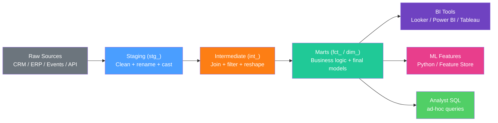

# dbt Analytics Engineering

> [!abstract] TL;DR
> dbt (data build tool) brings software engineering best practices to SQL analytics: models are version-controlled SELECT queries, each transformation is tested, dependencies are declared with `ref()`, and the lineage graph is auto-documented. The result is a reliable, collaborative, and auditable transformation layer in the warehouse — the foundation that BI tools, ML features, and analyst SQL all build on top of.

---

## Architecture



**Convention-over-configuration naming:**
- `stg_<source>__<entity>.sql` — staging model
- `int_<description>.sql` — intermediate model
- `fct_<entity>.sql` — fact table
- `dim_<entity>.sql` — dimension table

---

## Models — SELECT Queries as Files

Every dbt model is a `.sql` file containing a single SELECT statement. dbt wraps it in `CREATE TABLE AS` or `CREATE VIEW AS` depending on the materialization.

```sql
-- models/staging/stg_orders.sql
-- Staging: rename columns, cast types, filter out test data

SELECT
    id                                    AS order_id,
    customer_id,
    CAST(created_at AS TIMESTAMP)         AS order_timestamp,
    DATE_TRUNC('day', created_at)         AS order_date,
    UPPER(status)                         AS status,
    COALESCE(total_amount, 0)             AS revenue,
    currency
FROM {{ source('raw', 'orders') }}       -- reference to raw source table
WHERE environment = 'production'          -- exclude test orders
  AND id IS NOT NULL
```

```sql
-- models/marts/fct_orders.sql
-- Fact table: join staging models, add business logic

WITH orders AS (
    SELECT * FROM {{ ref('stg_orders') }}    -- ref() creates dependency
),

customers AS (
    SELECT * FROM {{ ref('stg_customers') }}
),

order_items AS (
    SELECT * FROM {{ ref('stg_order_items') }}
),

order_metrics AS (
    SELECT
        order_id,
        COUNT(*)    AS line_item_count,
        SUM(amount) AS subtotal
    FROM order_items
    GROUP BY 1
)

SELECT
    o.order_id,
    o.customer_id,
    o.order_timestamp,
    o.order_date,
    o.status,
    o.revenue,
    c.customer_tier,
    c.acquisition_channel,
    m.line_item_count,
    m.subtotal,
    o.revenue - m.subtotal AS discount_amount
FROM orders o
LEFT JOIN customers c     ON o.customer_id = c.customer_id
LEFT JOIN order_metrics m ON o.order_id = m.order_id
```

---

## Materializations

| Materialization | What dbt Does | Use When |
|---|---|---|
| `view` | `CREATE VIEW` — runs query at query time | Light transformations, fast to refresh |
| `table` | `CREATE TABLE AS SELECT` — materialized | Heavy transformations, slow source |
| `incremental` | Inserts/updates only new rows | Large fact tables, append-only data |
| `ephemeral` | CTE injected inline — no DB object | Simple intermediate logic used once |

```sql
-- models/marts/fct_events.sql (incremental model)
{{ config(materialized='incremental', unique_key='event_id') }}

SELECT
    event_id,
    user_id,
    event_type,
    event_timestamp,
    properties
FROM {{ source('raw', 'events') }}


-- Only process rows newer than the latest row in the existing table
WHERE event_timestamp > (SELECT MAX(event_timestamp) FROM {{ this }})

```

---

## `ref()` and `source()` — The Dependency System

```sql
-- ref() references another dbt model (creates DAG dependency)
SELECT * FROM {{ ref('stg_orders') }}

-- source() references a raw source table (declared in sources.yml)
SELECT * FROM {{ source('salesforce', 'opportunities') }}
```

```yaml
# models/staging/sources.yml
sources:
  - name: salesforce
    database: raw_data
    schema: salesforce
    tables:
      - name: opportunities
        description: "Raw Salesforce opportunity records"
        columns:
          - name: id
            description: "Salesforce Opportunity ID"
        loaded_at_field: systemmodstamp  # for source freshness checks
        freshness:
          warn_after: {count: 12, period: hour}
          error_after: {count: 24, period: hour}
```

---

## Testing — Built-in Quality Checks

```yaml
# models/marts/schema.yml
models:
  - name: fct_orders
    description: "One row per completed order with customer and revenue attributes"
    columns:
      - name: order_id
        description: "Unique order identifier"
        tests:
          - unique
          - not_null

      - name: status
        tests:
          - accepted_values:
              values: ["COMPLETED", "CANCELLED", "PENDING", "REFUNDED"]

      - name: customer_id
        tests:
          - not_null
          - relationships:
              to: ref('dim_customers')
              field: customer_id

      - name: revenue
        tests:
          - not_null
          - dbt_utils.accepted_range:
              min_value: 0
              max_value: 1000000
```

```bash
# Run all tests
dbt test

# Run tests for a specific model
dbt test --select fct_orders

# Run tests and models in one command
dbt build --select fct_orders+  # model + downstream dependencies
```

---

## Snapshots — SCD Type 2

Snapshots capture slowly changing dimensions (Type 2 history):

```sql
-- snapshots/customer_snapshot.sql


{{ config(
    target_schema='snapshots',
    unique_key='customer_id',
    strategy='timestamp',    -- or 'check'
    updated_at='updated_at',
) }}

SELECT
    customer_id,
    email,
    customer_tier,
    updated_at
FROM {{ source('raw', 'customers') }}


```

dbt adds `dbt_valid_from`, `dbt_valid_to`, and `dbt_scd_id` columns automatically. Query the snapshot to see what tier a customer was in at any point in history.

---

## Macros with Jinja2

Macros are reusable SQL functions defined in `.sql` files under `macros/`:

```sql
-- macros/cents_to_dollars.sql

    ROUND({{ column_name }} / 100.0, 2)


-- Usage in a model:
SELECT {{ cents_to_dollars('amount_cents') }} AS amount_dollars
FROM orders
```

```sql
-- macros/generate_date_spine.sql (generate a complete date series)

    {{ dbt_utils.date_spine(
        datepart="day",
        start_date="CAST('" ~ start_date ~ "' AS DATE)",
        end_date="CAST('" ~ end_date ~ "' AS DATE)"
    ) }}

```

---

## Packages

```yaml
# packages.yml
packages:
  - package: dbt-labs/dbt_utils
    version: [">=1.0.0", "<2.0.0"]
  - package: calogica/dbt_date
    version: [">=0.9.0"]

# Install with: dbt deps
```

Useful packages:
- `dbt_utils`: date spine, surrogate key, pivot, union_relations, accepted_range test
- `dbt_date`: date dimension generation, fiscal calendars
- `audit_helper`: compare model results between branches
- `elementary`: data observability (anomaly detection)

---

## dbt Docs and Lineage

```bash
# Generate documentation
dbt docs generate

# Serve locally
dbt docs serve  # opens http://localhost:8080

# The lineage graph shows:
# source → stg_ → int_ → fct_/dim_ → downstream
# Click any node to see its SQL, tests, and description
```

---

## dbt Cloud vs dbt Core (CLI)

| Feature | dbt Core (CLI) | dbt Cloud |
|---|---|---|
| Cost | Free (open source) | Paid per developer seat |
| Runs | Manually or via Airflow/Prefect | Managed scheduler + UI |
| IDE | Your editor | Browser-based IDE with lineage |
| CI/CD | Manual GitHub Actions setup | Built-in Slim CI (run only changed models) |
| Best for | Teams with existing orchestration | Teams wanting managed + fast onboarding |

---

## Common Pitfalls

- **Not using `unique_key` in incremental models** — without a unique key, incremental models append duplicates. Always specify `unique_key` and decide between `delete+insert` and `merge` strategies.
- **`ref()` in subqueries without CTEs** — deeply nested `ref()` calls create hard-to-debug models. Use CTEs at the top of every model file for clarity.
- **Testing without `dbt build`** — `dbt run` then `dbt test` runs tests on potentially stale data. Use `dbt build` to run models and tests together in dependency order.
- **Ephemeral models in production** — ephemeral models are CTEs injected at compile time. In large projects, they cause duplicate SQL and make query plans harder to optimize. Prefer `view` for reusable intermediates.
- **No description on columns** — dbt docs are only useful if columns are described. Make it a team policy: every column in a mart model must have a description in `schema.yml`.

---

## Review Questions

1. **Design:** You're modeling an e-commerce dataset with raw tables: `raw.orders`, `raw.order_items`, `raw.customers`, `raw.products`. Draw the dbt DAG (staging → intermediate → marts) with at least one intermediate model. What business logic goes in each layer?

2. **Incremental:** An `events` table receives 5 million new rows per day and has 3 billion total rows. Explain how an incremental dbt model handles this, what `unique_key` strategy you'd use (delete+insert vs merge), and what happens if a backfill is needed.

3. **Testing:** A `fct_revenue` model was working fine but broke downstream Looker dashboards showing negative revenue. Write the dbt schema test that would have caught this, and explain how you'd add a `dbt build` step to your CI/CD pipeline so this can't happen again.

---

#DataAnalytics #dbt #AnalyticsEngineering #SQL #DataTransformation #DataModeling #advanced
