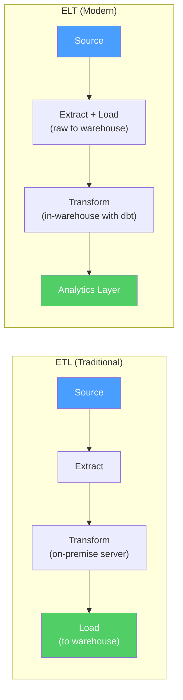

# Data Pipeline ETL and ELT

> [!abstract] TL;DR
> A data pipeline moves data from source systems to analytical destinations reliably, on a schedule, with quality guarantees. The ETL vs ELT distinction matters: modern cloud warehouses are powerful enough to do transformations *after* loading raw data (ELT), which means you retain raw history and can reprocess it. The modern data stack uses managed connectors (Fivetran/Airbyte) for EL, dbt for T, and Airflow/Prefect for orchestration.

---

## ETL vs ELT



| Aspect | ETL | ELT |
|---|---|---|
| Transform location | External server before load | Inside the warehouse after load |
| Raw data preserved | Often not (transformed data only) | Yes — raw layer stays intact |
| Reprocessing | Hard (must re-run ETL) | Easy (re-run dbt on raw data) |
| Warehouse cost | Lower (less data stored) | Higher (raw + transformed stored) |
| Flexibility | Low (schema change = re-engineer ETL) | High (add new transformations anytime) |
| **Recommendation** | Legacy systems | Modern cloud warehouses |

---

## Batch vs Streaming

| Aspect | Batch | Streaming |
|---|---|---|
| Latency | Minutes to hours | Seconds to milliseconds |
| Complexity | Low | High |
| Cost | Lower | Higher |
| Use cases | Daily reports, ML training | Fraud detection, real-time dashboards |
| Tools | Airflow, dbt, Spark batch | Kafka, Flink, Spark Structured Streaming |

**Decision rule:** If your stakeholders can accept data that is 1 hour old, use batch. Most analytics (dashboards, reports, cohort analysis) don't need sub-minute latency. Streaming is needed for: fraud detection, live leaderboards, real-time bidding, operational alerting.

---

## Ingestion Tools

### Fivetran — Managed SaaS Connectors

```
Configuration:
1. Choose source connector (Salesforce, Stripe, PostgreSQL, S3, etc.)
2. Provide credentials
3. Specify schema destination in warehouse
4. Fivetran handles: schema evolution, incremental syncs, retries, CDC
5. Cost: based on Monthly Active Rows (MAR) synced
```

Fivetran normalizes source data into a star-schema-like structure. Raw source tables land in a `<source>_<schema>` schema in your warehouse.

### Airbyte — Open Source Alternative

```yaml
# airbyte-config/connections/stripe-to-snowflake.yaml
sourceId: "stripe-source-uuid"
destinationId: "snowflake-dest-uuid"
syncCatalog:
  streams:
    - stream:
        name: charges
        namespace: stripe
      config:
        syncMode: incremental_append
        cursorField: ["created"]
        destinationSyncMode: append
schedule:
  scheduleType: cron
  cronExpression: "0 */6 * * *"  # every 6 hours
```

### Reverse ETL (Census, Hightouch)

Reverse ETL sends data *back* from the warehouse to operational tools:
```
Warehouse (analytics) → CRM (Salesforce) → Sales reps see customer health score
Warehouse (analytics) → Email tool (Braze) → Marketing sends personalized emails
```

---

## Orchestration: Apache Airflow

Airflow schedules, monitors, and manages pipeline dependencies as DAGs. Each pipeline is a Python file in the `dags/` directory.

### Core Concepts

```python
from airflow import DAG
from airflow.operators.python import PythonOperator
from airflow.operators.bash import BashOperator
from airflow.sensors.filesystem import FileSensor
from airflow.utils.dates import days_ago
from datetime import timedelta

with DAG(
    dag_id="analytics_pipeline",
    description="Daily analytics data pipeline",
    start_date=days_ago(1),
    schedule_interval="@daily",    # or "0 6 * * *" cron syntax
    catchup=False,                 # don't backfill missed runs
    max_active_runs=1,             # prevent overlapping runs
    default_args={
        "owner": "data-team",
        "retries": 3,
        "retry_delay": timedelta(minutes=5),
        "retry_exponential_backoff": True,
        "email_on_failure": True,
    },
    tags=["analytics", "daily"]
) as dag:

    # Sensor: wait for file to appear before processing
    wait_for_file = FileSensor(
        task_id="wait_for_export",
        filepath="/data/exports/{{ ds }}/orders.csv",
        poke_interval=300,  # check every 5 minutes
        timeout=7200,       # fail after 2 hours
        mode="reschedule"   # free worker slot while waiting
    )

    # Python task: extract data
    def extract(**context):
        run_date = context["ds"]  # execution date
        # ... extract logic ...
        context["task_instance"].xcom_push(key="row_count", value=1234)

    extract_task = PythonOperator(
        task_id="extract",
        python_callable=extract,
        provide_context=True
    )

    # Bash task: run dbt
    dbt_task = BashOperator(
        task_id="dbt_run",
        bash_command="cd /dbt && dbt run --select tag:daily --target prod"
    )

    # Dependencies: sensor → extract → dbt
    wait_for_file >> extract_task >> dbt_task
```

### Airflow Operators Reference

| Operator | Purpose |
|---|---|
| `PythonOperator` | Run a Python function |
| `BashOperator` | Run a shell command |
| `SQLExecuteQueryOperator` | Run SQL against a database |
| `S3ToSnowflakeOperator` | Load S3 files into Snowflake |
| `BigQueryOperator` | Run BigQuery SQL |
| `KubernetesPodOperator` | Run a Docker container in Kubernetes |
| `FileSensor` | Wait for a file to appear |
| `ExternalTaskSensor` | Wait for another DAG's task to complete |

---

## CDC — Change Data Capture

CDC captures row-level changes (INSERT, UPDATE, DELETE) from source databases in real-time, using the database's write-ahead log (WAL).

```
Source DB (PostgreSQL WAL)
    ↓
Debezium (Kafka Connect source connector)
    ↓
Kafka topic: orders.public.orders (each message = one change event)
    ↓
Kafka Consumer / Kafka Connect Sink
    ↓
Landing zone in Data Warehouse (raw CDC events)
    ↓
dbt model: apply MERGE to keep the analytical table in sync
```

**CDC event structure:**
```json
{
  "before": null,
  "after": {"id": 42, "status": "shipped", "updated_at": "2025-07-01T12:00:00Z"},
  "op": "u",        // u=update, c=insert, d=delete
  "ts_ms": 1751371200000
}
```

---

## Data Quality Monitoring

### Great Expectations

```python
import great_expectations as gx

context = gx.get_context()
batch = context.get_validator(
    datasource_name="my_snowflake",
    data_asset_name="fct_orders"
)

# Define expectations
batch.expect_column_values_to_not_be_null("order_id")
batch.expect_column_values_to_be_unique("order_id")
batch.expect_column_values_to_be_between("revenue", 0, 1_000_000)
batch.expect_column_values_to_be_in_set("status", ["COMPLETED", "CANCELLED", "PENDING"])
batch.expect_column_pair_values_A_to_be_greater_than_B("order_date", "signup_date")

# Run validation
results = batch.validate()
print(results.success)  # True if all pass
```

### Monte Carlo / Soda (Automated Data Observability)

These tools automatically monitor tables for anomalies without writing manual expectations:
- **Volume anomalies:** "orders table had 50% fewer rows than usual today"
- **Freshness alerts:** "table hasn't been updated in 6 hours (SLA = 3h)"
- **Schema changes:** "column `discount` was added/removed/renamed"
- **Distribution drift:** "null rate in `customer_id` jumped from 0.1% to 15%"

---

## Idempotency in Pipelines

An idempotent pipeline can be run multiple times and produces the same result. Essential for retries and backfills.

```sql
-- Non-idempotent (BAD) — appends duplicates on re-run
INSERT INTO daily_summary SELECT region, SUM(revenue) FROM orders WHERE date = '2025-07-01';

-- Idempotent (GOOD) — delete-then-insert or MERGE
DELETE FROM daily_summary WHERE date = '2025-07-01';
INSERT INTO daily_summary SELECT '2025-07-01', region, SUM(revenue)
FROM orders WHERE date = '2025-07-01' GROUP BY 1, 2;

-- Or use MERGE (upsert)
MERGE INTO daily_summary AS target
USING (
    SELECT '2025-07-01' AS date, region, SUM(revenue) AS revenue
    FROM orders WHERE date = '2025-07-01' GROUP BY 1, 2
) AS source
ON target.date = source.date AND target.region = source.region
WHEN MATCHED THEN UPDATE SET target.revenue = source.revenue
WHEN NOT MATCHED THEN INSERT (date, region, revenue) VALUES (source.date, source.region, source.revenue);
```

---

## Common Pitfalls

- **Non-idempotent pipelines** — if a pipeline fails halfway and retries, non-idempotent pipelines duplicate data. Always design for safe re-runs.
- **Hardcoded dates** — `WHERE order_date = '2025-07-01'` breaks in production. Use execution context variables (`{{ ds }}` in Airflow, `CURRENT_DATE - 1` in SQL).
- **Missing SLA monitoring** — pipelines fail silently and dashboards show stale data. Always set up alerts for pipeline failures AND for data freshness (table not updated > N hours).
- **Loading before testing** — loading bad data into the warehouse and discovering it after BI tools have displayed it to stakeholders destroys trust. Run data quality checks *before* loading to the serving layer.
- **No backfill strategy** — when a pipeline breaks, you need to backfill historical data. Airflow's `catchup=True` handles this for date-partitioned pipelines but can overwhelm databases if not throttled.

---

## Review Questions

1. **Architecture:** Design an ELT pipeline for a SaaS company that needs to: ingest Salesforce CRM data, Stripe payments, and custom app events from Kafka; apply transformations to create a unified customer 360 view; and serve the result to Power BI. Draw the component diagram with tools for each layer.

2. **Debugging:** Your Airflow DAG failed at the `dbt_run` task. The DAG retried 3 times and failed each time. Walk through the investigation process: what logs do you check, what the likely root causes are, and how you determine whether to trigger a manual retry or wait.

3. **Design:** You need to capture changes to a PostgreSQL `customers` table (status changes, tier changes) and maintain a full Type 2 history in Snowflake. Walk through the CDC approach with Debezium + Kafka and the Snowflake MERGE logic to maintain the history table.

---

#DataAnalytics #ETL #ELT #DataPipeline #Airflow #DataEngineering #advanced
