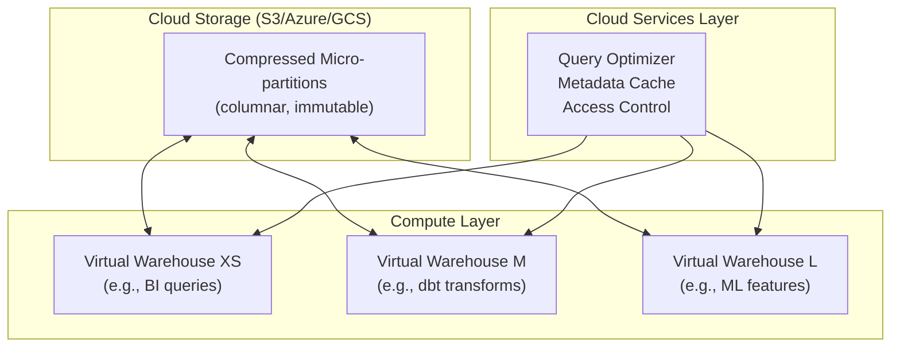

# Snowflake and BigQuery

> [!abstract] TL;DR
> Snowflake, BigQuery, and Redshift are the dominant cloud data warehouses — each with distinct architectural trade-offs. Snowflake separates compute and storage with virtual warehouses and is multi-cloud. BigQuery is serverless and priced per bytes scanned. Redshift runs on provisioned clusters with distribution and sort keys that require tuning. The SQL extensions (FLATTEN, QUALIFY, PIVOT in Snowflake; BQML in BigQuery) are what make each platform analytically powerful.

---

## Snowflake Architecture



**Key architectural properties:**
- **Separate compute and storage** — scale warehouses without copying data; multiple warehouses query same data concurrently without interference
- **Virtual warehouse sizing:** XS, S, M, L, XL, 2XL, 3XL, 4XL (each size = 2× the credits of the previous)
- **Auto-suspend / auto-resume** — warehouse suspends after N seconds of inactivity (cost control); resumes on next query
- **Multi-cluster warehouses** — for concurrency: automatically add compute nodes when query queue builds up
- **Time travel** — query data as it existed at any point in the past (default 1 day, Enterprise: 90 days)
- **Zero-copy cloning** — clone a table/schema/database instantly with no additional storage cost (great for dev/test environments)

---

## Snowflake SQL Extensions

### FLATTEN (Semi-structured Data)

```sql
-- FLATTEN expands arrays/objects from VARIANT columns
SELECT
    order_id,
    f.value:item_id::VARCHAR    AS item_id,
    f.value:quantity::INTEGER   AS quantity,
    f.value:price::FLOAT        AS item_price
FROM orders,
     LATERAL FLATTEN(input => order_items_json) f;
-- order_items_json is a VARIANT column containing a JSON array

-- Query nested JSON keys
SELECT
    data:user.id::VARCHAR    AS user_id,
    data:user.email::VARCHAR AS email,
    data:metadata.source::VARCHAR AS source
FROM raw_events;
```

### QUALIFY (Filter Window Function Results)

```sql
-- QUALIFY: filter rows based on window function result
-- Without QUALIFY, you'd need a subquery or CTE

-- Get each customer's most recent order
SELECT customer_id, order_id, order_date, revenue
FROM orders
QUALIFY ROW_NUMBER() OVER (PARTITION BY customer_id ORDER BY order_date DESC) = 1;

-- Get only the top 10% by revenue within each region
SELECT region, customer_id, revenue
FROM orders
QUALIFY NTILE(10) OVER (PARTITION BY region ORDER BY revenue DESC) = 1;
```

### PIVOT

```sql
-- Pivot monthly revenue across products
SELECT *
FROM (SELECT product, month, revenue FROM monthly_sales)
PIVOT (SUM(revenue) FOR product IN ('Widget A', 'Widget B', 'Widget C'))
AS pivoted_data;
```

### Time Travel

```sql
-- Query historical version of a table
SELECT * FROM orders AT (TIMESTAMP => '2025-06-01 09:00:00'::TIMESTAMP);

-- Restore accidentally deleted rows
CREATE OR REPLACE TABLE orders AS
SELECT * FROM orders BEFORE (STATEMENT => '<query-id>');

-- Zero-copy clone for dev
CREATE DATABASE dev_db CLONE prod_db;
CREATE TABLE orders_backup CLONE orders;
```

---

## BigQuery Architecture

BigQuery is **serverless** — no cluster to provision, no virtual warehouse to size. You submit queries and Google allocates compute automatically.

**Storage format:** Capacitor (Google's columnar format, built on top of Dremel). Data is stored in Google Cloud Storage, automatically replicated.

**Pricing models:**
- **On-demand:** `$6.25 per TB scanned` — cost-efficient for infrequent queries
- **Capacity (slots):** buy dedicated slot-hours — cost-efficient for constant high-volume workloads

### Partitioning and Clustering

```sql
-- Partitioned table (reduces bytes scanned by pruning partitions)
CREATE TABLE orders
PARTITION BY DATE(order_date)  -- or TIMESTAMP_TRUNC, or integer range
AS SELECT * FROM raw_orders;

-- Always filter on partition column to avoid full table scans
SELECT * FROM orders WHERE order_date BETWEEN '2025-01-01' AND '2025-03-31';

-- Clustered table (sorts data within each partition by cluster columns)
CREATE TABLE orders
PARTITION BY DATE(order_date)
CLUSTER BY region, customer_tier  -- up to 4 cluster columns
AS SELECT * FROM raw_orders;
-- Clustering prunes blocks when you filter by region or tier
-- BigQuery auto-manages re-clustering as data changes
```

### BigQuery SQL Extensions

```sql
-- INFORMATION_SCHEMA — metadata queries
SELECT table_name, row_count, size_bytes / (1024*1024*1024) AS size_gb
FROM `region-us`.INFORMATION_SCHEMA.TABLE_STORAGE
WHERE table_schema = 'analytics'
ORDER BY size_bytes DESC;

-- EXCEPT and REPLACE modifiers
SELECT * EXCEPT (ssn, internal_id)           -- select all columns except
FROM users;

SELECT * REPLACE (revenue / 100 AS revenue)  -- transform one column inline
FROM orders;

-- Array and struct operations
SELECT
    user_id,
    events[SAFE_OFFSET(0)].event_type AS first_event,  -- first array element
    ARRAY_LENGTH(events) AS event_count
FROM user_events;

-- UNNEST arrays (equivalent to Snowflake FLATTEN)
SELECT user_id, event.event_type, event.timestamp
FROM user_events,
     UNNEST(events) AS event;

-- BQML: in-database machine learning
CREATE OR REPLACE MODEL analytics.churn_model
OPTIONS (model_type='LOGISTIC_REG', input_label_cols=['churned'])
AS
SELECT tenure, avg_monthly_revenue, support_tickets, churned
FROM analytics.fct_customer_features;

-- Score predictions
SELECT * FROM ML.PREDICT(MODEL analytics.churn_model,
  SELECT * FROM analytics.fct_customer_features WHERE date = CURRENT_DATE()
);
```

---

## Redshift Architecture

Redshift is Amazon's data warehouse, built on PostgreSQL, running on EC2 clusters.

```
Leader Node: query parsing, optimization, orchestration
Compute Nodes: each stores a slice of data, executes in parallel
Node Types: RA3 (managed storage), DC2 (SSD, dense compute)
```

### Distribution Keys

Distribution key determines how data is distributed across compute nodes.

```sql
-- DISTKEY: rows with the same key value land on the same node
-- Ideal for join keys (reduces data movement during joins)
CREATE TABLE orders (
    order_id   BIGINT NOT NULL,
    customer_id BIGINT DISTKEY,  -- join with customers on this column
    order_date  DATE,
    revenue     DECIMAL(10,2)
);

-- DISTSTYLE ALL: copy full table to every node (for small dimension tables)
CREATE TABLE dim_product (...) DISTSTYLE ALL;

-- DISTSTYLE EVEN: round-robin (for tables with no clear join key)
CREATE TABLE log_events (...) DISTSTYLE EVEN;
```

### Sort Keys

Sort keys control the physical ordering of data on disk, enabling zone maps to skip blocks.

```sql
-- Compound sortkey (ordered by all listed columns, leftmost first)
COMPOUND SORTKEY (order_date, region)

-- Interleaved sortkey (equal weight to each column — better for multi-column filters)
INTERLEAVED SORTKEY (order_date, region, customer_id)

-- Rule: always sort by the most common filter column (usually date)
```

### Maintenance

```sql
-- VACUUM: reclaim deleted row space and resort data
VACUUM orders;
VACUUM orders TO 75 PERCENT;  -- partial vacuum, faster

-- ANALYZE: update statistics for query optimizer
ANALYZE orders;

-- Redshift Serverless (2023+): eliminates manual cluster sizing
-- Similar to BigQuery: pay per compute second used
```

---

## Comparison: Snowflake vs BigQuery vs Redshift

| Feature | Snowflake | BigQuery | Redshift |
|---|---|---|---|
| **Architecture** | Separate compute/storage | Serverless | Leader/compute nodes |
| **Pricing** | Credits per second of compute | Per TB scanned (or slots) | Hourly node cost (or serverless) |
| **Setup** | Minimal (choose warehouse size) | Zero (serverless) | Moderate (cluster sizing, distkeys) |
| **Multi-cloud** | Yes (AWS, Azure, GCP) | GCP only | AWS only |
| **Semi-structured** | Excellent (VARIANT type) | Good (ARRAY, STRUCT) | Limited |
| **Time travel** | Built-in (1-90 days) | No native time travel | No native time travel |
| **Best for** | Multi-cloud, flexible workloads | GCP-native, pay-per-query | AWS-native, predictable workloads |

---

## Common Pitfalls

- **Full table scans in BigQuery** — `SELECT *` from a 10 TB table costs ~$62.50 per query. Always specify columns and filter on partition column. Use `bq --dry_run` to estimate cost before running.
- **Over-provisioned Snowflake warehouses** — defaulting to Large warehouses when XS handles the workload wastes 16× the credits. Start XS and scale up only when queries are slow.
- **Snowflake auto-suspend too short** — if your BI tool sends queries rapidly, a 60-second auto-suspend causes constant resume overhead (5-20 second delay each time). Set auto-suspend to at least 5 minutes for interactive BI workloads.
- **Redshift join skew** — if the distribution key column has very uneven distribution (one customer with 80% of orders), one compute node gets all the data for that key. Choose a high-cardinality distribution key or use `DISTSTYLE EVEN`.
- **Not using QUALIFY in Snowflake** — writing a subquery or CTE just to filter on a window function result when `QUALIFY` achieves it in one query level.

---

## Review Questions

1. **Cost:** Your team runs a BigQuery query that scans a 5 TB events table every hour for a dashboard. Calculate the monthly cost at $6.25/TB and propose three ways to reduce it by 90%+ (hint: partitioning, clustering, materialized views).

2. **Snowflake Design:** You're loading 500 GB/day of event data into Snowflake. Describe the warehouse size, auto-suspend/resume settings, and loading strategy (COPY INTO vs Snowpipe) you'd use for the loading job vs the BI query workload. Should they share a warehouse?

3. **Redshift Tuning:** A Redshift query joining orders (1 billion rows) and customers (5 million rows) takes 45 minutes. Describe the distribution key and sort key choices for both tables that would reduce this to seconds, and explain what `EXPLAIN` output would tell you about the bottleneck.

---

#DataAnalytics #Snowflake #BigQuery #Redshift #CloudWarehouse #SQL #advanced
