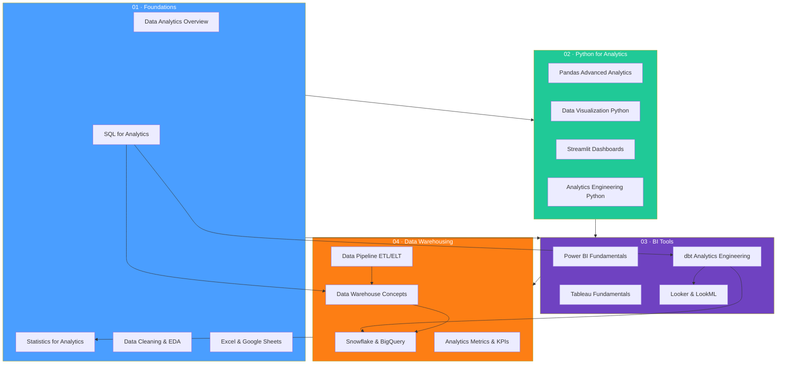

# Data Analytics and Business Intelligence

> [!abstract] About
> 17 notes across 4 sections covering the full analytics and BI stack — from statistical foundations and analytical SQL through Python analytics tooling, BI platforms (Power BI, Tableau, Looker, dbt), and cloud data warehousing (Snowflake, BigQuery). Covers all roles: Data Analyst, BI Developer, and Analytics Engineer.

---

## Concept Map

---

## Sections

| Section | Notes | Focus |
|---|---|---|
| **01 · Foundations** | 5 | Analytics disciplines, statistics, SQL patterns, EDA, Excel |
| **02 · Python for Analytics** | 4 | Advanced pandas, data viz, Streamlit, cloud connections |
| **03 · BI Tools** | 4 | Power BI/DAX, Tableau/LOD, Looker/LookML, dbt |
| **04 · Data Warehousing** | 4 | Dimensional modeling, cloud warehouses, pipelines, metrics |

---

## Section 01 — Foundations

| Note | Difficulty | Key Topics |
|---|---|---|
| [[Data_Analytics_Overview]] | Beginner | Four analytics types, role landscape, maturity model, key tools |
| [[Statistics_for_Analytics]] | Intermediate | Descriptive stats, distributions, hypothesis testing, A/B testing |
| [[SQL_for_Analytics]] | Intermediate | Window functions, CTEs, pivots, GROUPING SETS, cohort SQL, funnel SQL |
| [[Data_Cleaning_and_EDA]] | Intermediate | EDA workflow, missing data (MCAR/MAR/MNAR), outlier detection, data quality |
| [[Excel_and_Google_Sheets]] | Beginner | Power Query, pivot tables, XLOOKUP, dynamic arrays, Power Pivot + DAX |

---

## Section 02 — Python for Analytics

| Note | Difficulty | Key Topics |
|---|---|---|
| [[Pandas_Advanced_Analytics]] | Intermediate | Multi-index, advanced groupby, pivot/melt/stack, rolling windows, resampling |
| [[Data_Visualization_Python]] | Intermediate | Matplotlib architecture, Seaborn statistical plots, Plotly interactive, Altair |
| [[Streamlit_Dashboards]] | Intermediate | Widgets, caching, session state, layout, SQL integration, multi-page apps |
| [[Analytics_Engineering_Python]] | Advanced | Snowflake/BigQuery connectors, API reading, Polars, DuckDB, Airflow, Prefect |

---

## Section 03 — BI Tools

| Note | Difficulty | Key Topics |
|---|---|---|
| [[Power_BI_Fundamentals]] | Intermediate | Star schema, Power Query (M), relationships, DAX (CALCULATE, iterators, time intelligence) |
| [[Tableau_Fundamentals]] | Intermediate | Dimensions vs measures, Marks card, LOD expressions, table calculations, parameters |
| [[Looker_and_LookML]] | Advanced | Semantic layer architecture, views/explores/models, derived tables, PDTs, LookML |
| [[dbt_Analytics_Engineering]] | Advanced | Models, materializations, ref()/source(), testing, snapshots (SCD2), macros, packages |

---

## Section 04 — Data Warehousing

| Note | Difficulty | Key Topics |
|---|---|---|
| [[Data_Warehouse_Concepts]] | Intermediate | OLTP vs OLAP, dimensional modeling, star/snowflake schema, SCDs, modern data stack |
| [[Snowflake_and_BigQuery]] | Advanced | Snowflake architecture/time travel/FLATTEN/QUALIFY, BigQuery partitioning/BQML, Redshift distkeys |
| [[Data_Pipeline_ETL_ELT]] | Advanced | ETL vs ELT, batch vs streaming, Fivetran/Airbyte, Airflow DAGs, CDC, data quality |
| [[Analytics_Metrics_and_KPIs]] | Intermediate | North Star metric, DAU/MAU/retention/LTV/CAC, cohort analysis, attribution, A/B analysis |

---

## Learning Paths

### Path A — Data Analyst

> Goal: Answer business questions with SQL, Python, and BI tools

1. [[Data_Analytics_Overview]] — understand the landscape and your role
2. [[Statistics_for_Analytics]] — speak the language of data
3. [[SQL_for_Analytics]] — the core analytical skill
4. [[Data_Cleaning_and_EDA]] — understand your data before reporting
5. [[Excel_and_Google_Sheets]] — stakeholder-facing analysis
6. [[Pandas_Advanced_Analytics]] — Python for heavier analysis
7. [[Data_Visualization_Python]] — code-based charts
8. [[Analytics_Metrics_and_KPIs]] — measure what matters
9. [[Power_BI_Fundamentals]] or [[Tableau_Fundamentals]] — your org's BI tool
10. [[Data_Warehouse_Concepts]] — understand where your data comes from

---

### Path B — BI Developer

> Goal: Build self-service reporting platforms with Power BI or Tableau

1. [[Data_Analytics_Overview]] — understand the reporting landscape
2. [[SQL_for_Analytics]] — queries the BI tool generates
3. [[Data_Warehouse_Concepts]] — star schema drives BI tool performance
4. [[Power_BI_Fundamentals]] — master DAX and data model design
5. [[Tableau_Fundamentals]] — LOD expressions and calculated fields
6. [[Looker_and_LookML]] — semantic layer for governed self-service
7. [[dbt_Analytics_Engineering]] — the clean data models BI tools need
8. [[Excel_and_Google_Sheets]] — stakeholder-facing deliverables
9. [[Statistics_for_Analytics]] — interpret what the charts mean
10. [[Analytics_Metrics_and_KPIs]] — design dashboards around the right metrics

---

### Path C — Analytics Engineer

> Goal: Build the clean, tested, documented data models that power analytics

1. [[Data_Analytics_Overview]] — understand what you're building for
2. [[SQL_for_Analytics]] — analytical SQL is the primary language
3. [[Data_Warehouse_Concepts]] — dimensional modeling is the design framework
4. [[dbt_Analytics_Engineering]] — the central tool of the role
5. [[Snowflake_and_BigQuery]] — the platform your dbt runs on
6. [[Data_Pipeline_ETL_ELT]] — understand the full pipeline you're part of
7. [[Analytics_Engineering_Python]] — Python for non-SQL transformations
8. [[Looker_and_LookML]] — semantic layer above your dbt models
9. [[Analytics_Metrics_and_KPIs]] — translate business requirements to models
10. [[Data_Cleaning_and_EDA]] — data profiling for new sources

---

## Cross-Vault Links

- [[_MOC_AI_ML_Master]] — predictive analytics, ML models, feature engineering
- [[_MOC_Database_Master]] — PostgreSQL, MySQL, indexing, query optimization
- [[_MOC_DSA_Master]] — data structures underlying warehouse internals
- [[_MOC_DevOps_Master]] — CI/CD for analytics pipelines, infrastructure as code

---

#DataAnalytics #BusinessIntelligence #AnalyticsEngineering #MOC
