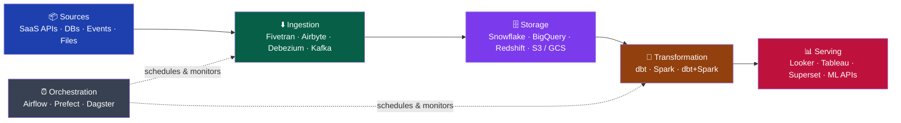

# Data Engineering Overview

> [!abstract] TL;DR
> Data engineering is the discipline of building and maintaining the infrastructure and pipelines that move raw data from source systems into a reliable, queryable state for analysts, scientists, and ML engineers. The field has matured from ad-hoc scripts into a rigorous software engineering practice with its own toolchain, architectural patterns, and quality standards. Understanding the modern data stack layers and knowing when to apply batch vs. streaming are the two most foundational skills.

## Role Landscape: Data Engineer vs. Adjacent Roles

One of the most common points of confusion in data-heavy organisations is where one role ends and another begins. The table below maps each role by primary output, key skills, and typical toolchain.

| Role | Primary Output | Core Skills | Typical Toolchain |
|---|---|---|---|
| **Data Engineer** | Reliable pipelines, clean datasets, platform infrastructure | SQL, Python, distributed systems, DevOps | Spark, Airflow, dbt, Kafka, Snowflake/BigQuery |
| **Data Analyst** | Dashboards, ad-hoc queries, business reports | SQL, Excel, statistics, domain knowledge | Looker, Tableau, Mode, BigQuery |
| **Data Scientist** | Statistical models, experiments, predictions | Python/R, ML algorithms, feature engineering | Jupyter, scikit-learn, MLflow, pandas |
| **ML Engineer** | Production ML systems, model serving, retraining pipelines | Python, software engineering, MLOps, Spark | TensorFlow/PyTorch, Kubernetes, Feast, Ray |
| **Analytics Engineer** | Semantic layer, curated dbt models, documentation | SQL, dbt, data modeling | dbt, Metabase, Looker |

---

## The Modern Data Stack

The modern data stack organises tools into layers, each with a clear responsibility boundary.



**Layer responsibilities:**

- **Sources** — operational DBs (Postgres, MySQL), SaaS tools (Salesforce, Stripe), event streams (Kafka), files (S3, SFTP)
- **Ingestion** — extract raw data and land it in the warehouse with minimal transformation (ELT, not ETL)
- **Storage** — centralised, columnar warehouse or lake; the single source of truth for analytics
- **Transformation** — apply business logic inside the warehouse using SQL (dbt) or distributed compute (Spark)
- **Serving** — BI tools read from curated models; ML pipelines read feature stores or data marts
- **Orchestration** — schedules, monitors, and retries all pipeline tasks; provides lineage and alerting

---

## Batch vs. Streaming

Choosing the wrong processing mode is a common architectural mistake. Use this table before deciding.

| Dimension | Batch | Streaming |
|-----------|-------|-----------|
| **Latency** | Minutes to hours | Milliseconds to seconds |
| **Complexity** | Low — SQL or simple Python | High — state management, watermarks, exactly-once |
| **Cost** | Lower — run on schedule | Higher — always-on infrastructure |
| **Fault model** | Rerun the job | Checkpointing, offset management |
| **Use cases** | Nightly reports, historical backfills, ETL jobs | Fraud detection, live dashboards, IoT monitoring |
| **Tools** | Spark batch, dbt, SQL | Kafka Streams, Spark Structured Streaming, Flink |

> [!tip] Default to batch.
> Streaming solves a latency problem. If your stakeholders are happy with data that is 1 hour old, batch is simpler, cheaper, and easier to test. Only add streaming when the business requires it.

---

## Data Engineering Maturity Model


Most teams spend years at Level 3. Resist jumping to Level 5 prematurely — streaming infrastructure without solid batch foundations creates operational chaos.

---

## Data Contracts

A data contract is a formal agreement between the team that produces data and the team that consumes it. It defines the schema, semantics, SLA, and quality expectations.

```yaml
# Example data contract (datacontract.com spec)
dataContractSpecification: 0.9.3
id: orders-v1
info:
  title: Orders Event Stream
  version: 1.0.0
  owner: checkout-team
  contact:
    email: checkout@company.com

models:
  orders:
    description: One record per completed order
    fields:
      order_id:
        type: string
        required: true
        unique: true
      customer_id:
        type: string
        required: true
      total_amount:
        type: number
        minimum: 0
      status:
        type: string
        enum: [pending, confirmed, shipped, delivered, cancelled]
      created_at:
        type: timestamp
        required: true

servicelevels:
  freshness:
    description: Data must arrive within 5 minutes of order creation
    threshold: PT5M
  availability:
    description: Pipeline must be available 99.5% of business hours

quality:
  type: SodaCL
  specification:
    checks for orders:
      - row_count > 0
      - missing_count(order_id) = 0
      - duplicate_count(order_id) = 0
```

---

## DataOps Principles

DataOps applies DevOps practices to data pipelines:

1. **Version control everything** — pipelines, SQL models, schemas, tests, and config all live in git
2. **Test early and often** — data quality tests run in CI before code merges and again after every run
3. **Automate deployments** — pipeline changes deploy via CI/CD, not manual Airflow uploads
4. **Monitor with alerting** — SLA breaches, row count anomalies, and schema drift page on-call
5. **Idempotent pipelines** — re-running any pipeline at any time produces the same result
6. **Observability over logging** — data lineage, freshness metrics, and volume trends are first-class

---

## Key Metrics for Data Engineers

| Metric | Definition | Healthy Target |
|--------|-----------|----------------|
| Pipeline SLA breach rate | % of pipelines that miss their freshness SLA | < 1% |
| Data quality pass rate | % of dbt/Great Expectations tests passing | > 99.5% |
| Mean time to detection (MTTD) | How quickly data incidents are discovered | < 30 min |
| Mean time to resolution (MTTR) | How quickly incidents are resolved | < 2 hours |
| Ingestion lag (streaming) | Time from event creation to availability in warehouse | < 5 min |

---

## Common Pitfalls

1. **Premature streaming** — adding Kafka/Flink before batch pipelines are reliable wastes engineering time on infrastructure instead of data quality.
2. **Storing raw data with business logic applied** — always land raw data untransformed; apply logic in the transformation layer so you can reprocess.
3. **Monotonically increasing shard keys** — using `order_id` or `created_at` as Kafka partition key or Spark partition column creates hotspots; use hash partitioning.
4. **Non-idempotent pipelines** — `INSERT INTO` without deduplication creates duplicates on retry; use `MERGE` or partition overwrite.
5. **Over-engineering early** — a `cron` + Python script is often the right tool at Stage 1; reach for Airflow/Spark only when you feel the pain.
6. **Ignoring schema evolution** — producers change schemas without warning; enforce contracts with schema registries and data contract SLAs.

---

## Review Questions

1. **What is the difference between a Data Engineer and an Analytics Engineer?**
   *Answer: Data Engineers build and maintain the ingestion and infrastructure layers; Analytics Engineers own the transformation layer (dbt models, semantic layer) and work closer to business definitions.*

2. **When should you choose streaming over batch?**
   *Answer: When the business requires sub-minute data freshness — fraud detection, live dashboards, IoT monitoring. For most reporting use cases, batch (hourly or nightly) is simpler and cheaper.*

3. **What is a data contract and why does it matter?**
   *Answer: A data contract is a formal schema + semantics + SLA agreement between producer and consumer. It prevents silent breaking changes from crashing downstream pipelines.*

4. **What does "idempotent pipeline" mean and how do you achieve it?**
   *Answer: Running the pipeline multiple times produces the same result. Achieved via partition overwrite (replace, don't append), MERGE/UPSERT statements, and deduplication on unique keys.*

---

## See Also

- [[Data_Modeling_for_Engineering]] — dimensional modeling, Data Vault, medallion architecture
- [[Distributed_Computing]] — MapReduce vs Spark, DAG execution, partitioning
- [[Storage_Formats]] — Parquet, Avro, Delta Lake, Iceberg
- [[Data_Quality_and_Observability]] — Great Expectations, dbt tests, data contracts
- [[_MOC_Data_Analytics_Master]] — the analytics consumer of data engineering output
- [[_MOC_Database_Master]] — storage fundamentals that underpin data warehouses

#DataEngineering #Overview #DataStack
