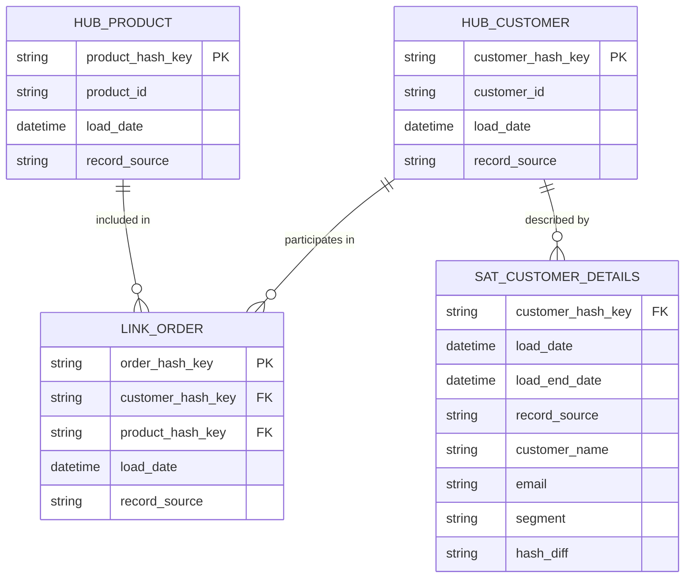
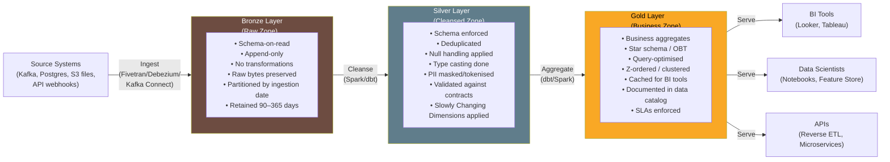

# Data Modeling for Engineering

> [!abstract] TL;DR
> Data modeling for engineering is about structuring data so it is reliably queryable, maintainable, and evolvable. The three dominant paradigms are dimensional modeling (star/snowflake schema — optimised for analytical queries), Data Vault 2.0 (hub-link-satellite — optimised for auditability and history), and the Medallion architecture (bronze/silver/gold — a layered refinement pipeline). The right choice depends on query patterns, regulatory requirements, team maturity, and operational overhead tolerance.

## Dimensional Modeling

Dimensional modeling, pioneered by Ralph Kimball, is the bedrock of data warehousing. It organises data into **fact tables** and **dimension tables** to make analytical queries fast and intuitive.

### Fact Tables

Fact tables record measurements or events. They are the quantitative core of a data model.

| Characteristic | Detail |
|---|---|
| Grain | One row = one event or measurement at a specific level of detail |
| Content | Numeric measures (amounts, counts, durations) + foreign keys to dimensions |
| Sparsity | Generally large and wide |
| Examples | `fact_orders`, `fact_page_views`, `fact_transactions` |

```sql
-- Example fact table: fact_orders
CREATE TABLE fact_orders (
    order_key        BIGINT PRIMARY KEY,       -- surrogate key
    customer_key     BIGINT REFERENCES dim_customer(customer_key),
    product_key      BIGINT REFERENCES dim_product(product_key),
    date_key         INT    REFERENCES dim_date(date_key),
    store_key        INT    REFERENCES dim_store(store_key),
    -- measures
    quantity         INT            NOT NULL,
    unit_price_usd   DECIMAL(10,4)  NOT NULL,
    revenue_usd      DECIMAL(10,4)  NOT NULL,
    discount_pct     DECIMAL(5,4)   DEFAULT 0
);
```

**Fact table types:**
- **Transaction fact** — One row per event (most common). E.g., each order line item.
- **Periodic snapshot fact** — State at regular intervals. E.g., account balance at end of each month.
- **Accumulating snapshot fact** — One row per process instance, updated as it progresses. E.g., order fulfilment pipeline (order → pick → ship → deliver columns).

### Dimension Tables

Dimension tables provide context and descriptive attributes for the facts. They are what users filter, group, and label by.

```sql
-- Example dimension table: dim_customer
CREATE TABLE dim_customer (
    customer_key     BIGINT PRIMARY KEY,       -- surrogate key
    customer_id      VARCHAR(50) NOT NULL,     -- natural/business key
    customer_name    VARCHAR(200),
    email            VARCHAR(200),
    country          VARCHAR(100),
    city             VARCHAR(100),
    segment          VARCHAR(50),              -- e.g., 'Enterprise', 'SMB'
    -- SCD columns
    effective_from   DATE NOT NULL,
    effective_to     DATE,                     -- NULL = current record
    is_current       BOOLEAN DEFAULT TRUE
);
```

**Slowly Changing Dimensions (SCD):**
- **SCD Type 1** — Overwrite. Lose history. Simple to maintain.
- **SCD Type 2** — Add new row with new `effective_from`, set `effective_to` on old row. Full history preserved. Most common in warehouses.
- **SCD Type 3** — Add `previous_value` column. Only tracks one prior state.

### Star Schema vs. Snowflake Schema

```
Star Schema:                          Snowflake Schema:

        dim_date                          dim_date
           |                                 |
dim_store—fact_orders—dim_product    dim_store—fact_orders—dim_product—dim_category
           |                                 |                              |
      dim_customer                    dim_customer              dim_subcategory
                                             |
                                        dim_geography
```

| Aspect | Star Schema | Snowflake Schema |
|---|---|---|
| Dimension normalisation | Denormalised (flat) | Normalised (nested hierarchy) |
| Query performance | Fewer joins → faster | More joins → slower |
| Storage | Slightly more (redundant data) | Slightly less |
| Ease of understanding | Simple | More complex |
| Recommendation | **Preferred for analytics** | Use when hierarchy depth matters |

> [!tip] Practical guidance
> Default to star schema. The storage savings from snowflaking are irrelevant at modern warehouse pricing, but the additional joins meaningfully hurt query performance and make exploration harder. Only snowflake when you have deep, multi-level hierarchies (e.g., geography: city → state → country → region).

---

## Data Vault 2.0

Data Vault 2.0 (DV2) is a modeling methodology designed for **auditability**, **historical tracking**, and **flexibility** in enterprise data warehouses. It shines in regulated industries (finance, healthcare, insurance) where you must prove what the data looked like at any point in time and where it came from.

### The Three Building Blocks



**Hubs** — Store unique business keys and their load metadata. No descriptive attributes.
- Contains: hash key (MD5/SHA of business key), business key, load date, record source.
- One hub per business concept (customer, product, order, account).

**Links** — Store relationships between hubs. Model many-to-many associations.
- Contains: hash key of the link, foreign hash keys to related hubs, load date, record source.
- Links never change once loaded (append-only).

**Satellites** — Store descriptive attributes and their history for hubs and links.
- Contains: hash key (FK to hub/link), load date, load end date (or hash diff), all descriptive attributes.
- When an attribute changes, a new row is inserted with a new `load_date`. History is fully preserved.

### Data Vault Loading Pattern

```python
# Pseudocode: Load Hub from staging
INSERT INTO hub_customer (customer_hash_key, customer_id, load_date, record_source)
SELECT
    MD5(UPPER(TRIM(customer_id)))  AS customer_hash_key,
    customer_id,
    CURRENT_TIMESTAMP              AS load_date,
    'salesforce_crm'               AS record_source
FROM staging_customers stg
WHERE NOT EXISTS (
    SELECT 1 FROM hub_customer h
    WHERE h.customer_hash_key = MD5(UPPER(TRIM(stg.customer_id)))
);
-- Hubs are always insert-only. Never update.

# Load Satellite (captures changes via hash_diff)
INSERT INTO sat_customer_details
SELECT
    MD5(UPPER(TRIM(customer_id)))  AS customer_hash_key,
    CURRENT_TIMESTAMP              AS load_date,
    NULL                           AS load_end_date,
    'salesforce_crm'               AS record_source,
    customer_name, email, segment,
    MD5(CONCAT(customer_name, email, segment)) AS hash_diff
FROM staging_customers stg
WHERE NOT EXISTS (
    SELECT 1 FROM sat_customer_details s
    WHERE s.customer_hash_key = MD5(UPPER(TRIM(stg.customer_id)))
      AND s.hash_diff = MD5(CONCAT(stg.customer_name, stg.email, stg.segment))
      AND s.load_end_date IS NULL
);
```

### When to Use Data Vault

- Regulated industry where complete audit trail is mandatory
- Multiple source systems feeding the same business entities (hub acts as integration point)
- Business keys are well-defined and stable
- Long project lifespan with anticipated schema changes
- Team has DV expertise (there is operational overhead)

### When NOT to Use Data Vault

- Small team, fast iteration cycles
- Query performance is primary concern (DV requires many joins to reconstruct a business object)
- Clear, stable source of truth (Kimball star schema is simpler and faster)

---

## One Big Table (OBT) — Anti-pattern and Exceptions

OBT is a pre-joined, fully denormalised wide table containing all attributes for a domain in a single table.

```sql
-- OBT example: all order attributes pre-joined
SELECT
    o.order_id, o.order_date, o.revenue_usd,
    c.customer_name, c.segment, c.country,
    p.product_name, p.category, p.subcategory,
    s.store_name, s.region
FROM fact_orders o
JOIN dim_customer c ON o.customer_key = c.customer_key
JOIN dim_product p ON o.product_key = p.product_key
JOIN dim_store s ON o.store_key = s.store_key
-- Materialised as a single table with 50+ columns
```

**Apparent benefits:** Zero-join queries, maximum query speed for the specific use case it was built for.

**Real costs:**
- **Maintenance burden** — Every upstream schema change must be reflected in the OBT.
- **Storage waste** — Dimension attributes repeated across millions of rows (customer name stored once per order, not once per customer).
- **Debugging difficulty** — When revenue looks wrong, is it the join? The filter? The measure? Hard to isolate.
- **Inflexibility** — Adding a new dimension attribute requires rewriting the entire OBT.

**When OBT is acceptable:**
- ML feature serving where a model has a fixed feature set and latency is critical.
- Specific high-traffic BI dashboard with a completely stable query pattern.
- Prototype / exploration layer for a data science team.

> [!warning] Default: avoid OBT in production warehouse models. Prefer a properly normalised star schema served through a semantic layer (dbt metrics, Looker LookML).

---

## Lakehouse Architecture

Traditional data architectures forced a choice: data lakes (cheap, unstructured, no ACID) or data warehouses (expensive, structured, ACID). The lakehouse pattern eliminates this choice by layering open table formats on top of cloud object stores.

### Open Table Formats Compared

| Feature | Delta Lake | Apache Iceberg | Apache Hudi |
|---|---|---|---|
| ACID transactions | Yes | Yes | Yes |
| Time travel | Yes | Yes | Yes |
| Schema evolution | Yes | Yes | Yes |
| Hidden partitioning | No | **Yes** | No |
| Partition evolution | Limited | **Yes** | Limited |
| Primary use case | Databricks-centric | Multi-engine, cloud-native | Streaming upserts (Uber) |
| Best engines | Spark, Databricks | Spark, Flink, Trino, Hive | Spark, Flink |
| Merge/upsert support | MERGE INTO | MERGE INTO | UPSERT |
| Storage format | Parquet | Parquet | Parquet + Avro |

See [[Storage_Formats]] for a deep dive on each format's internals.

---

## Medallion Architecture (Bronze / Silver / Gold)

The Medallion architecture is the standard layering pattern for lakehouses. It provides a clear separation of concerns — raw data preservation, cleaned canonical data, and query-optimised business data.



### Bronze Layer — Raw Zone

The bronze layer is the **immutable archive** of all incoming data exactly as received.

```python
# PySpark: Bronze ingestion from Kafka
from pyspark.sql import SparkSession
from pyspark.sql.functions import current_timestamp, col

spark = SparkSession.builder.appName("bronze_ingestion").getOrCreate()

# Read from Kafka
kafka_df = (
    spark.readStream
    .format("kafka")
    .option("kafka.bootstrap.servers", "broker:9092")
    .option("subscribe", "orders_raw")
    .option("startingOffsets", "latest")
    .load()
)

# Write to Bronze as Delta — no transformation, just land the raw bytes
bronze_df = kafka_df.select(
    col("value").cast("string").alias("raw_payload"),
    col("topic"),
    col("partition"),
    col("offset"),
    col("timestamp").alias("kafka_timestamp"),
    current_timestamp().alias("ingestion_timestamp")
)

(
    bronze_df.writeStream
    .format("delta")
    .outputMode("append")
    .option("checkpointLocation", "s3://datalake/checkpoints/bronze/orders")
    .option("path", "s3://datalake/bronze/orders")
    .partitionBy("ingestion_timestamp")   # partition by date for pruning
    .start()
)
```

**Design rules:**
- Append-only. Never delete or update bronze.
- Store raw payloads (JSON strings, Avro bytes) — parse later.
- Include metadata: `ingestion_timestamp`, `source_system`, `file_name` or Kafka offset.
- Long retention (90 days minimum; often 1–3 years for compliance).

### Silver Layer — Cleansed Zone

Silver is the **canonical, trusted** representation of each business entity.

```python
# PySpark: Silver transformation from Bronze
from pyspark.sql.functions import from_json, col, when, lit, current_timestamp
from pyspark.sql.types import StructType, StructField, StringType, DecimalType, TimestampType

order_schema = StructType([
    StructField("order_id", StringType(), False),
    StructField("customer_id", StringType(), False),
    StructField("product_id", StringType(), True),
    StructField("revenue", DecimalType(10, 4), True),
    StructField("order_ts", TimestampType(), True),
])

silver_df = (
    spark.read.format("delta").load("s3://datalake/bronze/orders")
    # Parse JSON payload
    .withColumn("data", from_json(col("raw_payload"), order_schema))
    .select("data.*", "ingestion_timestamp")
    # Type coercion and cleaning
    .withColumn("revenue_usd", col("revenue").cast("decimal(10,4)"))
    .withColumn("revenue_usd", when(col("revenue_usd") < 0, lit(None)).otherwise(col("revenue_usd")))
    # Deduplication: keep latest record per order_id
    .dropDuplicates(["order_id"])
    # Add audit columns
    .withColumn("silver_load_timestamp", current_timestamp())
)

# Write with MERGE to handle deduplication across incremental loads
silver_df.createOrReplaceTempView("updates")
spark.sql("""
    MERGE INTO delta.`s3://datalake/silver/orders` AS target
    USING updates AS source
    ON target.order_id = source.order_id
    WHEN MATCHED AND source.order_ts > target.order_ts THEN UPDATE SET *
    WHEN NOT MATCHED THEN INSERT *
""")
```

**Design rules:**
- Enforce schema — reject or quarantine malformed records.
- Deduplicate by business key.
- Apply type casting, null handling, basic business rules.
- Mask or tokenise PII at this layer.
- Partition by business date (not ingestion date).

### Gold Layer — Business Zone

Gold tables are the **serving layer** — built for the specific consumption patterns of analysts and dashboards.

```sql
-- dbt Gold model: fct_daily_revenue.sql
{{ config(
    materialized='incremental',
    unique_key='report_date || product_category',
    cluster_by=['report_date', 'product_category'],
    file_format='delta'
) }}

WITH daily_orders AS (
    SELECT
        DATE_TRUNC('day', order_ts)  AS report_date,
        p.category                   AS product_category,
        c.segment                    AS customer_segment,
        COUNT(DISTINCT o.order_id)   AS order_count,
        SUM(o.revenue_usd)           AS total_revenue_usd,
        AVG(o.revenue_usd)           AS avg_order_value_usd
    FROM {{ ref('silver_orders') }} o
    JOIN {{ ref('silver_products') }} p ON o.product_id = p.product_id
    JOIN {{ ref('silver_customers') }} c ON o.customer_id = c.customer_id
    WHERE o.revenue_usd IS NOT NULL
    
        AND order_ts >= (SELECT MAX(report_date) FROM {{ this }}) - INTERVAL 3 DAYS
    
    GROUP BY 1, 2, 3
)

SELECT * FROM daily_orders
```

**Design rules:**
- Query-optimised: Z-order/cluster on common filter columns.
- Pre-aggregate where possible (reduce query cost for BI tools).
- Fully documented in data catalog with column descriptions.
- Tested with dbt and SLA monitoring.

### Medallion Architecture: Choosing Layer Granularity

| Question | Bronze | Silver | Gold |
|---|---|---|---|
| Who consumes this? | Platform engineers, data engineers (debugging) | Data engineers, data scientists | Analysts, BI tools, APIs |
| Schema enforcement? | None (schema-on-read) | Enforced | Enforced + aggregated |
| Is PII present? | Yes (masked at Silver) | Masked/tokenised | No PII |
| Latency from ingest? | Seconds (streaming) or minutes (batch) | Minutes to 30 min | 30 min to hours |
| Historical retention | Maximum | Business-defined | Query-relevant window |

---

## Choosing the Right Modeling Approach

| Factor | Kimball Star Schema | Data Vault 2.0 | Medallion + OBT |
|---|---|---|---|
| Team size | Any | Large, specialised | Any |
| Query performance | High | Medium (many joins) | High (Gold layer) |
| Historical auditability | Limited (SCD2) | **Excellent** | Good (Bronze retained) |
| Regulatory compliance | Adequate | **Best** | Good |
| Schema change flexibility | Moderate | **High** | High |
| Operational overhead | Low | High | Medium |
| Best for | General analytics | Finance, insurance, healthcare | Cloud-native lakehouses |

---

## Common Pitfalls

- **Wrong grain on fact tables** — Mixing order-level and line-item-level facts in the same table. Define the grain explicitly before designing.
- **Business logic in Bronze** — Applying transformations at the ingestion layer makes debugging impossible. Keep Bronze raw.
- **Overusing Gold** — Creating a Gold table for every conceivable query pattern. Gold tables are expensive to maintain; create them only for high-traffic, stable use cases.
- **Forgetting SCD2 for slowly changing dimensions** — If you overwrite customer segment, you lose the ability to analyse historical orders by the segment that existed at the time.
- **Data Vault without business keys** — DV only works when business keys (natural keys) are well-defined and stable. If business keys are weak or ambiguous, hubs become meaningless.
- **Treating Silver as Bronze** — Not enforcing schema at Silver allows bad data to silently propagate to Gold.
- **No partition pruning at Bronze** — Storing Bronze without any partitioning means every query scans the entire table; partition by `ingestion_date` at minimum.
- **OBT for a pipeline product** — Building an OBT as the output of a shared pipeline used by many teams. Changes to OBT structure break all consumers simultaneously.

---

## Review Questions

1. What is the grain of a fact table, and why must it be defined explicitly before modeling? Give an example where ambiguous grain causes query errors.
2. Compare SCD Type 1, Type 2, and Type 3. When would you choose Type 2, and what are the storage and query implications?
3. In Data Vault 2.0, what is a Satellite, and how does it record history without modifying existing rows?
4. You have a gold-layer table that five dashboards query. A source system adds three new columns to a Silver table. Describe the change management process through all three medallion layers.
5. Your Gold layer table for daily revenue is 2 TB and used by a BI tool that always filters by `report_date` and `product_category`. What physical optimisation would you apply in Delta Lake / Iceberg?
6. A compliance team asks you to prove what a customer's email address was on a specific date three years ago. Which modeling approach supports this requirement, and why?

---

## See Also

- [[Data_Engineering_Overview]] — Role landscape and data stack layers
- [[Storage_Formats]] — Parquet, Delta Lake, Iceberg internals
- [[Data_Quality_and_Observability]] — Testing and monitoring for data models
- [[_MOC_Database_Master]] — Relational database fundamentals, indexing, normalisation

#DataEngineering
