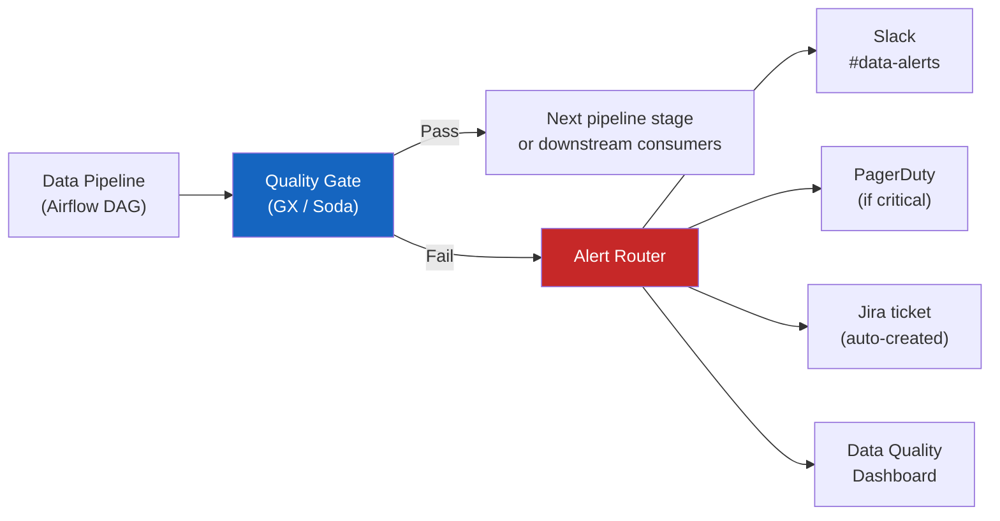

# Data Quality and Observability

> [!abstract] TL;DR
> Data quality is the property of data being fit for its intended use. Data observability is the ability to understand the health of data across the pipeline at any point in time. In practice, quality is enforced through assertions (dbt tests, Great Expectations), contracts (schema + semantic agreements), and SLA monitoring (freshness, row count, distribution checks). Observability platforms like Monte Carlo and Soda add ML-based anomaly detection to catch regressions that static assertions miss.

## Data Quality Dimensions

The six standard dimensions of data quality provide a vocabulary for describing and measuring data health.

| Dimension | Definition | Example Check | Common Cause of Failure |
|---|---|---|---|
| **Completeness** | No unexpected nulls; all required fields populated | `null_count(customer_id) = 0` | Source system bug; ETL null-coalescion error |
| **Accuracy** | Values match the source of truth or real-world fact | Revenue sum matches accounting system total | Transformation logic error; currency conversion bug |
| **Consistency** | Same entity has consistent values across systems | `customer.segment` in CRM = `customer.segment` in warehouse | System-of-record ambiguity; async updates |
| **Timeliness** | Data arrives within the SLA window | `max(updated_at) >= NOW() - INTERVAL 2 HOURS` | Pipeline delay; upstream system outage |
| **Validity** | Values conform to expected format, range, or enumeration | Email matches regex; `revenue >= 0`; `status IN ('active','cancelled','pending')` | Bad input validation; schema drift |
| **Uniqueness** | No duplicate records on primary or natural key | `duplicate_count(order_id) = 0` | CDC replay; ETL idempotency failure |

### Designing Checks per Dimension

```sql
-- Completeness
SELECT COUNT(*) AS null_customer_ids
FROM orders
WHERE customer_id IS NULL;   -- expect: 0

-- Accuracy: revenue reconciliation
SELECT ABS(warehouse_total - source_total) AS discrepancy
FROM (
  SELECT SUM(revenue_usd) AS warehouse_total FROM fact_orders WHERE order_date = CURRENT_DATE - 1
),
(
  SELECT SUM(revenue) AS source_total FROM raw_orders WHERE order_date = CURRENT_DATE - 1
);  -- expect: discrepancy < 0.01 (rounding only)

-- Consistency
SELECT COUNT(*) AS segment_mismatches
FROM warehouse_customers w
JOIN crm_customers c ON w.customer_id = c.customer_id
WHERE w.segment != c.segment;   -- expect: 0 within 24h

-- Timeliness
SELECT DATEDIFF(MINUTE, MAX(updated_at), NOW()) AS lag_minutes
FROM silver_orders;   -- expect: < 120

-- Validity
SELECT COUNT(*) AS invalid_emails
FROM dim_customer
WHERE email NOT REGEXP '^[A-Za-z0-9._%+-]+@[A-Za-z0-9.-]+\.[A-Za-z]{2,}$';  -- expect: 0

-- Uniqueness
SELECT order_id, COUNT(*) AS cnt
FROM fact_orders
GROUP BY order_id
HAVING COUNT(*) > 1;   -- expect: 0 rows
```

---

## Data Contracts

A data contract is a formal, enforceable agreement between a **data producer** and **data consumers** defining what data will look like (schema) and what it means (semantics).

### Schema Contract vs. Semantic Contract

**Schema Contract** specifies the technical structure:
- Column names and data types
- Nullability constraints
- Primary keys and foreign keys
- Allowed enumerations

**Semantic Contract** specifies the business meaning:
- What does `revenue_usd` mean? Gross or net? Pre-tax or post-tax?
- What timezone are timestamps in?
- What is the granularity of one row?
- What business rules govern the values?

### Ownership Model

```
Producer team owns:          Consumer team owns:
- Generating correct data    - Using data within agreed SLA
- Honouring schema contract  - Raising breaking change concerns
- Maintaining SLA uptime     - Not bypassing serving layer
- Notifying of breaking      - Contributing to contract
  changes in advance           definitions
```

### Example Data Contract (YAML / Data Contract Specification)

```yaml
# data_contract.yaml — using open datacontract.com specification
dataContractSpecification: 0.9.3
id: urn:datacontract:silver:orders:v2
info:
  title: Silver Orders
  version: 2.3.0
  owner: "platform-team@company.com"
  description: |
    One row per confirmed order placed on the e-commerce platform.
    Revenue is net (after refunds), pre-tax, in USD.
  status: active
  contact:
    name: Platform Data Team
    url: https://slack.com/data-platform

servers:
  production:
    type: databricks
    catalog: main
    schema: silver
    table: orders

models:
  orders:
    type: table
    description: Canonical orders dataset, Silver layer
    fields:
      order_id:
        type: string
        required: true
        unique: true
        description: UUID assigned at order creation
      customer_id:
        type: string
        required: true
        references: "silver.customers.customer_id"
      order_date:
        type: date
        required: true
      revenue_usd:
        type: decimal(18,4)
        required: true
        minimum: 0
        description: Net revenue in USD after refunds; excludes tax
      status:
        type: string
        required: true
        enum: [placed, confirmed, shipped, delivered, cancelled, refunded]
      updated_at:
        type: timestamp
        required: true
        description: Last modification timestamp (UTC)

quality:
  type: SodaCL
  specification:
    checks for orders:
      - row_count > 0
      - freshness(updated_at) < 2h
      - missing_count(order_id) = 0
      - duplicate_count(order_id) = 0
      - missing_count(customer_id) = 0
      - invalid_count(status) = 0:
          valid values: [placed, confirmed, shipped, delivered, cancelled, refunded]
      - min(revenue_usd) >= 0

sla:
  freshness: 2h
  availability: 99.5%
  support_channel: "#data-platform-alerts"

changelog:
  - version: 2.3.0
    date: 2026-07-01
    changes: "Added `updated_at` field. Breaking: removed deprecated `last_modified` field."
  - version: 2.2.0
    date: 2026-04-15
    changes: "Added `refunded` to status enum."
```

### Contract Tooling

| Tool | Purpose |
|---|---|
| **Data Contract CLI** (`datacontract.com`) | Validate contract YAML, diff versions, export to HTML/PDF |
| **Soda Core** | Runtime contract enforcement against actual data |
| **AsyncAPI** | Schema contracts for Kafka event streams |
| **Protobuf** | Strongly-typed schema with code generation for gRPC/Kafka |
| **JSON Schema** | Web API payload contracts |
| **OpenMetadata / DataHub** | Data catalog with contract tracking and lineage |

---

## Great Expectations

Great Expectations (GX) is the most widely used Python library for data quality assertions. It provides a vocabulary of Expectations (assertions), composable Suites, and a runtime that validates data in batches.

### Core Concepts

```
Expectation       — A single assertion about data. E.g., "column X must not be null."
Expectation Suite — A named, saved collection of Expectations.
Batch             — A slice of data to validate (a file, a table, or a DataFrame).
Validator         — The object that connects a Batch to an Expectation Suite.
Checkpoint        — Orchestrates running a Validator and saves results.
Data Docs         — Auto-generated HTML reports showing validation results.
```

### Setting Up Great Expectations

```bash
# Install
pip install great_expectations

# Initialise a GX project
great_expectations init
# Creates: great_expectations/
#   ├── great_expectations.yml        (datasource and store config)
#   ├── expectations/                 (expectation suite YAML files)
#   ├── checkpoints/                  (checkpoint definitions)
#   └── uncommitted/validations/     (validation results — gitignored)
```

### Defining Expectations (Python API)

```python
import great_expectations as gx

# Get context (loads from great_expectations.yml)
context = gx.get_context()

# Connect to a data source
datasource = context.sources.add_spark(name="silver_datasource")
data_asset = datasource.add_dataframe_asset(name="orders_asset")
batch_request = data_asset.build_batch_request(dataframe=orders_df)

# Create expectation suite
suite = context.add_expectation_suite("silver_orders_suite")

# Get validator
validator = context.get_validator(
    batch_request=batch_request,
    expectation_suite_name="silver_orders_suite"
)

# --- Completeness ---
validator.expect_column_values_to_not_be_null("order_id")
validator.expect_column_values_to_not_be_null("customer_id")

# --- Uniqueness ---
validator.expect_column_values_to_be_unique("order_id")

# --- Validity ---
validator.expect_column_values_to_be_in_set(
    "status",
    value_set=["placed", "confirmed", "shipped", "delivered", "cancelled", "refunded"]
)
validator.expect_column_values_to_match_regex(
    "order_id",
    regex=r"^[0-9a-f]{8}-[0-9a-f]{4}-[0-9a-f]{4}-[0-9a-f]{4}-[0-9a-f]{12}$"
)
validator.expect_column_values_to_be_between(
    "revenue_usd",
    min_value=0,
    max_value=1_000_000
)

# --- Schema ---
validator.expect_column_to_exist("order_id")
validator.expect_column_values_to_be_of_type("revenue_usd", "DecimalType")
validator.expect_table_columns_to_match_ordered_list([
    "order_id", "customer_id", "order_date", "revenue_usd", "status", "updated_at"
])

# --- Row count / table level ---
validator.expect_table_row_count_to_be_between(min_value=1_000, max_value=None)

# --- Relationships ---
validator.expect_column_pair_values_to_be_equal(
    "order_id",    # column A must equal column B
    "canonical_order_id"
)

# Save the suite
validator.save_expectation_suite(discard_failed_expectations=False)
```

### Running a Checkpoint

```python
# Define and run a Checkpoint (orchestrates validation + results storage + alerts)
checkpoint = context.add_checkpoint(
    name="silver_orders_checkpoint",
    validations=[
        {
            "batch_request": batch_request,
            "expectation_suite_name": "silver_orders_suite"
        }
    ],
    action_list=[
        # Save results to local filesystem
        {"name": "store_validation_result", "action": {"class_name": "StoreValidationResultAction"}},
        # Build HTML Data Docs
        {"name": "update_data_docs", "action": {"class_name": "UpdateDataDocsAction"}},
        # Slack alert on failure
        {
            "name": "notify_slack",
            "action": {
                "class_name": "SlackNotificationAction",
                "webhook": "https://hooks.slack.com/services/T.../B.../...",
                "notify_on": "failure"
            }
        }
    ]
)

results = context.run_checkpoint("silver_orders_checkpoint")
print(results.success)          # True if all expectations passed
print(results.get_statistics()) # {'evaluated_expectations': 12, 'successful_expectations': 12}
```

### Useful Expectation Reference

```python
# Null / completeness
expect_column_values_to_not_be_null(column)
expect_column_values_to_be_null(column)    # useful for checking a retired column
expect_column_proportion_of_unique_values_to_be_between(column, min_value=0.95)

# Range / bounds
expect_column_values_to_be_between(column, min_value, max_value)
expect_column_min_to_be_between(column, min_value, max_value)
expect_column_max_to_be_between(column, min_value, max_value)
expect_column_mean_to_be_between(column, min_value, max_value)
expect_column_stdev_to_be_between(column, min_value, max_value)

# Set membership
expect_column_values_to_be_in_set(column, value_set)
expect_column_values_to_not_be_in_set(column, value_set)

# Pattern
expect_column_values_to_match_regex(column, regex)
expect_column_values_to_not_match_regex(column, regex)

# Type
expect_column_values_to_be_of_type(column, type_)   # "StringType", "LongType", etc.

# Distributions (ML-grade)
expect_column_kl_divergence_to_be_less_than(column, partition_object, threshold=0.1)
expect_column_chisquare_test_p_value_to_be_greater_than(column, partition_object, p=0.05)

# Multi-column
expect_column_pair_values_a_to_be_greater_than_b(column_A, column_B)
expect_multicolumn_sum_to_equal(column_list, sum_total)

# Table
expect_table_row_count_to_be_between(min_value, max_value)
expect_table_column_count_to_equal(value)
expect_table_columns_to_match_ordered_list(column_list)
```

---

## dbt Tests

dbt (data build tool) provides a lightweight but powerful testing framework that runs as part of the dbt build process. Tests are SQL queries that should return zero rows to pass.

### Built-in Generic Tests

```yaml
# models/silver/schema.yml
version: 2

models:
  - name: silver_orders
    description: Cleaned and validated orders from Bronze layer
    columns:
      - name: order_id
        description: UUID surrogate key
        tests:
          - not_null
          - unique

      - name: customer_id
        tests:
          - not_null
          - relationships:
              to: ref('silver_customers')
              field: customer_id

      - name: status
        tests:
          - not_null
          - accepted_values:
              values: [placed, confirmed, shipped, delivered, cancelled, refunded]

      - name: revenue_usd
        tests:
          - not_null
          - dbt_utils.accepted_range:        # dbt-utils package
              min_value: 0
              inclusive: true

  - name: silver_customers
    tests:
      - dbt_utils.unique_combination_of_columns:
          combination_of_columns: [customer_id, effective_from]   # SCD2 composite key
```

### Custom SQL Tests

For business logic that cannot be expressed as generic tests, write custom SQL tests in `tests/`.

```sql
-- tests/assert_revenue_matches_source.sql
-- dbt runs this and expects 0 rows returned
WITH warehouse_total AS (
    SELECT SUM(revenue_usd) AS total
    FROM {{ ref('fact_daily_revenue') }}
    WHERE report_date = CURRENT_DATE - 1
),
source_total AS (
    SELECT SUM(revenue) AS total
    FROM {{ source('transactional', 'raw_orders') }}
    WHERE DATE(order_ts) = CURRENT_DATE - 1
      AND status != 'cancelled'
)
SELECT 'Revenue mismatch' AS failure_reason,
       w.total            AS warehouse_total,
       s.total            AS source_total,
       ABS(w.total - s.total) AS discrepancy
FROM warehouse_total w, source_total s
WHERE ABS(w.total - s.total) > 0.01   -- allow $0.01 rounding tolerance
```

```sql
-- tests/assert_no_future_orders.sql
-- No order should have an order_date in the future
SELECT order_id, order_date
FROM {{ ref('silver_orders') }}
WHERE order_date > CURRENT_DATE
```

### Test Severity Levels

```yaml
# models/silver/schema.yml
models:
  - name: silver_orders
    columns:
      - name: revenue_usd
        tests:
          - not_null:
              severity: error    # fail the dbt build (default)
          - dbt_utils.accepted_range:
              min_value: 0
              max_value: 1000000
              severity: warn     # log warning but don't fail build
              warn_if: ">10"     # only warn if more than 10 rows fail

      - name: promotional_code
        tests:
          - not_null:
              severity: warn     # promotional_code is optional; warn only
```

### Running Tests

```bash
# Run all tests
dbt test

# Run tests for one model and its dependencies
dbt test --select silver_orders+

# Run tests for a specific tag
dbt test --select tag:critical

# Run only schema tests (not data tests)
dbt test --select silver_orders --exclude test_type:generic

# Run tests after a model build (combined)
dbt build --select silver_orders+
# dbt build = dbt run + dbt test in dependency order
```

### dbt Test Sources

```yaml
# models/staging/sources.yml
version: 2

sources:
  - name: transactional
    database: raw_db
    schema: public
    freshness:
      warn_after: {count: 1, period: hour}
      error_after: {count: 4, period: hour}
    tables:
      - name: raw_orders
        loaded_at_field: created_at   # column used to check freshness
        columns:
          - name: order_id
            tests: [not_null, unique]
          - name: status
            tests:
              - accepted_values:
                  values: [placed, confirmed, shipped, delivered, cancelled]
```

```bash
# Check source freshness
dbt source freshness
```

---

## Data Observability: Monte Carlo and Soda

Static assertions (GX, dbt tests) check known issues with known thresholds. **Data observability** platforms use ML and statistical methods to detect unknown unknowns — regressions in distribution, unexpected drops in row count, schema changes.

### Five Pillars of Data Observability

1. **Freshness** — Is data arriving on time? Anomaly on last-seen timestamp.
2. **Distribution** — Have data values shifted unexpectedly? (e.g., average revenue dropped 30%)
3. **Volume** — Has row count changed abnormally? (e.g., midnight batch brought 0 rows)
4. **Schema** — Did column names, types, or counts change without warning?
5. **Lineage** — Which upstream tables contributed to this anomaly?

### Soda Core

Soda is open-source, config-driven, and supports custom SodaCL (Soda Checks Language) assertions.

```yaml
# checks/silver_orders_checks.yml
checks for silver.orders:
  # Freshness
  - freshness(updated_at) < 2h:
      name: "Orders updated within 2 hours"
      fail: when > 4h
      warn: when > 2h

  # Volume
  - row_count > 10000:
      name: "Minimum daily order count"
  - change for row_count < 50%:
      name: "Row count did not drop by more than 50%"

  # Completeness
  - missing_count(order_id) = 0
  - missing_count(customer_id) = 0

  # Uniqueness
  - duplicate_count(order_id) = 0

  # Validity
  - invalid_count(status) = 0:
      valid values: [placed, confirmed, shipped, delivered, cancelled, refunded]
  - min(revenue_usd) >= 0
  - max(revenue_usd) < 1000000:
      name: "Max order value sanity check"

  # Distribution drift (compare to yesterday's partition)
  - schema:
      fail:
        when required column missing: [order_id, customer_id, revenue_usd, order_date]
        when forbidden column present: [ssn, password_hash]
        when wrong column type:
          revenue_usd: decimal
```

```python
# Run Soda checks programmatically
from soda.scan import Scan

scan = Scan()
scan.set_data_source_name("silver_datasource")
scan.add_configuration_yaml_file("soda_config.yml")
scan.add_sodacl_yaml_file("checks/silver_orders_checks.yml")
scan.execute()

print(scan.get_logs_text())
print(scan.has_check_failures())
```

### Integrating with Airflow

```python
# airflow/dags/silver_orders_pipeline.py
from airflow.decorators import dag, task
from airflow.utils.dates import days_ago

@dag(schedule_interval="@hourly", start_date=days_ago(1), catchup=False)
def silver_orders_pipeline():

    @task
    def ingest_bronze():
        # ... ingest from Kafka to Bronze
        pass

    @task
    def transform_silver():
        # ... run Spark transform Bronze → Silver
        pass

    @task
    def run_quality_checks():
        from soda.scan import Scan
        scan = Scan()
        scan.set_data_source_name("silver_datasource")
        scan.add_configuration_yaml_file("/opt/soda/config.yml")
        scan.add_sodacl_yaml_file("/opt/soda/checks/silver_orders.yml")
        scan.execute()

        if scan.has_check_failures():
            raise ValueError(f"Data quality checks failed: {scan.get_logs_text()}")

    @task
    def transform_gold():
        # ... run dbt models
        pass

    ingest_bronze() >> transform_silver() >> run_quality_checks() >> transform_gold()

dag_instance = silver_orders_pipeline()
```

---

## Data Lineage

Data lineage tracks the origin and transformation history of each dataset — which tables it was built from, which models transformed it, and which downstream consumers depend on it.

### dbt Lineage Graph

dbt automatically generates a directed acyclic graph (DAG) of model dependencies.

```
raw_orders (source)
    ↓
stg_orders (staging model)
    ↓
silver_orders (silver model) ← dim_customers (silver model)
    ↓
fct_daily_revenue (gold model)
    ↓
rpt_executive_dashboard (gold model)
```

```bash
# View upstream and downstream lineage in the CLI
dbt ls --select +silver_orders+   # + means include all parents and children

# Generate documentation site with interactive lineage graph
dbt docs generate
dbt docs serve   # opens browser at localhost:8080
```

### OpenLineage + Marquez

OpenLineage is an open standard for lineage metadata. Marquez is the reference backend.

```python
# Emit lineage event from a Spark job using OpenLineage Spark integration
# Add to Spark config:
spark = SparkSession.builder \
    .config("spark.extraListeners", "io.openlineage.spark.agent.OpenLineageSparkListener") \
    .config("spark.openlineage.transport.type", "http") \
    .config("spark.openlineage.transport.url", "http://marquez:5000") \
    .config("spark.openlineage.namespace", "silver_pipeline") \
    .getOrCreate()

# All read/write operations are automatically tracked as lineage events
# Marquez UI shows: which jobs read which datasets, which jobs wrote which datasets
```

---

## SLA Monitoring Patterns

Data SLAs are commitments about when data will be available and in what state. Monitor them proactively before users report issues.

### Core SLA Checks

```sql
-- Freshness SLA: orders table must have data from within the last 2 hours
SELECT
    MAX(updated_at)                          AS last_update,
    DATEDIFF(MINUTE, MAX(updated_at), NOW()) AS lag_minutes,
    CASE WHEN DATEDIFF(MINUTE, MAX(updated_at), NOW()) > 120
         THEN 'SLA_BREACH'
         ELSE 'OK' END                       AS sla_status
FROM silver.orders;

-- Volume SLA: daily orders should be within ±30% of 7-day average
WITH daily_counts AS (
    SELECT DATE(order_date) AS dt, COUNT(*) AS row_count
    FROM silver.orders
    WHERE order_date >= CURRENT_DATE - 8
    GROUP BY 1
),
stats AS (
    SELECT
        AVG(row_count) AS avg_7d,
        STDDEV(row_count) AS std_7d
    FROM daily_counts
    WHERE dt < CURRENT_DATE
)
SELECT
    d.dt,
    d.row_count,
    s.avg_7d,
    ABS(d.row_count - s.avg_7d) / s.avg_7d AS pct_deviation,
    CASE WHEN ABS(d.row_count - s.avg_7d) / s.avg_7d > 0.3
         THEN 'ANOMALY' ELSE 'OK' END AS volume_status
FROM daily_counts d, stats s
WHERE d.dt = CURRENT_DATE;
```

### Alerting Architecture



---

## Data Incident Response

When a data quality issue reaches production (or is detected before reaching users), follow a structured triage process.

### Incident Triage Steps

```
1. DETECT
   - Alert from monitoring (Soda / Monte Carlo / PagerDuty)
   - User report ("revenue dashboard shows 0 for yesterday")

2. SCOPE
   - Which tables are affected?
   - Which time range?
   - Which downstream consumers are impacted?
   - Is this still happening or was it a point-in-time issue?

3. ISOLATE (using lineage)
   - Check the lineage graph (dbt docs / Marquez)
   - Is the issue in the source? Silver? Gold? Or the BI layer?
   - Run: dbt test --select +affected_model

4. ROOT CAUSE
   - Source system issue? (new null values, schema change, outage)
   - Pipeline logic bug? (dbt model change, Spark job error)
   - Infrastructure issue? (S3 permissions, Kafka consumer lag)
   - Check pipeline run logs in Airflow / Prefect

5. REMEDIATE
   - Fix the bug and deploy
   - Trigger backfill for the affected time range
   - Verify with quality checks post-backfill

6. COMMUNICATE
   - Update the incident channel with status
   - Notify downstream consumers when data is clean

7. POST-MORTEM
   - Document timeline, root cause, impact
   - Add a new quality check to catch this class of issue in future
   - Update runbook
```

### Backfill Pattern

```bash
# dbt: backfill a specific date range by overriding the incremental filter
dbt run --select silver_orders --full-refresh   # full table rebuild
# Or for incremental models, override the lookback:
dbt run --select silver_orders --vars '{"start_date": "2024-01-01", "end_date": "2024-01-10"}'
```

---

## Common Pitfalls

- **Only testing what you know** — Static assertions catch known failure modes. Distribution drift, unexpected joins exploding row counts, and subtle encoding issues are invisible to static tests. Pair static tests with observability platforms.
- **Test severity misconfiguration** — Marking non-critical columns as `error` severity causes pipeline failures for minor issues, training teams to ignore alerts ("alert fatigue"). Reserve `error` for truly blocking issues; use `warn` for informational checks.
- **Testing the wrong layer** — Running quality checks on Bronze (raw data) is often wasteful — Bronze is intentionally unclean. Focus checks on Silver (schema enforcement) and Gold (business rule validation).
- **No lineage visibility** — When an incident occurs, engineers spend hours tracing which upstream table broke which downstream report. Implement lineage from day one (dbt docs, OpenLineage).
- **Missing volume checks** — A pipeline can return 0 rows (due to a broken filter or empty partition) and pass all row-level checks trivially. Always include `row_count > threshold` as a check.
- **Data contracts without enforcement** — Writing a YAML contract that no system validates is documentation, not a contract. Wire contracts to runtime validation (Soda, GX checkpoints) or they will drift immediately.
- **Not testing source freshness** — Downstream quality checks passing is meaningless if the source stopped sending data 6 hours ago. Add `dbt source freshness` to the beginning of every pipeline DAG.
- **Checkpoints not wired to pipeline failures** — If a GX checkpoint fails but the Airflow task still succeeds, bad data flows downstream. Always raise an exception on checkpoint failure to block the pipeline.

---

## Review Questions

1. Name the six data quality dimensions. For each, give one concrete example of a dbt test or Great Expectations assertion that covers it.
2. What is the difference between a schema contract and a semantic contract? Give an example of a production incident that a semantic contract would have prevented but a schema contract would not.
3. A dbt `not_null` test on `customer_id` fails for 150 rows out of 5 million. Should this be `severity: warn` or `severity: error`? What factors drive the decision?
4. You have a Gold table that showed correct revenue yesterday but is showing a 40% drop today. Describe the triage process, step by step, using lineage and quality tooling.
5. What is the difference between data quality (Great Expectations / dbt tests) and data observability (Monte Carlo / Soda anomaly detection)? What failure class does each one catch that the other misses?
6. A team adds a new column `promotional_code_id` to a Silver table without notifying downstream consumers. Which part of the data contract would have flagged this as a breaking change, and how would an enforcement tool catch it at runtime?
7. Explain how to use `dbt source freshness` and why it should be the first step in a pipeline DAG, before any transformations run.

---

## See Also

- [[Data_Engineering_Overview]] — DataOps principles and data contracts introduction
- [[Data_Modeling_for_Engineering]] — Medallion architecture and where quality checks belong per layer
- [[Storage_Formats]] — Schema enforcement in Delta Lake and Iceberg
- [[Distributed_Computing]] — Where to place quality gates in Spark pipelines

#DataEngineering
