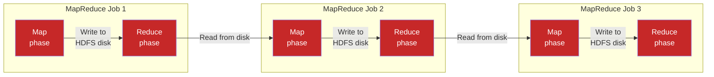
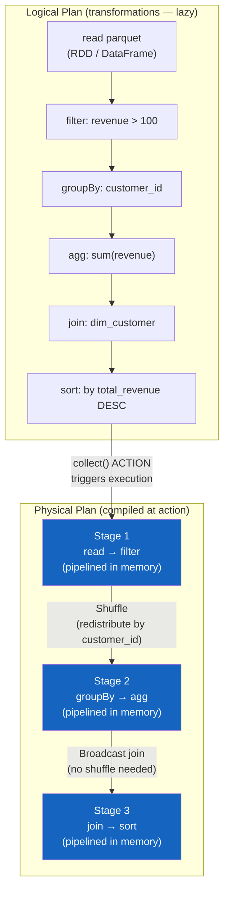

# Distributed Computing for Data Engineering

> [!abstract] TL;DR
> Distributed computing frameworks split large datasets across a cluster of machines to process data in parallel. MapReduce pioneered the paradigm but is slow due to disk I/O between every stage. Spark replaced it with an in-memory DAG (Directed Acyclic Graph) execution model that batches transformations into stages separated only by shuffles, dramatically reducing I/O. Understanding partitioning, shuffles, data skew, and join strategies is essential for writing performant Spark code at scale.

## MapReduce: The Foundation

MapReduce, introduced by Google in 2004 and open-sourced as Hadoop, is a programming model for processing large datasets across commodity hardware. It makes parallelism explicit via two phases.

### The Three Phases

**Map Phase** — Apply a function to each input record independently. Produces intermediate key-value pairs.

```
Input: [("alice", 3), ("bob", 1), ("alice", 5), ("charlie", 2), ("bob", 4)]

Map function: emit (key, value) unchanged
Output: [("alice", 3), ("bob", 1), ("alice", 5), ("charlie", 2), ("bob", 4)]
```

**Shuffle Phase** — Group all values by key across all mapper outputs. This requires moving data across the network and writing intermediate results to disk. **This is the bottleneck.**

```
After shuffle (grouped by key):
"alice":   [3, 5]
"bob":     [1, 4]
"charlie": [2]
```

**Reduce Phase** — Apply an aggregation function to each group of values.

```
Reduce function: sum values
Output: [("alice", 8), ("bob", 5), ("charlie", 2)]
```

### Why MapReduce Is Slow



Every intermediate result is written to HDFS and read back by the next job. For a 10-stage pipeline, you perform 20 disk read/write operations. Disk I/O is 100–1000x slower than RAM access.

---

## Spark: In-Memory DAG Execution

Apache Spark replaces MapReduce's chained disk-write pattern with an in-memory computation model. Instead of executing immediately, transformations are **lazy** — they build a logical plan (the DAG). Only when an **action** is called does Spark compile the DAG into a physical execution plan and actually run it.

### Spark's Execution Model



**Key insight:** Transformations within a stage are pipelined in memory — no disk I/O. Only shuffle boundaries (where data must be redistributed across executors) require network transfer and potential disk spill.

### MapReduce vs. Spark — Side by Side

| Aspect | MapReduce | Apache Spark |
|---|---|---|
| Intermediate results | Written to HDFS disk | Kept in RAM (spill to disk only if needed) |
| Execution model | Pair of Map + Reduce jobs chained | DAG of stages separated only by shuffles |
| Multi-stage pipelines | Extremely slow (disk between every stage) | Fast (pipelined within stages) |
| Iterative algorithms (ML) | Very slow (read/write every iteration) | Fast (keep data in memory across iterations) |
| Streaming support | Not native | Spark Structured Streaming |
| Python API | Limited (Hadoop Streaming) | Full PySpark API |
| Typical speedup | Baseline | 10–100x faster for iterative |

---

## Spark Architecture: Key Components

```
┌─────────────────────────────────────────────────────┐
│                   Driver Program                      │
│  SparkSession │ DAG Scheduler │ Task Scheduler       │
└──────────────────────┬──────────────────────────────┘
                       │ Task assignment
          ┌────────────┴────────────┐
          │      Cluster Manager    │
          │  (YARN / K8s / Mesos)   │
          └────────┬────────────────┘
     ┌─────────────┴──────────┐
     ▼                        ▼
┌────────────┐          ┌────────────┐
│ Executor 1 │          │ Executor 2 │
│ Task  Task │          │ Task  Task │
│ [Partition]│          │ [Partition]│
│ Cache      │          │ Cache      │
└────────────┘          └────────────┘
```

- **Driver** — Hosts `SparkSession`. Builds the DAG, divides work into tasks, coordinates executors.
- **Executor** — JVM process on a worker node. Runs tasks, stores cached RDD/DataFrame partitions.
- **Cluster Manager** — Allocates resources (YARN in Hadoop, Kubernetes, Databricks Runtime).
- **Task** — Unit of work. One task processes one partition.
- **Stage** — Group of tasks that can run without a shuffle. Bounded by shuffle operations.
- **Job** — One DAG triggered by a single action (e.g., `collect()`, `write()`).

---

## Lazy Evaluation

Transformations in Spark are **lazy** — they do not execute when called. They build a logical plan.

```python
from pyspark.sql.functions import col, sum as spark_sum

df = spark.read.parquet("s3://datalake/silver/orders")   # lazy: no read yet
filtered = df.filter(col("revenue_usd") > 100)           # lazy: plan recorded
grouped = filtered.groupBy("customer_id")                # lazy: plan recorded
result = grouped.agg(spark_sum("revenue_usd").alias("total_revenue"))  # lazy

# NOTHING has executed yet. The following ACTION triggers full execution:
result.write.parquet("s3://datalake/gold/customer_revenue")  # ACTION: executes now
```

**Why this matters for optimisation:**
- Spark's **Catalyst Optimizer** can reorder filters, push predicates into file reads, eliminate unnecessary columns before generating the physical plan.
- The whole logical plan is available at compile time, enabling cross-operation optimisations that are impossible if each transformation executes immediately.

---

## Partitioning Strategies

A partition is the basic unit of parallelism in Spark. Each partition is processed by one task on one executor. Choosing a good partitioning strategy determines whether data is evenly distributed or skewed.

### Hash Partitioning

The default strategy. Records with the same key value are assigned to the same partition.

```
Partition number = hash(key) % num_partitions
```

```python
# Repartition by customer_id for subsequent groupBy operations
df.repartition(200, col("customer_id"))
```

**Good for:** Operations that group or join by the same key (data for the same key is co-located).
**Bad for:** Skewed keys (common keys dominate a single partition → straggler tasks).

### Range Partitioning

Records are sorted and divided into ranges. Each partition contains a contiguous range of key values.

```python
# Range partition by order_date — useful for time-series data and range queries
df.repartitionByRange(200, col("order_date"))
```

**Good for:** Range queries (`WHERE date BETWEEN ... AND ...`), sorted data, time-series.
**Bad for:** Writes dominated by the latest range (all new data goes to one partition — the "hot partition" problem).

### Round-Robin Partitioning

Records are distributed cyclically across partitions, regardless of key.

```python
# Round-robin: evenly distribute without key awareness
df.repartition(200)   # no column specified = round-robin
```

**Good for:** Rebalancing a skewed DataFrame when key-based grouping is not needed.
**Bad for:** Subsequent key-based operations (same keys may be on different partitions → shuffle required).

### Choosing Partition Count

```python
# Rule of thumb: 2–4 partitions per CPU core in the cluster
# For files: target 128MB–256MB per partition

# Check current partition count
df.rdd.getNumPartitions()  # e.g., 8 (one per input file)

# After a filter that removes 80% of data, coalesce to reduce
filtered_df = df.filter(col("status") == "active")
optimised = filtered_df.coalesce(50)   # reduce without full shuffle

# After a join that creates more data, repartition (full shuffle)
joined_df.repartition(400)
```

---

## Data Skew: Detection and Solutions

Data skew occurs when some partitions contain significantly more data than others. The slowest partition (the "straggler") determines the overall job time.

### Detecting Skew

```python
# Check partition size distribution
from pyspark.sql.functions import spark_partition_id, count

df.withColumn("partition_id", spark_partition_id()) \
  .groupBy("partition_id") \
  .agg(count("*").alias("row_count")) \
  .orderBy("row_count", ascending=False) \
  .show(20)

# If one partition has 10M rows and others have 50K → severe skew
```

### Solution 1: Salting (Most Common for GroupBy Skew)

Add a random suffix to the skewed key, aggregate at fine grain, then re-aggregate.

```python
from pyspark.sql.functions import concat, lit, floor, rand, col, sum as spark_sum

NUM_SALT = 50  # number of salt buckets

# Step 1: Add random salt to key
salted_df = (
    df.withColumn("salted_key",
        concat(col("customer_id"), lit("_"), (floor(rand() * NUM_SALT)).cast("string"))
    )
)

# Step 2: First aggregation on salted key (distributed evenly)
first_agg = (
    salted_df
    .groupBy("salted_key")
    .agg(spark_sum("revenue_usd").alias("partial_revenue"))
)

# Step 3: Strip salt and do final aggregation
final_agg = (
    first_agg
    .withColumn("customer_id", regexp_extract(col("salted_key"), "^(.+)_\\d+$", 1))
    .groupBy("customer_id")
    .agg(spark_sum("partial_revenue").alias("total_revenue"))
)
```

### Solution 2: Broadcast Join (for Join Skew with a Small Table)

When joining a large skewed table with a small dimension table, broadcast the small table to all executors. This eliminates the shuffle entirely.

```python
from pyspark.sql.functions import broadcast

# Without broadcast: both tables are shuffled by customer_id → skew causes stragglers
result = large_orders_df.join(small_customers_df, "customer_id")

# With broadcast: small_customers_df is replicated to every executor
result = large_orders_df.join(broadcast(small_customers_df), "customer_id")
```

**Spark auto-broadcasts** tables smaller than `spark.sql.autoBroadcastJoinThreshold` (default 10 MB). Increase to 100 MB for large but still-broadcastable dimensions:

```python
spark.conf.set("spark.sql.autoBroadcastJoinThreshold", 100 * 1024 * 1024)  # 100MB
```

---

## Join Strategies

### Broadcast Join (Map-Side Join)

- Small table replicated to every executor's memory.
- Large table is never shuffled.
- **Best for:** large table × small dimension (< ~100 MB).
- **Cost:** Memory pressure on executors (must hold full small table in RAM).

### Sort-Merge Join (Shuffle Join)

- Both tables shuffled by join key → sorted → merged.
- Handles large × large joins.
- **Expensive:** Two full shuffles.
- **Best for:** large table × large table with no skew.

```python
# Force sort-merge join (disable broadcast)
spark.conf.set("spark.sql.autoBroadcastJoinThreshold", -1)
result = df_left.join(df_right, "customer_id")  # will use sort-merge
```

### Hash Join (Shuffle Hash Join)

- One table shuffled and stored in a hash map in memory.
- Other table streamed and probed against hash map.
- Faster than sort-merge but requires one side to fit in per-executor memory.

```python
# Hint to use shuffle-hash join
result = df_large.join(df_medium.hint("shuffle_hash"), "customer_id")
```

### Join Strategy Summary

| Strategy | When to Use | Shuffle Required | Memory Cost |
|---|---|---|---|
| Broadcast join | Small table < 100 MB | No shuffle | High (replicates small table) |
| Sort-merge join | Large × large | Yes (both sides) | Low per-executor |
| Shuffle-hash join | Large × medium (fits in memory) | Yes (one side) | Medium |

---

## Lineage and Fault Tolerance

Spark tracks the full lineage (transformation history) of every RDD/DataFrame. If an executor fails during execution and loses a partition, Spark does **not** restart the entire job. Instead, it replays only the lost partition's lineage from the last stable point (checkpoint or input data).

```
Input Parquet
      ↓ filter(revenue > 100)        ← if partition 7 lost here,
      ↓ groupBy(customer_id)           Spark re-reads partition 7
      ↓ agg(sum revenue)               from S3 and replays
      ↓ sort(DESC)
   Output
```

For long lineages or iterative ML algorithms, **checkpointing** breaks the lineage chain and materialises a stable snapshot:

```python
# Enable checkpointing to truncate long lineage chains
spark.sparkContext.setCheckpointDir("s3://datalake/checkpoints/spark/")

# After 10 iterations of an iterative algorithm, checkpoint to avoid stack overflow
if iteration % 10 == 0:
    df = df.checkpoint()  # materialises to checkpoint dir, truncates lineage
```

---

## Framework Comparison

| Framework | Primary Use | Latency | Python Support | Streaming | When to Choose |
|---|---|---|---|---|---|
| **Apache Spark** | Batch ETL, ML, large-scale transforms | Seconds-minutes | Excellent (PySpark) | Structured Streaming | Gold standard for batch; most tooling integrates with it |
| **Apache Flink** | Stateful stream processing | Milliseconds | Good (PyFlink) | Native first-class | True real-time (gaming, fraud, IoT); complex event processing |
| **Dask** | Python-native parallel computing | Minutes | Native Python | Limited | Data scientists scaling pandas; avoid for production ETL |
| **Ray** | Python ML workloads, RL, distributed inference | Seconds | Native Python | Via Ray Streaming | ML training, hyperparameter tuning, model serving |
| **Trino/Presto** | Interactive SQL on data lakes | Seconds | JDBC/Python | No | Ad-hoc SQL queries on S3/Iceberg without loading to warehouse |

---

## Practical Spark Tuning Cheatsheet

```python
# Memory configuration
spark.conf.set("spark.executor.memory", "8g")
spark.conf.set("spark.executor.memoryOverhead", "2g")   # off-heap for native libs
spark.conf.set("spark.driver.memory", "4g")

# Shuffle configuration
spark.conf.set("spark.sql.shuffle.partitions", "400")    # default 200; scale with data
spark.conf.set("spark.sql.adaptive.enabled", "true")     # AQE: auto-optimise at runtime
spark.conf.set("spark.sql.adaptive.coalescePartitions.enabled", "true")  # reduce empty partitions
spark.conf.set("spark.sql.adaptive.skewJoin.enabled", "true")  # auto-detect and fix skew

# Broadcast join threshold
spark.conf.set("spark.sql.autoBroadcastJoinThreshold", "100m")

# Serialisation (Kryo is faster than Java default for RDD APIs)
spark.conf.set("spark.serializer", "org.apache.spark.serializer.KryoSerializer")

# Dynamic allocation (cluster autoscaling)
spark.conf.set("spark.dynamicAllocation.enabled", "true")
spark.conf.set("spark.dynamicAllocation.minExecutors", "2")
spark.conf.set("spark.dynamicAllocation.maxExecutors", "100")
```

### Adaptive Query Execution (AQE)

AQE (Spark 3.0+) is a game-changer. It re-optimises the query plan **at runtime** using actual shuffle statistics:

1. **Coalesces small shuffle partitions** — Merges many tiny partitions into fewer larger ones, reducing task overhead.
2. **Converts sort-merge joins to broadcast joins** — If at runtime one side of a join turns out to be small after filters, AQE automatically switches to broadcast join.
3. **Skew join optimisation** — Splits skewed partitions into smaller sub-partitions automatically.

```python
# Enable all AQE features (Spark 3.2+)
spark.conf.set("spark.sql.adaptive.enabled", "true")
spark.conf.set("spark.sql.adaptive.coalescePartitions.enabled", "true")
spark.conf.set("spark.sql.adaptive.skewJoin.enabled", "true")
spark.conf.set("spark.sql.adaptive.localShuffleReader.enabled", "true")
```

---

## Common Pitfalls

- **Too few partitions for large datasets** — A 10 TB dataset with 200 partitions means 50 GB per partition. Most executors run out of memory. Scale `spark.sql.shuffle.partitions` with your data volume.
- **Too many partitions for small datasets** — 10 MB of data with 10,000 partitions creates 10,000 tasks with trivial work each — scheduler overhead dominates. Use `coalesce` after aggressive filters.
- **Not using AQE** — Spark 3.x has AQE disabled by default in some distributions. Always enable it in production.
- **Calling `.count()` inside a loop** — Each `.count()` is an action that triggers a full job. Accumulate metrics with accumulators instead.
- **`collect()` on large DataFrames** — Pulls the entire dataset to the driver. For 1 TB tables this crashes the driver. Use `.show(20)` or write to storage.
- **Wide transformations inside `udf`** — Python UDFs break Catalyst optimisation, force row-at-a-time serialisation (100x slower than vectorised). Use Spark built-in functions or Pandas UDFs (`@pandas_udf`).
- **Ignoring shuffle spill** — When shuffle data exceeds executor memory it spills to disk. The Spark UI shows shuffle spill metrics. Address with more memory or fewer `shuffle.partitions`.
- **Not caching shared DataFrames** — If the same DataFrame is used in two branches of a DAG, Spark recomputes it from scratch both times. Cache it: `df.cache()`.

---

## Review Questions

1. Explain the shuffle phase in MapReduce. Why is it the performance bottleneck, and how does Spark's DAG model reduce this cost?
2. What is a "stage" in Spark's execution model? What event marks the boundary between two stages?
3. You have a join between a 5 TB fact table and a 50 MB dimension table. What join strategy would Spark choose, and why? How would you explicitly enforce it?
4. A Spark job has 1,000 partitions but one partition consistently takes 10x longer than others. What is this called, and what are two techniques to fix it for a `groupBy` aggregation?
5. Explain lazy evaluation. How does it enable the Catalyst Optimizer to generate a better physical plan than eager execution would allow?
6. What does Adaptive Query Execution (AQE) do, and which of its three features provides the most benefit in a pipeline with several wide aggregations?
7. When should you use `repartition()` vs `coalesce()`? What is the key operational difference between them?

---

## See Also

- [[Data_Engineering_Overview]] — When to choose batch vs streaming frameworks
- [[Storage_Formats]] — Parquet optimisations that pair with Spark (predicate pushdown, column pruning)
- [[Data_Modeling_for_Engineering]] — Medallion architecture implemented with Spark
- [[_MOC_DevOps_Master]] — Kubernetes deployment for Spark on K8s

#DataEngineering
