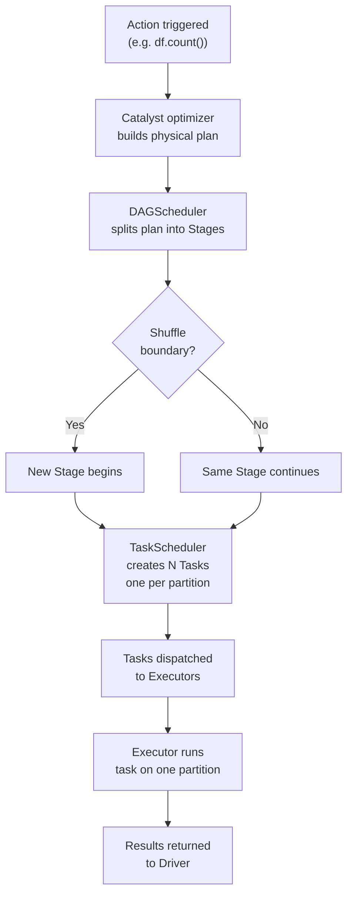
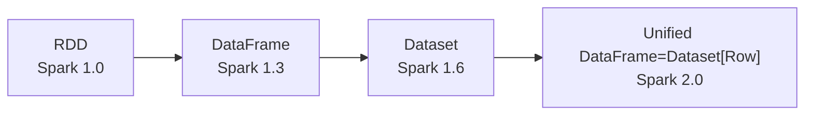
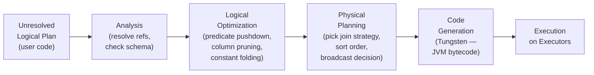

# Spark Architecture

> [!abstract] TL;DR
> Apache Spark runs as a master/worker distributed system where a Driver program orchestrates execution by building a DAG of stages and tasks, dispatching them to Executor JVMs on worker nodes via a Cluster Manager. The Catalyst optimizer rewrites logical query plans into optimized physical plans, and Tungsten generates bytecode for CPU-efficient execution.

## Cluster Components

Spark's runtime consists of four main actors that collaborate to execute a distributed computation.

```
Driver ──► Cluster Manager ──► Worker Node 1: Executor (Task, Task, Task)
                           ──► Worker Node 2: Executor (Task, Task, Task)
                           ──► Worker Node 3: Executor (Task, Task, Task)
```

### Driver

The Driver is the JVM process that hosts your application's `main()` (or notebook kernel). It is responsible for:

- **Hosting `SparkContext` / `SparkSession`**: the entry-point objects your code talks to.
- **Building the logical and physical plan** from your DataFrame/SQL transformations.
- **Maintaining the DAG**: tracking all transformations as a directed acyclic graph of stages.
- **Scheduling tasks** onto executors through the Cluster Manager.
- **Collecting results** sent back from executors (e.g., `collect()`, `take()`).
- **Exposing the Spark Web UI** on port 4040 for job/stage/task monitoring.

> [!warning] Driver memory matters
> All data returned by `collect()` lands in Driver heap. Returning large DataFrames can OOM the driver. Use `df.limit(n).collect()` or write to storage instead.

### Cluster Manager

The Cluster Manager is a pluggable resource scheduler that Spark talks to for acquiring executor slots:

| Cluster Manager | Best For | Notes |
|---|---|---|
| **YARN** | Hadoop clusters (EMR, CDH, HDP) | Shares cluster with MapReduce, Hive, etc. |
| **Kubernetes** | Containerised modern deployments | Dynamic allocation works well; each executor is a pod |
| **Standalone** | Dev/test, simple dedicated Spark clusters | Built-in, no external dependency |
| **Mesos** | Legacy; largely replaced by K8s | |

### Executors

Each Executor is a **long-lived JVM process** launched on a worker node. It:

- Receives serialised task closures from the Driver.
- Runs tasks on its thread pool (one thread per task slot = `--executor-cores`).
- Holds **cached RDD/DataFrame partitions** in its managed memory or disk.
- Sends task results and metrics back to the Driver.
- Maintains a **block manager** for shuffle data exchange with other executors.

### Tasks

A Task is the **smallest unit of work** in Spark. One task processes exactly one partition of data. Tasks within a stage are identical in structure but operate on different data slices. All tasks in a stage can run in parallel (subject to available executor slots).

---

## Job Execution Model

When your code calls an **action** (`count()`, `show()`, `write()`, `collect()`), Spark triggers a **Job**. Lazy transformations before that point build a logical plan but do not execute.



### Actions → Jobs → Stages → Tasks

1. **Action**: triggers execution (`collect`, `count`, `save`, `foreach`, `reduce`).
2. **Job**: one job per action. A single Spark application can run many jobs sequentially or concurrently.
3. **Stages**: the DAGScheduler splits each job into stages at **shuffle boundaries** (wide transformations like `groupBy`, `join`, `repartition` require shuffling data across the network). Each stage is a set of tasks that can be pipelined without a shuffle.
4. **Tasks**: one task per partition per stage. The TaskScheduler dispatches them to free executor slots.

```
Job
├── Stage 0  (narrow transforms: map, filter, select)
│   ├── Task 0 → partition 0
│   ├── Task 1 → partition 1
│   └── Task N → partition N
└── Stage 1  (after shuffle: groupBy aggregation)
    ├── Task 0 → shuffle partition 0
    └── Task M → shuffle partition M
```

### Shuffle

A **shuffle** is the most expensive operation in Spark — it requires all executors to write their output to disk and other executors to read it over the network. Shuffles are triggered by:
- `groupBy`, `agg`, `distinct`
- `join` (unless one side is broadcast)
- `repartition` (full shuffle), `sortBy`

---

## Deploy Modes: Client vs Cluster

| Mode | Where Driver runs | When to use |
|---|---|---|
| `--deploy-mode client` | On the machine running `spark-submit` | Interactive (notebooks, shells); driver logs are local |
| `--deploy-mode cluster` | On a worker node in the cluster | Production batch jobs; driver survives submitter machine exit |

```bash
# Client mode (default for notebooks)
spark-submit --master yarn --deploy-mode client my_job.py

# Cluster mode (production)
spark-submit --master yarn --deploy-mode cluster \
  --driver-memory 4g \
  --executor-memory 8g \
  --executor-cores 4 \
  --num-executors 10 \
  my_job.py
```

---

## SparkContext vs SparkSession

### SparkContext (Legacy)
- Introduced in Spark 1.x.
- **One per JVM** — attempting to create a second throws an error unless the first is stopped.
- Entry point for RDD API: `sc.parallelize()`, `sc.textFile()`.
- Still exists under the hood in Spark 2+.

### SparkSession (Modern — use this)
- Introduced in Spark 2.0, **unifies** SparkContext + SQLContext + HiveContext.
- Multiple logical sessions can coexist in one JVM (they share the underlying SparkContext).
- Entry point for DataFrame/Dataset API and Spark SQL.

```python
from pyspark.sql import SparkSession

spark = SparkSession.builder \
    .appName("MyApp") \
    .master("yarn") \
    .config("spark.sql.shuffle.partitions", "200") \
    .config("spark.serializer", "org.apache.spark.serializer.KryoSerializer") \
    .enableHiveSupport() \
    .getOrCreate()

# Access the underlying SparkContext
sc = spark.sparkContext
```

> [!tip] `getOrCreate()` is idempotent — safe to call from multiple places. It returns the existing session if one exists in the JVM.

---

## RDD vs DataFrame vs Dataset



| Feature | RDD | DataFrame | Dataset |
|---|---|---|---|
| API | Functional (map/filter/reduce) | SQL-like (select/filter/groupBy) | SQL-like + typed methods |
| Schema | None — opaque objects | Yes — named columns with types | Yes — compile-time typed |
| Optimizer | No | Catalyst + Tungsten | Catalyst + Tungsten |
| Language | All | All | Scala/Java only |
| Type safety | Compile-time (Scala) | Runtime only | Compile-time (Scala) |
| Performance | Baseline | Faster (Catalyst) | Same as DataFrame |
| Serialization | Java/Kryo | Tungsten (off-heap binary) | Encoder-based |

### When to use which

- **DataFrame**: default choice for all production pipelines. Gets full Catalyst + Tungsten optimizations. Available in Python, R, SQL, Scala, Java.
- **Dataset**: Scala/Java only. Use when you need compile-time type safety AND optimizer benefits (e.g., complex domain logic where runtime errors are costly).
- **RDD**: only when you need fine-grained control over partitioning/serialization, or are working with unstructured data where a schema is impossible. Avoid in new code.

```python
# RDD (avoid unless needed)
rdd = sc.parallelize([1, 2, 3, 4, 5])
result = rdd.filter(lambda x: x > 2).map(lambda x: x * 2).collect()

# DataFrame (preferred)
from pyspark.sql import functions as F
df = spark.range(1, 6).toDF("value")
result = df.filter(F.col("value") > 2).withColumn("doubled", F.col("value") * 2)
result.show()
```

---

## Catalyst Optimizer Pipeline

Catalyst is Spark's **query optimizer** — it transforms your DataFrame operations into an optimized execution plan. It operates in four phases:



### Phase 1: Analysis
- Resolves column names against the schema (e.g., `"user_id"` → `users.user_id BIGINT`).
- Checks for missing columns, type mismatches.
- Produces a **Resolved Logical Plan**.

### Phase 2: Logical Optimization
Key rewrites applied:
- **Predicate pushdown**: moves `filter()` as close to the data source as possible (avoids reading unnecessary rows).
- **Column pruning**: removes columns from scans that are never used downstream.
- **Constant folding**: evaluates constant expressions at plan time (`1 + 1` → `2`).
- **Null propagation**: simplifies null-handling expressions.
- **Boolean simplification**: rewrites redundant boolean logic.

### Phase 3: Physical Planning
- Selects a physical strategy for each logical operation (e.g., Sort-Merge Join vs Broadcast Hash Join vs Shuffle Hash Join).
- May produce multiple candidate physical plans and uses a **cost model** to pick the best.
- With **AQE** (Spark 3+), physical decisions are revised at runtime using actual statistics.

### Phase 4: Code Generation (Tungsten)
- Generates **JVM bytecode** at runtime (Whole-Stage Code Generation).
- Eliminates virtual function dispatch overhead — tight loops with inlined logic.
- Uses **SIMD-friendly** access patterns.

```python
# See the full plan
df.explain(True)
# Output shows: == Parsed Logical Plan ==, == Analyzed Logical Plan ==,
#               == Optimized Logical Plan ==, == Physical Plan ==
```

---

## Tungsten Execution Engine

Tungsten (Spark 1.5+) is a **physical execution layer** focused on CPU and memory efficiency:

| Capability | What it does |
|---|---|
| **Off-heap memory** | Stores data in managed binary format outside JVM heap — reduces GC pressure |
| **Cache-aware algorithms** | Designs data structures to fit CPU cache lines (better locality) |
| **Whole-stage codegen** | Fuses multiple operators into one tight JVM loop — eliminates per-row overhead |
| **Vectorized Parquet reader** | Reads columnar Parquet in batches, exploiting SIMD instructions |
| **Unsafe row format** | Compact binary row encoding — minimises serialization cost |

---

## Spark Web UI (Port 4040)

| Tab | What to look for |
|---|---|
| **Jobs** | Overall job status, duration, number of stages |
| **Stages** | DAG visualization, per-task metrics (duration, GC time, shuffle read/write) |
| **Storage** | Cached RDDs/DataFrames — size, fraction cached, storage level |
| **Environment** | Effective Spark configuration — verify your `conf.set()` calls took effect |
| **Executors** | Per-executor memory usage, GC time, task count — spot stragglers and spill |
| **SQL** | DataFrame/SQL query plans with timing — see which nodes are slow |

> [!tip] Check the **Stages** tab's task timeline: if most tasks finish quickly but a few take 10x longer, you have **data skew**. The **Executors** tab's GC column > 10% of task time signals memory pressure.

---

## Common Pitfalls

- Calling `collect()` on a large DataFrame brings all data into Driver heap — use `write()` or aggregations instead.
- Creating a new `SparkSession` inside a UDF or loop — sessions are expensive; create once and reuse.
- Using RDDs where DataFrames will do — you lose all Catalyst/Tungsten optimizations.
- Setting `spark.sql.shuffle.partitions = 200` (default) on small datasets — creates 200 tiny files and high overhead. Tune it or enable AQE coalescing.
- Running in client deploy mode in production — if the submitting machine dies, the driver dies and the job fails.
- Forgetting that `explain()` does not trigger execution — it only shows the plan.
- Ignoring the Web UI's GC metrics — high GC time (>10%) is the first sign of memory undersizing.
- Over-caching DataFrames — each cached DF occupies executor memory; cache only what you actually reuse.

---

## Review Questions

1. What is the difference between a Spark Job, Stage, and Task? What triggers a new stage boundary?
2. Explain the four phases of the Catalyst optimizer. Which phase is responsible for choosing between Sort-Merge Join and Broadcast Hash Join?
3. When would you choose RDD over DataFrame API, and what do you sacrifice by doing so?
4. What is the difference between client mode and cluster mode deployment, and why does it matter for production pipelines?
5. What does Tungsten's Whole-Stage Code Generation do, and why does it improve performance over the pre-Tungsten execution model?

#DataEngineering #Spark
