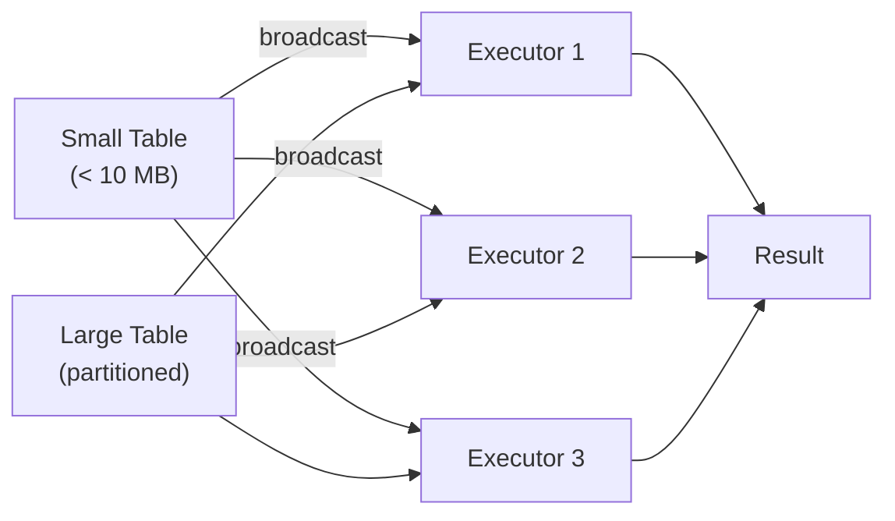
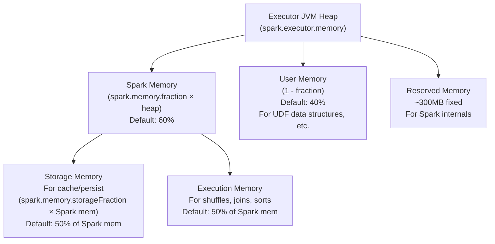

# Spark Performance Tuning

> [!abstract] TL;DR
> Spark performance problems almost always come from one of four sources: too many or too few partitions, data skew (some partitions are 100x larger than others), excessive shuffles, or memory pressure. Adaptive Query Execution (Spark 3+) fixes many issues automatically, but you still need to understand partitioning, broadcast joins, Parquet optimizations, and memory tuning for large-scale production pipelines.

## Partitioning Fundamentals

Partitions are the unit of parallelism in Spark. Each task processes exactly one partition.

### Key Configuration

```python
# Shuffle partitions: number of partitions after a shuffle (groupBy, join)
spark.conf.set("spark.sql.shuffle.partitions", "200")   # default — often too many

# Check how many partitions a DataFrame has
print(df.rdd.getNumPartitions())

# Check partition sizes (approximate)
df.withColumn("pid", F.spark_partition_id()) \
  .groupBy("pid").count() \
  .orderBy(F.col("count").desc()) \
  .show(20)
```

### Rules of Thumb

| Situation | Target |
|---|---|
| Shuffle partition count | 2–3× total executor cores across the cluster |
| Partition size (in memory) | ~128–256 MB per partition |
| Partition size (on disk) | ~64–128 MB per partition (Parquet compressed) |
| Too many small partitions | High scheduling overhead; each task has ~1ms setup cost |
| Too few large partitions | Memory pressure; GC spikes; stragglers |

```python
# Quick formula: if your dataset is 100GB and you want ~200MB partitions → 500 partitions
# For a cluster with 50 cores: set shuffle.partitions = 100-150
spark.conf.set("spark.sql.shuffle.partitions", "100")
```

### `repartition()` vs `coalesce()`

```python
# repartition(n): full shuffle — evenly redistributes data
# Use when: increasing partitions, fixing skew, need even distribution before a wide transform
df_even = df.repartition(100)
df_on_key = df.repartition(50, "user_id")   # co-partition for subsequent joins

# coalesce(n): narrow transform — merges partitions without full shuffle
# Use when: reducing partition count before writing (avoid many tiny files)
# CANNOT increase partition count above current number
df_compact = df.coalesce(10)
df_compact.write.parquet("output/")
```

> [!warning] `coalesce()` produces uneven partition sizes because it just merges adjacent partitions. If you need evenly-sized output files, use `repartition()`.

---

## Data Skew: Detection and Solutions

Data skew occurs when a small number of partitions contain dramatically more data than others. This causes a few tasks to take 10–100× longer than the rest, stalling the entire stage.

### Detection

```python
# Method 1: Check partition row counts
df.withColumn("pid", F.spark_partition_id()) \
  .groupBy("pid") \
  .count() \
  .orderBy(F.col("count").desc()) \
  .show(20)
# If the top partition has 10M rows and others have 100K → severe skew

# Method 2: Check key distribution before a join
df.groupBy("skewed_key") \
  .count() \
  .orderBy(F.col("count").desc()) \
  .show(20)
# A single key with millions of rows is the skew culprit

# Method 3: Spark UI → Stages tab → task duration histogram
# Straggler tasks (long tail) indicate skew
```

### Solution 1: Salting

Artificially split a hot key into multiple sub-keys, aggregate, then re-aggregate:

```python
import random
from pyspark.sql import functions as F

SALT_BUCKETS = 10

# Step 1: Add random salt to left side
df_left_salted = df_left.withColumn(
    "salted_key",
    F.concat(F.col("skewed_key"), F.lit("_"), (F.rand() * SALT_BUCKETS).cast("int").cast("string"))
)

# Step 2: Explode salt on right side (replicate each row SALT_BUCKETS times)
salt_df = spark.range(SALT_BUCKETS).toDF("salt")
df_right_exploded = df_right.crossJoin(salt_df).withColumn(
    "salted_key",
    F.concat(F.col("original_key"), F.lit("_"), F.col("salt").cast("string"))
).drop("salt")

# Step 3: Join on salted key
joined = df_left_salted.join(df_right_exploded, "salted_key", "left")

# Step 4: Aggregate back to real key
result = joined.groupBy("skewed_key").agg(F.sum("amount"))
```

### Solution 2: Skew Hint (Spark 3.x)

```python
# Hint the optimizer that a specific column is skewed
# AQE will automatically split large partitions for this join
result = df_left.hint("skew", "user_id").join(df_right, "user_id")
```

### Solution 3: AQE Skew Join (Automatic)

```python
# Enable AQE — it automatically detects and handles skew at runtime
spark.conf.set("spark.sql.adaptive.enabled", "true")
spark.conf.set("spark.sql.adaptive.skewJoin.enabled", "true")
spark.conf.set("spark.sql.adaptive.skewJoin.skewedPartitionFactor", "5")    # 5x median → skewed
spark.conf.set("spark.sql.adaptive.skewJoin.skewedPartitionThresholdInBytes", "256mb")
```

---

## Broadcast Joins

A broadcast join sends the **entire smaller table** to every executor in memory, eliminating the shuffle for the larger table.



```python
# Auto-broadcast: Spark broadcasts tables smaller than this threshold
spark.conf.set("spark.sql.autoBroadcastJoinThreshold", "10mb")   # default: 10MB
# Set to -1 to disable auto-broadcast entirely

# Manual broadcast hint (overrides threshold)
from pyspark.sql.functions import broadcast
result = large_df.join(broadcast(small_lookup), "country_code", "left")

# Check if broadcast was used in the plan
result.explain()
# Look for: BroadcastHashJoin in the physical plan
# vs:        SortMergeJoin (requires full shuffle of both sides)
```

### Broadcast Thresholds

| Table size | Recommendation |
|---|---|
| < 10 MB | Auto-broadcast (default threshold) |
| 10–200 MB | Manual `broadcast()` hint if join is hot |
| > 200 MB | Do NOT broadcast — OOM risk on executors |
| Unknown size | Let AQE decide post-scan |

> [!warning] Each executor must hold the broadcast table in memory. With 20 executors and a 200MB broadcast table: 4GB of executor memory consumed just for the broadcast. Size accordingly.

---

## Parquet Optimizations

Parquet is Spark's native columnar format and provides three layers of optimization:

### Layer 1: Partition Pruning (Hive-style Partitioning)

```python
# Write with partition columns
df.write.partitionBy("year", "month", "day").parquet("s3://bucket/events/")
# Creates: s3://bucket/events/year=2024/month=01/day=15/part-*.parquet

# Spark prunes entire directories — never reads year=2023 files when filter is year=2024
df = spark.read.parquet("s3://bucket/events/") \
    .filter((F.col("year") == 2024) & (F.col("month") == 3))
# Catalyst pushes this filter to the file discovery phase
```

### Layer 2: Column Pruning

```python
# Reading only needed columns — Parquet reads column chunks, not full rows
# This is automatic when you select() before (or after) reading
df = spark.read.parquet("s3://bucket/wide_table/") \
    .select("user_id", "amount", "event_date")
# Only user_id, amount, event_date columns are read from disk

# Verify in explain():
# FileScan parquet [...] PushedFilters: [...], ReadSchema: struct<user_id:bigint,amount:double,...>
```

### Layer 3: Row Group / Page Filtering

Parquet stores min/max statistics per row group (default ~128MB blocks). Spark uses these statistics to skip row groups that cannot satisfy a filter:

```python
# Effective when data is sorted or clustered by the filter column
# Example: if events are written in chronological order, a date range filter
# can skip most row groups via statistics alone

# Boost: sort before writing
df.orderBy("event_date") \
  .write.mode("overwrite") \
  .parquet("s3://bucket/events_sorted/")
```

### File Size Guidelines

```python
# Too many small files = "small files problem" — high metadata overhead in HDFS/S3
# Target: 128MB–1GB per Parquet file

# Control output file count
target_files = 100
df.repartition(target_files).write.parquet("output/")

# Or use coalesce if reducing from many partitions
df.coalesce(20).write.parquet("output/")
```

---

## `mapPartitions` vs `map` (for UDFs)

```python
# map / udf: called once per ROW — high per-call overhead for setup (DB connections, model loads)
def enrich_row(row):
    # Imagine this opens a DB connection each time → catastrophic
    conn = get_db_connection()
    result = conn.query(row.user_id)
    conn.close()
    return result

# mapPartitions: called once per PARTITION — amortizes setup cost
def enrich_partition(rows):
    conn = get_db_connection()       # one connection per partition, not per row
    for row in rows:
        yield conn.query(row.user_id)
    conn.close()

result_rdd = df.rdd.mapPartitions(enrich_partition)

# DataFrame equivalent: foreachPartition (no return) or mapPartitions
result = df.rdd.mapPartitions(enrich_partition).toDF(schema)
```

> [!tip] Use `mapPartitions` whenever your UDF needs to initialise an expensive resource (database connection, ML model, HTTP session) that can be reused for all rows in the partition. This is one of the few remaining good use cases for the RDD API.

---

## Serialization: Kryo vs Java

```python
# Default: Java serialization — slow, large output
# Kryo: ~10x faster, more compact, requires class registration for maximum benefit

spark.conf.set("spark.serializer", "org.apache.spark.serializer.KryoSerializer")
spark.conf.set("spark.kryo.registrationRequired", "false")   # false = works without registration
# For maximum benefit in Scala, register classes:
# spark.conf.set("spark.kryo.classesToRegister", "com.myapp.MyClass,com.myapp.OtherClass")
```

Kryo matters most when:
- Using RDDs with complex Scala/Java objects.
- Shuffling custom case class types.
- Broadcasting large collections.

With the DataFrame API, Tungsten's binary format largely bypasses Java/Kryo serialization anyway.

---

## Memory Management

Spark's executor memory is divided into distinct regions:



### Key Memory Configurations

```python
# Executor sizing
spark.conf.set("spark.executor.memory", "8g")        # JVM heap per executor
spark.conf.set("spark.executor.memoryOverhead", "1g") # off-heap overhead (shuffle buffers, etc.)
spark.conf.set("spark.executor.cores", "4")           # vCPUs per executor

# Driver sizing
spark.conf.set("spark.driver.memory", "4g")
spark.conf.set("spark.driver.memoryOverhead", "512m")

# Memory fraction tuning
spark.conf.set("spark.memory.fraction", "0.6")        # fraction of heap for Spark managed memory
spark.conf.set("spark.memory.storageFraction", "0.5") # fraction of managed for storage (cache)

# Off-heap memory (reduces GC pressure for large datasets)
spark.conf.set("spark.memory.offHeap.enabled", "true")
spark.conf.set("spark.memory.offHeap.size", "4g")
```

### Memory Tuning Strategy

| Symptom | Likely Cause | Fix |
|---|---|---|
| `OutOfMemoryError: Java heap space` | Executor heap too small | Increase `spark.executor.memory` |
| `SparkException: Container killed by YARN for exceeding memory limits` | Total container memory (heap + overhead) exceeds YARN limit | Reduce `executor.memory` or increase YARN container limit |
| High GC time (>10%) in Executors tab | Too many objects on heap; caching too much | Reduce cache, use off-heap, increase memory |
| `shuffle spill (disk)` in Stages tab | Execution memory insufficient for sort/agg | Increase executor memory or reduce shuffle partitions |
| Driver OOM | `collect()` on large data, or many broadcast variables | Avoid `collect()`, use write; reduce broadcast table sizes |

### Executor Sizing Best Practices

```python
# YARN: Don't use giant executors — 4-5 cores per executor is the sweet spot
# Too many cores per executor → HDFS throughput issues, GC contention
# Too few cores → high overhead
#
# Example for 10 worker nodes × 16 cores × 64GB RAM:
#   executor-cores = 5
#   executor-memory = 18g  (leave some for OS: 64 / (16/5) ≈ 20g, minus overhead)
#   executor-memoryOverhead = 2g
#   num-executors = 10 × (16/5) - 1 = 31  (minus 1 for AM)
```

---

## Adaptive Query Execution (AQE) — Spark 3.0+

AQE makes runtime decisions by re-optimising the query plan **after each shuffle stage**, using actual statistics rather than estimates.

```python
# Enable AQE (default=true in Spark 3.2+)
spark.conf.set("spark.sql.adaptive.enabled", "true")
```

### AQE Feature 1: Coalescing Shuffle Partitions

With `shuffle.partitions=200`, most aggregations on small data create 200 nearly-empty partitions. AQE collapses small post-shuffle partitions into fewer, appropriately-sized ones.

```python
spark.conf.set("spark.sql.adaptive.coalescePartitions.enabled", "true")
spark.conf.set("spark.sql.adaptive.coalescePartitions.minPartitionSize", "1mb")
spark.conf.set("spark.sql.adaptive.advisoryPartitionSizeInBytes", "128mb")
# AQE targets ~128MB partitions by coalescing
```

### AQE Feature 2: Dynamic Broadcast Join

After Stage 0 completes, AQE knows the actual size of the shuffle output. If one side of a join turns out to be small (even if Spark didn't know at plan time), AQE can switch from SortMergeJoin to BroadcastHashJoin dynamically.

```python
spark.conf.set("spark.sql.adaptive.autoBroadcastJoinThreshold", "30mb")
# Independent of autoBroadcastJoinThreshold — AQE uses runtime stats
```

### AQE Feature 3: Skew Join Optimization

AQE splits oversized partitions in a join and processes them in parallel with smaller tasks.

```python
spark.conf.set("spark.sql.adaptive.skewJoin.enabled", "true")
spark.conf.set("spark.sql.adaptive.skewJoin.skewedPartitionFactor", "5")
# A partition is skewed if its size > 5 × median partition size
spark.conf.set("spark.sql.adaptive.skewJoin.skewedPartitionThresholdInBytes", "256mb")
```

---

## Avoiding Common Performance Anti-Patterns

### Anti-Pattern 1: UDF instead of built-in functions

```python
# BAD: Python UDF — row-by-row serialization between JVM and Python process
from pyspark.sql.functions import udf
@udf("string")
def category(amount):
    return "high" if amount > 1000 else "low"
df = df.withColumn("cat", category(F.col("amount")))

# GOOD: Catalyst-optimised built-in — 10–100x faster
df = df.withColumn("cat", F.when(F.col("amount") > 1000, "high").otherwise("low"))
```

### Anti-Pattern 2: Iterating with Python loops

```python
# BAD: collect + iterate on driver
for row in df.collect():
    process(row)

# GOOD: use DataFrame transformations or foreachPartition
df.foreachPartition(lambda rows: [process(row) for row in rows])
```

### Anti-Pattern 3: Repeated expensive recomputation

```python
# BAD: df_expensive is recomputed twice (once per action)
df_expensive = big_table.join(other, "key").agg(...)
df_expensive.write.parquet("path/a/")
df_expensive.write.parquet("path/b/")

# GOOD: cache between multiple uses
df_expensive = big_table.join(other, "key").agg(...).cache()
df_expensive.write.parquet("path/a/")
df_expensive.write.parquet("path/b/")
df_expensive.unpersist()
```

### Anti-Pattern 4: Cartesian joins

```python
# BAD: cross join explodes row count — n×m rows
df_cross = df1.crossJoin(df2)   # 1M × 1M = 1 trillion rows

# GOOD: use explicit join conditions
df_joined = df1.join(df2, "shared_key")
```

---

## Performance Tuning Checklist

```python
# ─── Cluster Sizing ───────────────────────────────────────────────────────────
spark.conf.set("spark.executor.cores",          "4")       # sweet spot: 4-5 cores
spark.conf.set("spark.executor.memory",         "16g")     # heap per executor
spark.conf.set("spark.executor.memoryOverhead", "2g")      # off-heap overhead
spark.conf.set("spark.driver.memory",           "4g")

# ─── Partitioning ─────────────────────────────────────────────────────────────
spark.conf.set("spark.sql.shuffle.partitions",  "200")     # tune: 2-3x cores
spark.conf.set("spark.default.parallelism",     "200")     # for RDD operations

# ─── Adaptive Query Execution ─────────────────────────────────────────────────
spark.conf.set("spark.sql.adaptive.enabled",                           "true")
spark.conf.set("spark.sql.adaptive.coalescePartitions.enabled",        "true")
spark.conf.set("spark.sql.adaptive.skewJoin.enabled",                  "true")
spark.conf.set("spark.sql.adaptive.advisoryPartitionSizeInBytes",      "128mb")

# ─── Joins ────────────────────────────────────────────────────────────────────
spark.conf.set("spark.sql.autoBroadcastJoinThreshold",  "10mb")

# ─── Serialization ────────────────────────────────────────────────────────────
spark.conf.set("spark.serializer", "org.apache.spark.serializer.KryoSerializer")

# ─── I/O ──────────────────────────────────────────────────────────────────────
spark.conf.set("spark.sql.parquet.filterPushdown",        "true")     # default true
spark.conf.set("spark.sql.parquet.enableVectorizedReader","true")     # default true
spark.conf.set("spark.sql.hive.metastorePartitionPruning","true")

# ─── Dynamic Allocation ───────────────────────────────────────────────────────
spark.conf.set("spark.dynamicAllocation.enabled",                  "true")
spark.conf.set("spark.dynamicAllocation.minExecutors",             "2")
spark.conf.set("spark.dynamicAllocation.maxExecutors",             "50")
spark.conf.set("spark.dynamicAllocation.executorIdleTimeout",      "60s")
```

---

## Common Pitfalls

- Setting `shuffle.partitions = 200` for tiny datasets (< 1 GB) — creates 200 tasks of microseconds each; set it to 10–20 for small jobs.
- Over-broadcasting: tables > 200MB sent to all executors consume huge amounts of executor memory; prefer sort-merge join for large tables.
- Ignoring shuffle spill in the Spark UI — `Spill (disk)` in the Stages tab means tasks overflowed memory to disk during aggregation; increase executor memory or partition count.
- Caching mid-pipeline DataFrames that are only used once — wastes storage memory without benefit.
- Using `df.rdd.getNumPartitions()` without understanding that it reflects the initial read, not post-shuffle partition count.
- Forgetting that `repartition("user_id")` uses hash partitioning — `NULL` values all go to one partition, potentially creating a skew bucket.
- Not enabling AQE in Spark 3.x — it's now on by default but verify it's not been disabled in your cluster configuration.
- Running without `spark.executor.memoryOverhead` set — YARN containers can be killed without warning if off-heap usage (shuffle buffers, JVM overhead) exceeds the default 10% estimate.

---

## Review Questions

1. A Spark job's Stage 3 takes 10 minutes while all other stages take under 1 minute. The Stages tab shows 199 tasks complete in 30 seconds but Task 200 takes 10 minutes. What is the most likely cause, and what are three ways to fix it?
2. Explain how Adaptive Query Execution's coalescing shuffle partitions feature works. Why is the default of 200 shuffle partitions often problematic for small datasets?
3. What is the difference between predicate pushdown and column pruning in Parquet? How does Spark's Catalyst optimizer apply each?
4. When would you choose `repartition(n, "user_id")` before a join rather than just joining directly? What does co-partitioning buy you?
5. Describe the trade-off between executor memory size and number of executors. What is the "5 cores per executor" rule of thumb, and why does it exist?

#DataEngineering #Spark
