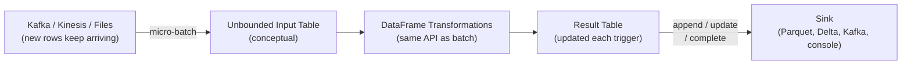
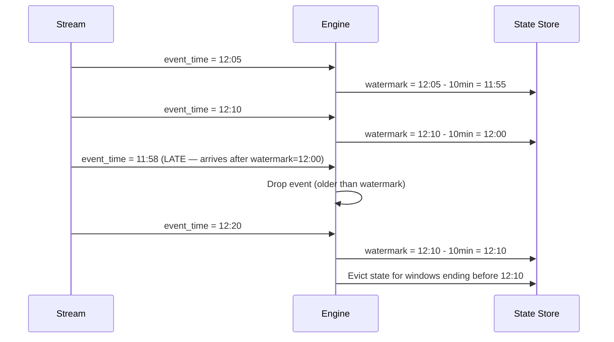

# Spark Structured Streaming

> [!abstract] TL;DR
> Structured Streaming treats an incoming data stream as an unbounded table and applies the same DataFrame API used in batch processing. The engine runs in micro-batches (or continuous mode), maintains checkpoints for exactly-once fault tolerance, and uses watermarks to handle late-arriving data. With Kafka as a source and Delta Lake or Parquet as a sink, it covers the majority of real production streaming use cases.

## Mental Model: Stream as an Unbounded Table



Key insight: you write **exactly the same `select`, `filter`, `groupBy`, `join` code** as batch. The engine handles the "run this forever" part through the `writeStream` API.

---

## Reading from Kafka

```python
from pyspark.sql import SparkSession
from pyspark.sql import functions as F
from pyspark.sql.types import StructType, StructField, StringType, LongType, TimestampType

spark = SparkSession.builder.appName("StreamingPipeline").getOrCreate()

# Read from Kafka — returns a DataFrame with fixed Kafka schema:
# key (binary), value (binary), topic, partition, offset, timestamp, timestampType
raw_stream = spark.readStream \
    .format("kafka") \
    .option("kafka.bootstrap.servers", "broker1:9092,broker2:9092") \
    .option("subscribe", "user_events") \
    .option("startingOffsets", "earliest") \     # or "latest", or JSON offset map
    .option("failOnDataLoss", "false") \          # continue if Kafka offset gap
    .option("maxOffsetsPerTrigger", "500000") \   # throttle ingest rate
    .option("kafka.security.protocol", "SASL_SSL") \
    .option("kafka.sasl.mechanism", "PLAIN") \
    .load()

# Subscribe to multiple topics
multi_stream = spark.readStream \
    .format("kafka") \
    .option("kafka.bootstrap.servers", "broker:9092") \
    .option("subscribePattern", "user_events_.*") \  # regex pattern
    .load()
```

### Parsing the Kafka Payload

Kafka `key` and `value` are `binary` (byte arrays). Decode and parse JSON:

```python
event_schema = StructType([
    StructField("user_id",    LongType(),      nullable=False),
    StructField("event_type", StringType(),    nullable=True),
    StructField("amount",     DoubleType(),    nullable=True),
    StructField("item_id",    StringType(),    nullable=True),
    StructField("session_id", LongType(),      nullable=True),
    StructField("event_time", TimestampType(), nullable=True),
])

parsed = raw_stream.select(
    F.from_json(F.col("value").cast("string"), event_schema).alias("data"),
    F.col("timestamp").alias("kafka_timestamp"),       # Kafka ingestion time
    F.col("topic"),
    F.col("partition"),
    F.col("offset"),
).select(
    "data.*",
    "kafka_timestamp",
    "topic",
    "partition",
    "offset",
)
# Now: user_id, event_type, amount, item_id, session_id, event_time, kafka_timestamp, ...
```

### Reading from Files (for testing / batch-style streaming)

```python
# Treat a directory as a stream — processes new files as they arrive
file_stream = spark.readStream \
    .option("maxFilesPerTrigger", "10") \    # process 10 files per micro-batch
    .schema(event_schema) \
    .parquet("s3a://bucket/incoming/")
```

---

## Trigger Types

The trigger controls when each micro-batch runs:

```python
from pyspark.sql.streaming import DataStreamWriter

# 1. Fixed interval micro-batch (most common)
query = df.writeStream \
    .trigger(processingTime="30 seconds") \
    .format("parquet") \
    .start()

# 2. Once — process all available data, then stop (deprecated since Spark 3.3)
query = df.writeStream \
    .trigger(once=True) \
    .format("parquet") \
    .start()
query.awaitTermination()

# 3. availableNow (Spark 3.3+) — process all available data in multiple batches, then stop
# Better than once=True: uses dynamic partition discovery, respects maxFilesPerTrigger
query = df.writeStream \
    .trigger(availableNow=True) \
    .format("parquet") \
    .start()
query.awaitTermination()

# 4. Continuous (experimental) — true sub-second low latency
# Limitations: only map-like operations, no aggregations, limited sources
query = df.writeStream \
    .trigger(continuous="1 second") \
    .format("kafka") \
    .start()
```

| Trigger | Latency | Best For |
|---|---|---|
| `processingTime="1 minute"` | 1–5 min | Near-real-time analytics |
| `processingTime="5 seconds"` | 5–30 sec | Low-latency dashboards |
| `availableNow` | Batch | Scheduled batch runs on streaming API |
| `continuous` | < 1 sec | Ultra-low latency (experimental, limited ops) |

---

## Watermarking and Late Data

Events rarely arrive in perfect order. Network delays, mobile app buffers, and retries cause **late data** — events with `event_time` older than the current processing time.

### Defining a Watermark

```python
# Tell Spark: "events may arrive up to 10 minutes late"
# The engine tracks: watermark = max(event_time seen) - 10 minutes
# Data older than the watermark is dropped

windowed = parsed \
    .withWatermark("event_time", "10 minutes") \
    .groupBy(
        F.window("event_time", "5 minutes"),   # 5-minute tumbling window
        F.col("event_type")
    ) \
    .agg(
        F.count("*").alias("event_count"),
        F.sum("amount").alias("total_amount"),
    )
```

### How the Watermark Advances



### Window Types

```python
# Tumbling window: fixed, non-overlapping windows
F.window("event_time", "5 minutes")

# Sliding window: windows that overlap
F.window("event_time", "10 minutes", "5 minutes")  # 10min window, slides every 5min
# A single event can fall into multiple windows

# Session window (Spark 3.2+): gap-based grouping
from pyspark.sql.functions import session_window
F.session_window("event_time", "30 minutes")  # new session if gap > 30 minutes
```

---

## Output Modes

Output mode controls which rows are written to the sink at each micro-batch:

| Mode | What is written | Requires | Use case |
|---|---|---|---|
| `append` | Only new rows added to result table | Watermark for aggregations | Append-only sinks (Parquet, files, Kafka) |
| `complete` | Entire result table | Bounded result set | Small aggregated tables (count by type) |
| `update` | Only rows that changed since last trigger | — | Delta/database upsert sinks |

```python
# Append mode — only works with stateless ops OR aggregations with watermark
df.writeStream.outputMode("append").format("parquet").start()

# Complete mode — rewrites entire result each trigger (use for small aggregated tables)
df.groupBy("event_type").count() \
  .writeStream.outputMode("complete").format("console").start()

# Update mode — efficient for Delta Lake upserts
df.writeStream.outputMode("update").foreachBatch(upsert_fn).start()
```

---

## Writing Output

### To Files (Parquet/Delta)

```python
checkpoint_base = "s3a://bucket/checkpoints/"

# Parquet — append mode, micro-batch partitioned by processing date
query = parsed.writeStream \
    .outputMode("append") \
    .format("parquet") \
    .option("checkpointLocation", f"{checkpoint_base}events_parquet/") \
    .option("path", "s3a://bucket/output/events/") \
    .trigger(processingTime="1 minute") \
    .partitionBy("event_type") \
    .start()

# Delta Lake — append
query = parsed.writeStream \
    .outputMode("append") \
    .format("delta") \
    .option("checkpointLocation", f"{checkpoint_base}events_delta/") \
    .option("path", "s3a://bucket/delta/events/") \
    .trigger(processingTime="1 minute") \
    .start()

query.awaitTermination()
```

### Writing Back to Kafka

```python
# Write enriched events back to Kafka — value must be a string or binary column
output = parsed.select(
    F.col("user_id").cast("string").alias("key"),
    F.to_json(F.struct("user_id", "event_type", "amount", "event_time")).alias("value")
)

query = output.writeStream \
    .format("kafka") \
    .option("kafka.bootstrap.servers", "broker:9092") \
    .option("topic", "enriched_events") \
    .option("checkpointLocation", f"{checkpoint_base}kafka_output/") \
    .start()
```

### Console / Memory (for development only)

```python
# Print to console — never use in production
query = df.writeStream.outputMode("append").format("console").start()

# In-memory table — queryable via spark.sql (small data only)
query = df.writeStream.outputMode("complete").format("memory").queryName("events").start()
spark.sql("SELECT * FROM events").show()
```

---

## Checkpointing and Fault Tolerance

Checkpointing is **mandatory** for production streaming jobs. It stores:
1. **Kafka/source offsets** — where to resume after restart.
2. **State data** — aggregation state, watermark positions, window state.
3. **Committed batch IDs** — to guarantee exactly-once processing.

```python
# Rules:
# 1. Each streaming query must have its OWN checkpoint location
# 2. The location must be on fault-tolerant storage (HDFS, S3, ADLS)
# 3. Never share checkpoints between different queries
# 4. Changing certain query parameters requires deleting the checkpoint

query1 = stream_A.writeStream \
    .option("checkpointLocation", "s3a://bucket/checkpoints/pipeline_v2/query1/") \
    .start()

query2 = stream_B.writeStream \
    .option("checkpointLocation", "s3a://bucket/checkpoints/pipeline_v2/query2/") \
    .start()
```

> [!warning] If you change the query logic significantly (add/remove transformations, change source schema), you may need to delete the checkpoint and restart from the beginning — or from a specific Kafka offset. The checkpoint is tied to the query's physical plan.

---

## Stateful Operations

For complex stateful logic beyond windowed aggregations, use `mapGroupsWithState` (Scala/Java only) or the Python equivalent via `applyInPandas` on streaming DataFrames.

### `flatMapGroupsWithState` via Pandas (Spark 3.4+ / experimental)

For stateful processing in PySpark, `applyInPandas` in streaming mode allows per-group state management:

```python
# Note: full stateful operator (mapGroupsWithState) is Scala/Java only
# In Python, complex stateful logic is typically handled via foreachBatch

def process_stateful_batch(batch_df, batch_id):
    """Process each micro-batch with access to state in Delta table."""
    # Load current state
    state = spark.read.format("delta").load("s3a://bucket/delta/user_state/")

    # Compute new state
    new_events = batch_df.groupBy("user_id").agg(
        F.sum("amount").alias("batch_spend"),
        F.count("*").alias("batch_events"),
    )

    # Merge into state table
    from delta.tables import DeltaTable
    dt = DeltaTable.forPath(spark, "s3a://bucket/delta/user_state/")
    dt.alias("s").merge(
        new_events.alias("n"),
        "s.user_id = n.user_id"
    ).whenMatchedUpdate(set={
        "total_spend":  "s.total_spend + n.batch_spend",
        "total_events": "s.total_events + n.batch_events",
        "last_updated": F.current_timestamp(),
    }).whenNotMatchedInsert(values={
        "user_id":      "n.user_id",
        "total_spend":  "n.batch_spend",
        "total_events": "n.batch_events",
        "last_updated": F.current_timestamp(),
    }).execute()

query = parsed.writeStream \
    .foreachBatch(process_stateful_batch) \
    .option("checkpointLocation", checkpoint_path) \
    .trigger(processingTime="1 minute") \
    .start()
```

---

## `foreachBatch`: Custom Sink Logic

`foreachBatch` is the most flexible output mechanism — it gives you each micro-batch as a regular (batch) DataFrame, letting you use any batch API operation including Delta MERGE, multi-sink writes, and custom quality checks.

```python
from delta.tables import DeltaTable

def foreach_batch_upsert(batch_df: "DataFrame", batch_id: int) -> None:
    """Upsert streaming events into a Delta table with deduplication."""
    if batch_df.isEmpty():
        return

    # Deduplicate within the batch (Kafka can deliver duplicates on retry)
    deduped = batch_df.dropDuplicates(["user_id", "event_time"])

    # Upsert to Delta
    target = DeltaTable.forPath(spark, "s3a://bucket/delta/events/")
    target.alias("t").merge(
        deduped.alias("s"),
        "t.user_id = s.user_id AND t.event_time = s.event_time"
    ).whenNotMatchedInsertAll() \
     .execute()

    # Also write a copy to audit log
    deduped.withColumn("ingested_batch", F.lit(batch_id)) \
           .write.mode("append") \
           .parquet(f"s3a://bucket/audit/batch_{batch_id}/")

query = parsed.writeStream \
    .foreachBatch(foreach_batch_upsert) \
    .option("checkpointLocation", "s3a://bucket/checkpoints/events_upsert/") \
    .trigger(processingTime="2 minutes") \
    .start()
```

> [!tip] In `foreachBatch`, you can call `batch_df.persist()` if you use the DataFrame more than once (e.g., write to multiple sinks), then `unpersist()` at the end to release memory.

---

## Monitoring Streaming Queries

```python
# List all active streaming queries in this SparkSession
for q in spark.streams.active:
    print(q.name, q.id, q.status)

# Current status
print(query.status)
# {'message': 'Waiting for next trigger', 'isDataAvailable': False,
#  'isTriggerActive': False}

# Last processed micro-batch stats
import json
print(json.dumps(query.lastProgress, indent=2))
# {
#   "id": "...",
#   "batchId": 42,
#   "timestamp": "2024-01-15T10:30:00.000Z",
#   "numInputRows": 15432,
#   "inputRowsPerSecond": 1543.2,
#   "processedRowsPerSecond": 3200.0,
#   "durationMs": {"getBatch": 50, "queryPlanning": 120, "addBatch": 4800, "triggerExecution": 5000},
#   "sources": [{"numInputRows": 15432, "startOffset": {"topic": {"0": 100}}, "endOffset": {...}}],
#   "sink": {"description": "FileSink[s3a://bucket/output/events]"}
# }

# Historical progress (last 100 batches)
for progress in query.recentProgress[-5:]:
    print(f"batch={progress['batchId']} rows={progress['numInputRows']} "
          f"rps={progress['inputRowsPerSecond']:.0f}")

# Wait for query to terminate (blocks — use in scripts)
query.awaitTermination()

# Stop a query gracefully
query.stop()

# Restart all queries (e.g., after config change)
spark.streams.resetTerminated()
```

### Key Metrics to Monitor

| Metric | What it tells you | Alert if |
|---|---|---|
| `inputRowsPerSecond` | Ingest rate | Drops suddenly (source issue) or spikes (backlog) |
| `processedRowsPerSecond` | Throughput | Lower than input rate → falling behind |
| `durationMs.addBatch` | Core processing time | Consistently close to trigger interval → insufficient capacity |
| `sources[].numInputRows` | Rows per trigger | Near `maxOffsetsPerTrigger` → backlog building |
| `batchId` progression | Continuity | Gaps indicate restarts or failures |

---

## End-to-End Example: Kafka → Delta Lake Pipeline

```python
from pyspark.sql import SparkSession, functions as F
from pyspark.sql.types import *
from delta.tables import DeltaTable

spark = SparkSession.builder \
    .appName("EventsPipeline") \
    .config("spark.sql.extensions", "io.delta.sql.DeltaSparkSessionExtension") \
    .config("spark.sql.catalog.spark_catalog",
            "org.apache.spark.sql.delta.catalog.DeltaCatalog") \
    .getOrCreate()

KAFKA_BROKERS     = "broker1:9092,broker2:9092"
KAFKA_TOPIC       = "user_events"
DELTA_PATH        = "s3a://bucket/delta/events/"
CHECKPOINT_PATH   = "s3a://bucket/checkpoints/events_v3/"

event_schema = StructType([
    StructField("user_id",    LongType()),
    StructField("event_type", StringType()),
    StructField("amount",     DoubleType()),
    StructField("event_time", TimestampType()),
])

# 1. Read stream
raw = spark.readStream \
    .format("kafka") \
    .option("kafka.bootstrap.servers", KAFKA_BROKERS) \
    .option("subscribe", KAFKA_TOPIC) \
    .option("startingOffsets", "latest") \
    .option("maxOffsetsPerTrigger", "100000") \
    .load()

# 2. Parse and transform
events = raw \
    .select(F.from_json(F.col("value").cast("string"), event_schema).alias("e")) \
    .select("e.*") \
    .filter(F.col("user_id").isNotNull()) \
    .withColumn("event_date", F.to_date("event_time")) \
    .withColumn("amount_usd",  F.round(F.col("amount"), 2)) \
    .withWatermark("event_time", "5 minutes")

# 3. Write with MERGE (exactly-once upsert)
def upsert_to_delta(batch_df, batch_id):
    batch_df = batch_df.dropDuplicates(["user_id", "event_time"]).cache()
    if batch_df.isEmpty():
        batch_df.unpersist()
        return

    dt = DeltaTable.forPath(spark, DELTA_PATH)
    dt.alias("t").merge(
        batch_df.alias("s"),
        "t.user_id = s.user_id AND t.event_time = s.event_time"
    ).whenNotMatchedInsertAll().execute()
    batch_df.unpersist()

query = events.writeStream \
    .foreachBatch(upsert_to_delta) \
    .option("checkpointLocation", CHECKPOINT_PATH) \
    .trigger(processingTime="1 minute") \
    .start()

query.awaitTermination()
```

---

## Common Pitfalls

- Not setting `checkpointLocation` — without a checkpoint, a restart replays all Kafka data from the beginning (or loses offsets entirely).
- Using the same checkpoint directory for two different queries — they overwrite each other's state and produce corrupt results.
- Using `outputMode("append")` with a windowed aggregation but no watermark — Spark raises `AnalysisException: Append output mode not supported when there are streaming aggregations without watermark`.
- Setting the watermark threshold too tight (e.g., 1 minute for mobile events that can buffer for hours) — legitimate late events get silently dropped.
- Calling `df.show()` or `df.count()` on a streaming DataFrame — these batch actions throw `AnalysisException: Queries with streaming sources must be executed with writeStream.start()`.
- Not caching `batch_df` inside `foreachBatch` when writing to multiple sinks — the DataFrame is recomputed from scratch for each sink write.
- Using `trigger(once=True)` in Spark 3.3+ — prefer `trigger(availableNow=True)` which processes all available data in multiple efficient batches and respects `maxFilesPerTrigger`.
- Forgetting `query.awaitTermination()` in a script — without it, the Python process exits immediately and the streaming query is killed.
- Using `complete` output mode on high-cardinality aggregations — `complete` mode writes the entire result table every trigger; with millions of keys this rewrites massive amounts of data each minute.

---

## Review Questions

1. Explain what a watermark is in Structured Streaming. Why is it required for aggregations in `append` output mode, and what happens to events that arrive after the watermark boundary?
2. What is the difference between `trigger(once=True)` and `trigger(availableNow=True)`? Why is `availableNow` preferred in Spark 3.3+?
3. Describe the three output modes (`append`, `complete`, `update`). For each, give a real scenario where it would be the correct choice.
4. What does checkpointing store, and why must each streaming query have its own unique checkpoint location?
5. When would you use `foreachBatch` instead of a native format sink like `.format("delta")`? What are the trade-offs?

#DataEngineering #Spark
