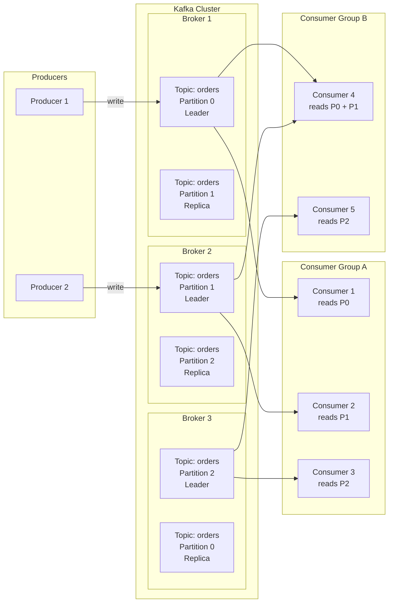

# Kafka Fundamentals

> [!abstract] TL;DR
> Apache Kafka is a distributed commit log — an append-only, immutable, partitioned, and replicated sequence of records. Unlike traditional message queues that delete messages after consumption, Kafka retains records based on time/size policies, enabling multiple independent consumers to replay the same stream. It is the de facto standard for high-throughput event streaming, CDC pipelines, and decoupled microservice communication.

## The Distributed Commit Log

Kafka's foundational abstraction is the **commit log**: an ordered, append-only sequence of records. Once written, records are never mutated. The core properties:

- **Append-only**: new records are always appended to the end of the partition log
- **Immutable**: records cannot be edited or deleted individually (only expired by retention policy)
- **Partitioned**: a topic is split into N partitions, each being an independent ordered log
- **Replicated**: each partition is copied across multiple brokers for fault tolerance

Every record carries:
- **Key** (optional): used for partitioning and compaction
- **Value**: the payload (bytes — schema is the application's responsibility)
- **Timestamp**: event time or ingestion time
- **Offset**: a monotonically increasing integer per partition, uniquely identifying a record's position (0-indexed)

```
Partition 0:  [offset=0] [offset=1] [offset=2] [offset=3] → appending
Partition 1:  [offset=0] [offset=1] [offset=2] → appending
Partition 2:  [offset=0] [offset=1] → appending
```

Offsets are local to a partition. Offset 5 in Partition 0 is unrelated to Offset 5 in Partition 1.

## Core Architecture Components

### Topics and Partitions

A **topic** is a logical stream name — a category to which producers write and from which consumers read. Topics are split into **partitions** to enable parallelism and horizontal scaling.

```
Topic: "order-events"
  ├── Partition 0  (stored on Broker 1, replicated to Broker 2)
  ├── Partition 1  (stored on Broker 2, replicated to Broker 3)
  └── Partition 2  (stored on Broker 3, replicated to Broker 1)
```

Each partition is an ordered, immutable log stored as segment files on the broker's disk. Within a partition, ordering is strictly guaranteed. **Across partitions, there is no ordering guarantee.**

### Brokers

A **broker** is a Kafka server process. A Kafka cluster typically has 3–12+ brokers for production. Each broker:
- Stores partition log segments on disk (sequential I/O — very fast)
- Serves producer write requests and consumer fetch requests
- Participates in replication (as either leader or follower for each partition)
- One broker is the **controller** (elected via ZooKeeper or KRaft) — manages partition leadership and cluster metadata

### Producers

Producers write records to topics. Key behaviors:
- Choose which partition to write to (by key hash, round-robin, or custom partitioner)
- Batch records for throughput
- Configure durability guarantees via `acks`

### Consumers and Consumer Groups

A **consumer** reads records from one or more topic partitions by tracking offsets. Consumers operate within **consumer groups**:

- Each partition is consumed by **exactly one consumer** within a group at a time
- Multiple groups can consume the same topic independently — each group maintains its own offsets
- Parallelism is bounded by partition count: adding more consumers than partitions results in idle consumers

```
Topic (3 partitions) → Consumer Group A (3 consumers): 1 partition each
Topic (3 partitions) → Consumer Group B (2 consumers): 1 consumer gets 2 partitions, 1 gets 1
Topic (3 partitions) → Consumer Group C (4 consumers): 1 consumer is idle
```

## Architecture Diagram



## Replication and Durability

Each partition has one **leader replica** and zero or more **follower replicas**.

- The **leader** handles all reads and writes for that partition
- **Followers** continuously fetch from the leader to stay in sync
- **ISR (In-Sync Replicas)**: the set of replicas that are caught up to within a configurable lag threshold (`replica.lag.time.max.ms`). If a follower falls too far behind, it is removed from the ISR.

### min.insync.replicas

The `min.insync.replicas` broker/topic config sets the minimum number of ISR replicas that must acknowledge a write before the producer considers it committed (when `acks=all`).

```
replication.factor = 3
min.insync.replicas = 2

→ Tolerates 1 broker failure while still accepting writes
→ If 2 brokers are down: topic becomes read-only (writes fail with NotEnoughReplicasException)
```

| `acks` | `min.insync.replicas` | Durability | Latency |
|--------|----------------------|------------|---------|
| 0 | N/A | None (fire-and-forget) | Lowest |
| 1 | N/A | Leader only | Low |
| all | 1 | Same as acks=1 (misleading) | Medium |
| all | 2 (RF=3) | Production standard | Higher |

## `__consumer_offsets` Topic

Kafka stores committed consumer group offsets in the internal `__consumer_offsets` topic:
- Compacted topic (retains latest offset per `group+topic+partition` key)
- 50 partitions by default (`offsets.topic.num.partitions`)
- When a consumer commits offset N for partition P, it writes a record to `__consumer_offsets`
- On restart, consumers read from this topic to know where to resume

This allows offset management without any external state (no ZooKeeper, no database).

## Kafka Guarantees

| Guarantee | How to Achieve |
|-----------|---------------|
| **At-most-once** | `acks=0`, no retries, auto-commit before processing |
| **At-least-once** | `acks=all`, retries enabled, commit after processing |
| **Exactly-once** | Idempotent producer + transactions (`enable.idempotence=true`, transactional API) |
| **Ordering** | Guaranteed within a partition; not across partitions |

### Idempotent Producer
With `enable.idempotence=true`, the broker assigns each producer a **PID (Producer ID)** and tracks sequence numbers. Duplicate writes caused by retries are silently deduplicated. This is enabled by default in Kafka 3.0+.

### Transactions
Kafka transactions allow atomic writes across multiple partitions and topics — either all succeed or all are rolled back. Required for exactly-once stream processing:

```java
producer.initTransactions();
producer.beginTransaction();
try {
    producer.send(new ProducerRecord<>("topic-a", key, value1));
    producer.send(new ProducerRecord<>("topic-b", key, value2));
    producer.commitTransaction();
} catch (Exception e) {
    producer.abortTransaction();
}
```

## Kafka vs. Traditional Message Queues

| Dimension | Kafka | RabbitMQ / Amazon SQS |
|-----------|-------|----------------------|
| **Consumption model** | Log — message retained after read | Queue — message deleted after ACK |
| **Multiple consumers** | Independent groups replay same data | Competing consumers split messages |
| **Replay** | Yes — reset offset to any point in retention window | No |
| **Throughput** | Millions of msgs/sec (sequential disk I/O) | Thousands to low millions |
| **Ordering** | Per-partition FIFO | Best-effort (SQS) / queue-level (RabbitMQ) |
| **Routing** | Topic/partition key | Exchange/routing key, dead-letter queues |
| **Use case** | Event streaming, CDC, audit log, event sourcing | Task queues, RPC, work distribution |

**When to choose Kafka:**
- Multiple consumers need to independently process the same event stream
- You need to replay historical events (new service bootstrapping, bug replay)
- High-throughput ingestion (logs, metrics, CDC)
- Event sourcing or audit trail requirements
- Stream processing pipelines (Kafka Streams, Flink, Spark)

**When to choose RabbitMQ/SQS:**
- Simple task queue with one consumer type
- Complex routing logic (topic exchanges, fanout)
- Short-lived messages with acknowledgment semantics

## ZooKeeper vs. KRaft Mode

### ZooKeeper (Legacy, Deprecated in Kafka 3.x)
Originally, Kafka used Apache ZooKeeper for:
- Storing cluster metadata (broker list, topic configs, partition assignments)
- Controller election (one broker is elected controller to manage partition leadership)
- Consumer group coordination (pre-Kafka 0.9 — now done internally)

Drawbacks: operational complexity of a separate ZooKeeper ensemble, metadata bottleneck at scale, slow failover during controller election.

### KRaft (Kafka Raft Metadata Mode)
Introduced in Kafka 2.8, **production-ready from Kafka 3.3+**, mandatory from Kafka 4.0:
- Kafka manages its own metadata using a built-in **Raft consensus** protocol
- Metadata stored in an internal `__cluster_metadata` topic
- A subset of brokers acts as **controllers** (voters in the Raft quorum)
- Eliminates ZooKeeper entirely — simpler operations, faster failover (<30s → <1s)
- Single security model, unified configuration

```
# KRaft broker config snippet
process.roles=broker,controller   # combined mode (dev) or separate roles (prod)
node.id=1
controller.quorum.voters=1@host1:9093,2@host2:9093,3@host3:9093
```

## Retention and Log Cleanup

Records are not deleted immediately after consumption. Retention is controlled by:

```properties
# Time-based (default: 7 days)
log.retention.ms=604800000

# Size-based (per partition, default: disabled)
log.retention.bytes=1073741824

# Log compaction (keeps latest value per key)
log.cleanup.policy=compact

# Combined: compact AND time-based delete
log.cleanup.policy=compact,delete
```

**Log segments**: partition data is split into segment files (default 1GB or 7 days). Older segments are candidates for deletion/compaction. Active segment is always the last one.

## Common Pitfalls

- **Too few partitions**: limits consumer parallelism and throughput. Can only increase partitions, never decrease — plan ahead.
- **No key on high-cardinality topics**: round-robin partitioning prevents ordered processing per entity (e.g., per-user event ordering requires keying by user ID).
- **`acks=1` with `min.insync.replicas=2`**: misleading — `acks=1` ignores `min.insync.replicas`. You need `acks=all` to enforce ISR acknowledgment.
- **Treating consumer lag as latency**: lag (message count) alone is misleading — a topic with 1000 messages/second at lag=1000 has 1 second of latency; the same lag on a slow topic is minutes.
- **Not accounting for partition skew**: if all messages share the same key, all go to one partition, nullifying horizontal scaling.
- **Consumers that commit before processing**: auto-commit can commit an offset before the application successfully processes the message, causing silent data loss on crash.
- **Comparing Kafka offsets across partitions**: offsets are partition-local integers. Offset 100 in P0 and Offset 100 in P1 are completely independent.

## Review Questions

1. Why is ordering only guaranteed within a partition and not across partitions? What is the architectural consequence for applications that need global ordering?
2. A topic has `replication.factor=3` and `min.insync.replicas=2`. Two brokers are unavailable. What happens to producer writes with `acks=all`? What happens to consumer reads?
3. How does `__consumer_offsets` enable consumer restarts without data loss? What is the risk if a consumer commits offsets but crashes before persisting its processed output?
4. Compare Kafka's log semantics to RabbitMQ's queue semantics. Give a concrete scenario where each is the better choice.
5. What is the KRaft mode and why does it simplify Kafka operations compared to ZooKeeper?

#DataEngineering #Kafka #DistributedSystems #MessageStreaming
