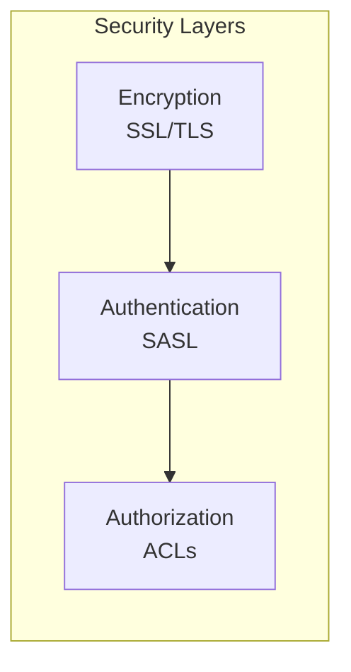

# Kafka Operations and Administration

> [!abstract] TL;DR
> Operating Kafka in production requires understanding topic management (partition counts, replication factors, retention policies), consumer group administration (lag monitoring, offset reset), and performance tuning (hardware, JVM, batching). Consumer lag is the #1 operational SLA metric — it tells you how far behind your consumers are from the latest events. Kafka exposes all metrics via JMX and integrates with Prometheus + Grafana for observability.

## Topic Management CLI

Kafka ships with shell scripts wrapping the Java admin client. On Kafka 3.x, use `--bootstrap-server` (not `--zookeeper`).

### Create, List, Describe

```bash
# Create a topic
kafka-topics.sh --create \
  --bootstrap-server localhost:9092 \
  --replication-factor 3 \
  --partitions 12 \
  --topic order-events \
  --config retention.ms=604800000 \
  --config min.insync.replicas=2

# Create with compact cleanup policy (for changelog/CDC topics)
kafka-topics.sh --create \
  --bootstrap-server localhost:9092 \
  --replication-factor 3 \
  --partitions 6 \
  --topic user-profiles \
  --config cleanup.policy=compact \
  --config min.cleanable.dirty.ratio=0.1 \
  --config segment.ms=86400000

# List all topics (includes internal topics)
kafka-topics.sh --list --bootstrap-server localhost:9092

# List only user-created topics (exclude __internal)
kafka-topics.sh --list --bootstrap-server localhost:9092 \
  | grep -v '^_'

# Describe a single topic
kafka-topics.sh --describe \
  --bootstrap-server localhost:9092 \
  --topic order-events

# Output example:
# Topic: order-events  PartitionCount: 12  ReplicationFactor: 3  Configs: ...
# Topic: order-events  Partition: 0  Leader: 1  Replicas: 1,2,3  Isr: 1,2,3
# Topic: order-events  Partition: 1  Leader: 2  Replicas: 2,3,1  Isr: 2,3,1
# ...

# Find under-replicated partitions (ISR < Replicas — data risk!)
kafka-topics.sh --describe \
  --bootstrap-server localhost:9092 \
  --under-replicated-partitions

# Find partitions with no leader (offline partitions — consumers blocked!)
kafka-topics.sh --describe \
  --bootstrap-server localhost:9092 \
  --unavailable-partitions
```

### Alter and Delete Topics

```bash
# Increase partition count (can ONLY increase, never decrease)
kafka-topics.sh --alter \
  --bootstrap-server localhost:9092 \
  --topic order-events \
  --partitions 24

# WARNING: increasing partitions re-distributes key-based routing for new messages
# Existing messages keep their original partition; new messages re-hash
# This breaks ordering guarantees for existing consumers relying on key affinity

# Modify topic config (retention, etc.)
kafka-configs.sh --alter \
  --bootstrap-server localhost:9092 \
  --entity-type topics \
  --entity-name order-events \
  --add-config retention.ms=2592000000  # 30 days

# Remove a topic-level config override (revert to broker default)
kafka-configs.sh --alter \
  --bootstrap-server localhost:9092 \
  --entity-type topics \
  --entity-name order-events \
  --delete-config retention.ms

# Describe current topic configs
kafka-configs.sh --describe \
  --bootstrap-server localhost:9092 \
  --entity-type topics \
  --entity-name order-events

# Delete a topic (set delete.topic.enable=true on broker — default true since Kafka 1.0)
kafka-topics.sh --delete \
  --bootstrap-server localhost:9092 \
  --topic order-events
```

## Partition Count Design Decisions

| Factor | Consideration |
|--------|---------------|
| **Target throughput** | Each partition handles ~10–100 MB/s (disk and network bound). Divide total throughput by per-partition throughput. |
| **Consumer parallelism** | Max useful consumers in a group = num partitions. Plan for future scaling. |
| **Replication overhead** | More partitions = more replication traffic, more file handles per broker. |
| **Kafka Streams** | Number of stream tasks = max(partitions across all input topics). |
| **Metadata overhead** | Each partition is tracked in controller memory. Very high partition counts (100k+) strain the controller. |

**Practical guidelines:**
```
Small topic (< 1 MB/s):    6 partitions (allows 6-consumer groups, room to grow)
Medium topic (1–10 MB/s):  12–24 partitions
High-throughput (10+ MB/s): 48–96+ partitions (benchmark first)
```

> [!warning] You can only increase partitions, never decrease
> Decreasing requires deleting and recreating the topic, which loses all data. Plan partition counts conservatively upward — start higher than needed.

## Replication Factor Guidelines

```
RF=1 → Development/testing only (no fault tolerance)
RF=2 → Some durability, 1 failure before data loss or unreadability
RF=3 → Production standard — tolerates 1 broker failure with continued writes (min.insync.replicas=2)
RF=5 → Critical topics where 2 simultaneous failures are plausible (financial records, compliance)
```

RF=3 with `min.insync.replicas=2` is the standard production configuration:
- Tolerates 1 broker failure and keeps accepting writes
- With 2 brokers down: read-only (can consume, cannot produce with acks=all)
- Storage cost: 3x your raw data size

## Retention Policies

### Time-Based Retention

```bash
# 7 days (default)
retention.ms=604800000

# Set via kafka-configs.sh
kafka-configs.sh --alter \
  --bootstrap-server localhost:9092 \
  --entity-type topics \
  --entity-name clickstream \
  --add-config retention.ms=86400000   # 1 day for high-volume click data
```

### Size-Based Retention (Per Partition)

```bash
# 1 GB per partition
retention.bytes=1073741824

# With both time AND size: whichever limit is hit first triggers deletion
kafka-configs.sh --alter \
  --bootstrap-server localhost:9092 \
  --entity-type topics \
  --entity-name logs \
  --add-config "retention.ms=604800000,retention.bytes=5368709120"  # 7d or 5GB/partition
```

### Log Compaction

Log compaction retains only the **latest value per key**. Records with `value=null` are **tombstones** — they mark a key for deletion and are eventually removed after `delete.retention.ms`.

```bash
# Enable compaction
cleanup.policy=compact

# Tuning compaction aggressiveness
min.cleanable.dirty.ratio=0.1    # compact when 10% of log is dirty (more frequent)
# default: 0.5 (compact when 50% dirty — less frequent, more storage used)

segment.ms=86400000              # 1 day — compaction only runs on closed segments
min.compaction.lag.ms=3600000    # messages must be at least 1h old before compaction

# Combined: compact AND time-based delete
cleanup.policy=compact,delete
```

**Log compaction use cases:**
- Consumer group offset topic (`__consumer_offsets`) — keeps latest offset per group
- Debezium CDC topics — latest state per row key
- User profile topics — latest profile per user ID
- Kafka Streams changelog topics — state store backups

## Consumer Group Management

```bash
# List all consumer groups
kafka-consumer-groups.sh --list \
  --bootstrap-server localhost:9092

# Describe a group (shows lag per partition — most important!)
kafka-consumer-groups.sh --describe \
  --bootstrap-server localhost:9092 \
  --group order-processing-service

# Output:
# GROUP                    TOPIC         PARTITION  CURRENT-OFFSET  LOG-END-OFFSET  LAG  CONSUMER-ID  HOST
# order-processing-service order-events  0          10500           10500           0    consumer-1   /10.0.0.1
# order-processing-service order-events  1          9800            10200           400  consumer-2   /10.0.0.2
# order-processing-service order-events  2          -               10100           -    -            -  ← no consumer!

# Describe ALL groups (broad audit)
kafka-consumer-groups.sh --describe \
  --bootstrap-server localhost:9092 \
  --all-groups

# Check for groups with lag
kafka-consumer-groups.sh --describe \
  --bootstrap-server localhost:9092 \
  --all-groups | awk 'NR==1 || $6 > 0'

# Delete a stale consumer group (must have no active members)
kafka-consumer-groups.sh --delete \
  --bootstrap-server localhost:9092 \
  --group stale-test-group
```

### Resetting Consumer Offsets

```bash
# Dry run first — always use --dry-run before --execute!
kafka-consumer-groups.sh --reset-offsets \
  --bootstrap-server localhost:9092 \
  --group my-group \
  --topic order-events \
  --to-earliest \
  --dry-run

# Reset to beginning (reprocess all retained data)
kafka-consumer-groups.sh --reset-offsets \
  --bootstrap-server localhost:9092 \
  --group my-group \
  --topic order-events \
  --to-earliest \
  --execute

# Reset to latest (skip backlog, start fresh)
kafka-consumer-groups.sh --reset-offsets \
  --bootstrap-server localhost:9092 \
  --group my-group \
  --topic order-events \
  --to-latest \
  --execute

# Reset to a specific timestamp (replay from a point in time)
kafka-consumer-groups.sh --reset-offsets \
  --bootstrap-server localhost:9092 \
  --group my-group \
  --topic order-events \
  --to-datetime 2024-06-01T00:00:00.000 \
  --execute

# Reset a specific partition to a specific offset
kafka-consumer-groups.sh --reset-offsets \
  --bootstrap-server localhost:9092 \
  --group my-group \
  --topic order-events:0 \
  --to-offset 5000 \
  --execute

# Reset ALL topics for a group
kafka-consumer-groups.sh --reset-offsets \
  --bootstrap-server localhost:9092 \
  --group my-group \
  --all-topics \
  --to-earliest \
  --execute
```

> [!warning] Consumer must be stopped before resetting offsets
> `--reset-offsets --execute` fails if the consumer group has active members. Stop all consumers in the group first.

## Producing and Consuming from CLI (Testing)

```bash
# Console producer — type messages, one per line
kafka-console-producer.sh \
  --bootstrap-server localhost:9092 \
  --topic test-topic \
  --property key.separator=: \
  --property parse.key=true
# Type: mykey:myvalue

# Console consumer — read from beginning
kafka-console-consumer.sh \
  --bootstrap-server localhost:9092 \
  --topic order-events \
  --from-beginning \
  --property print.key=true \
  --property key.separator=" | "

# Consumer in a group (tracks offsets)
kafka-console-consumer.sh \
  --bootstrap-server localhost:9092 \
  --topic order-events \
  --group debug-group \
  --from-beginning

# Read specific number of messages
kafka-console-consumer.sh \
  --bootstrap-server localhost:9092 \
  --topic order-events \
  --from-beginning \
  --max-messages 100
```

## Performance Tuning

### Hardware Recommendations

| Resource | Recommendation | Rationale |
|----------|---------------|-----------|
| **Disk** | NVMe SSDs (or fast SATA SSDs) | Sequential write throughput critical; HDDs work but limit to ~100-200 MB/s |
| **Disk filesystem** | XFS (preferred) or ext4 with `noatime` | XFS handles large files better; `noatime` removes access-time update on every read |
| **Disk I/O** | RAID-10 or JBOD (Kafka handles its own replication) | RAID-5/6 adds write amplification; JBOD common |
| **RAM** | 64-128GB+ | Kafka relies heavily on **OS page cache** — keep heap small (6-8GB), give rest to OS |
| **Network** | 10 GbE minimum, 25 GbE for high-throughput | Replication multiplies write bandwidth; each broker sends to N-1 followers |
| **CPU** | 8-16 cores | Mostly I/O bound, but compression/decompression is CPU-intensive |

### JVM Tuning

```bash
# broker environment / KAFKA_HEAP_OPTS
export KAFKA_HEAP_OPTS="-Xms6g -Xmx6g"

# GC settings (Kafka 2.x+ recommends G1GC)
export KAFKA_JVM_PERFORMANCE_OPTS="-server \
  -XX:+UseG1GC \
  -XX:MaxGCPauseMillis=20 \
  -XX:InitiatingHeapOccupancyPercent=35 \
  -XX:+ExplicitGCInvokesConcurrent \
  -Djava.awt.headless=true"
```

**Key principle**: keep JVM heap at 6-8GB max. The rest of RAM goes to the OS page cache, which Kafka uses aggressively for read performance (avoids disk I/O for recently written data).

### Broker Thread Tuning

```properties
# Network threads: handle client connections
num.network.threads=8        # default 3; increase for many concurrent clients

# I/O threads: disk read/write operations
num.io.threads=16            # default 8; set to 2x num disks or higher

# Background thread pool for log operations
background.threads=10

# Replication fetch threads (per broker, for followers)
num.replica.fetchers=4       # default 1; increase for higher replication throughput

# Max request size (default 1MB — increase for large payloads)
message.max.bytes=10485760   # 10MB
```

### OS-Level Tuning

```bash
# Increase file descriptor limit (each partition = multiple file handles)
echo "kafka    soft    nofile    100000" >> /etc/security/limits.conf
echo "kafka    hard    nofile    100000" >> /etc/security/limits.conf

# Disable swap — Kafka should never swap (causes severe performance degradation)
echo "vm.swappiness=1" >> /etc/sysctl.conf

# Increase socket buffer sizes for network throughput
echo "net.core.rmem_max=134217728" >> /etc/sysctl.conf
echo "net.core.wmem_max=134217728" >> /etc/sysctl.conf
echo "net.ipv4.tcp_rmem=4096 65536 134217728" >> /etc/sysctl.conf
echo "net.ipv4.tcp_wmem=4096 65536 134217728" >> /etc/sysctl.conf

# Dirty page ratios (allow more dirty pages before flush)
echo "vm.dirty_ratio=80" >> /etc/sysctl.conf
echo "vm.dirty_background_ratio=5" >> /etc/sysctl.conf

# Mount Kafka log directories with noatime
# In /etc/fstab:
# /dev/nvme0n1p1  /kafka/data  xfs  defaults,noatime  0 0
```

## Monitoring — Key Metrics

### Consumer Lag (Most Critical)

Consumer lag = `LOG-END-OFFSET - CURRENT-OFFSET` per partition. It represents how many messages a consumer group is behind the producer.

```
LAG = 0          → Consumer is caught up (real-time)
LAG = 1000       → Consumer is 1000 messages behind
LAG = growing    → Consumer cannot keep up with producer rate — ALERT!
LAG = constant   → Consumer processes at same rate as producer, but started behind
```

### Full Metrics Reference Table

| Metric | JMX MBean / Description | Alert Threshold |
|--------|--------------------------|-----------------|
| **Consumer Lag** | `kafka.consumer:type=consumer-fetch-manager-metrics,records-lag-max` | > SLA-defined threshold |
| **Under-Replicated Partitions** | `kafka.server:type=ReplicaManager,UnderReplicatedPartitions` | > 0 |
| **Offline Partitions** | `kafka.controller:type=KafkaController,OfflinePartitionsCount` | > 0 (critical) |
| **Active Controller Count** | `kafka.controller:type=KafkaController,ActiveControllerCount` | != 1 (critical) |
| **Leader Election Rate** | `kafka.controller:type=ControllerStats,LeaderElectionRateAndTimeMs` | Spike indicates failures |
| **Bytes In/Out** | `kafka.server:type=BrokerTopicMetrics,BytesInPerSec/BytesOutPerSec` | Trending toward capacity |
| **Request Queue Size** | `kafka.network:type=RequestChannel,RequestQueueSize` | Growing indicates overload |
| **Produce Request Latency** | `kafka.network:type=RequestMetrics,name=TotalTimeMs,request=Produce` | p99 > SLA |
| **Fetch Consumer Latency** | `kafka.network:type=RequestMetrics,name=TotalTimeMs,request=FetchConsumer` | p99 > SLA |
| **Log Flush Rate** | `kafka.log:type=LogFlushStats,LogFlushRateAndTimeMs` | High = performance issue |
| **JVM GC Time** | JVM GC pause duration | p99 > 200ms |
| **ISR Shrink Rate** | `kafka.server:type=ReplicaManager,IsrShrinksPerSec` | > 0 sustained = replication problem |
| **Network Handler Idle** | `kafka.network:type=SocketServer,NetworkProcessorAvgIdlePercent` | < 30% = network bottleneck |

### Prometheus JMX Exporter Setup

```yaml
# jmx_exporter_config.yml (Prometheus JMX Exporter)
startDelaySeconds: 0
ssl: false
lowercaseOutputName: false
lowercaseOutputLabelNames: false
rules:
  # Kafka broker metrics
  - pattern: "kafka.server<type=(.+), name=(.+)><>Value"
    name: "kafka_server_$1_$2"
  # Consumer group lag
  - pattern: "kafka.consumer<type=consumer-fetch-manager-metrics, client-id=(.+)><>records-lag-max"
    name: "kafka_consumer_records_lag_max"
    labels:
      client_id: "$1"
```

```bash
# Start broker with JMX exporter
export JMX_PORT=9999
export KAFKA_OPTS="-javaagent:/opt/jmx_prometheus_javaagent.jar=7071:/opt/jmx_exporter_config.yml"
kafka-server-start.sh /opt/kafka/config/server.properties
```

### Monitoring Tools Comparison

| Tool | Type | Strengths | Cost |
|------|------|-----------|------|
| **Prometheus + Grafana** | Metrics + dashboards | Industry standard, free, great community dashboards | Free (OSS) |
| **Kafka UI (Provectus)** | Web UI | Topic browser, consumer group view, offset management | Free (OSS) |
| **Redpanda Console** | Web UI | Modern UI, schema registry integration, ksqlDB | Free (OSS) |
| **Burrow** (LinkedIn) | Consumer lag monitoring | Dead-simple lag monitoring, evaluates consumer "health" | Free (OSS) |
| **Confluent Control Center** | Full platform management | Production-grade, integrated with Confluent Platform | Commercial |
| **Datadog** | SaaS monitoring | Easy setup, unified with other infra monitoring | Commercial |

## Kafka Security



### SSL/TLS for Encryption in Transit

```properties
# Broker config: server.properties
listeners=PLAINTEXT://0.0.0.0:9092,SSL://0.0.0.0:9093
advertised.listeners=PLAINTEXT://broker1:9092,SSL://broker1:9093

ssl.keystore.location=/var/ssl/kafka.server.keystore.jks
ssl.keystore.password=keystore_password
ssl.key.password=key_password
ssl.truststore.location=/var/ssl/kafka.server.truststore.jks
ssl.truststore.password=truststore_password
ssl.client.auth=required  # require client cert for mutual TLS
```

### SASL Authentication Mechanisms

| Mechanism | Description | Use Case |
|-----------|-------------|----------|
| `SASL_PLAINTEXT/PLAIN` | Username/password over plaintext | Dev only (not encrypted) |
| `SASL_SSL/PLAIN` | Username/password over SSL | Simple auth with encryption |
| `SASL_SSL/SCRAM-SHA-256` | Password-based with challenge-response | Production without Kerberos |
| `SASL_SSL/GSSAPI` | Kerberos authentication | Enterprise with Active Directory/MIT Kerberos |
| `SASL_SSL/OAUTHBEARER` | OAuth 2.0 tokens | Cloud-native, service accounts |

```properties
# SCRAM-SHA-256 broker config
listeners=SASL_SSL://0.0.0.0:9092
sasl.enabled.mechanisms=SCRAM-SHA-256
sasl.mechanism.inter.broker.protocol=SCRAM-SHA-256

# Create SCRAM user
kafka-configs.sh --alter \
  --bootstrap-server localhost:9092 \
  --entity-type users \
  --entity-name app-producer \
  --add-config 'SCRAM-SHA-256=[password=secret123]'
```

### ACLs (Access Control Lists)

```bash
# Grant producer permissions
kafka-acls.sh --bootstrap-server localhost:9092 \
  --add \
  --allow-principal User:app-producer \
  --operation Write \
  --operation Create \
  --topic order-events

# Grant consumer permissions
kafka-acls.sh --bootstrap-server localhost:9092 \
  --add \
  --allow-principal User:app-consumer \
  --operation Read \
  --topic order-events

# Grant consumer group access
kafka-acls.sh --bootstrap-server localhost:9092 \
  --add \
  --allow-principal User:app-consumer \
  --operation Read \
  --group order-processing-service

# List ACLs for a topic
kafka-acls.sh --bootstrap-server localhost:9092 \
  --list \
  --topic order-events

# Remove an ACL
kafka-acls.sh --bootstrap-server localhost:9092 \
  --remove \
  --allow-principal User:old-service \
  --operation Write \
  --topic order-events
```

## Kafka Log Dirs and Disk Management

```bash
# List log dirs and sizes across brokers
kafka-log-dirs.sh \
  --bootstrap-server localhost:9092 \
  --topic-list order-events \
  --describe

# Reassign partitions (rebalance across brokers after adding new broker)
# Step 1: Create reassignment JSON
kafka-reassign-partitions.sh \
  --bootstrap-server localhost:9092 \
  --broker-list "1,2,3,4" \
  --topics-to-move-json-file topics-to-move.json \
  --generate > reassignment-plan.json

# Step 2: Execute reassignment
kafka-reassign-partitions.sh \
  --bootstrap-server localhost:9092 \
  --reassignment-json-file reassignment-plan.json \
  --execute \
  --throttle 50000000  # 50MB/s throttle to avoid saturating network

# Step 3: Verify completion
kafka-reassign-partitions.sh \
  --bootstrap-server localhost:9092 \
  --reassignment-json-file reassignment-plan.json \
  --verify
```

## Troubleshooting Runbook

| Symptom | Likely Cause | Investigation | Fix |
|---------|-------------|---------------|-----|
| Consumer lag growing | Consumer too slow, or producer spike | Check `records-lag-max`, CPU/memory of consumer | Scale consumers, optimize processing, or add partitions |
| Under-replicated partitions | Follower behind or crashed | `--under-replicated-partitions`, check broker health | Restart failed broker; check network/disk |
| Offline partitions | All replicas unavailable | `kafka-topics.sh --unavailable-partitions` | Bring brokers online; check unclean leader election settings |
| Producer `NotEnoughReplicasException` | ISR < `min.insync.replicas` | Check ISR on affected partitions | Restore broker(s) to ISR; or temporarily lower `min.insync.replicas` |
| Consumer rebalancing constantly | Slow processing, poll interval exceeded | Check `max.poll.interval.ms` vs actual processing time | Reduce `max.poll.records`, increase `max.poll.interval.ms`, async processing |
| Disk full on broker | Retention too high, compaction lagging | `kafka-log-dirs.sh` for sizes | Lower `retention.ms/bytes`; add disk; tune compaction |
| High GC pause times | Heap too large, memory pressure | JVM GC logs, JMX GC metrics | Reduce JVM heap (6-8GB), tune G1GC |

## Common Pitfalls

- **Not monitoring consumer lag**: lag is the primary SLA metric — a consumer that stops silently causes unbounded lag growth. Set alerts.
- **Under-replicated partitions ignored**: URP > 0 means data is at risk. Treat as a P1 alert.
- **Increasing partitions on a keyed topic**: existing messages stay in their original partition; new messages rehash. Consumers relying on per-key ordering will see interleaving during the transition period.
- **Forgetting to throttle partition reassignment**: unthrottled reassignment saturates broker network, impacting producers and consumers. Always use `--throttle`.
- **Not running on SSDs**: Kafka is sequential-write dominant but the OS page cache for reads needs fast disk I/O. HDDs cause compaction and replication lag at scale.
- **Heap set too high**: giving JVM 32GB+ heap causes multi-second GC pauses. Keep heap at 6-8GB and let the OS use the rest for page cache.
- **`auto.create.topics.enable=true` in production**: rogue clients can create misconfigured topics (wrong partition count, RF=1). Set to `false` and create topics explicitly.
- **Resetting offsets on a live consumer group**: the reset command silently fails or partially succeeds. Stop the consumer group first.

## Review Questions

1. A topic has 12 partitions, RF=3, and `min.insync.replicas=2`. After a broker failure, `kafka-topics.sh --under-replicated-partitions` shows 4 partitions. Are producers still able to write? Are consumers able to read? What should you do?
2. Consumer lag for `order-processing-service` is 500,000 messages and growing by 10,000/minute. The topic produces at 20,000 messages/minute. What is the minimum number of additional consumers needed to stop the lag from growing, assuming 12 partitions?
3. You want to replay all events from January 1st to reprocess them with a bug-fixed consumer. Write the exact CLI command to reset the consumer group offsets.
4. Explain why setting JVM heap to 48GB on a 64GB broker machine is counterproductive. What is the recommended configuration?
5. What does `cleanup.policy=compact,delete` do, and when would you use it over `compact` alone?

#DataEngineering #Kafka #Operations #Monitoring #Performance
