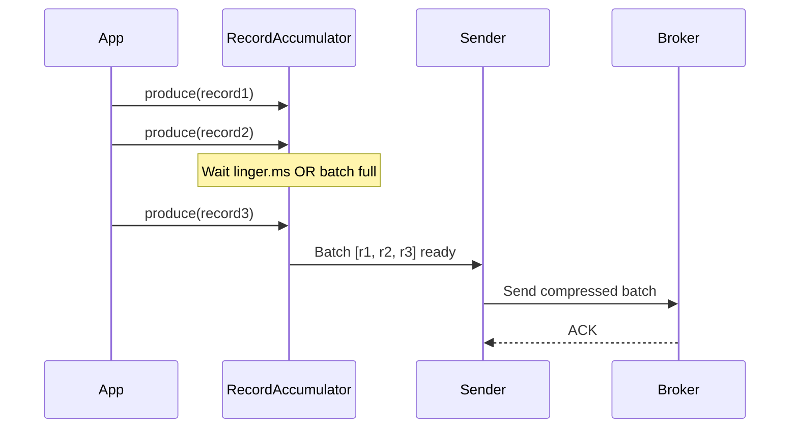
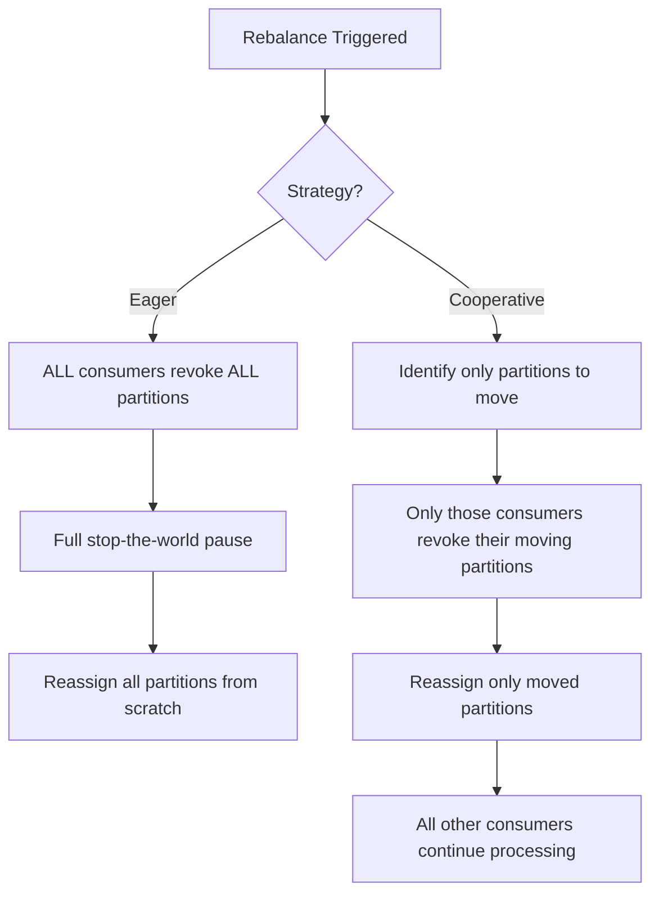

# Kafka Producers and Consumers

> [!abstract] TL;DR
> Kafka producers and consumers are tuned independently for durability, throughput, and latency. Producers trade off durability (`acks`) against latency, and use batching/compression for throughput. Consumers must choose between automatic offset management (risk of duplicates/loss on crash) and manual offset management (exact control). Understanding these configurations is critical to building reliable, high-performance Kafka pipelines.

## Producer Configuration Deep Dive

### Acknowledgment (`acks`) — The Durability Knob

`acks` controls how many broker replicas must acknowledge a write before the producer considers it committed.

| `acks` | Behavior | Risk | Use Case |
|--------|----------|------|----------|
| `0` | Fire-and-forget: producer does not wait for any ACK | Complete data loss on any failure | Metrics where loss is acceptable |
| `1` | Leader acknowledges: write to leader's log, return ACK | Data loss if leader crashes before followers sync | Moderate-durability, lower latency |
| `all` / `-1` | All ISR replicas acknowledge | No data loss while ISR has >= `min.insync.replicas` replicas | Production — financial, audit, CDC |

```python
# Production-safe producer config
{
    'acks': 'all',
    'min.insync.replicas': 2,   # set at topic or broker level
    'enable.idempotence': True
}
```

> [!warning] `acks=all` without `min.insync.replicas` is misleading
> If a topic has RF=3 but two followers are down, the ISR is just the leader. `acks=all` with ISR=1 is equivalent to `acks=1` — the leader alone acknowledges. Always pair `acks=all` with `min.insync.replicas=2` (for RF=3).

### Retries and Idempotence

```properties
# Retry on transient errors (leader election, network hiccup)
retries=2147483647           # effectively infinite retries (Kafka 2.1+ default)
retry.backoff.ms=100         # wait between retries
delivery.timeout.ms=120000   # total time budget including retries

# Prevents duplicate messages when retrying
enable.idempotence=true      # default true in Kafka 3.0+

# With idempotence enabled, safe to use up to 5 in-flight requests
max.in.flight.requests.per.connection=5   # default 5 (idempotent dedup handles ordering)

# WITHOUT idempotence: must set to 1 for strict ordering on retry
max.in.flight.requests.per.connection=1   # serializes batches, reduces throughput
```

**How idempotence works**: the broker assigns each producer instance a **Producer ID (PID)** and a **epoch**. Each batch carries a sequence number. The broker rejects duplicates (same PID + partition + sequence number), making retries safe. On producer restart, a new PID is assigned — idempotence is per session only (for cross-session dedup, use transactions).

### Producer Batching for Throughput

Kafka producers batch records before sending to reduce network round-trips and CPU overhead:



Key batching parameters:

```properties
# Wait this long before sending a batch (0 = send immediately)
linger.ms=10                 # 10ms good balance; 0 for lowest latency

# Max bytes per batch per partition (default: 16KB)
batch.size=65536             # 64KB — increase for high-throughput topics

# Compression codec
compression.type=snappy      # snappy: fast compression/decompression, ~2x ratio
                             # lz4: faster than snappy, similar ratio
                             # zstd: best ratio (~4-5x), slightly more CPU
                             # gzip: good ratio, slow — avoid for high throughput
                             # none: no compression (default)

# Buffer memory for all pending batches (default: 32MB)
buffer.memory=67108864       # 64MB for high-throughput producers

# Block if buffer full (ms), then throw BufferExhaustedException
max.block.ms=60000
```

**Throughput tuning rule of thumb**: set `linger.ms=5-20` and `batch.size=65536` to start. Profile with and without `snappy` compression — typically 2-4x throughput improvement with minimal CPU overhead.

### Partitioner — Routing Records to Partitions

```python
# Default behavior:
# - key present: murmur2_hash(key) % num_partitions
# - key absent (null): round-robin across partitions (sticky partitioner in Kafka 2.4+)

# Custom partitioner in Java:
public class RegionPartitioner implements Partitioner {
    @Override
    public int partition(String topic, Object key, byte[] keyBytes,
                         Object value, byte[] valueBytes, Cluster cluster) {
        int numPartitions = cluster.partitionsForTopic(topic).size();
        if (key.toString().startsWith("EU")) return 0;
        if (key.toString().startsWith("US")) return 1;
        return 2;  // APAC
    }
}
```

**Sticky partitioner** (Kafka 2.4+, default for null-key records): accumulates records into one partition until the batch is full or `linger.ms` expires, then switches. Improves batching efficiency over pure round-robin.

## Python Kafka Producer

### confluent-kafka (Recommended for Production)

```python
from confluent_kafka import Producer
from confluent_kafka.admin import AdminClient, NewTopic

# Producer configuration
producer_config = {
    'bootstrap.servers': 'broker1:9092,broker2:9092,broker3:9092',
    'acks': 'all',
    'enable.idempotence': True,
    'compression.type': 'snappy',
    'linger.ms': 10,
    'batch.size': 65536,
    'retries': 2147483647,
    'delivery.timeout.ms': 120000,
    # Optional: for exactly-once (transactional)
    # 'transactional.id': 'my-producer-1'
}

p = Producer(producer_config)

def delivery_report(err, msg):
    """Called once per message, either on success or permanent failure."""
    if err is not None:
        print(f'Message delivery failed: topic={msg.topic()}, '
              f'partition={msg.partition()}, error={err}')
    else:
        print(f'Message delivered: topic={msg.topic()}, '
              f'partition={msg.partition()}, offset={msg.offset()}')

# Async produce (non-blocking)
for i in range(1000):
    p.produce(
        topic='orders',
        key=f'order-{i}'.encode('utf-8'),
        value=f'{{"order_id": {i}, "amount": 99.99}}'.encode('utf-8'),
        callback=delivery_report
    )
    # Serve delivery callbacks without blocking (poll internal queue)
    p.poll(0)

# Block until all outstanding messages are delivered (or fail)
remaining = p.flush(timeout=30)
if remaining > 0:
    print(f'WARNING: {remaining} messages were not delivered')
```

### Transactional Producer (Exactly-Once)

```python
p = Producer({
    'bootstrap.servers': 'broker:9092',
    'transactional.id': 'order-processor-1',  # unique per producer instance
    'enable.idempotence': True,                # required for transactions
})

p.init_transactions()

try:
    p.begin_transaction()
    p.produce('processed-orders', key='k1', value='v1')
    p.produce('order-audit', key='k1', value='audit-record')
    p.commit_transaction()
except Exception as e:
    p.abort_transaction()
    raise
```

## Consumer Configuration Deep Dive

### Offset Reset — Where to Start

```properties
# If no committed offset exists for this group+partition:
auto.offset.reset=earliest   # start from offset 0 (read full history)
auto.offset.reset=latest     # only consume new messages written after subscribe()
auto.offset.reset=none       # throw exception if no committed offset (fail-fast)
```

### Auto vs. Manual Offset Commit

**Auto-commit (default, `enable.auto.commit=true`):**
```properties
enable.auto.commit=true
auto.commit.interval.ms=5000   # commit current offset every 5 seconds
```

Risk: if a consumer crashes after `poll()` returns records but before they are processed, the next start-up may see offsets already committed — **data loss** (at-most-once). Alternatively, if auto-commit runs *during* slow processing, records may be reprocessed — **duplicates** (at-least-once in practice).

**Manual commit (recommended for reliability):**

```properties
enable.auto.commit=false
```

```python
from confluent_kafka import Consumer, KafkaError, TopicPartition

consumer_config = {
    'bootstrap.servers': 'broker1:9092,broker2:9092',
    'group.id': 'order-processing-service',
    'auto.offset.reset': 'earliest',
    'enable.auto.commit': False,
    'max.poll.records': 500,          # max records per poll() call
    'session.timeout.ms': 30000,      # consumer declared dead if no heartbeat
    'heartbeat.interval.ms': 10000,   # heartbeat frequency (must be < session.timeout/3)
    'max.poll.interval.ms': 300000,   # max time between poll() calls (5 min)
}

c = Consumer(consumer_config)
c.subscribe(['orders'])

try:
    while True:
        msg = c.poll(timeout=1.0)  # wait up to 1s for a message
        if msg is None:
            continue
        if msg.error():
            if msg.error().code() == KafkaError._PARTITION_EOF:
                # Reached end of partition — not an error
                print(f'Reached end of {msg.topic()} [{msg.partition()}]')
            else:
                raise Exception(f'Consumer error: {msg.error()}')
            continue

        # Process the message
        process(msg.value().decode('utf-8'))

        # Commit AFTER successful processing (synchronous = guaranteed)
        c.commit(asynchronous=False)

except KeyboardInterrupt:
    pass
finally:
    c.close()  # graceful shutdown: commit offsets, trigger rebalance
```

### Batch Processing with Manual Commit

```python
from confluent_kafka import Consumer

c = Consumer({...})
c.subscribe(['orders'])

BATCH_SIZE = 100
batch = []

while True:
    msg = c.poll(0.1)
    if msg and not msg.error():
        batch.append(msg)

    if len(batch) >= BATCH_SIZE:
        # Process entire batch
        process_batch([m.value() for m in batch])

        # Commit only the highest offset per partition
        offsets = {}
        for m in batch:
            tp = (m.topic(), m.partition())
            if tp not in offsets or m.offset() > offsets[tp]:
                offsets[tp] = m.offset() + 1  # commit offset+1 (next to read)

        from confluent_kafka import TopicPartition
        c.commit(offsets=[
            TopicPartition(t, p, o) for (t, p), o in offsets.items()
        ], asynchronous=False)
        batch.clear()
```

### Consumer Health Configuration

```properties
# Rebalance triggers:
session.timeout.ms=30000        # broker-detected timeout (no heartbeats received)
heartbeat.interval.ms=10000     # how often consumer sends heartbeat to broker
max.poll.interval.ms=300000     # if poll() not called within this time → leave group

# Fetch tuning:
fetch.min.bytes=1               # min bytes broker must have before responding (1 = immediately)
fetch.max.wait.ms=500           # max wait if fetch.min.bytes not met
max.partition.fetch.bytes=1048576  # max bytes per partition per fetch (1MB default)
```

> [!tip] `max.poll.interval.ms` is the most common cause of unexpected rebalances
> If your processing logic takes longer than 300 seconds (default), the broker assumes the consumer is dead and triggers a rebalance. Fix: reduce `max.poll.records`, process asynchronously, or increase `max.poll.interval.ms`.

## Consumer Rebalance Strategies

A **rebalance** is triggered when:
- A consumer joins or leaves a group
- A consumer is considered dead (missed heartbeats or poll timeout)
- Partition count changes

### Eager Rebalance (Default)

All consumers **stop consuming and release all partitions**, then the group coordinator reassigns from scratch.

```
Problem: "stop-the-world" pause — all consumers idle during rebalance
Duration: proportional to number of consumers and partitions
```

### Cooperative Incremental Rebalance (Kafka 2.4+, Recommended)

Only partitions that need to move are revoked and reassigned. Consumers keep unaffected partitions throughout.

```python
consumer_config = {
    ...
    'partition.assignment.strategy': 'cooperative-sticky',
    # Full name: 'org.apache.kafka.clients.consumer.CooperativeStickyAssignor'
}
```



## Java Producer and Consumer (Reference)

### Java Producer

```java
Properties props = new Properties();
props.put(ProducerConfig.BOOTSTRAP_SERVERS_CONFIG, "broker:9092");
props.put(ProducerConfig.KEY_SERIALIZER_CLASS_CONFIG, StringSerializer.class);
props.put(ProducerConfig.VALUE_SERIALIZER_CLASS_CONFIG, StringSerializer.class);
props.put(ProducerConfig.ACKS_CONFIG, "all");
props.put(ProducerConfig.ENABLE_IDEMPOTENCE_CONFIG, true);
props.put(ProducerConfig.COMPRESSION_TYPE_CONFIG, "snappy");

KafkaProducer<String, String> producer = new KafkaProducer<>(props);

ProducerRecord<String, String> record = new ProducerRecord<>("orders", "key1", "value1");

// Async with callback
producer.send(record, (metadata, exception) -> {
    if (exception != null) {
        log.error("Failed to send", exception);
    } else {
        log.info("Sent to partition={}, offset={}", metadata.partition(), metadata.offset());
    }
});

// Sync (blocks until ack)
try {
    RecordMetadata metadata = producer.send(record).get();
} catch (ExecutionException | InterruptedException e) {
    // Handle
}

producer.flush();
producer.close();
```

### Java Consumer

```java
Properties props = new Properties();
props.put(ConsumerConfig.BOOTSTRAP_SERVERS_CONFIG, "broker:9092");
props.put(ConsumerConfig.GROUP_ID_CONFIG, "my-group");
props.put(ConsumerConfig.KEY_DESERIALIZER_CLASS_CONFIG, StringDeserializer.class);
props.put(ConsumerConfig.VALUE_DESERIALIZER_CLASS_CONFIG, StringDeserializer.class);
props.put(ConsumerConfig.ENABLE_AUTO_COMMIT_CONFIG, false);
props.put(ConsumerConfig.AUTO_OFFSET_RESET_CONFIG, "earliest");

KafkaConsumer<String, String> consumer = new KafkaConsumer<>(props);
consumer.subscribe(List.of("orders"));

try {
    while (true) {
        ConsumerRecords<String, String> records = consumer.poll(Duration.ofMillis(100));
        for (ConsumerRecord<String, String> record : records) {
            System.out.printf("offset=%d, key=%s, value=%s%n",
                record.offset(), record.key(), record.value());
        }
        consumer.commitSync();
    }
} finally {
    consumer.close();
}
```

## Python Client Comparison

| Library | Backend | Performance | Setup | Best For |
|---------|---------|-------------|-------|----------|
| `confluent-kafka` | librdkafka (C) | Excellent — production-grade | Requires librdkafka installed | Production workloads, high throughput |
| `kafka-python` | Pure Python | Moderate | `pip install kafka-python` only | Prototypes, testing, simpler setup |
| `aiokafka` | Pure Python async | Good (async I/O) | `pip install aiokafka` | Async applications (FastAPI, asyncio) |

```python
# confluent-kafka install
pip install confluent-kafka

# kafka-python install (no native deps)
pip install kafka-python

# kafka-python equivalent consumer
from kafka import KafkaConsumer

consumer = KafkaConsumer(
    'my-topic',
    bootstrap_servers=['broker:9092'],
    group_id='my-group',
    auto_offset_reset='earliest',
    enable_auto_commit=False,
    value_deserializer=lambda m: m.decode('utf-8')
)

for msg in consumer:
    process(msg.value)
    consumer.commit()
```

## Common Pitfalls

- **Committing before processing**: auto-commit can fire while processing is in-flight — use `enable.auto.commit=false` and commit explicitly after successful processing.
- **Slow processing exceeding `max.poll.interval.ms`**: consumer is kicked out of group mid-batch, triggering rebalance. Reduce `max.poll.records` or process asynchronously.
- **Not calling `p.flush()` before process exit**: undelivered messages in the producer buffer are silently discarded on program exit without `flush()`.
- **`acks=1` thinking it's durable**: leader-only acknowledgment — if the leader crashes and the follower hasn't synced, that message is gone.
- **Mixing producer key=None for ordering-sensitive topics**: null keys use round-robin, scattering related events across partitions and breaking per-entity ordering.
- **Consumer group ID collisions**: two different services sharing the same `group.id` compete for partitions — each gets a subset, causing both to miss events.
- **Not closing consumers on shutdown**: `consumer.close()` commits offsets and notifies the broker to trigger immediate rebalance, avoiding the `session.timeout.ms` wait.
- **Creating a new Consumer instance per message**: extremely expensive — create once, reuse in a poll loop.

## Review Questions

1. A producer uses `acks=all` and the topic has `replication.factor=3`, `min.insync.replicas=2`. One broker goes down. Can the producer still write? What if two brokers go down?
2. What is the difference between `session.timeout.ms` and `max.poll.interval.ms`? Which one would cause a rebalance if your message processing takes 10 minutes per batch?
3. Why is `max.in.flight.requests.per.connection=1` required for ordering guarantees when `enable.idempotence=false`? Why is it safe to use 5 when idempotence is enabled?
4. Explain the at-most-once vs. at-least-once risk with `enable.auto.commit=true`. How does manual commit after processing achieve at-least-once semantics?
5. You have a topic with 6 partitions and start a consumer group with 8 consumers. What happens? What is the maximum useful parallelism for this topic?

#DataEngineering #Kafka #Producer #Consumer #Python
