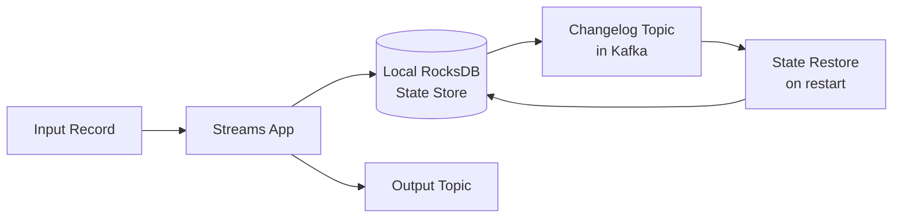
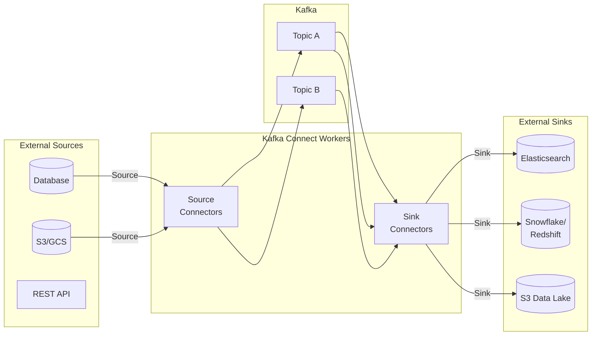
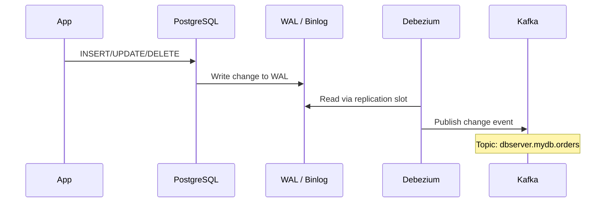
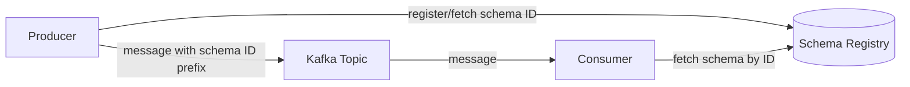

# Kafka Streams and Kafka Connect

> [!abstract] TL;DR
> Kafka Streams is a Java library for stateful stream processing that runs inside your application — no separate cluster required. Kafka Connect is a scalable, fault-tolerant framework for streaming data between Kafka and external systems (databases, S3, Elasticsearch). Together with ksqlDB and Debezium CDC, they form a complete real-time data platform on top of Kafka.

## Kafka Streams Overview

Kafka Streams is a **Java client library** — not a separate service — that turns your application into a stream processing node. It reads from Kafka topics, processes records, and writes results back to Kafka.

```
                    ┌─────────────────────────────────────────┐
                    │     Your Application (JVM Process)       │
                    │                                          │
Input Topic ──────► │  KafkaStreams (filter, map, join, agg)  │ ──────► Output Topic
                    │         + Local RocksDB State            │
                    └─────────────────────────────────────────┘
                              ↑ changelog topics ↑
                                 (Kafka-backed)
```

Key advantages over Spark/Flink for Kafka-native use cases:
- No separate cluster to operate — scales with your application
- Exactly-once semantics with simple config
- Fault-tolerant state via Kafka-backed changelog topics
- Strong integration with the Kafka ecosystem (Schema Registry, Kafka Connect)

## KStream and KTable

### KStream — Unbounded Event Log

A `KStream` represents a **continuous stream of events** — each record is an independent event. Semantics: insert-only, append mode.

```java
KStream<String, String> pageviews = builder.stream("pageview-events");

// Filter, transform, branch
KStream<String, Long> parsed = pageviews
    .filter((key, value) -> value != null)
    .mapValues(value -> JSON.parse(value).getLong("duration_ms"))
    .filter((key, value) -> value > 0);

parsed.to("processed-pageviews");
```

### KTable — Materialized Changelog

A `KTable` represents the **latest state per key** — changelog semantics (upsert). Each new record with a key overwrites the previous value for that key. Think of it as a database table that updates in real-time.

```java
// Reads "user-profiles" topic — each key is a user ID, value is latest profile
KTable<String, String> userProfiles = builder.table("user-profiles");
```

### GlobalKTable — Fully Replicated Lookup Table

A `GlobalKTable` is fully replicated to **every application instance** (unlike `KTable` which is partitioned). Used for broadcast joins where you need to look up data from any partition.

```java
// Small reference data — product catalog, country codes, etc.
GlobalKTable<String, String> productCatalog = builder.globalTable("product-catalog");
```

| Type | Partitioned? | Replicated to all instances? | Semantics |
|------|-------------|------------------------------|-----------|
| KStream | Yes | No | Append (each record is a new event) |
| KTable | Yes | No | Upsert (latest value per key) |
| GlobalKTable | No (full copy) | Yes | Upsert (for lookups / broadcast joins) |

## Kafka Streams DSL

### Stateless Operations

```java
StreamsBuilder builder = new StreamsBuilder();
KStream<String, String> orders = builder.stream("raw-orders");

// Filter: keep only completed orders
KStream<String, String> completed = orders
    .filter((key, value) -> value.contains("\"status\":\"COMPLETED\""));

// Map keys and values
KStream<String, Order> parsed = orders
    .mapValues(v -> gson.fromJson(v, Order.class));

// Re-key (triggers re-partitioning / shuffle)
KStream<String, Order> byRegion = parsed
    .selectKey((key, order) -> order.getRegion());

// Branch into multiple streams
Map<String, KStream<String, Order>> branches = parsed.split()
    .branch((k, v) -> v.getAmount() > 1000, Branched.as("high-value"))
    .branch((k, v) -> v.getAmount() <= 1000, Branched.as("standard"))
    .noDefaultBranch();
```

### Stateful Aggregations

```java
// Count events per key
KTable<String, Long> orderCountByRegion = orders
    .groupByKey()
    .count(Materialized.as("order-count-store"));

// Sum with windowing
KTable<Windowed<String>, Long> hourlyRevenue = parsed
    .groupByKey()
    .windowedBy(TimeWindows.ofSizeWithNoGrace(Duration.ofHours(1)))
    .aggregate(
        () -> 0L,                                    // initializer
        (key, order, agg) -> agg + order.getAmount(),// aggregator
        Materialized.<String, Long, WindowStore<Bytes, byte[]>>as("hourly-revenue")
            .withValueSerde(Serdes.Long())
    );
```

### Window Types

```java
// Tumbling: fixed-size, non-overlapping
TimeWindows.ofSizeWithNoGrace(Duration.ofMinutes(5))

// Hopping: fixed-size, overlapping (advance < size)
TimeWindows.ofSizeAndGrace(Duration.ofMinutes(10), Duration.ofMinutes(1))
    .advanceBy(Duration.ofMinutes(5))  // new window every 5 min, 10-min coverage

// Session: activity-based, closes after inactivity gap
SessionWindows.ofInactivityGapWithNoGrace(Duration.ofMinutes(30))
```

### Stream-Table and Stream-Stream Joins

```java
StreamsBuilder builder = new StreamsBuilder();
KStream<String, String> orders = builder.stream("orders");
KTable<String, String> customers = builder.table("customers");
GlobalKTable<String, String> products = builder.globalTable("products");

// Stream-Table join (enrich stream with table lookup — no window needed)
KStream<String, String> enrichedWithCustomer = orders.join(
    customers,
    (orderValue, customerValue) -> orderValue + " | customer: " + customerValue
);

// Stream-GlobalKTable join (lookup by non-key field — use mapper for join key)
KStream<String, String> enrichedWithProduct = orders.join(
    products,
    (orderKey, orderValue) -> extractProductId(orderValue),  // key mapper
    (orderValue, productValue) -> orderValue + " | product: " + productValue
);

// Stream-Stream join (both must be windowed — match events within time window)
KStream<String, String> payments = builder.stream("payments");
KStream<String, String> matched = orders.join(
    payments,
    (order, payment) -> "MATCHED: " + order + " + " + payment,
    JoinWindows.ofTimeDifferenceWithNoGrace(Duration.ofMinutes(5))
);
```

### Full Example: Order Enrichment Pipeline

```java
import org.apache.kafka.streams.*;
import org.apache.kafka.streams.kstream.*;
import java.util.Properties;

public class OrderEnrichmentApp {
    public static void main(String[] args) {
        Properties config = new Properties();
        config.put(StreamsConfig.APPLICATION_ID_CONFIG, "order-enrichment");
        config.put(StreamsConfig.BOOTSTRAP_SERVERS_CONFIG, "broker:9092");
        config.put(StreamsConfig.DEFAULT_KEY_SERDE_CLASS_CONFIG, Serdes.String().getClass());
        config.put(StreamsConfig.DEFAULT_VALUE_SERDE_CLASS_CONFIG, Serdes.String().getClass());
        config.put(StreamsConfig.PROCESSING_GUARANTEE_CONFIG, StreamsConfig.EXACTLY_ONCE_V2);

        StreamsBuilder builder = new StreamsBuilder();
        KStream<String, String> orders = builder.stream("orders");
        KTable<String, String> customers = builder.table("customers");

        orders
            .filter((key, value) -> value != null)
            .join(customers, (order, customer) -> order + "|" + customer)
            .to("enriched-orders");

        KafkaStreams streams = new KafkaStreams(builder.build(), config);

        // Graceful shutdown hook
        Runtime.getRuntime().addShutdownHook(new Thread(streams::close));

        streams.start();
    }
}
```

## State Stores and Fault Tolerance

Kafka Streams maintains local state in **RocksDB** (embedded key-value store). State is fault-tolerant via **changelog topics** — every state update is written to a Kafka topic. On failure/restart, state is restored by replaying the changelog.



Standby replicas (`num.standby.replicas=1`) keep a warm copy of state on another instance, reducing restore time on failover.

## ksqlDB — SQL Over Kafka

ksqlDB provides a SQL interface for Kafka stream processing. It runs as a separate cluster (or embedded), backed by Kafka Streams internally.

### Push vs. Pull Queries

```sql
-- Push query: continuous streaming results (emits as new events arrive)
SELECT userId, COUNT(*) as event_count
FROM pageview_stream
WINDOW TUMBLING (SIZE 1 HOUR)
GROUP BY userId
EMIT CHANGES;

-- Pull query: point-in-time lookup on a materialized view (like a SELECT on a table)
SELECT * FROM user_order_counts WHERE userId = 'user123';
```

### CSAS and CTAS

```sql
-- CSAS: Create Stream As Select — creates a new persistent stream
CREATE STREAM clean_orders AS
    SELECT
        order_id,
        user_id,
        CAST(amount AS DOUBLE) as amount_usd,
        TIMESTAMPTOSTRING(ROWTIME, 'yyyy-MM-dd HH:mm:ss') as event_time
    FROM raw_orders
    WHERE amount IS NOT NULL AND amount > 0
EMIT CHANGES;

-- CTAS: Create Table As Select — materialized aggregation (KTable)
CREATE TABLE hourly_revenue AS
    SELECT
        region,
        WINDOWSTART as window_start,
        SUM(amount_usd) as total_revenue,
        COUNT(*) as order_count
    FROM clean_orders
    WINDOW TUMBLING (SIZE 1 HOUR)
    GROUP BY region
EMIT CHANGES;

-- Create stream from existing topic with explicit schema
CREATE STREAM orders_stream (
    order_id VARCHAR KEY,
    user_id VARCHAR,
    amount DOUBLE,
    region VARCHAR
) WITH (
    KAFKA_TOPIC='orders',
    VALUE_FORMAT='JSON',
    TIMESTAMP='event_timestamp'
);
```

## Kafka Connect Framework

Kafka Connect is a scalable, fault-tolerant framework for streaming data **between Kafka and external systems** without writing custom consumer/producer code.



### Deployment Modes

| Mode | Use Case | Fault Tolerance |
|------|----------|-----------------|
| Standalone | Development, single-machine | None — single worker |
| Distributed | Production | Yes — REST API, automatic task rebalancing across workers |

### Managing Connectors via REST API

```bash
# List connectors
curl http://connect-worker:8083/connectors

# Create connector (POST)
curl -X POST http://connect-worker:8083/connectors \
  -H 'Content-Type: application/json' \
  -d @connector-config.json

# Get connector status
curl http://connect-worker:8083/connectors/my-connector/status

# Restart a failed task
curl -X POST http://connect-worker:8083/connectors/my-connector/tasks/0/restart

# Delete connector
curl -X DELETE http://connect-worker:8083/connectors/my-connector
```

### S3 Sink Connector Config

```json
{
  "name": "s3-sink-events",
  "connector.class": "io.confluent.connect.s3.S3SinkConnector",
  "tasks.max": "3",
  "topics": "clickstream-events,page-views",
  "s3.region": "us-east-1",
  "s3.bucket.name": "data-lake-raw",
  "s3.part.size": "5242880",
  "flush.size": "10000",
  "rotate.interval.ms": "300000",
  "storage.class": "io.confluent.connect.s3.storage.S3Storage",
  "format.class": "io.confluent.connect.s3.format.parquet.ParquetFormat",
  "parquet.codec": "snappy",
  "schema.compatibility": "FULL",
  "locale": "en_US",
  "timezone": "UTC",
  "timestamp.extractor": "RecordField",
  "timestamp.field": "event_timestamp",
  "path.format": "'year'=YYYY/'month'=MM/'day'=dd/'hour'=HH",
  "partition.duration.ms": "3600000"
}
```

### JDBC Source Connector (Database Polling)

```json
{
  "name": "jdbc-source-orders",
  "connector.class": "io.confluent.connect.jdbc.JdbcSourceConnector",
  "connection.url": "jdbc:postgresql://postgres:5432/mydb",
  "connection.user": "kafka_user",
  "connection.password": "${file:/opt/kafka/secrets.properties:db.password}",
  "mode": "timestamp+incrementing",
  "timestamp.column.name": "updated_at",
  "incrementing.column.name": "id",
  "table.whitelist": "orders,order_items",
  "topic.prefix": "postgres.",
  "poll.interval.ms": "5000",
  "batch.max.rows": "1000",
  "numeric.mapping": "best_fit"
}
```

## Debezium CDC Connector

Debezium captures **change data capture (CDC)** events from database transaction logs rather than polling, providing low-latency, complete change streams.



### Database Prerequisites

```sql
-- PostgreSQL: enable logical replication
-- In postgresql.conf:
wal_level = logical
max_replication_slots = 5
max_wal_senders = 5

-- Create replication user
CREATE USER debezium REPLICATION LOGIN PASSWORD 'dbz_password';
GRANT SELECT ON ALL TABLES IN SCHEMA public TO debezium;

-- MySQL: enable binary logging
-- In my.cnf:
-- log-bin=mysql-bin
-- binlog_format=ROW
-- binlog_row_image=FULL
-- server-id=1
```

### Debezium PostgreSQL Connector Config

```json
{
  "name": "postgres-cdc-orders",
  "connector.class": "io.debezium.connector.postgresql.PostgresConnector",
  "database.hostname": "postgres",
  "database.port": "5432",
  "database.user": "debezium",
  "database.password": "dbz_password",
  "database.dbname": "mydb",
  "database.server.name": "dbserver1",
  "table.include.list": "public.orders,public.customers",
  "plugin.name": "pgoutput",
  "slot.name": "debezium_slot",
  "publication.name": "dbz_publication",
  "heartbeat.interval.ms": "5000",
  "snapshot.mode": "initial",
  "key.converter": "io.confluent.connect.avro.AvroConverter",
  "key.converter.schema.registry.url": "http://schema-registry:8081",
  "value.converter": "io.confluent.connect.avro.AvroConverter",
  "value.converter.schema.registry.url": "http://schema-registry:8081"
}
```

### Debezium MySQL Connector Config

```json
{
  "name": "mysql-cdc",
  "connector.class": "io.debezium.connector.mysql.MySqlConnector",
  "database.hostname": "mysql",
  "database.port": "3306",
  "database.user": "debezium",
  "database.password": "dbz",
  "database.server.id": "184054",
  "database.server.name": "dbserver1",
  "database.include.list": "mydb",
  "table.include.list": "mydb.orders",
  "database.history.kafka.bootstrap.servers": "kafka:9092",
  "database.history.kafka.topic": "schema-changes.mydb",
  "include.schema.changes": "true"
}
```

### Debezium Change Event Structure

```json
{
  "before": {
    "id": 1001,
    "status": "PENDING",
    "amount": 99.99,
    "updated_at": "2024-01-01T10:00:00Z"
  },
  "after": {
    "id": 1001,
    "status": "COMPLETED",
    "amount": 99.99,
    "updated_at": "2024-01-01T10:05:00Z"
  },
  "op": "u",          // c=create, u=update, d=delete, r=read (snapshot)
  "ts_ms": 1704096300000,
  "source": {
    "version": "2.4.0",
    "connector": "postgresql",
    "db": "mydb",
    "table": "orders",
    "txId": 12345,
    "lsn": 67890
  }
}
```

**CDC Use Cases:**
- **Cache invalidation**: update Redis/Memcached when DB row changes
- **Data lake sync**: stream all DB changes to S3/Delta Lake without batch ETL
- **Search index updates**: sync Elasticsearch with Postgres changes
- **Event sourcing**: reconstruct application state from change history
- **Microservice data sync**: propagate changes between service databases

## Schema Registry

Schema Registry provides centralized schema management for Avro, Protobuf, and JSON Schema.



```python
# Using confluent-kafka with Avro + Schema Registry
from confluent_kafka import avro
from confluent_kafka.avro import AvroProducer

schema_str = """
{
  "type": "record",
  "name": "Order",
  "namespace": "com.example",
  "fields": [
    {"name": "order_id", "type": "string"},
    {"name": "amount",   "type": "double"},
    {"name": "status",   "type": "string"}
  ]
}
"""

value_schema = avro.loads(schema_str)

producer = AvroProducer({
    'bootstrap.servers': 'broker:9092',
    'schema.registry.url': 'http://schema-registry:8081'
}, default_value_schema=value_schema)

producer.produce(
    topic='orders',
    value={"order_id": "abc123", "amount": 99.99, "status": "COMPLETED"}
)
producer.flush()
```

### Schema Compatibility Modes

| Mode | Rule | Use Case |
|------|------|----------|
| `BACKWARD` | New schema can read data written with old schema | Consumer upgrades before producer |
| `FORWARD` | Old schema can read data written with new schema | Producer upgrades before consumer |
| `FULL` | Both backward + forward compatible | Safest — rolling upgrades in any order |
| `NONE` | No compatibility check | Development only |

```bash
# Set compatibility for a subject
curl -X PUT http://schema-registry:8081/config/orders-value \
  -H 'Content-Type: application/json' \
  -d '{"compatibility": "FULL"}'

# List subjects (topics with registered schemas)
curl http://schema-registry:8081/subjects

# Get all versions of a subject
curl http://schema-registry:8081/subjects/orders-value/versions
```

## Common Pitfalls

- **Kafka Streams application ID must be unique per application**: `application.id` is used as the consumer group ID and changelog topic prefix. Two apps with the same ID will compete for input partitions.
- **Re-keying a KStream triggers a repartition**: `selectKey()` or any operation that changes the key causes an internal repartition topic write — adds latency, be deliberate.
- **GlobalKTable for large datasets**: GlobalKTable loads entirely into every instance's memory. Only use for small reference data (< a few GB). Use KTable for large, partitioned datasets.
- **Debezium replication slot lag**: if Debezium is stopped for an extended period, the PostgreSQL WAL fills up (disk full risk). Monitor replication slot lag; set a `max_slot_wal_keep_size`.
- **Connector task failures are silent by default**: always monitor connector status via the REST API or a monitoring tool — failed tasks don't automatically restart in all configurations.
- **ksqlDB pull queries only work on materialized views**: you cannot run a pull query on a KStream — only on KTables/persistent queries that have materialized state.
- **Schema evolution breaking compatibility**: adding a required field (no default) is backward-incompatible. Always add new fields with defaults in Avro.

## Review Questions

1. What is the difference between a KStream and a KTable in Kafka Streams? Give a concrete example of when you'd use each.
2. When should you use a GlobalKTable instead of a KTable for a join? What is the cost of using GlobalKTable on a 500GB dataset?
3. How does Debezium capture changes from PostgreSQL without polling the table? What database configuration is required?
4. A Kafka Connect S3 Sink connector has 3 tasks for a topic with 6 partitions. How are partitions distributed across tasks? What happens if one task fails?
5. Explain the difference between BACKWARD and FORWARD schema compatibility in Schema Registry. Which mode allows a producer to add a new field while old consumers continue to work?

#DataEngineering #Kafka #KafkaStreams #KafkaConnect #ksqlDB #CDC #Debezium
