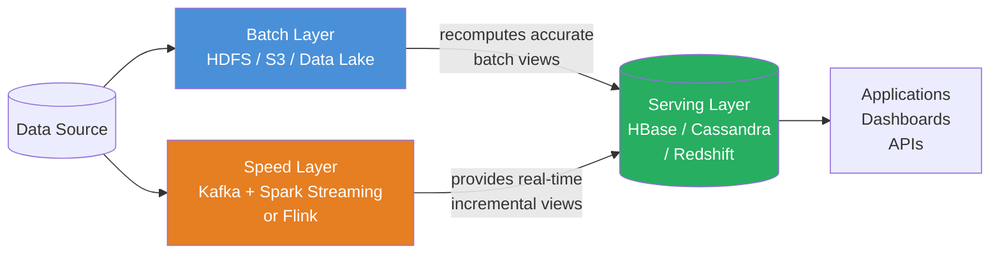
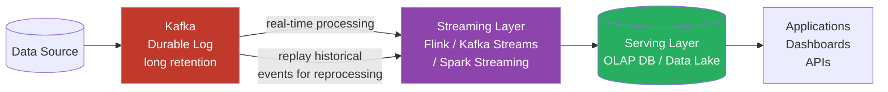

# Data Pipeline Design Patterns

> [!abstract] TL;DR
> Robust data pipelines are built on a small number of foundational patterns: idempotent writes, incremental processing with watermarks, CDC for source capture, and graceful handling of late-arriving data. Architectural choices between Lambda (batch + streaming dual track) and Kappa (streaming-only) determine long-term operational complexity. This note covers the patterns and trade-offs engineers must internalize.

## Idempotency

An idempotent pipeline produces the same result whether it runs once or N times. This is the single most important property for reliable data pipelines — it enables safe retries, re-runs after failures, and operational confidence.

### Why Idempotency is Hard

Most pipelines fail this without explicit design:
- `INSERT INTO target SELECT * FROM source` — re-run creates duplicates
- Writing `updated_at = CURRENT_TIMESTAMP()` — re-run produces different values
- Appending to a file — re-run grows the file with duplicate records

### Idempotency Techniques

#### 1. Partition Overwrite

Write to a date-partitioned path/table, overwriting only the target partition. Re-running replaces the same partition.

```python
# PySpark: overwrite only the partition being processed
df.write \
    .partitionBy("date") \
    .mode("overwrite") \                     # overwrites only matching partitions
    .option("partitionOverwriteMode", "dynamic") \
    .parquet("s3://data-lake/events/")

# Not this — overwrites the ENTIRE table:
df.write.mode("overwrite").parquet("s3://data-lake/events/")

# SQL: BigQuery / Snowflake partition overwrite
INSERT OVERWRITE TABLE events
PARTITION (date = '2024-01-15')
SELECT * FROM staging_events WHERE date = '2024-01-15';
```

#### 2. UPSERT (Merge)

Use MERGE/UPSERT instead of INSERT — update existing rows, insert new ones. No duplicates on re-run.

```sql
-- Snowflake MERGE
MERGE INTO target_orders AS t
USING (
    SELECT order_id, customer_id, amount, status, updated_at
    FROM staging_orders
    WHERE processing_date = '2024-01-15'
) AS s
ON t.order_id = s.order_id
WHEN MATCHED AND t.updated_at < s.updated_at THEN
    UPDATE SET
        t.customer_id = s.customer_id,
        t.amount = s.amount,
        t.status = s.status,
        t.updated_at = s.updated_at
WHEN NOT MATCHED THEN
    INSERT (order_id, customer_id, amount, status, updated_at)
    VALUES (s.order_id, s.customer_id, s.amount, s.status, s.updated_at);
```

```python
# dbt: incremental merge
# See [[dbt_Advanced]] for full incremental model syntax
```

#### 3. TRUNCATE + INSERT in a Transaction

For small tables where a full reload is acceptable:

```sql
BEGIN TRANSACTION;

TRUNCATE TABLE dim_products;

INSERT INTO dim_products
SELECT product_id, name, category, price, is_active
FROM staging_products;

COMMIT;
-- If anything fails between BEGIN and COMMIT, the TRUNCATE is rolled back
```

#### 4. Avoid Non-Deterministic Functions in Transformations

```sql
-- BAD: re-running gives a different result
INSERT INTO pipeline_runs (pipeline_name, run_at)
VALUES ('daily_etl', CURRENT_TIMESTAMP());   -- different every run

-- GOOD: derive timestamps from data, not from execution time
INSERT INTO pipeline_runs (pipeline_name, run_at, data_date)
VALUES ('daily_etl', '{{ run_started_at }}', '{{ ds }}');
-- The execution timestamp is fixed per run, passed as a parameter
```

#### Testing Idempotency

```python
def test_pipeline_idempotency():
    """Run pipeline twice on same date, compare results."""
    run_pipeline(date="2024-01-15")
    snapshot_1 = get_row_count("target_table", date="2024-01-15")
    checksum_1 = get_checksum("target_table", date="2024-01-15")

    # Simulate re-run (failure + retry scenario)
    run_pipeline(date="2024-01-15")
    snapshot_2 = get_row_count("target_table", date="2024-01-15")
    checksum_2 = get_checksum("target_table", date="2024-01-15")

    assert snapshot_1 == snapshot_2, "Row count changed on re-run!"
    assert checksum_1 == checksum_2, "Data changed on re-run!"
```

## Exactly-Once vs At-Least-Once Semantics

| Semantic | Description | Implementation Complexity | Risk |
|---|---|---|---|
| **At-most-once** | Deliver 0 or 1 times — may lose data | Low | Data loss |
| **At-least-once** | Deliver 1+ times — may duplicate | Medium | Duplicates |
| **Exactly-once** | Deliver exactly 1 time | High | Complexity |

In practice:
- **Exactly-once** requires distributed transactions or two-phase commit — expensive and rarely worth it
- **At-least-once + idempotent writes = effectively-once semantics** — the pragmatic standard

```
Message consumed → processed → written to target (UPSERT)
                                        ↑
                          Duplicate message? UPSERT deduplicates.
                          Pipeline retry?    UPSERT deduplicates.
```

## Watermark Pattern and Incremental Extraction

A watermark is a high-water mark tracking the latest data successfully processed. New runs only process data past the watermark.

```python
# Pattern: store watermark in a state store, increment after successful run

import boto3
from datetime import datetime, timezone

dynamodb = boto3.resource("dynamodb")
state_table = dynamodb.Table("pipeline-state")

def get_watermark(pipeline_id: str) -> datetime:
    """Get the last successfully processed timestamp."""
    response = state_table.get_item(Key={"pipeline_id": pipeline_id})
    item = response.get("Item")
    if not item:
        return datetime(2020, 1, 1, tzinfo=timezone.utc)    # bootstrap date
    return datetime.fromisoformat(item["last_processed_at"])

def set_watermark(pipeline_id: str, timestamp: datetime):
    """Update the watermark ONLY after successful processing."""
    state_table.put_item(Item={
        "pipeline_id": pipeline_id,
        "last_processed_at": timestamp.isoformat(),
        "updated_at": datetime.now(timezone.utc).isoformat(),
    })

def run_incremental_extract(pipeline_id: str = "orders_pipeline"):
    watermark = get_watermark(pipeline_id)
    # Add buffer to catch late-arriving records
    watermark_with_buffer = watermark - timedelta(hours=2)

    df = pd.read_sql(
        "SELECT * FROM orders WHERE updated_at > %(wm)s ORDER BY updated_at",
        con=source_conn,
        params={"wm": watermark_with_buffer},
    )

    if df.empty:
        print("No new data since watermark")
        return

    # Process and load...
    load_to_warehouse(df)

    # Only advance watermark AFTER successful load
    new_watermark = df["updated_at"].max()
    set_watermark(pipeline_id, new_watermark)
    print(f"Advanced watermark to {new_watermark}")
```

> [!important] Advance Watermark AFTER Load
> Never advance the watermark before data is successfully written. If the load fails after the watermark is advanced, that data window is permanently skipped. The watermark should be the last operation in a successful run.

## CDC (Change Data Capture) Patterns

CDC captures inserts, updates, and deletes from a source system with minimal impact.

### Log-Based CDC (Preferred)

Reads the database's binary/transaction log. Zero impact on source — no extra queries.

```
PostgreSQL WAL → Debezium → Kafka Topic → Consumer → Data Warehouse
```

```yaml
# Debezium PostgreSQL source connector config
{
  "name": "orders-cdc-connector",
  "config": {
    "connector.class": "io.debezium.connector.postgresql.PostgresConnector",
    "database.hostname": "prod-postgres.company.com",
    "database.port": "5432",
    "database.user": "debezium",
    "database.password": "${file:/secrets.properties:db.password}",
    "database.dbname": "production",
    "table.include.list": "public.orders,public.customers",
    "plugin.name": "pgoutput",
    "slot.name": "debezium",
    "publication.name": "dbz_publication",
    "topic.prefix": "prod.cdc",
    "transforms": "unwrap",
    "transforms.unwrap.type": "io.debezium.transforms.ExtractNewRecordState",
    "transforms.unwrap.delete.handling.mode": "rewrite",
    "transforms.unwrap.add.fields": "op,ts_ms,source.table",
    "snapshot.mode": "initial"          # initial snapshot then stream changes
  }
}
```

Debezium produces messages with `__op` field: `c` (create), `u` (update), `d` (delete), `r` (read/snapshot).

### Query-Based CDC (Simpler, Fewer Dependencies)

Poll source table using an `updated_at` watermark. Cannot capture hard deletes.

```sql
-- Extract changed rows since last watermark
SELECT
    order_id,
    customer_id,
    status,
    amount,
    updated_at,
    'upsert' AS __op
FROM orders
WHERE updated_at > :last_watermark
  AND updated_at <= :current_timestamp

UNION ALL

-- Detect soft-deleted rows (requires is_deleted column on source)
SELECT
    order_id,
    customer_id,
    status,
    amount,
    updated_at,
    'delete' AS __op
FROM orders
WHERE is_deleted = TRUE
  AND updated_at > :last_watermark
```

### Tombstone Pattern (Soft Deletes)

When the source system hard-deletes rows, use a tombstone record in the CDC stream:

```json
// Normal record
{"order_id": 123, "status": "shipped", "__op": "c"}

// Tombstone: key with null value signals deletion to downstream consumers
{"order_id": 123} → null
```

```sql
-- Target: apply deletes from CDC stream
MERGE INTO dim_orders AS t
USING (
    SELECT order_id, status, __op FROM cdc_staging
) AS s ON t.order_id = s.order_id
WHEN MATCHED AND s.__op = 'd' THEN DELETE
WHEN MATCHED AND s.__op IN ('u', 'c') THEN UPDATE SET status = s.status
WHEN NOT MATCHED AND s.__op = 'c' THEN INSERT (order_id, status) VALUES (s.order_id, s.status);
```

## Late-Arriving Data Handling

Late-arriving data — records that appear after their event time has already been processed — is one of the hardest problems in data engineering.

### Batch Strategies

```sql
-- Strategy 1: Reprocessing window — re-process last N days every run
-- Ensures late arrivals are caught on subsequent runs
WHERE event_date >= CURRENT_DATE - INTERVAL '3 days'

-- Strategy 2: Accumulating snapshot fact table
-- Update the row as the order moves through states
-- order_id | created_at | shipped_at | delivered_at | cancelled_at
-- Row exists from order creation, NULLs filled in as events arrive

-- Strategy 3: Correction records
-- Never update; append a correction row with a version number
INSERT INTO order_events
  (order_id, status, amount, version, recorded_at)
VALUES
  (123, 'delivered', 99.99, 3, CURRENT_TIMESTAMP);
-- Downstream queries take MAX(version) per order_id
```

### Streaming Strategy (Spark / Flink)

```python
# PySpark Structured Streaming: watermarks for late data
from pyspark.sql import functions as F
from pyspark.sql.types import *

events = (
    spark.readStream
    .format("kafka")
    .option("kafka.bootstrap.servers", "broker:9092")
    .option("subscribe", "app.events")
    .load()
)

processed = (
    events
    .withColumn("event_ts", F.col("timestamp").cast(TimestampType()))
    # Watermark: discard data more than 2 hours late
    .withWatermark("event_ts", "2 hours")
    .groupBy(
        F.window("event_ts", "1 hour"),    # 1-hour tumbling window
        F.col("event_type")
    )
    .count()
)

query = (
    processed.writeStream
    .outputMode("append")               # only emit windows after watermark passes
    .format("delta")
    .option("checkpointLocation", "s3://checkpoints/events/")
    .trigger(processingTime="5 minutes")
    .start("s3://data-lake/event_counts/")
)
```

## Lambda Architecture

The Lambda architecture separates data processing into three layers to provide both low-latency and accurate results.



### Lambda Layer Responsibilities

| Layer | Purpose | Tools | Latency | Accuracy |
|---|---|---|---|---|
| **Batch Layer** | Recompute all historical data periodically | Spark, Hive, dbt | Hours | High (complete data) |
| **Speed Layer** | Real-time incremental updates | Kafka Streams, Flink, Spark Streaming | Seconds-minutes | Approximate (recent data only) |
| **Serving Layer** | Merge batch + speed views for queries | HBase, Cassandra, Redshift, Snowflake | Milliseconds | Combined |

### Lambda Drawbacks

- **Two codebases**: same business logic must be implemented twice — once in batch SQL, once in streaming code. They often drift.
- **Reconciliation complexity**: merging batch and speed layer outputs at query time is non-trivial
- **Operational overhead**: running and monitoring both a batch system and a streaming system simultaneously
- **Lambda is from 2011**: designed for Hadoop-era batch constraints — modern streaming engines can handle historical data at scale

## Kappa Architecture

The Kappa architecture (Nathan Marz, LinkedIn, 2014) proposes a simpler alternative: use a **single streaming pipeline** for everything, and replay historical data through the same code when reprocessing is needed.



### Kappa Reprocessing Flow

```
1. Deploy new version of streaming job (v2)
2. Start v2 reading from the beginning of Kafka topic (offset 0)
3. v2 writes to a new output table (serving_v2)
4. Wait for v2 to catch up to real-time
5. Swap the serving layer to point to serving_v2
6. Decommission old serving table and v1 job
```

### Lambda vs Kappa Trade-off

| Dimension | Lambda | Kappa |
|---|---|---|
| Codebases | Two (batch + streaming) | One (streaming only) |
| Operational complexity | High | Lower |
| Historical reprocessing | Natural (just re-run batch) | Requires Kafka retention + replay |
| Query complexity | Higher (merge two views) | Simpler |
| Streaming framework maturity required | Low (batch is SQL) | High (streaming must handle scale) |
| Adopted by | Most enterprises (pre-2018) | LinkedIn, Uber, Netflix |
| Best fit | Mixed batch/streaming teams | Streaming-first teams |

> [!note] Modern Reality
> Most modern data stacks use a **hybrid approach** closer to Kappa: Kafka for streaming, with a data lakehouse (Delta Lake / Iceberg) providing efficient batch reprocessing without full historical replay. Tools like Apache Flink can handle both batch and streaming over the same API.

## Backfill Strategies

Backfilling means processing historical data that was missed or needs to be recomputed.

```bash
# Airflow backfill: run all missed DAG runs between two dates
airflow dags backfill \
    --start-date 2024-01-01 \
    --end-date 2024-06-30 \
    --reset-dagruns \
    my_pipeline

# dbt: full refresh (rebuild incremental models from scratch)
dbt run --full-refresh --select path:models/facts/

# Dagster: backfill partitioned assets
dagster asset backfill \
    --asset raw_orders_partitioned \
    --partition-range "2024-01-01,2024-06-30"
```

### Partition-Parallel Backfill

```python
# Run backfill partitions in parallel to reduce wall time
from concurrent.futures import ThreadPoolExecutor
from datetime import date, timedelta

def run_partition(dt: date):
    """Process a single date partition."""
    df = extract_for_date(dt)
    transformed = transform(df)
    load_partition(transformed, dt)
    print(f"Completed partition {dt}")

def parallel_backfill(start_date: date, end_date: date, max_workers: int = 8):
    dates = []
    d = start_date
    while d <= end_date:
        dates.append(d)
        d += timedelta(days=1)

    with ThreadPoolExecutor(max_workers=max_workers) as executor:
        futures = [executor.submit(run_partition, dt) for dt in dates]
        for future in futures:
            future.result()           # raise exception if any partition failed

parallel_backfill(
    start_date=date(2024, 1, 1),
    end_date=date(2024, 6, 30),
    max_workers=10,
)
```

## Testing Data Pipelines

### Unit Testing Transformations

```python
# tests/test_transforms.py
import pytest
import pandas as pd
from transforms import clean_orders, calculate_revenue

def test_clean_orders_drops_nulls():
    input_df = pd.DataFrame({
        "order_id": [1, None, 3],
        "amount": [100.0, 200.0, None],
        "status": ["shipped", "pending", "delivered"],
    })
    result = clean_orders(input_df)
    assert len(result) == 1
    assert result.iloc[0]["order_id"] == 1

def test_calculate_revenue_groups_by_date():
    input_df = pd.DataFrame({
        "order_id": [1, 2, 3],
        "date": ["2024-01-15", "2024-01-15", "2024-01-16"],
        "amount": [100.0, 200.0, 300.0],
    })
    result = calculate_revenue(input_df)
    assert result[result["date"] == "2024-01-15"]["revenue"].iloc[0] == 300.0
    assert result[result["date"] == "2024-01-16"]["revenue"].iloc[0] == 300.0
```

### Integration Testing with Testcontainers

```python
# tests/test_integration.py
import pytest
from testcontainers.postgres import PostgresContainer
from testcontainers.kafka import KafkaContainer
import sqlalchemy

@pytest.fixture(scope="session")
def postgres_container():
    with PostgresContainer("postgres:15") as postgres:
        engine = sqlalchemy.create_engine(postgres.get_connection_url())
        # Run schema migrations
        run_migrations(engine)
        yield engine

def test_full_pipeline_integration(postgres_container):
    """Test the complete extract → transform → load cycle with a real DB."""
    # Seed source data
    postgres_container.execute("""
        INSERT INTO orders (order_id, customer_id, amount, created_at)
        VALUES (1, 100, 99.99, '2024-01-15 10:00:00')
    """)

    # Run pipeline
    run_etl_pipeline(
        source_conn=postgres_container,
        target_conn=postgres_container,
        date="2024-01-15"
    )

    # Assert target state
    result = pd.read_sql(
        "SELECT COUNT(*) as cnt FROM fct_orders WHERE date = '2024-01-15'",
        con=postgres_container
    )
    assert result["cnt"].iloc[0] == 1
```

## Dead Letter Queue Pattern

Route failed or invalid records to a separate topic/table instead of failing the entire pipeline. Process DLQ records separately (manually, or via an alert + corrective job).

```python
from dataclasses import dataclass
from typing import List, Tuple
import json

@dataclass
class DLQRecord:
    original_record: dict
    error_type: str
    error_message: str
    pipeline_name: str
    failed_at: str

def process_with_dlq(records: List[dict], pipeline: str) -> Tuple[List, List[DLQRecord]]:
    """Process records, routing failures to DLQ instead of crashing."""
    good_records = []
    dlq_records = []

    for record in records:
        try:
            validated = validate_record(record)
            transformed = transform_record(validated)
            good_records.append(transformed)
        except ValidationError as e:
            dlq_records.append(DLQRecord(
                original_record=record,
                error_type="ValidationError",
                error_message=str(e),
                pipeline_name=pipeline,
                failed_at=datetime.utcnow().isoformat(),
            ))
        except Exception as e:
            dlq_records.append(DLQRecord(
                original_record=record,
                error_type=type(e).__name__,
                error_message=str(e),
                pipeline_name=pipeline,
                failed_at=datetime.utcnow().isoformat(),
            ))

    return good_records, dlq_records

# Usage
good, bad = process_with_dlq(raw_records, pipeline="orders_etl")
load_records(good, target="fct_orders")
load_dlq(bad, target="dlq_orders")   # store for later inspection

if bad:
    send_alert(f"{len(bad)} records failed in orders_etl — check dlq_orders table")
```

## Pipeline SLAs and Alerting

```yaml
# SLA definitions (document in pipeline config)
slas:
  orders_pipeline:
    freshness: "Data in fct_orders must be < 4 hours old by 8am ET"
    row_count: "Row count must be within 20% of 7-day rolling average"
    duration: "Pipeline must complete within 90 minutes"
    availability: "99.5% of scheduled runs must complete successfully"
```

```python
# SLA monitoring checks (run after pipeline completion)
def check_freshness_sla(table: str, max_age_hours: int = 4):
    result = query(f"""
        SELECT DATEDIFF(hour, MAX(created_at), CURRENT_TIMESTAMP()) AS age_hours
        FROM {table}
    """)
    age = result[0]["age_hours"]
    if age > max_age_hours:
        page_on_call(
            f"SLA BREACH: {table} is {age}h old (max allowed: {max_age_hours}h)"
        )

def check_row_count_sla(table: str, date: str, tolerance: float = 0.20):
    today = query(f"SELECT COUNT(*) cnt FROM {table} WHERE date = '{date}'")[0]["cnt"]
    avg_7d = query(f"""
        SELECT AVG(cnt) avg_cnt FROM (
            SELECT date, COUNT(*) cnt FROM {table}
            WHERE date >= DATEADD(day, -7, '{date}')
            GROUP BY date
        )
    """)[0]["avg_cnt"]

    deviation = abs(today - avg_7d) / avg_7d
    if deviation > tolerance:
        send_slack_alert(
            channel="#data-alerts",
            message=f"Row count anomaly in {table}: {today:,} rows vs {avg_7d:,.0f} avg ({deviation:.0%} deviation)"
        )
```

## Common Pitfalls

- **Advancing the watermark before the load succeeds**: if the write fails after the watermark is updated, that window of data is permanently lost. Always commit watermarks after confirmed successful writes.
- **Using `CURRENT_TIMESTAMP()` in pipeline transformations**: makes pipelines non-deterministic — re-running produces different `created_at`/`processed_at` values. Use the pipeline's logical execution date instead.
- **Lambda architecture two-codebase drift**: batch SQL and streaming logic implementing the same business rules diverge over time. Kappa or a unified batch+streaming API (Flink) solves this.
- **Missing indexes / partition on watermark column**: query-based CDC doing `WHERE updated_at > :watermark` on a non-indexed column scans the full source table — catastrophic for large tables. Always index or cluster by the watermark column.
- **Backfill without concurrency control**: parallel backfill can overload the source database. Limit `max_workers` and test the source's throughput before running at scale.
- **No DLQ means one bad record fails everything**: without a dead letter queue, a single malformed record can halt the entire pipeline. Always route validation failures to a DLQ and alert asynchronously.
- **Confusing `exactly-once` with idempotency**: exactly-once requires distributed transaction support. Idempotency (at-least-once + UPSERT) achieves the same practical outcome at far lower complexity.

## Review Questions

1. Explain the difference between idempotency and exactly-once delivery semantics. How can you achieve effectively-once semantics using at-least-once delivery?
2. Compare log-based CDC (Debezium) with query-based CDC. What are the trade-offs, and in what scenario would query-based CDC be preferred?
3. What are the two codebases maintained in Lambda architecture and why does this create operational risk? How does Kappa address this?
4. A pipeline is failing intermittently due to malformed input records. What pattern would you use to prevent these failures from blocking the entire pipeline, and how would you handle the failed records?
5. You run a daily pipeline and discover that 2% of records arrive 6-36 hours after their event time. How would you design the incremental watermark and backfill strategy to handle this?

#DataEngineering #Pipelines #DesignPatterns
