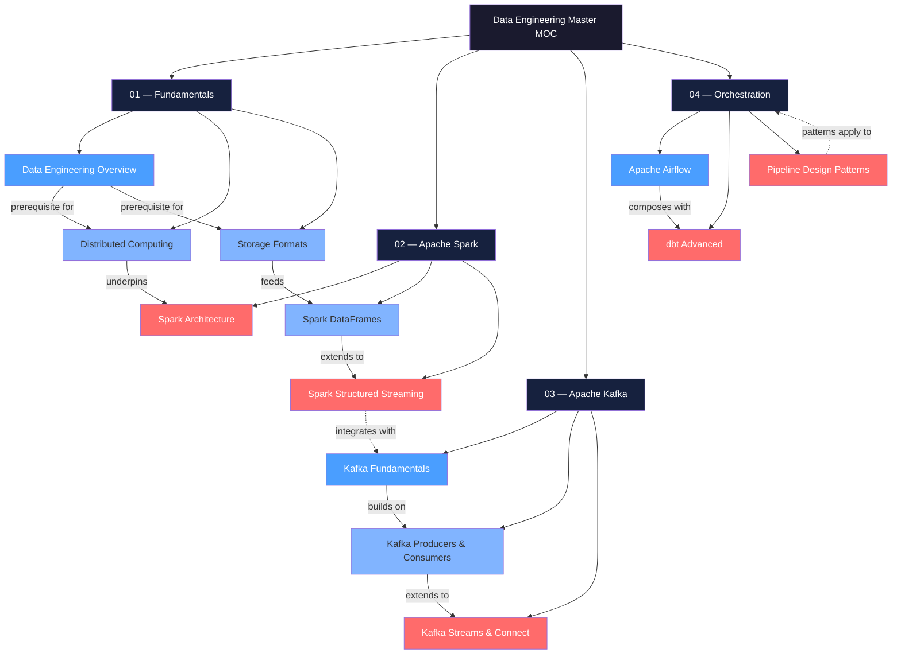

# Data Engineering — Map of Content

> [!info] About this vault
> 18 notes across 4 sections — data pipeline design, Apache Spark, Apache Kafka, and orchestration with Airflow/dbt/Prefect/Dagster.
> Start with **Fundamentals**, follow the arrows in the concept map, and use the learning path that matches your goal.

---

## Concept Map

*(Dark navy = section hub, Blue = fundamental/entry-point, Light blue = intermediate, Red = advanced — arrows show prerequisite or "leads to" relationships)*

---

## Sections at a Glance

| # | Section | Notes | Entry Point | Difficulty Range |
|---|---------|------:|-------------|-----------------|
| 1 | [[#01 — Fundamentals\|01 Fundamentals]] | 5 | [[Data_Engineering_Overview]] | Beginner → Intermediate |
| 2 | [[#02 — Apache Spark\|02 Apache Spark]] | 5 | [[Spark_Architecture]] | Intermediate → Advanced |
| 3 | [[#03 — Apache Kafka\|03 Apache Kafka]] | 4 | [[Kafka_Fundamentals]] | Intermediate → Advanced |
| 4 | [[#04 — Orchestration\|04 Orchestration]] | 4 | [[Apache_Airflow]] | Intermediate → Advanced |
| | **Total** | **18** | | |

---

## Learning Paths

### Path A — Generalist Data Engineer

*Full-breadth first pass. Builds the pipeline-to-production skill set end to end.*

1. [[Data_Engineering_Overview]] — understand role boundaries, the modern data stack, and batch vs. streaming trade-offs
2. [[Distributed_Computing]] — MapReduce → Spark DAG execution model; the mental model underpinning all Spark work
3. [[Storage_Formats]] — Parquet vs. Avro vs. Delta Lake; highest-leverage storage decisions
4. [[Data_Modeling_for_Engineering]] — Medallion architecture, dimensional modeling, Data Vault
5. [[Data_Quality_and_Observability]] — quality dimensions, dbt tests, Great Expectations, SLA monitoring
6. [[Spark_Architecture]] — Driver/Executor/Catalyst; how Spark executes a query end to end
7. [[Spark_DataFrames]] — core transformation vocabulary: `select`, `filter`, `groupBy`, `join`, windows
8. [[PySpark_Programming]] — UDFs, Pandas UDFs (Arrow), Delta Lake integration in Python
9. [[Spark_Performance]] — partitioning, AQE, broadcast joins, skew handling
10. [[Kafka_Fundamentals]] — commit log model, topics, partitions, consumer groups
11. [[Kafka_Producers_and_Consumers]] — `acks`, batching, offset management for reliable pipelines
12. [[Apache_Airflow]] — DAGs, operators, scheduling, production deployment patterns
13. [[Pipeline_Design_Patterns]] — idempotency, incremental loads, CDC, Lambda vs. Kappa
14. [[Spark_Structured_Streaming]] — micro-batch streaming, watermarks, Kafka→Delta sink
15. [[Kafka_Streams_and_Connect]] — Kafka Connect CDC with Debezium, ksqlDB, stateful streaming
16. [[Kafka_Operations]] — consumer lag, partition rebalancing, JMX/Prometheus monitoring
17. [[dbt_Advanced]] — incremental models, snapshots, macros, CI/CD for SQL transforms
18. [[Prefect_and_Modern_Orchestration]] — Prefect flows/tasks, Dagster asset-based orchestration

---

### Path B — Streaming Engineer

*Kafka-first, Spark Streaming, real-time pipeline architecture.*

1. [[Data_Engineering_Overview]] — streaming vs. batch context; where streaming fits the data stack
2. [[Distributed_Computing]] — DAG execution and partitioning fundamentals before Kafka
3. [[Kafka_Fundamentals]] — append-only commit log, partition replication, consumer group mechanics
4. [[Kafka_Producers_and_Consumers]] — durability knobs (`acks`, `min.insync.replicas`), consumer lag, manual offsets
5. [[Kafka_Streams_and_Connect]] — Kafka Connect for CDC ingestion, Kafka Streams for stateful processing, ksqlDB
6. [[Kafka_Operations]] — lag monitoring, partition tuning, Prometheus dashboards, operational runbooks
7. [[Spark_Architecture]] — Catalyst optimizer, DAG stages, shuffle boundaries
8. [[Spark_Structured_Streaming]] — exactly-once semantics, watermarking, trigger modes, Kafka source/sink
9. [[Storage_Formats]] — Delta Lake ACID for streaming sinks; Parquet checkpoint behavior
10. [[Pipeline_Design_Patterns]] — Lambda vs. Kappa architecture, late-data handling, exactly-once guarantees

---

### Path C — Analytics Engineer

*dbt, Airflow, warehouse modeling, data quality — the semantic-layer track.*

1. [[Data_Engineering_Overview]] — analytics engineer role in the modern data stack
2. [[Data_Modeling_for_Engineering]] — star/snowflake schema, Data Vault, Medallion bronze/silver/gold layers
3. [[Storage_Formats]] — columnar formats, Delta Lake, open table formats for warehouse performance
4. [[Data_Quality_and_Observability]] — quality dimensions, assertion frameworks, SLA alerting
5. [[Apache_Airflow]] — scheduling dbt runs, sensor patterns, cross-DAG dependencies, production deployment
6. [[dbt_Advanced]] — incremental materializations, snapshots (SCD Type 2), macros, CI/CD, contracts
7. [[Prefect_and_Modern_Orchestration]] — Prefect flows for Python-first pipelines; Dagster software-defined assets
8. [[Pipeline_Design_Patterns]] — idempotent transforms, incremental logic, testing strategies

---

## All Notes in This Vault

| Note | Core Idea | Difficulty |
|------|-----------|------------|
| [[Data_Engineering_Overview]] | Role landscape, modern data stack layers, batch vs. streaming | Beginner |
| [[Data_Modeling_for_Engineering]] | Dimensional modeling, Data Vault, Medallion architecture | Intermediate |
| [[Distributed_Computing]] | MapReduce → Spark DAG; partitioning, shuffle, skew | Intermediate |
| [[Storage_Formats]] | Parquet/Avro/ORC columnar storage; Delta Lake/Iceberg table formats | Intermediate |
| [[Data_Quality_and_Observability]] | Six quality dimensions, dbt tests, Great Expectations, SLA monitoring | Intermediate |
| [[Spark_Architecture]] | Driver/Executor/Catalyst/Tungsten; DAG → stage → task execution | Advanced |
| [[Spark_DataFrames]] | DataFrame API, SQL, transformations, window functions | Intermediate |
| [[PySpark_Programming]] | PySpark vs. Scala, UDFs, Pandas UDFs (Arrow), Delta Lake in Python | Intermediate |
| [[Spark_Performance]] | Partitioning, AQE, broadcast joins, skew salting, memory tuning | Advanced |
| [[Spark_Structured_Streaming]] | Unbounded-table model, watermarks, exactly-once, Kafka→Delta | Advanced |
| [[Kafka_Fundamentals]] | Commit log model, topics, partitions, replicas, consumer groups | Intermediate |
| [[Kafka_Producers_and_Consumers]] | `acks`, batching, compression, offset management, delivery semantics | Intermediate |
| [[Kafka_Streams_and_Connect]] | Kafka Streams stateful processing, Connect CDC (Debezium), ksqlDB | Advanced |
| [[Kafka_Operations]] | Consumer lag SLA, partition admin, JMX metrics, Prometheus monitoring | Advanced |
| [[Apache_Airflow]] | DAG-as-code, scheduler/executor architecture, operator ecosystem | Intermediate |
| [[dbt_Advanced]] | Incremental models, snapshots, macros, contracts, CI/CD for SQL | Advanced |
| [[Prefect_and_Modern_Orchestration]] | Prefect flows/tasks vs. Dagster asset-based orchestration | Intermediate |
| [[Pipeline_Design_Patterns]] | Idempotency, CDC, Lambda vs. Kappa architecture, late-data handling | Advanced |

---

## Key Questions This Vault Answers

- What distinguishes a data engineer from a data analyst, analytics engineer, or ML engineer?
- When should you use batch processing versus real-time streaming for a given pipeline?
- How do Parquet, Avro, Delta Lake, and Iceberg differ, and when does each format win?
- How does Spark's Catalyst optimizer convert a DataFrame query into an efficient physical plan?
- What are the root causes of Spark slowness, and how does Adaptive Query Execution address them?
- How does Kafka guarantee ordering and durability without sacrificing throughput?
- What is the difference between at-most-once, at-least-once, and exactly-once delivery in Kafka?
- How do Kafka Streams and Kafka Connect combine to replace a traditional ETL stack?
- How do you build idempotent, safely-retriable data pipelines?
- What are the practical trade-offs between Lambda architecture and Kappa architecture?
- How do Prefect and Dagster improve on Airflow's developer experience and observability?
- How does dbt's incremental materialization strategy minimize warehouse compute cost?

---

## Section MOC Index

### 01 — Fundamentals

The conceptual bedrock of data engineering. Covers what data engineers do, how distributed systems process data at scale, which storage formats to choose and why, how to model data for analytical workloads, and how to measure and enforce data quality. Read this section before touching any framework.

Notes: [[Data_Engineering_Overview]] · [[Distributed_Computing]] · [[Storage_Formats]] · [[Data_Modeling_for_Engineering]] · [[Data_Quality_and_Observability]]

---

### 02 — Apache Spark

The dominant large-scale batch and streaming compute engine. Covers the Driver/Executor/Catalyst/Tungsten execution stack, the full DataFrame/SQL transformation API, Python-specific patterns including Arrow-based Pandas UDFs, production performance tuning (partitioning, AQE, skew), and Structured Streaming for continuous processing.

Notes: [[Spark_Architecture]] · [[Spark_DataFrames]] · [[PySpark_Programming]] · [[Spark_Performance]] · [[Spark_Structured_Streaming]]

---

### 03 — Apache Kafka

The de facto standard for high-throughput event streaming and CDC. Covers the append-only commit log abstraction, client configuration for durability/throughput trade-offs, stateful stream processing with Kafka Streams, CDC ingestion with Kafka Connect (Debezium), SQL-based stream queries with ksqlDB, and day-2 operations including lag monitoring and partition rebalancing.

Notes: [[Kafka_Fundamentals]] · [[Kafka_Producers_and_Consumers]] · [[Kafka_Streams_and_Connect]] · [[Kafka_Operations]]

---

### 04 — Orchestration

The coordination layer that schedules, monitors, and retries pipeline work. Covers Apache Airflow (DAG-as-code, scheduler architecture, operator ecosystem), dbt Advanced (incremental models, snapshots, CI/CD for SQL), Prefect and Dagster (modern Python-native orchestration and asset-based workflows), and cross-cutting pipeline design patterns (idempotency, Lambda/Kappa, CDC, late-data handling).

Notes: [[Apache_Airflow]] · [[dbt_Advanced]] · [[Prefect_and_Modern_Orchestration]] · [[Pipeline_Design_Patterns]]

---

## Connections to Other Vaults

- [[_MOC_Database_Master]] — storage engines, SQL internals, query optimization, and Postgres/MySQL tuning; foundational knowledge that complements data warehouse and lakehouse design
- [[_MOC_Data_Analytics_Master]] — the analytics consumer of data engineering output; covers dbt fundamentals, BI tooling, and the semantic layer built on top of pipelines this vault constructs

---

#MOC #DataEngineering #MasterMOC
